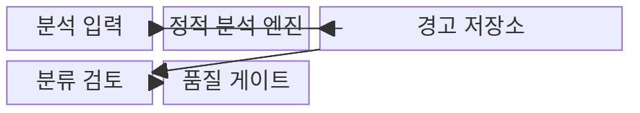
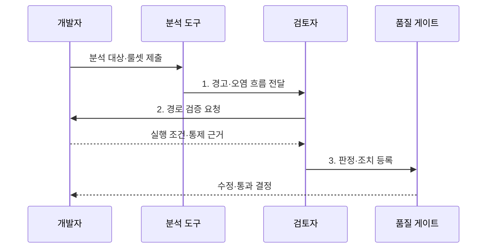

---
sidebar:
  order: 36
  label: "036. 정적 분석 결과 해석 (Static Analysis Result Interpretation)"
  badge:
    text: "기출 · 50%"
    variant: note
title: "정적 분석 결과 해석 (Static Analysis Result Interpretation)"
date: "2026-08-02T22:36:00+09:00"
tags:
  - "notes-evaluation"
weight: 36
extra:
  question_no: "036"
  source_status: "기출"
  source_history: "128회"
  priority: 50
  priority_note: "정적 분석 결과의 오탐·위험도를 판정"
---

## Ⅰ. 개요

핵심 용어

- **정적 분석 결과 해석**: 프로그램을 실행하지 않고 찾은 경고의 도달 가능성·오염 흐름·업무 영향을 검토해 실제 결함 여부와 조치 우선순위를 판정하는 활동이다.
- **분류 검토**: 도구 경고의 사실 여부·도달 가능성·영향과 조치 우선순위를 사람이 판정하는 활동이다.
- **오탐**: 분석 도구가 문제로 경고했지만 실행 문맥과 보호 통제를 확인했을 때 실제 결함은 아닌 항목이다.

- 정의/개념: **정적 분석 결과 해석** — 경고의 도달·오염 흐름·업무 영향을 **분류 검토** 하여 실제 결함과 조치 순위를 정하는 활동
- 배경/필요성: 도구 심각도와 경고 수만으로는 **오탐** 과 실제 악용 가능 결함을 구분하기 곤란

#### 한줄 요약
- 실제 실행 경로와 피해를 확인한 정적 분석 경고의 수정 우선순위 결정

## Ⅱ. 특징

핵심 용어

- **룰셋**: 결함이나 취약점 유형을 찾기 위해 적용하는 탐지 규칙의 묶음이다.
- **도달 가능성**: 실제 입력과 실행 조건에서 경고 지점까지 제어 흐름이 이어질 가능성이다.
- **오염 흐름**: 신뢰할 수 없는 입력이 적절한 검증 없이 위험 함수까지 이동하는 데이터 경로이다.
- **재현성**: 같은 소스·의존성·빌드 환경·룰셋으로 다시 분석했을 때 같은 경고를 얻을 수 있는 성질이다.

- **룰셋·언어·빌드 환경 고정** 을 통한 경고 재현성 확보
- **도달 가능성·오염 흐름·업무 영향** 을 통한 실제 위험 판정
- **오탐 근거·예외 만료·고위험 게이트** 를 통한 미해결 위험 통제

#### 한줄 요약
- 외부 입력의 도달성과 업무 영향에 따른 수정·예외 처리

## Ⅲ. 구조 및 구성요소

핵심 용어

- **참 양성**: 분석 도구가 경고한 항목에 실제 결함이나 취약점이 존재하는 판정이다.
- **거짓 양성**: 도구가 경고했지만 실행 문맥과 보호 통제를 검토했을 때 실제 문제는 없는 판정이다.
- **심각도·신뢰도**: 문제 발생 시 피해 수준과 해당 탐지가 실제 문제일 가능성에 대한 도구의 확신 수준이다.
- **판정 이력**: 경고별 검토 결과·근거·승인·변경 내역을 추적할 수 있게 보존한 기록이다.

| 구성요소 | 책임 |
|:---|:---|
| **분석 입력** | 소스·바이트코드·빌드 환경과 **룰셋 버전 고정** |
| **정적 분석 엔진** | 구문·제어·데이터 흐름을 규칙과 대조해 **경고 생성** |
| **경고 저장소** | 코드 위치·오염 경로·심각도·**판정 이력** 보관 |
| **분류 검토** | 도달성과 업무 영향에 따른 **TP·FP·위험 수용** 판정 |
| **품질 게이트** | 신규 미해결 고위험 경고의 **배포 차단** |

#### 한줄 요약
- 경고 재현·실행 가능성 검토·배포 판정의 연결 구조

## Ⅳ. 흐름도

핵심 용어

- **재현 가능한 분석**: 같은 소스·의존성·컴파일 옵션·룰셋으로 다시 실행하여 같은 경고를 얻는 분석이다.
- **증거 기반 판정**: 호출 경로·입력 통제·실행 가능 조건·업무 영향을 근거로 경고 상태를 확정하는 절차이다.
- **위험 수용**: 즉시 수정할 수 없는 실제 위험에 보완 통제·책임자·만료 기한을 지정하고 제한적으로 승인하는 결정이다.

1. **경고·오염 흐름 전달**: 코드 위치와 위험 함수까지의 **경로·신뢰도** 제공
2. **경로 검증 요청**: 실제 호출 조건과 기존 검증·인코딩·권한 통제의 유효성 확인
3. **판정·조치 등록**: TP는 수정, FP는 예외, 위험 수용은 **기한·통제** 기록

#### 한줄 요약
- 도구 경고의 실제 결함 판정과 배포 게이트 연계

## Ⅴ. 종류 및 비교

핵심 용어

- **도구 심각도**: 일반적인 규칙 위험을 기준으로 분석 도구가 부여한 등급이다.
- **업무 위험도**: 실제 배포 환경의 도달 가능성·데이터 가치·영향 범위를 반영하여 조직이 판정한 우선순위이다.
- **참 양성·거짓 양성(True Positive·False Positive, TP·FP)**: 경고가 실제 실행·공격 경로를 나타내는지에 따른 분류 결과이다.
- **위험 수용**: 실제 위험을 확인했지만 즉시 수정할 수 없을 때 승인자·기한·보완 통제를 기록하고 제한적으로 허용하는 처분이다.

정적 분석 경고는 먼저 사실 여부를 분류하고, 실제 위험으로 확인된 항목에 후속 처분을 결정한다. 위험 수용은 참 양성·거짓 양성과 같은 분류 유형이 아니다.

| 판단 단계 | 판정 기준 | 후속 조치 |
|:---|:---|:---|
| 사실 분류 | 실제 실행·공격 경로가 있으면 **참 양성(True Positive, TP)** | 수정·재검증 또는 업무 위험 평가 |
| 사실 분류 | 경로가 성립하지 않거나 안전 통제가 있으면 **거짓 양성(False Positive, FP)** | 근거·만료일을 둔 예외 처리 |
| 처분 결정 | 참 양성이지만 즉시 수정할 수 없고 잔여 위험을 허용할 수 있음 | 승인·기한·보완 통제를 둔 **위험 수용** |

도구가 부여한 **도구 심각도** 는 출발점이며, 도달 가능성과 업무 영향을 반영한 **업무 위험도** 로 처리 우선순위를 다시 정한다.

> 요약: 경고의 사실 여부를 먼저 분류하고, 확인된 위험은 수정하거나 승인된 통제 아래 제한적으로 수용

#### 한줄 요약
- 프로그램 고장 가능성과 공격자 악용 가능성에 따른 경고 판정

## Ⅵ. 실무 고려사항 및 대책

핵심 용어

- **품질 게이트**: 허용 기준을 넘는 미해결 고위험 경고가 있으면 빌드나 배포를 중단하는 통제이다.
- **예외 지시어**: 검토된 오탐을 다음 분석에서 제외하도록 코드나 도구에 남기는 표시이다.
- **예외 만료**: 코드·룰셋·환경 변화 뒤 기존 오탐 판단을 재검토하도록 예외에 유효기간을 두는 정책이다.
- **구조화 질의 언어(Structured Query Language, SQL) 오염 흐름**: 외부 입력이 검증·매개변수화 없이 데이터베이스 질의 실행 함수에 도달하는 보안 위험이다.

| 문제 | 대책 | 효과 |
|:---|:---|:---|
| 도구 심각도만 따른 **우선순위 왜곡** | 도달성·오염 흐름·업무 영향의 **분류 검토** | 실제 위험 중심의 **수정 순서 확보** |
| 근거 없는 예외에 따른 **취약점 은폐** | 예외의 사유·승인자·만료일과 **변경 재검토** | 오탐 억제와 **잔여 위험 추적** |
| 룰셋·환경 변경에 따른 **기준선 단절** | 환경·룰셋 버전 고정과 **변경 전후 분리** | 경고 추세의 **재현성 확보** |

#### 한줄 요약
- 검증 없는 결제 요청의 질의 실행 도달을 참 양성으로 판정하고 매개변수화로 차단

## Ⅶ. 결론

핵심 용어

- **경고 수와 위험의 구분**: 많은 저위험·오탐 경고보다 도달 가능한 고영향 경고를 먼저 해결해야 한다는 원칙이다.
- **추적 가능한 예외**: 경고 식별자·판정 근거·승인자·만료일을 기록하여 나중에 재검토할 수 있는 예외이다.
- **조치 결정**: 도달 가능성·오염 흐름·업무 영향이 큰 참 양성은 수정하고 거짓 양성은 예외, 수용 위험은 기한을 두어 승인하는 판단이다.

- 도달·오염·업무 영향이 큰 **TP는 수정**, FP는 **예외**, 수용 위험은 기한 승인

#### 한줄 요약
- 경고 수보다 실제 입력 도달성과 피해 규모를 우선한 위험 판정
