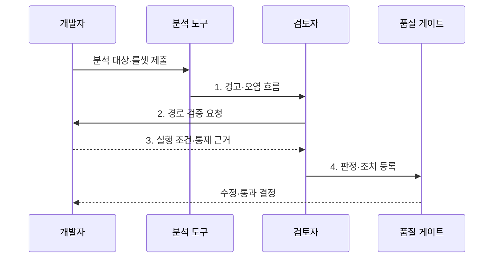

---
sidebar:
  order: 36
  label: "036. 정적 분석 결과 해석 (Static Analysis Result Interpretation)"
  badge:
    text: "기출 · 50%"
    variant: note
title: "정적 분석 결과 해석 (Static Analysis Result Interpretation)"
date: "2026-07-30T01:55:00+09:00"
tags:
  - "notes-evaluation"
weight: 36
extra:
  question_no: "036"
  source_status: "기출"
  source_history: "128회"
  priority: 50
  priority_note: "정적 분석 결과의 오탐·위험도를 판정"
---

## 미리 알고가기

- **정적 분석(Static Analysis, SA)**: 프로그램을 실행하지 않고 소스 코드·바이트코드·설정을 검사하여 결함과 취약점을 찾는 기법이다.
- **룰셋(Rule Set)**: 결함이나 취약점을 찾기 위해 적용하는 탐지 규칙의 묶음이다.
- **참 양성(True Positive, TP)**: 분석 도구가 경고한 항목에 실제 결함이나 취약점이 존재하는 판정이다.
- **거짓 양성(False Positive, FP)**: 분석 도구가 경고했지만 실제 결함이나 취약점은 없는 판정이다.
- **심각도(Severity)**: 문제가 발생했을 때 시스템과 업무에 미치는 피해 수준이다.
- **신뢰도(Confidence)**: 탐지 결과가 실제 문제일 가능성에 대한 도구의 확신 수준이다.
- **분류 검토(Triage)**: 경고의 사실 여부와 조치 우선순위를 사람이 판정하는 활동이다.
- **오염 흐름(Taint Flow)**: 신뢰할 수 없는 입력이 검증 없이 위험 함수까지 이동하는 경로다.
- **도달 가능성**: 실제 실행 조건에서 경고 지점까지 제어 흐름이 이어질 가능성이다.
- **품질 게이트**: 허용 기준을 넘는 미해결 경고가 있으면 빌드나 배포를 중단하는 통제다.
- **예외 지시어**: 검토된 오탐을 다음 분석에서 제외하도록 코드나 도구에 남기는 표시다.
- **구조화 질의어(Structured Query Language, SQL)**: 관계형 데이터베이스의 스키마와 데이터를 정의·조회·변경하는 언어다.
- **지속적 통합(Continuous Integration, CI)**: 코드 변경을 자주 병합하고 빌드·시험·분석을 자동 수행하는 개발 방식이다.


## Ⅰ. 개요

- 정의/개념: 정적 분석 경고의 도달 가능성·오염 흐름·업무 영향을 검증해 **실제 결함 여부와 조치 우선순위**를 정하는 위험 판정 활동
- 배경/필요성: 도구의 심각도와 경고 수만 따를 때 발생하는 **오탐 수정 낭비**와 실제 악용 가능한 결함의 우선순위 누락 방지

### 쉽게 이해하기 (학습용)
- 도구의 경고를 그대로 믿지 않고 실제 실행 경로와 피해를 확인해 수정 순서를 정한다.


## Ⅱ. 특징

- **룰셋·언어·빌드 환경 고정**으로 경고의 재현성을 확보한다.
- **도달 가능성·오염 흐름·업무 영향**으로 실제 위험을 판정한다.
- **오탐 근거·예외 만료·신규 고위험 게이트**로 미해결 위험을 통제한다.

### 쉽게 이해하기 (학습용)
- 같은 경고도 외부 입력이 중요 기능에 닿으면 먼저 고치고, 닿지 않으면 근거를 남겨 예외 처리한다.


## Ⅲ. 구조 및 구성요소

```mermaid
block-beta
    columns 2
    I["분석 입력"] E["정적 분석 엔진"]
    W["경고 저장소"]:2
    T["분류 검토"] G["품질 게이트"]
    I -- E
    E -- W
    W -- T
    T -- G
```

| 구성요소 | 책임 |
|:---|:---|
| 분석 입력 | 소스·바이트코드·빌드 환경과 **룰셋 버전 고정** |
| 정적 분석 엔진 | 구문·제어 흐름·데이터 흐름을 규칙과 대조해 경고 생성 |
| 경고 저장소 | 코드 위치·오염 경로·심각도·신뢰도와 판정 이력 보관 |
| 분류 검토 | 도달 가능성과 업무 영향을 확인해 **TP·FP·위험 수용** 판정 |
| 품질 게이트 | 신규 미해결 고위험 경고가 허용 기준을 넘으면 배포 차단 |

> 요약: 경고를 재현·분류해 품질 게이트로 통제한다

### 쉽게 이해하기 (학습용)
- 같은 소스와 규칙으로 경고를 재현하고 사람이 실행 가능성을 확인한 뒤 배포 여부를 결정한다.


## Ⅳ. 흐름도



- 1. **경고·오염 흐름**: 코드 위치와 입력에서 위험 함수까지의 경로·심각도·신뢰도 제공
- 2. **경로 검증 요청**: 실제 호출 조건과 기존 검증·인코딩·권한 통제의 유효성 확인
- 3. **실행 조건·통제 근거**: 경고 경로의 도달 가능성과 발생 시 업무 피해를 재현 증거로 설명
- 4. **판정·조치 등록**: 참 양성은 수정, 거짓 양성은 예외, 위험 수용은 승인자·기한·보완 통제 기록

> 요약: 경고 경로를 검증하고 판정해 배포를 결정한다

### 쉽게 이해하기 (학습용)
- 도구가 찾은 코드 위치를 사람이 따라가 실제 문제인지 확인하고 게이트 결과로 연결한다.


## Ⅴ. 종류 및 비교

| 정적 분석 경고 판정 | 참 양성 | 거짓 양성 | 위험 수용 |
|:---|:---|:---|:---|
| 적용 기준 | 실제 실행·공격 경로 존재 | 경로 불성립·안전 통제 존재 | 즉시 수정 불가·잔여 위험 허용 |
| 핵심 특징 | 결함 수정·재검증 | 근거 있는 예외 처리 | 승인·기한·보완 통제 |
| 한계 | 경로 검증 비용 | 잘못된 예외는 위험 은폐 | 장기 방치 시 위험 누적 |

> 요약: 결함은 실행 실패, 취약점은 공격 가능성을 판단한다

### 쉽게 이해하기 (학습용)
- 결함 경고는 프로그램 고장 가능성, 보안 경고는 공격자의 악용 가능성을 중심으로 판단한다.


## Ⅵ. 실무 고려사항 및 대책

| 고려사항 | 대책 | 효과 |
|:---|:---|:---|
| 도구 심각도만 따라 실제 도달 불가 경고를 먼저 고치는 **우선순위 왜곡** | 도달 가능성·오염 흐름·업무 영향을 결합해 분류 검토 | 실제 위험 중심의 **수정 순서 확보** |
| 근거 없이 예외 처리한 경고가 코드 변경 후 **취약점 은폐** | 예외에 사유·승인자·만료일을 기록하고 변경 시 재검토 | 오탐 억제와 **잔여 위험 추적** |
| 룰셋·빌드 환경 변경으로 경고 증감 원인을 알 수 없는 **기준선 단절** | 분석 환경과 룰셋 버전을 고정하고 변경 전후 결과를 분리 비교 | 경고 추세의 **재현성 확보** |

### 쉽게 이해하기 (학습용)
- 결제 요청값이 검증 없이 SQL 실행 함수에 도달하면 참 양성으로 판정하고 매개변수화 질의로 오염 흐름을 차단한다.


## Ⅶ. 결론

- 경고의 **도달 가능성·오염 흐름·업무 영향**으로 실제 위험을 판정하고 신규 미해결 고위험 항목을 품질 게이트로 차단하는 정적 분석 운영

### 쉽게 이해하기 (학습용)
- 경고 개수보다 실제 입력이 위험 코드까지 닿는지와 피해가 큰지를 먼저 확인해야 한다.
