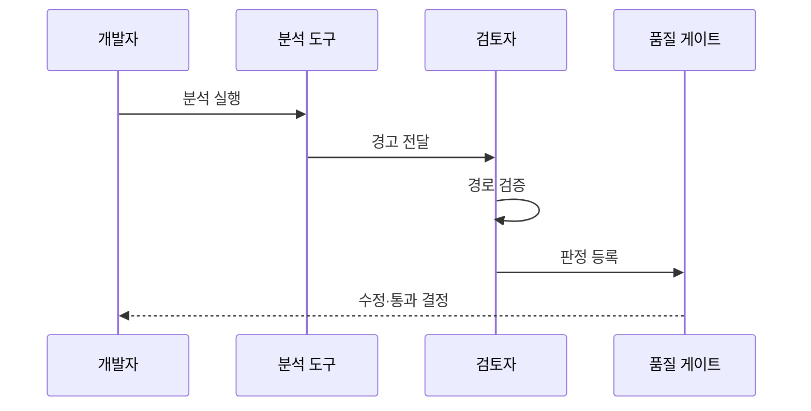

---
sidebar:
  order: 36
  label: "036. 정적 분석 결과 해석 (Static Analysis Result Interpretation)"
  badge:
    text: "기출 · 50%"
    variant: note
title: "정적 분석 결과 해석 (Static Analysis Result Interpretation)"
date: "2026-07-27T23:59:59+09:00"
tags:
  - "notes-evaluation"
weight: 36
extra:
  question_no: "036"
  source_status: "기출"
  source_history: "128회"
  priority: 50
  priority_note: "정적 분석 결과의 오탐·위험도를 판정"
---

## 미리 알고가기

- **정적 분석(Static Analysis, SA)**: '에스에이'로 읽고 실행 없이 소스·바이트코드·설정을 검사하는 기법을 영문 머리글자로 표시
- **룰셋(Rule Set)**: 결함이나 취약점을 찾기 위해 적용하는 탐지 규칙의 묶음
- **참 양성(True Positive, TP)**: '티피'로 읽고 도구 경고에 실제 문제가 있는 판정을 표시
- **거짓 양성(False Positive, FP)**: '에프피'로 읽고 실제 문제 없이 잘못 경고한 판정을 표시
- **심각도(Severity)**: 문제가 발생했을 때 시스템과 업무에 미치는 피해 수준
- **신뢰도(Confidence)**: 탐지 결과가 실제 문제일 가능성에 대한 도구의 확신 수준
- **분류 검토(Triage)**: 경고의 사실 여부와 우선순위를 사람이 판정하는 활동
- **오염 흐름(Taint Flow)**: 신뢰할 수 없는 입력이 검증 없이 위험 함수까지 이동하는 경로
- **도달 가능성**: 실제 실행 조건에서 경고 지점까지 제어 흐름이 이어질 가능성
- **품질 게이트**: 허용 기준을 넘는 경고가 있으면 빌드나 배포를 중단하는 통제
- **예외 지시어**: 검토된 오탐을 다음 분석에서 제외하도록 코드나 도구에 남기는 표시
- **구조화 질의어(Structured Query Language, SQL)**: '에스큐엘'로 읽고 관계형 데이터 조회·변경 언어를 표시
- **지속적 통합(Continuous Integration, CI)**: '시아이'로 읽고 코드 병합·빌드·시험 자동화 방식을 표시

## Ⅰ. 개요

- 정의/개념: 정적 분석 경고의 **실제 결함 여부·악용 가능성·조치 우선순위 판정**
- **배경/필요성**: 도구 심각도와 경고 수만 따르면 생기는 **오탐 대응·실위험 누락 방지**

### 쉽게 이해하기 (학습용)
- 도구의 경고를 그대로 믿지 않고 실제 실행 경로와 피해를 확인해 수정 순서를 정한다.

## Ⅱ. 특징

- **룰셋·언어·빌드 환경 고정**으로 경고의 재현성을 확보한다.
- **도달 가능성·오염 흐름·업무 영향**으로 실제 위험을 판정한다.
- **오탐 근거·예외 만료·신규 고위험 게이트**로 미해결 위험을 통제한다.

### 쉽게 이해하기 (학습용)
- 같은 경고도 외부 입력이 중요 기능에 닿으면 먼저 고치고, 닿지 않으면 근거를 남겨 예외 처리한다.

## Ⅲ. 아키텍처 및 구성요소

| 설계 요소 | 설명 |
|:---|:---|
| 분석 입력 | **소스·빌드 환경·룰셋 고정** |
| 정적 분석 엔진 | **제어·데이터 흐름 규칙 검사** |
| 경고 저장소 | **위치·경로·심각도·신뢰도 보관** |
| 분류 검토 | **TP·FP·위험 수용 판정** |
| 품질 게이트 | **신규 미해결 고위험 배포 차단** |

> 요약: 경고를 재현·분류해 품질 게이트로 통제한다

### 쉽게 이해하기 (학습용)
- 같은 소스와 규칙으로 경고를 재현하고 사람이 실행 가능성을 확인한 뒤 배포 여부를 결정한다.

## Ⅳ. 원리 및 절차 흐름도

| 절차 | 설명 |
|:---|:---|
| 분석 실행 | 고정한 소스·빌드 환경·룰셋 검사 |
| 경고 전달 | 위치·오염 흐름·심각도 제공 |
| 경로 검증 | 도달 가능성과 실제 피해 확인 |
| 판정 등록 | 수정·오탐·위험 수용과 근거 기록 |
| 수정·통과 결정 | 미해결 위험으로 게이트 판정 |

> 요약: 경고 경로를 검증하고 판정해 배포를 결정한다

### 쉽게 이해하기 (학습용)
- 도구가 찾은 코드 위치를 사람이 따라가 실제 문제인지 확인하고 게이트 결과로 연결한다.

## Ⅴ. 종류 및 비교

| 정적 분석 경고 판정 | 참 양성 | 거짓 양성 | 위험 수용 |
|:---|:---|:---|:---|
| 적용 기준 | 실제 실행·공격 경로 존재 | 경로 불성립·안전 통제 존재 | 즉시 수정 불가·잔여 위험 허용 |
| 핵심 특징 | 결함 수정·재검증 | 근거 있는 예외 처리 | 승인·기한·보완 통제 |
| 한계 | 경로 검증 비용 | 잘못된 예외는 위험 은폐 | 장기 방치 시 위험 누적 |

> 요약: 결함은 실행 실패, 취약점은 공격 가능성을 판단한다

### 쉽게 이해하기 (학습용)
- 결함 경고는 프로그램 고장 가능성, 보안 경고는 공격자의 악용 가능성을 중심으로 판단한다.

## Ⅵ. 실무 사례

1. 결제 API에서 외부 입력의 SQL 도달 경로를 확인한다
2. CI 파이프라인은 신규 고위험 경고를 차단한다

### 쉽게 이해하기 (학습용)
- 결제 요청값이 검증 없이 SQL 실행 함수에 닿으면 실제 취약점으로 판정해 수정한다.
- 기존 경고가 아니라 이번 변경에서 새로 생긴 고위험 경고만 품질 게이트로 차단한다.

## Ⅶ. 결론

- 경고 수보다 **도달 가능성·업무 영향**으로 조치 결정

### 쉽게 이해하기 (학습용)
- 경고 개수보다 실제 입력이 위험 코드까지 닿는지와 피해가 큰지를 먼저 확인해야 한다.
