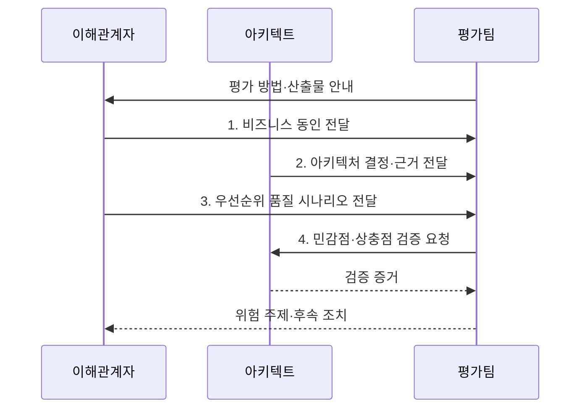

---
sidebar:
  order: 37
  label: "037. ATAM 아키텍처 트레이드오프 분석 (Architecture Tradeoff Analysis Method)"
  badge:
    text: "기출 · 50%"
    variant: note
title: "ATAM 아키텍처 트레이드오프 분석 (Architecture Tradeoff Analysis Method)"
date: "2026-07-31T05:06:09+09:00"
author: "Claude Opus 4.6 (Enhanced by Gemini 3.5)"
tags:
  - "notes-evaluation"
weight: 37
extra:
  question_no: "037"
  source_status: "기출"
  source_history: "131회"
  priority: 50
  priority_note: "품질 속성 간 상충을 시나리오로 평가"
---

## 미리 알고가기

- **아키텍처 트레이드오프 분석 방법(Architecture Tradeoff Analysis Method, ATAM)**: 품질 속성 시나리오를 기준으로 아키텍처의 위험·민감점·상충점을 분석하는 방법이다.
- **소프트웨어 아키텍처 분석 방법(Software Architecture Analysis Method, SAAM)**: 변경 시나리오가 아키텍처와 구성요소에 미치는 수정 영향을 평가하는 방법이다.
- **비용 편익 분석 방법(Cost Benefit Analysis Method, CBAM)**: 품질 속성 개선 대안의 비용과 기대 편익을 비교하여 투자 우선순위를 정하는 방법이다.
- **개념 증명(Proof of Concept, PoC)**: 제한된 구현과 실험으로 아키텍처의 핵심 가정과 기술적 실현 가능성을 검증하는 활동이다.
- **비즈니스 동인**: 사업 목표·제약·이해관계자 요구처럼 아키텍처 결정을 이끄는 조건이다.
- **품질 시나리오**: 자극·환경·대상·반응·측정값으로 품질 요구를 검증 가능하게 표현한 명세다.
- **유틸리티 트리**: 품질 시나리오를 품질 속성별로 묶고 중요도와 구현 난도로 우선순위를 정한 트리다.
- **민감점(Sensitivity Point)**: 작은 설계 변경이 특정 품질 속성에 큰 영향을 주는 결정 지점이다.
- **상충점(Tradeoff Point)**: 하나의 설계 결정이 여러 품질 속성에 서로 반대 영향을 주는 지점이다.
- **위험·비위험**: 품질 목표 달성이 불확실한 결정과 근거상 달성 가능한 결정을 구분한 평가 결과다.


## Ⅰ. 개요

- 정의/개념: 우선순위 **품질 시나리오**로 아키텍처의 위험·민감점·상충점을 식별하는 다중 품질 평가 방법
- 배경/필요성: 단일 품질 평가는 하나의 설계가 여러 품질에 미치는 **상충 효과·불확실한 가정** 식별 곤란

### 쉽게 이해하기 (학습용)
- 성능을 높인 설계가 보안이나 변경 용이성을 해치지 않는지 구현 전에 함께 따져 봄


## Ⅱ. 특징

- **비즈니스 동인·유틸리티 트리**를 통한 품질 시나리오 우선화
- **아키텍처 접근법·시나리오 반응** 연결을 통한 민감점·상충점 식별
- **위험·비위험·위험 주제** 도출과 후속 설계·PoC 검증

### 쉽게 이해하기 (학습용)
- “빨라야 한다”를 “피크 시간에도 2초 안에 응답”처럼 바꿔 설계가 버틸지 판단함


## Ⅲ. 구조 및 구성요소

```mermaid
block-beta
    columns 3
    B["비즈니스 동인"] A["아키텍처 결정"]
    U["유틸리티 트리"]:2
    M["결정-시나리오 매핑"]:2
    R["평가·검증 결과"]:2
    B -- U
    U -- M
    A -- M
    M -- R
  B --- U
  U --- M
  M --- R
```

| 구성요소 | 책임 |
|:---|:---|
| **비즈니스 동인** | 사업 목표·제약·요구에 따른 **품질 우선순위** 제공 |
| **아키텍처 결정** | 구조·패턴·배치의 **선택·가정·근거** 제공 |
| **유틸리티 트리** | 품질 시나리오를 **중요도·구현 난도**로 계층화 |
| **결정-시나리오 매핑** | 결정별 품질 반응과 **민감점·상충점** 분석 |
| **평가·검증 결과** | 위험 주제와 **PoC 검증 계획** 연결 |

### 쉽게 이해하기 (학습용)
- 중요한 품질 시나리오와 실제 설계 결정을 맞대어 위험한 가정과 상충을 찾음


## Ⅳ. 흐름도



1. **비즈니스 동인 전달**: 사업 목표·제약과 **품질 속성** 제공
2. **아키텍처 결정·근거 전달**: 구조·패턴·배치와 **품질 가정** 공개
3. **우선순위 품질 시나리오 전달**: 자극·환경·반응·측정값과 **우선순위** 제공
4. **민감점·상충점 검증 요청**: 결정 변화와 품질 간 **반대 효과** 분석

### 쉽게 이해하기 (학습용)
- 중요한 상황을 설계에 대입해 어느 결정이 품질을 흔들고 서로 충돌시키는지 찾음


## Ⅴ. 종류 및 비교

| 아키텍처 평가 방법 | ATAM | SAAM | CBAM |
|:---|:---|:---|:---|
| **적용 기준** | **ATAM**: 품질 간 균형 설계 | **SAAM**: 변경 용이성 검증 | **CBAM**: 제한 예산의 대안 선택 |
| **핵심 특징** | 다중 품질의 **상충 분석** | 변경 시나리오의 **영향 분석** | 개선 대안의 **비용·편익 분석** |
| **한계** | 시나리오 편향에 따른 **상충 누락** | 다른 품질의 **상충 누락** | 편익의 **추정 오류 가능성** |

### 쉽게 이해하기 (학습용)
- 여러 품질 충돌은 ATAM, 변경 파급은 SAAM, 개선 투자 순서는 CBAM으로 판단함


## Ⅵ. 실무 고려사항 및 대책

| 고려사항 | 대책 | 효과 |
|:---|:---|:---|
| 추상적 품질 요구에 따른 **평가 불능** | 측정값을 포함한 **품질 시나리오** 작성 | 설계 결정의 **검증 가능성 확보** |
| 특정 관점 편중에 따른 **상충점 누락** | 사업·개발·운영·보안의 **공동 우선화** | 품질 속성 간 **균형 판단 강화** |
| 문서화에 그친 **설계 가정 미검증** | 위험별 **설계 변경·PoC**와 책임·기한 연결 | 고위험 가정의 **조기 해소** |

### 쉽게 이해하기 (학습용)
- 금융 API의 통신 암호화가 보안을 높이면서 피크 시간 응답 목표를 넘기는지 측정 가능한 시나리오와 PoC로 검증한다.


## Ⅶ. 결론

- 상충 근거가 확인되면 **설계 변경**, 불확실한 고위험 가정은 **PoC 검증**

### 쉽게 이해하기 (학습용)
- 구현 전에 중요한 품질 충돌을 찾아 설계 결정을 바꾸거나 PoC로 위험을 확인함
