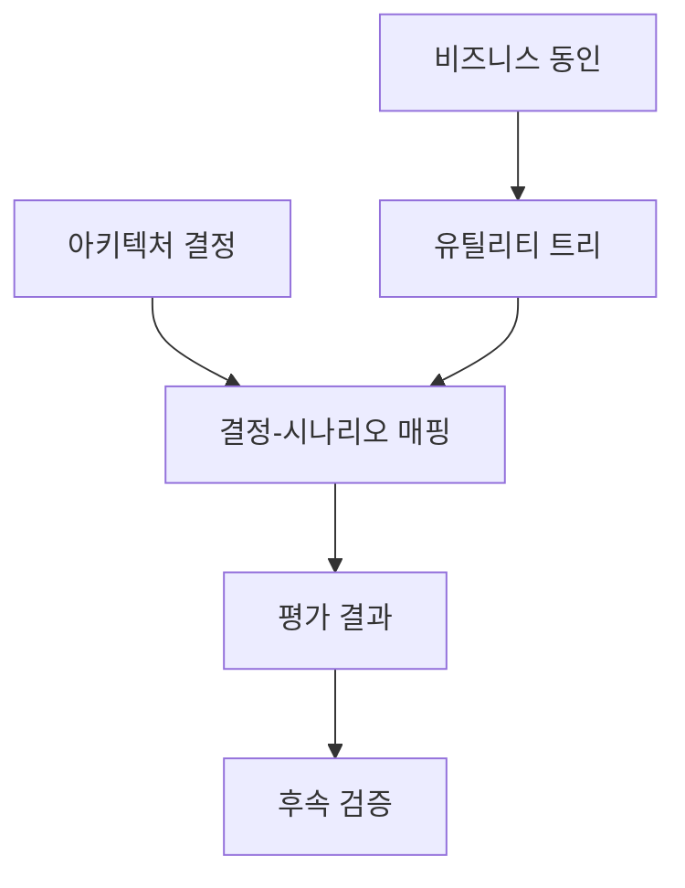
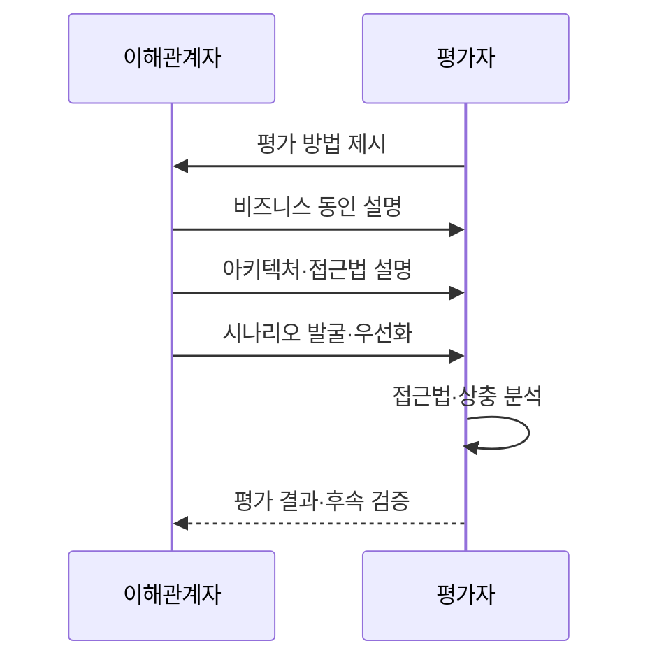

---
sidebar:
  order: 37
  label: "037. ATAM 아키텍처 트레이드오프 분석 (Architecture Tradeoff Analysis Method)"
  badge:
    text: "기출 · 50%"
    variant: note
title: "ATAM 아키텍처 트레이드오프 분석 (Architecture Tradeoff Analysis Method)"
date: "2026-07-27T23:59:59+09:00"
author: "Claude Opus 4.6 (Enhanced by Gemini 3.5)"
tags:
  - "notes-evaluation"
weight: 37
extra:
  question_no: "037"
  source_status: "기출"
  source_history: "131회"
  priority: 50
  priority_note: "품질 속성 간 상충을 시나리오로 평가"
---

## 미리 알고가기

- **아키텍처 트레이드오프 분석 방법(Architecture Tradeoff Analysis Method, ATAM)**: 품질 속성 시나리오를 기준으로 아키텍처의 위험·민감점·상충점을 분석하는 방법이다.
- **소프트웨어 아키텍처 분석 방법(Software Architecture Analysis Method, SAAM)**: 변경 시나리오가 아키텍처와 구성요소에 미치는 수정 영향을 평가하는 방법이다.
- **비용 편익 분석 방법(Cost Benefit Analysis Method, CBAM)**: 품질 속성 개선 대안의 비용과 기대 편익을 비교하여 투자 우선순위를 정하는 방법이다.
- **개념 증명(Proof of Concept, PoC)**: 제한된 구현과 실험으로 아키텍처의 핵심 가정과 기술적 실현 가능성을 검증하는 활동이다.
- **비즈니스 동인**: 사업 목표·제약·이해관계자 요구처럼 아키텍처 결정을 이끄는 조건
- **품질 시나리오**: 자극·환경·대상·반응·측정값으로 품질 요구를 검증 가능하게 표현한 것
- **유틸리티 트리**: 품질 시나리오를 품질 속성별로 묶고 중요도와 구현 난도로 우선순위를 정한 트리
- **민감점(Sensitivity Point)**: 작은 설계 변경이 특정 품질 속성에 큰 영향을 주는 결정 지점
- **상충점(Tradeoff Point)**: 하나의 설계 결정이 여러 품질 속성에 서로 반대 영향을 주는 지점
- **위험·비위험**: 품질 목표 달성이 불확실한 결정과 근거상 달성 가능한 결정을 구분한 평가 결과
- **동기 복제**: 원본과 복제본의 쓰기가 모두 끝난 뒤 완료를 응답해 데이터 차이를 줄이는 복제 방식
- **복구 목표**: 재해 뒤 서비스를 복구할 시간과 허용할 데이터 손실 시점을 정한 기준

## Ⅰ. 개요

- 정의/개념: 품질 시나리오로 아키텍처 결정의 **위험·민감점·상충점 평가**
- 기존 한계: 단일 품질 속성만 평가하면 하나의 설계 결정이 성능·가용성·보안 등 여러 품질에 미치는 상충 효과와 가정의 불확실성을 놓칠 수 있다.

### 쉽게 이해하기 (학습용)
- 성능을 높인 설계가 보안이나 변경 용이성을 해치지 않는지 구현 전에 함께 따져 봄

## Ⅱ. 특징

- **비즈니스 동인·유틸리티 트리**로 품질 시나리오를 우선화한다.
- **아키텍처 접근법과 시나리오 반응**을 연결해 민감점·상충점을 찾는다.
- **위험·비위험·위험 주제**를 도출해 후속 설계·PoC로 검증한다.

### 쉽게 이해하기 (학습용)
- “빨라야 한다”를 “피크 시간에도 2초 안에 응답”처럼 바꿔 설계가 버틸지 판단함

## Ⅲ. 아키텍처 및 구성요소

| 설계 요소 | 설명 |
|:---|:---|
| 비즈니스 동인 | 사업 목표·제약·품질 우선순위 |
| 아키텍처 결정 | 구조·패턴·배치 선택과 근거 |
| 유틸리티 트리 | 시나리오의 중요도·난도 계층화 |
| 결정-시나리오 매핑 | 결정별 품질 반응과 상호 영향 분석 |
| 평가 결과 | 위험·비위험·민감점·상충점 기록 |
| 후속 검증 | PoC로 위험 결정의 가정 확인 |

### 쉽게 이해하기 (학습용)
- 중요한 품질 시나리오와 실제 설계 결정을 맞대어 위험한 가정과 상충을 찾음

## Ⅳ. 원리 및 절차 흐름도

| 절차 | 설명 |
|:---|:---|
| 평가 방법 제시 | 참여자·산출물·평가 절차 공유 |
| 비즈니스 동인 설명 | 목표·제약·품질 우선순위 합의 |
| 아키텍처·접근법 설명 | 주요 결정·선택 근거 제시 |
| 시나리오 발굴·우선화 | 중요도·난도로 평가 대상 선정 |
| 접근법·상충 분석 | 민감점·상충점·위험 도출 |
| 평가 결과·후속 검증 | 위험 주제·PoC·담당 기한 확정 |

### 쉽게 이해하기 (학습용)
- 중요한 상황을 설계에 대입해 어느 결정이 품질을 흔들고 서로 충돌시키는지 찾음

## Ⅴ. 종류 및 비교

| 아키텍처 평가 방법 | ATAM | SAAM | CBAM |
|:---|:---|:---|:---|
| 적용 기준 | 품질 간 균형 설계가 필요할 때 | 변경 용이성을 검증할 때 | 제한 예산으로 대안을 고를 때 |
| 핵심 특징 | 다중 품질의 상충 분석 | 변경 시나리오 영향 분석 | 개선 대안 비용·편익 분석 |
| 한계 | 시나리오 편향 시 상충 누락 | 다른 품질 상충 누락 | 편익 추정 오류 가능 |

### 쉽게 이해하기 (학습용)
- 여러 품질 충돌은 ATAM, 변경 파급은 SAAM, 개선 투자 순서는 CBAM으로 판단함

## Ⅵ. 실무 사례

1. 금융 API: 암호화 적용과 응답시간 상충 분석

### 쉽게 이해하기 (학습용)
- 모든 통신 암호화가 보안을 높이지만 응답시간 목표를 넘기는지 시나리오로 분석함

## Ⅶ. 결론

- 구조 위험 판단을 위해 민감점·상충점을 검토하여 **ATAM** 활용

### 쉽게 이해하기 (학습용)
- 구현 전에 중요한 품질 충돌을 찾아 설계 결정을 바꾸거나 PoC로 위험을 확인함
