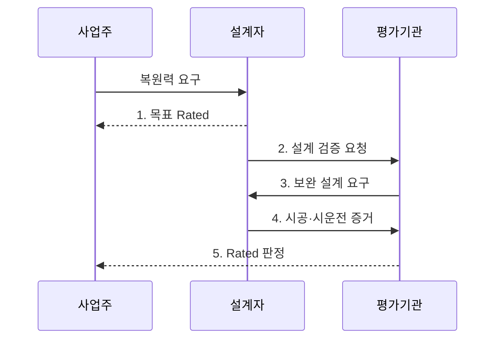

---
sidebar:
  order: 38
  label: "038. 데이터센터 등급 표준 (TIA-942 Rated)"
  badge:
    text: "기출 · 50%"
    variant: note
title: "데이터센터 등급 표준 (TIA-942 Rated)"
date: "2026-07-30T23:30:00+09:00"
author: "Claude Opus 4.6 (Enhanced by Gemini 3.5)"
tags:
  - "notes-evaluation"
weight: 38
extra:
  question_no: "038"
  source_status: "기출"
  source_history: "129회"
  priority: 50
  priority_note: "데이터센터 가용성 등급을 비교하는 기출 표준"
---

## 미리 알고가기

- **미국 국가표준협회(American National Standards Institute, ANSI)**: 미국의 국가표준 승인과 표준화 체계 조정을 담당하는 기관이다.
- **통신산업협회(Telecommunications Industry Association, TIA)**: 통신과 데이터센터 인프라 표준을 개발하는 산업 협회다.
- **ANSI/TIA-942-C**: 데이터센터의 건축·통신·전력·냉각·보안 인프라와 등급 요건을 정의한 표준이다.
- **IT 부하(IT Load)**: 데이터센터의 전력·냉각·통신을 실제로 사용하는 서버·스토리지·네트워크 장비다.
- **무정전 전원장치(Uninterruptible Power Supply, UPS)**: 정전이나 전원 이상 시 저장된 에너지로 장비에 전력을 계속 공급하는 장치다.
- **동시 유지보수성**: 계획 정비 중에도 IT 부하로의 공급을 중단하지 않는 능력이다.
- **내결함성**: 단일 설비나 공급 경로가 고장 나도 IT 서비스를 유지하는 능력이다.
- **공통 원인 장애**: 서로 이중화한 설비가 같은 화재·배관·전원 문제로 동시에 멈추는 장애다.
- **종합 시운전**: 실제 장애·전환 조건을 만들어 설비가 설계대로 연동되는지 확인하는 시험이다.
- **업무 영향 분석(Business Impact Analysis, BIA)**: 업무 중단의 영향과 허용 시간을 분석하여 복구 우선순위와 목표를 정하는 활동이다.
- **복구 시간 목표(Recovery Time Objective, RTO)**: 장애 발생 후 업무 서비스를 복구해야 하는 목표 시간이다.
- **재해 복구(Disaster Recovery, DR)**: 재해로 중단된 시스템과 데이터를 목표 시간 안에 복구하는 체계다.
- **Rated-1**: 하나의 기본 공급 경로로 IT 부하를 지원하는 기본 시설 등급이다.
- **Rated-2**: 하나의 공급 경로에 예비 용량 구성요소를 둔 시설 등급이다.
- **Rated-3**: 계획 정비 중에도 IT 부하 공급을 유지할 수 있는 시설 등급이다.
- **Rated-4**: 단일 장애가 발생해도 IT 부하 공급을 유지할 수 있는 내결함 시설 등급이다.
- **Rated와 Tier 구분**: TIA-942는 Rated, Uptime Institute는 Tier라는 서로 다른 시설 등급 명칭을 사용한다.


## Ⅰ. 개요

- 정의/개념: 데이터센터의 건축·통신·전력·냉각 인프라가 정비·장애 중 IT 부하를 지원하는 수준을 **Rated-1~4**로 평가하는 시설 표준
- 배경/필요성: 예비 장비 수만으로 판정하기 어려운 **공급 경로의 동시 유지보수성·내결함성**과 실제 전환 능력 검증

### 쉽게 이해하기 (학습용)
- 전력·냉각 장비를 정비하거나 하나가 고장 나도 서버가 계속 동작할 수준을 등급으로 구분함


## Ⅱ. 특징

- **물리 인프라 통합 평가**로 전력·냉각·통신과 시설 안전을 함께 검증한다.
- **공급 경로 복원력**으로 예비 용량·동시 유지보수·내결함 등급을 구분한다.
- **시설 가용성 범위**와 응용·데이터·운영 가용성을 분리해 판정한다.

### 쉽게 이해하기 (학습용)
- 예비 장비 개수뿐 아니라 정비나 고장 때 다른 공급 길이 실제로 살아 있는지 확인함


## Ⅲ. 구조 및 구성요소

```mermaid
block-beta
    columns 3
    P["전력 계통"] C["냉각 계통"] T["통신 계통"]
    I["IT 부하"]:3
    F["건축·안전·보안"]:3
    P -- I
    C -- I
    T -- I
    F -- P
    F -- C
    F -- T
  P --- I
  I --- F
```

| 구성요소 | 책임 |
|:---|:---|
| 전력 계통 | 수전·발전기·UPS의 용량과 **공급 경로** 유지 |
| 냉각 계통 | 냉동기·공조·배관의 용량과 **열 제거 경로** 유지 |
| 통신 계통 | 외부 인입과 내부 배선의 물리적 경로 분리 |
| IT 부하 | 전력·냉각·통신이 연속 공급해야 하는 보호 대상 |
| 건축·안전·보안 | 구획·하중·소화·출입통제로 공통 원인 장애 억제 |

### 쉽게 이해하기 (학습용)
- 서버까지 이어지는 전력·냉각·통신 길과 이를 둘러싼 건물·안전 통제를 함께 평가함


## Ⅳ. 흐름도



1. **목표 Rated**: BIA·RTO와 허용 중단 수준에 따라 정비·장애 허용 목표 선택
2. **설계 검증 요청**: 전력·냉각·통신의 용량·경로·물리 분리 요건을 도면으로 확인
3. **보완 설계 요구**: 목표 등급을 충족하지 못하는 단일 장애점과 공통 원인 경로 제거
4. **시공·시운전 증거**: 완공 상태에서 설비 고장·정비 조건을 만들어 공급 경로 전환 검증
5. **Rated 판정**: 영역별 요건과 현장 증거를 종합해 시설 등급 확정

### 쉽게 이해하기 (학습용)
- 업무가 버틸 수 있는 중단 시간을 정한 뒤 그 등급의 설계와 실제 시공 상태를 차례로 확인함


## Ⅴ. 종류 및 비교

| TIA-942 시설 등급 | Rated-1 | Rated-2 | Rated-3 | Rated-4 |
|:---|:---|:---|:---|:---|
| 적용 기준 | 짧은 중단을 허용할 때 | 설비 고장 위험을 줄일 때 | 계획 정비 중 가동이 필요할 때 | 장애 중에도 가동해야 할 때 |
| 핵심 특징 | 기본 단일 공급 | 예비 용량 구성요소 | 동시 유지보수 가능 | 단일 장애 허용 |
| 한계 | 정비·고장 시 중단 | 경로 장애 시 중단 | 일부 비계획 장애 취약 | 비용·복잡성·공통 장애 |

### 쉽게 이해하기 (학습용)
- Rated-3은 계획 정비를 견디고 Rated-4는 하나의 비계획 장애까지 견디는 수준임


## Ⅵ. 실무 고려사항 및 대책

| 고려사항 | 대책 | 효과 |
|:---|:---|:---|
| 높은 시설 등급을 요구하지만 업무의 **중단 허용 수준과 비용 불일치** | BIA·RTO로 중요 업무별 목표 Rated와 투자 범위 결정 | 가용성 투자와 **업무 위험 정렬** |
| 이중화 설비가 같은 공간·배관·전원을 공유해 **공통 원인 장애** | 공급 경로와 방재 구획을 물리적으로 분리하고 단일 장애점 검토 | 설비 중복의 **실제 내결함성 확보** |
| 설계 도면은 충족하지만 현장 전환 실패로 **서비스 중단** | 종합 시운전에서 정비·장애 시나리오별 부하 전환 시험 | 설계 등급의 **현장 작동성 입증** |

### 쉽게 이해하기 (학습용)
- 도면 검토 후 완공 시설에서 주 공급 경로를 차단해 예비 전력·냉각 경로가 실제 부하를 유지하는지 시험한다.


## Ⅶ. 결론

- 업무의 중단 허용 수준에 맞춰 **목표 Rated**를 선택하고 설계 검증과 현장 장애 전환 시험으로 동시 유지보수성·내결함성을 입증하는 시설 결정

### 쉽게 이해하기 (학습용)
- 중단 허용 수준에 맞는 Rated를 고르고 설계와 현장 시험으로 같은 수준을 검증함
