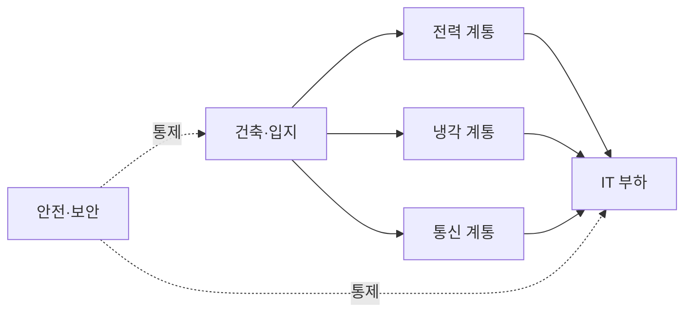
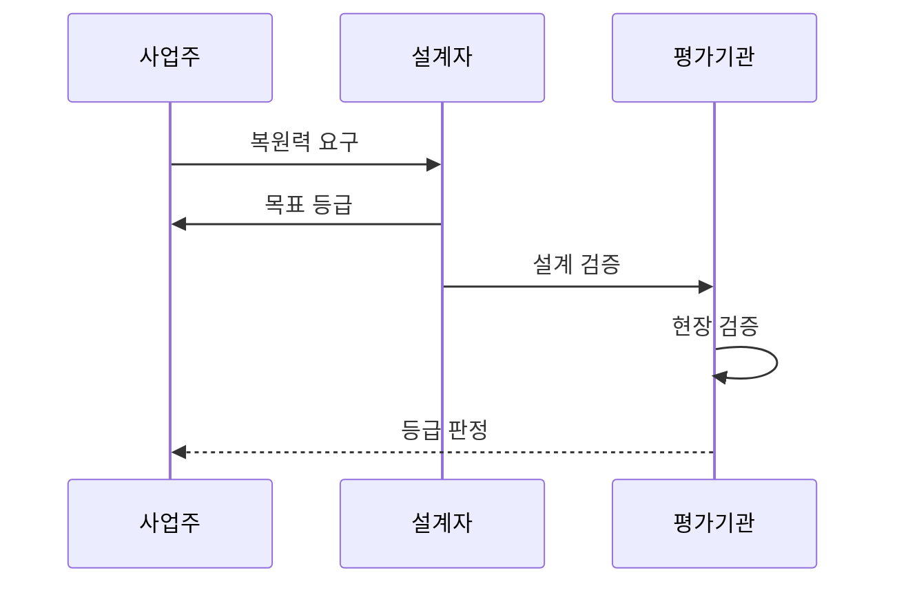

---
sidebar:
  order: 38
  label: "038. 데이터센터 등급 표준 (TIA-942 Tier Rating)"
  badge:
    text: "기출 · 50%"
    variant: note
title: "데이터센터 등급 표준 (TIA-942 Tier Rating)"
date: "2026-07-25T01:15:00+09:00"
author: "Claude Opus 4.6 (Enhanced by Gemini 3.5)"
tags:
  - "notes-evaluation"
weight: 38
extra:
  question_no: "038"
  source_status: "기출"
  source_history: "129회"
  priority: 50
  priority_note: "데이터센터 가용성 등급을 비교하는 기출 표준"
---

## 미리 알고가기

- **ANSI(American National Standards Institute)**: 미국의 표준 개발 절차를 승인하고 국가표준을 관리하는 기관
- **TIA(Telecommunications Industry Association)**: 통신·데이터센터 인프라 표준을 개발하는 산업 협회
- **ANSI/TIA-942-C**: 건축·통신·전력·냉각·화재·보안 등 데이터센터 물리 인프라 요구사항을 규정한 2024년 개정 표준
- **IT 부하(IT Load)**: 데이터센터의 전력·냉각·통신을 실제로 사용하는 서버·스토리지·네트워크 장비
- **UPS(Uninterruptible Power Supply)**: 상용 전원이 끊겨도 배터리 등으로 IT 장비에 전력을 계속 공급하는 장치
- **동시 유지보수성**: 계획 정비 중에도 IT 부하로의 공급을 중단하지 않는 능력
- **내결함성**: 단일 설비나 공급 경로가 고장 나도 IT 서비스를 유지하는 능력
- **공통 원인 장애**: 서로 이중화한 설비가 같은 화재·배관·전원 문제로 동시에 멈추는 장애
- **종합 시운전**: 실제 장애·전환 조건을 만들어 설비가 설계대로 연동되는지 확인하는 시험
- **BIA(Business Impact Analysis)**: 업무 중단의 시간별 피해를 분석해 필요한 복원 수준을 정하는 활동
- **RTO(Recovery Time Objective)**: 장애 후 업무를 복구해야 하는 목표 시간
- **DR(Disaster Recovery)**: 재해로 중단된 정보시스템과 데이터를 복구하는 체계
- **Rated-1**: 하나의 기본 공급 경로로 IT 부하를 지원하는 기본 시설 등급
- **Rated-2**: 하나의 공급 경로에 예비 용량 구성요소를 둔 시설 등급
- **Rated-3**: 계획 정비 중에도 IT 부하 공급을 유지할 수 있는 시설 등급
- **Rated-4**: 단일 장애가 발생해도 IT 부하 공급을 유지할 수 있는 내결함 시설 등급

## Ⅰ. 개요

- **정의/개념**: 데이터센터 물리 인프라의 복원력 등급 표준
- **배경/필요성**: 중단 허용 수준에 맞는 공급 경로 설계·검증

### 쉽게 이해하기 (학습용)
- 전력·냉각 장비를 정비하거나 하나가 고장 나도 서버가 계속 동작할 수준을 등급으로 구분함

## Ⅱ. 특징

- 규모·용도와 무관하게 물리 인프라를 평가한다.
- 건축·통신·전력·냉각·안전·보안을 포괄한다.
- 경로 분리·정비 지속성을 예비 용량보다 중시한다.
- 시설 등급은 응용 가용성을 보장하지 않는다.

### 쉽게 이해하기 (학습용)
- 예비 장비 개수뿐 아니라 정비나 고장 때 다른 공급 길이 실제로 살아 있는지 확인함

## Ⅲ. 아키텍처 및 구성요소

| 설계 요소 | 설명 |
|:---|:---|
| 건축·입지 | 공간 구획·하중·자연재해 위험 |
| 전력 계통 | 수전·발전기·UPS 공급 경로 |
| 냉각 계통 | 냉동기·배관의 용량과 경로 |
| 통신 계통 | 외부 인입·내부 배선 경로 |
| IT 부하 | 세 계통이 보호하는 정보 장비 |
| 안전·보안 | 소화·출입통제·환경 감시 |

### 쉽게 이해하기 (학습용)
- 서버까지 이어지는 전력·냉각·통신 길과 이를 둘러싼 건물·안전 통제를 함께 평가함

## Ⅳ. 원리 및 절차 흐름도

| 절차 | 설명 |
|:---|:---|
| 복원력 요구 | BIA·RTO로 허용 중단 수준 산정 |
| 목표 등급 | 정비·장애 허용 수준으로 Rated 선택 |
| 설계 검증 | 도면의 용량·경로·분리 요건 확인 |
| 현장 검증 | 시공 상태와 장애 전환을 시험 |
| 등급 판정 | 영역별 충족 결과로 인증 결정 |

### 쉽게 이해하기 (학습용)
- 업무가 버틸 수 있는 중단 시간을 정한 뒤 그 등급의 설계와 실제 시공 상태를 차례로 확인함

## Ⅴ. 종류 및 비교

| 판단 기준 | Rated-1 | Rated-2 | Rated-3 | Rated-4 |
|:---|:---|:---|:---|:---|
| 핵심 특징 | 기본 단일 공급 | 예비 용량 구성요소 | 동시 유지보수 가능 | 단일 장애 허용 |
| 적용 기준 | 짧은 중단을 허용할 때 | 설비 고장 위험을 줄일 때 | 계획 정비 중 가동이 필요할 때 | 장애 중에도 가동해야 할 때 |
| 주요 위험 | 정비·고장 시 서비스 중단 | 공급 경로 장애 시 중단 | 비계획 장애는 중단 가능 | 복잡성·비용과 공통 장애 |

### 쉽게 이해하기 (학습용)
- Rated-3은 계획 정비를 견디고 Rated-4는 하나의 비계획 장애까지 견디는 수준임

## Ⅵ. 실무 사례

1. 금융센터: Rated-4 전력·냉각 경로 분리
2. 상용센터: 설계 인증 후 현장 장애 전환 시험

### 쉽게 이해하기 (학습용)
- 전력·냉각 경로가 물리적으로 갈라져 하나의 고장이 양쪽을 함께 멈추지 않게 설계함
- 도면만 확인하지 않고 완공 시설에서 전원을 끊어 예비 경로가 실제로 전환되는지 시험함

## Ⅶ. 결론

- 정비 지속성·단일 장애 허용성으로 등급 선택

### 쉽게 이해하기 (학습용)
- 중단 허용 수준에 맞는 Rated를 고르고 설계와 현장 시험으로 같은 수준을 검증함
