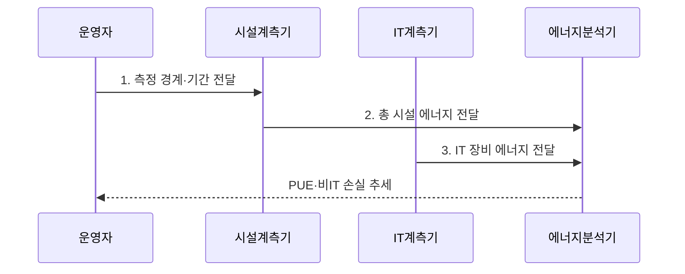

---
sidebar:
  order: 39
  label: "039. 데이터센터 전력 효율 지표 (PUE, Power Usage Effectiveness)"
  badge:
    text: "기출 · 50%"
    variant: note
title: "데이터센터 전력 효율 지표 (PUE, Power Usage Effectiveness)"
date: "2026-08-02T22:39:00+09:00"
author: "Claude Opus 4.6 (Enhanced by Gemini 3.5)"
tags:
  - "notes-evaluation"
weight: 39
extra:
  question_no: "039"
  source_status: "기출"
  source_history: "138회"
  priority: 50
  priority_note: "최근 기출, 전력 효율을 재는 데이터센터 지표"
---

## Ⅰ. 개요

핵심 용어

- **전력 사용 효율(Power Usage Effectiveness, PUE)**: 데이터센터 총 시설 에너지를 같은 경계·기간의 IT 장비 에너지로 나누어 비IT 지원 설비의 에너지 부담을 나타내는 지표이다.
- **정보기술(Information Technology, IT) 장비**: 데이터센터에서 실제 정보 처리를 수행하는 서버·스토리지·네트워크 장비이다.

- 정의/개념: **총 시설 에너지÷IT 장비 에너지** 로 지원 설비의 **에너지 부담** 을 측정하는 데이터센터 효율 지표
- 배경/필요성: 총에너지 사용량만으로는 IT 장비 소비와 냉각·배전의 **비IT 에너지 손실** 구분 곤란

#### 한줄 요약
- 서버가 1만큼 쓸 때 센터 전체가 몇 배의 전기를 쓰는지 보여 주며 1에 가까울수록 지원 설비 부담이 작음

## Ⅱ. 특징

핵심 용어

- **PUE≥1**: 총 시설 에너지가 IT 장비 에너지보다 작을 수 없으므로 PUE는 1 이상이며 1에 가까울수록 지원 설비 부담이 작다.
- **측정 경계·기간 정합성**: 분자와 분모가 같은 시설 경계와 관측 기간의 에너지를 사용해야 한다는 조건이다.
- **부하·계절 민감성**: 정보기술 부하와 외기 조건 변화에 따라 지원 설비의 고정·변동 에너지 비중과 PUE가 달라지는 특성이다.

- **PUE≥1이며 1에 가까울수록** 작은 비IT 에너지 부담
- **총 시설·IT 에너지의 경계·기간 일치** 를 전제로 한 비교
- **계절·IT 부하 민감성** 과 IT 생산성·탄소·물 효율의 별도 평가
- **ISO/IEC 30134-2:2026** 에 따른 현장 발전·미계측 에너지 관리

#### 한줄 요약
- 서버의 계산량이 줄어도 고정 냉각 전력은 남으므로 PUE가 나빠질 수 있어 IT 생산성 지표로 쓰면 안 됨

## Ⅲ. 구조 및 구성요소

핵심 용어

- **지원 설비**: IT 장비 운전에 필요한 냉각·공조·배전·조명 등의 시설이다.
- **무정전 전원장치(Uninterruptible Power Supply, UPS)**: 정전·전원 이상 시 IT 장비에 전력을 계속 공급하는 장치이며 변환 손실이 PUE에 포함된다.
- **전력 분배 장치(Power Distribution Unit, PDU)**: 데이터센터 전력을 IT 장비에 분배하고 IT 에너지를 계측하는 장치이다.

| 구성요소 | 책임 |
|:---|:---|
| **총 시설 에너지 계측** | 수전·자체 생산을 포함한 **전체 에너지** 측정 |
| **IT 장비 에너지 계측** | UPS·PDU 출력단의 **IT 장비 사용량** 측정 |
| **경계·기간 관리** | 총 시설과 IT 계측의 **공간·시간 범위** 일치 |
| **PUE 계산** | **총 시설 에너지÷IT 장비 에너지** 로 설비 부담 산출 |
| **추세·손실 분석** | 계절·IT 부하별 **냉각·배전 손실** 추적 |

#### 한줄 요약
- 센터 입구 전력과 서버 앞 전력을 같은 기간에 재서 그 차이를 냉각·배전 부담으로 봄

## Ⅳ. 흐름도

핵심 용어

- **총 시설 에너지**: 전력 인입점에서 계측한 IT 장비와 모든 지원 설비의 전체 에너지 사용량이다.
- **IT 장비 에너지**: UPS·PDU 손실 이후 서버·스토리지·네트워크 장비가 실제 사용한 에너지이다.
- **비IT 손실 추세**: 총 시설 에너지와 정보기술 장비 에너지의 차이를 기간별로 비교해 냉각·배전 부담 변화를 보는 분석이다.

1. **측정 경계·기간 전달**: 혼합용도 부하 분리와 **공간·시간 범위** 일치
2. **총 시설 에너지 전달**: 수전·현장 발전을 포함한 **전체 에너지** 집계
3. **IT 장비 에너지 전달**: UPS·PDU 출력단의 **IT 장비 에너지** 집계

#### 한줄 요약

- 시설 전체 전력과 IT 장비 전력을 같은 기간에 재서 나눈 뒤, 냉각·배전 개선 전후를 같은 조건으로 비교한다.

## Ⅴ. 종류 및 비교

핵심 용어

- **전력 사용 효율(Power Usage Effectiveness, PUE)**: IT 장비 에너지 대비 총 시설 에너지로 전력 지원 부담을 평가하는 지표이다.
- **탄소 사용 효율(Carbon Usage Effectiveness, CUE)**: IT 장비 에너지 대비 데이터센터 운영의 탄소 배출량을 평가하는 지표이다.
- **물 사용 효율(Water Usage Effectiveness, WUE)**: IT 장비 에너지 대비 데이터센터의 현장 물 사용량을 평가하는 지표이다.

| 데이터센터 효율 지표 | PUE | CUE | WUE |
|:---|:---|:---|:---|
| **적용 기준** | **PUE**: 냉각·배전 전력 효율 | **CUE**: 전력원 포함 탄소 감축 | **WUE**: 냉각수·지역 물 부담 |
| **핵심 특징** | IT 대비 **총 시설 에너지** | IT 대비 **탄소 배출량** | IT 대비 **물 사용량** |
| **한계** | IT 생산성·탄소 **미측정** | 배출계수별 **비교 편차** | 취수·소비 경계별 **편차** |

#### 한줄 요약
- 시설 전기는 PUE, 전력원의 탄소는 CUE, 냉각에 쓴 물은 WUE로 따로 봄

## Ⅵ. 실무 고려사항 및 대책

핵심 용어

- **혼합용도 건물**: 사무실과 데이터센터가 전력 설비를 공유하여 데이터센터 총에너지 경계를 분리하기 어려운 건물이다.
- **IT 부하 민감성**: 같은 시설도 IT 부하가 낮으면 고정 냉각·배전 손실 비중이 커져 PUE가 악화되는 특성이다.
- **계절 편향**: 외기 온도·습도에 따른 냉각 에너지 변화를 짧은 측정 기간이 대표하지 못하는 문제이다.
- **운영 안정성 균형**: PUE를 낮추려 냉각 여유를 과도하게 줄이지 않고 온습도와 가용성 범위 안에서 효율을 개선하는 원칙이다.

| 문제 | 대책 | 효과 |
|:---|:---|:---|
| 공용 부하 포함에 따른 **시설 에너지 과대계상** | 전용 계측과 근거 기반 **공용 부하 배분** | PUE의 **경계 정확성 확보** |
| 계절·IT 부하 차이에 따른 **효과 왜곡** | 동일 계절·유사 부하의 **PUE 장기 추세** 비교 | 냉각·배전 개선의 **효과 분리** |
| 냉각 여유 축소에 따른 **온도 위험 증가** | 온습도·가용성 내 **냉·열 통로 최적화** | 효율과 **운영 안정성 균형** |

#### 한줄 요약
- 냉·열 통로 분리 전후의 PUE를 같은 계절과 유사 IT 부하에서 비교해 냉각 손실 감소 효과를 확인한다.

## Ⅶ. 결론

핵심 용어

- **국제표준화기구·국제전기기술위원회 30134-2(International Organization for Standardization/International Electrotechnical Commission 30134-2, ISO/IEC 30134-2)**: PUE의 정의·측정·계산·보고 기준을 규정한 국제표준이다.
- **효율과 생산성 구분**: PUE가 시설 지원 에너지 비율만 나타내며 IT 작업량·서비스 가치나 절대 탄소 배출은 측정하지 않는다는 구분이다.
- **개선 결정**: 같은 경계·계절·부하의 PUE 추세로 냉각·배전을 개선하되 온습도와 가용성을 우선하는 판단이다.

- 같은 경계·부하의 **PUE 추세** 로 냉각·배전을 개선하되 **온습도·가용성** 우선

#### 한줄 요약
- PUE는 같은 센터의 냉각·배전 개선 추세에 쓰고 다른 기후·부하 센터와 단순 비교하지 않음
