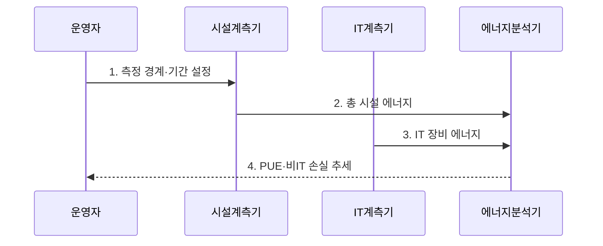

---
sidebar:
  order: 39
  label: "039. 데이터센터 전력 효율 지표 (PUE, Power Usage Effectiveness)"
  badge:
    text: "기출 · 50%"
    variant: note
title: "데이터센터 전력 효율 지표 (PUE, Power Usage Effectiveness)"
date: "2026-07-30T23:30:00+09:00"
author: "Claude Opus 4.6 (Enhanced by Gemini 3.5)"
tags:
  - "notes-evaluation"
weight: 39
extra:
  question_no: "039"
  source_status: "기출"
  source_history: "138회"
  priority: 50
  priority_note: "최근 기출, 전력 효율을 재는 데이터센터 지표"
---

## 미리 알고가기

- **전력 사용 효율(Power Usage Effectiveness, PUE)**: 데이터센터 총 시설 에너지를 IT 장비 에너지로 나누어 지원 설비의 전력 부담을 나타내는 지표다.
- **IT 장비**: 데이터센터에서 실제 정보 처리를 수행하는 서버·스토리지·네트워크 장비다.
- **지원 설비**: IT 장비를 운전하기 위한 냉각·공조·배전·조명 등의 시설이다.
- **무정전 전원장치(Uninterruptible Power Supply, UPS)**: 정전이나 전원 이상 시 장비에 전력을 계속 공급하는 장치다.
- **전력 분배 장치(Power Distribution Unit, PDU)**: 데이터센터 전력을 IT 장비에 분배하고 사용량을 계측하는 장치다.
- **탄소 사용 효율(Carbon Usage Effectiveness, CUE)**: IT 장비 에너지 사용량 대비 데이터센터의 탄소 배출량을 나타내는 지표다.
- **물 사용 효율(Water Usage Effectiveness, WUE)**: IT 장비 에너지 사용량 대비 데이터센터의 현장 물 사용량을 나타내는 지표다.
- **혼합용도 건물**: 사무실과 데이터센터처럼 여러 용도가 전력 설비를 함께 사용하는 건물이다.
- **ISO/IEC 30134-2**: PUE의 정의와 측정·계산·보고 기준을 규정한 국제표준이다.


## Ⅰ. 개요

- 정의/개념: 데이터센터 **총 시설 에너지**를 **IT 장비 에너지**로 나눠 냉각·배전 등 지원 설비의 에너지 부담을 측정하는 효율 지표
- 배경/필요성: 총에너지 사용량만으로 구분하기 어려운 IT 장비 소비와 냉각·배전 등 **비IT 에너지 손실**의 개선 효과 측정

### 쉽게 이해하기 (학습용)
- 서버가 1만큼 쓸 때 센터 전체가 몇 배의 전기를 쓰는지 보여 주며 1에 가까울수록 지원 설비 부담이 작음


## Ⅱ. 특징

- **PUE≥1이며 1에 가까울수록** 비IT 에너지 부담이 작다.
- **총 시설·IT 에너지의 경계·기간 일치**가 비교의 전제다.
- **계절·IT 부하에 민감**하며 IT 생산성·탄소·물 효율은 별도 평가한다.

### 쉽게 이해하기 (학습용)
- 서버의 계산량이 줄어도 고정 냉각 전력은 남으므로 PUE가 나빠질 수 있어 IT 생산성 지표로 쓰면 안 됨


## Ⅲ. 구조 및 구성요소

```mermaid
block-beta
    columns 2
    F["총 시설 에너지 계측"] I["IT 장비 에너지 계측"]
    B["경계·기간 관리"]:2
    P["PUE 계산"]:2
    A["추세·손실 분석"]:2
    F -- B
    I -- B
    B -- P
    P -- A
```

| 구성요소 | 책임 |
|:---|:---|
| 총 시설 에너지 계측 | 수전·자체 생산을 포함한 데이터센터 전체 에너지 측정 |
| IT 장비 에너지 계측 | UPS·PDU 출력단에서 서버·스토리지·네트워크 사용량 측정 |
| 경계·기간 관리 | 총 시설과 IT 장비 계측의 시설 범위·시간 구간 일치 |
| PUE 계산 | **총 시설 에너지÷IT 장비 에너지**로 지원 설비 부담 산출 |
| 추세·손실 분석 | 계절·IT 부하별 PUE와 냉각·배전 손실의 변화 추적 |

### 쉽게 이해하기 (학습용)
- 센터 입구 전력과 서버 앞 전력을 같은 기간에 재서 그 차이를 냉각·배전 부담으로 봄


## Ⅳ. 흐름도



### 동작 원리

1. **측정 경계·기간 설정**: 혼합용도 부하를 분리하고 총 시설·IT 계측의 공간과 시간 범위를 일치
2. **총 시설 에너지**: 수전과 현장 발전을 포함한 데이터센터 전체 에너지를 같은 기간으로 집계
3. **IT 장비 에너지**: 서버·스토리지·네트워크에 실제 전달된 에너지를 UPS·PDU 출력단에서 집계
4. **PUE·비IT 손실 추세**: 총 시설 에너지를 IT 장비 에너지로 나누고 계절·부하별 냉각·배전 부담 분석


## Ⅴ. 종류 및 비교

| 데이터센터 효율 지표 | PUE | CUE | WUE |
|:---|:---|:---|:---|
| 적용 기준 | 냉각·배전 전력 효율 개선 | 전력원 포함 탄소 감축 | 냉각수·지역 물 부담 관리 |
| 핵심 특징 | IT 대비 총 시설 에너지 | IT 대비 탄소 배출량 | IT 대비 물 사용량 |
| 한계 | IT 생산성·탄소 미측정 | 배출계수별 비교 편차 | 취수·소비 경계별 편차 |

### 쉽게 이해하기 (학습용)
- 시설 전기는 PUE, 전력원의 탄소는 CUE, 냉각에 쓴 물은 WUE로 따로 봄


## Ⅵ. 실무 고려사항 및 대책

| 고려사항 | 대책 | 효과 |
|:---|:---|:---|
| 혼합용도 건물의 사무실 부하가 포함돼 **총 시설 에너지 과대계상** | 데이터센터 전용 계측기를 설치하고 공용 부하는 근거 있는 방식으로 배분 | PUE 측정 **경계 정확성 확보** |
| 계절·IT 부하가 다른 기간을 비교해 **개선 효과 왜곡** | 동일 계절·유사 IT 부하 구간의 PUE와 장기 추세를 함께 비교 | 냉각·배전 개선의 **효과 분리** |
| 낮은 PUE를 위해 냉각 여유를 줄여 **장비 온도 위험 증가** | 온도·습도 한계와 가용성 조건 안에서 냉·열 통로와 제어값 최적화 | 에너지 효율과 **운영 안정성 균형** |

### 쉽게 이해하기 (학습용)
- 냉·열 통로 분리 전후의 PUE를 같은 계절과 유사 IT 부하에서 비교해 냉각 손실 감소 효과를 확인한다.


## Ⅶ. 결론

- 동일한 계측 경계·기간과 유사 IT 부하에서 **PUE 추세**를 비교해 냉각·배전 손실을 줄이되 장비 환경 한계와 가용성을 함께 지키는 운영 결정

### 쉽게 이해하기 (학습용)
- PUE는 같은 센터의 냉각·배전 개선 추세에 쓰고 다른 기후·부하 센터와 단순 비교하지 않음
