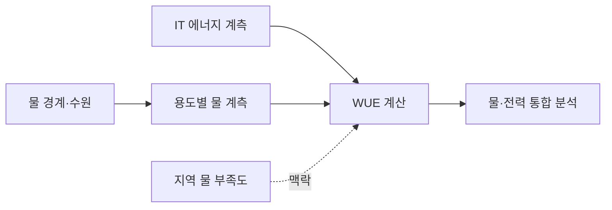
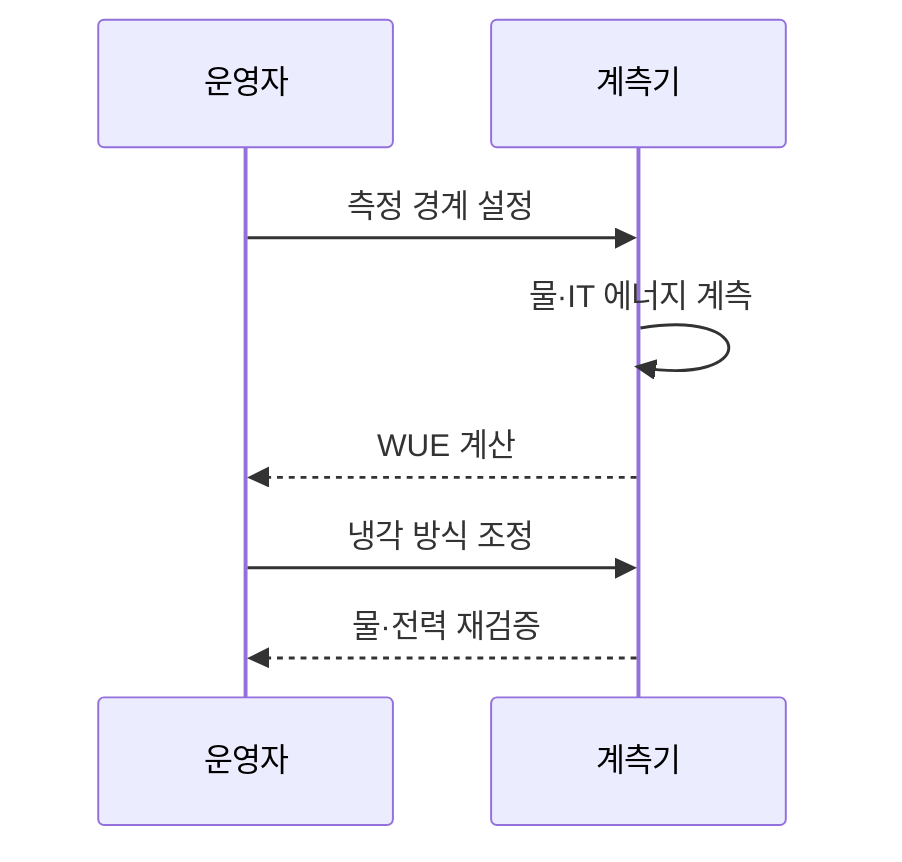

---
sidebar:
  order: 40
  label: "040. 데이터센터 물 사용 효율 지표 (WUE, Water Usage Effectiveness)"
  badge:
    text: "기출 · 50%"
    variant: note
title: "데이터센터 물 사용 효율 지표 (WUE, Water Usage Effectiveness)"
date: "2026-07-25T01:10:00+09:00"
author: "Claude Opus 4.6 (Enhanced by Gemini 3.5)"
tags:
  - "notes-evaluation"
weight: 40
extra:
  question_no: "040"
  source_status: "기출"
  source_history: "138회"
  priority: 50
  priority_note: "최근 기출, 냉각수 효율을 재는 환경 지표"
---

## 미리 알고가기

- **WUE(Water Usage Effectiveness)**: 데이터센터의 연간 물 사용량을 IT 장비 에너지로 나눈 수자원 효율 지표
- **IT 장비 에너지**: 서버·스토리지·네트워크 장비가 일정 기간 사용한 전력량
- **PUE(Power Usage Effectiveness)**: 데이터센터 총에너지를 IT 장비 에너지로 나눈 시설 전력 효율 지표
- **L/kWh**: IT 장비가 1킬로와트시 전력을 쓸 때 소비한 물의 리터 수를 나타내는 WUE 단위
- **물 부족도(Water Stress)**: 지역의 물 수요가 이용 가능한 수자원에 주는 압박 정도
- **현장 물 사용**: 냉각·가습·시설 운영 과정에서 데이터센터가 직접 소비한 물
- **간접 물 사용**: 데이터센터가 소비한 전력을 생산하는 과정 등 공급망에서 사용한 물
- **재이용수**: 하수·폐수를 처리해 냉각 등 비음용 목적으로 다시 쓰는 물
- **폐쇄형 냉각**: 냉각수를 외부에 버리지 않고 밀폐된 회로에서 순환시키는 방식
- **전력원 구성(Grid Mix)**: 전력망 전기가 화력·원자력·재생에너지 등으로 생산된 비율

## Ⅰ. 개요

- **정의/개념**: 물 사용량÷IT 에너지로 물 효율 측정
- **배경/필요성**: 냉각수 소비와 지역 물 부족 위험 관리

### 쉽게 이해하기 (학습용)
- 서버가 전기 1kWh를 쓸 때 냉각 등에 몇 리터의 물을 소비했는지 보여 줌

## Ⅱ. 특징

- 연간 물 사용량과 IT 에너지로 L/kWh 산출한다.
- 현장 소비와 전력 생산의 간접 소비를 구분한다.
- 기후·냉각 방식·IT 부하에 따라 값 변동한다.
- 물 절감 시 냉각 전력이 늘어 PUE와 상충한다.

### 쉽게 이해하기 (학습용)
- 물을 증발시켜 식히는 대신 전기식 냉각을 늘리면 WUE는 좋아져도 PUE가 나빠질 수 있음

## Ⅲ. 아키텍처 및 구성요소

| 설계 요소 | 설명 |
|:---|:---|
| 물 경계·수원 | 상수·지하수·재이용수 범위 구분 |
| 용도별 물 계측 | 냉각·가습·생활용수 사용량 분리 |
| IT 에너지 계측 | 물과 같은 기간의 IT 전력량 측정 |
| WUE 계산 | 물 사용량을 IT 에너지로 나눔 |
| 지역 물 부족도 | 같은 사용량의 지역별 부담 반영 |
| 물·전력 통합 분석 | WUE 개선에 따른 PUE 변화 확인 |

### 쉽게 이해하기 (학습용)
- 어디서 온 물이 어디에서 소비되는지 재고 같은 기간 서버 전력으로 나눠 지역 부담까지 봄

## Ⅳ. 원리 및 절차 흐름도

| 절차 | 설명 |
|:---|:---|
| 측정 경계 설정 | 취수·소비 경계와 측정 기간 확정 |
| 물·IT 에너지 계측 | 같은 기간의 물과 IT 전력량 수집 |
| WUE 계산 | L/kWh 산출 후 지역 맥락 분석 |
| 냉각 방식 조정 | 재이용수·폐쇄형 냉각 적용 |
| 물·전력 재검증 | WUE·PUE 변화를 함께 확인 |

### 쉽게 이해하기 (학습용)
- 같은 기간의 물과 서버 전력을 재고 냉각 방식을 바꾼 뒤 물·전력 변화를 함께 확인함

## Ⅴ. 종류 및 비교

| 비교축 | 현장 WUE | 공급망 포함 WUE | 절대 물 사용량 |
|:---|:---|:---|:---|
| 핵심 특징 | 현장 물÷IT 에너지 | 현장·간접 물÷IT 에너지 | 시설 전체 물 사용량 |
| 적용 기준 | 냉각·가습 방식 개선 | 전력원까지 물 영향을 평가 | 지역 취수 한도·가뭄 대응 |
| 주요 위험 | 발전소 물 사용을 제외 | 전력원별 계수 불확실 | IT 부하 차이를 반영 못 함 |

### 쉽게 이해하기 (학습용)
- 센터 냉각만 보면 현장 WUE, 전기를 만들 때 쓴 물까지 보면 공급망 포함 WUE를 사용함

## Ⅵ. 실무 사례

- 가뭄 지역 센터: 재이용수로 상수 취수 감축
- 냉각 설비: 폐쇄형 전환 후 WUE·PUE 비교

### 쉽게 이해하기 (학습용)
- 냉각에 재이용수를 우선 공급해 주민과 기업이 쓰는 상수의 소비를 줄임
- 증발식 냉각을 폐쇄형으로 바꾼 뒤 줄어든 물과 늘어난 전력을 함께 비교함

## Ⅶ. 결론

- 지역 물 부족도와 PUE로 WUE 개선안 선택

### 쉽게 이해하기 (학습용)
- WUE만 낮추지 말고 지역의 물 부족 정도와 냉각 전력 증가를 함께 보고 방식을 골라야 함
