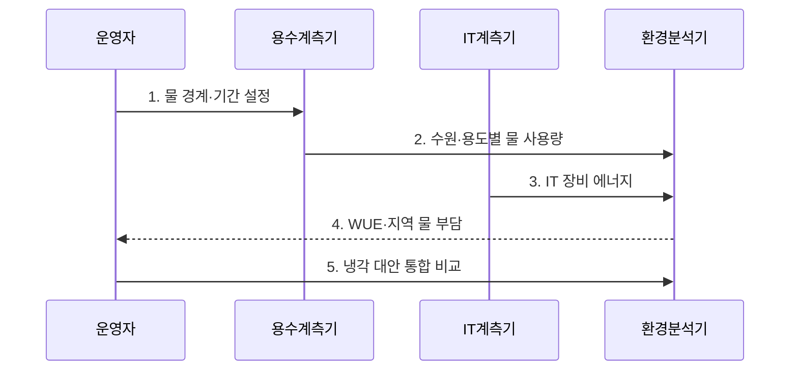

---
sidebar:
  order: 40
  label: "040. 데이터센터 물 사용 효율 지표 (WUE, Water Usage Effectiveness)"
  badge:
    text: "기출 · 50%"
    variant: note
title: "데이터센터 물 사용 효율 지표 (WUE, Water Usage Effectiveness)"
date: "2026-07-30T23:30:00+09:00"
author: "Claude Opus 4.6 (Enhanced by Gemini 3.5)"
tags:
  - "notes-evaluation"
weight: 40
extra:
  question_no: "040"
  source_status: "기출"
  source_history: "138회"
  priority: 50
  priority_note: "최근 기출, 냉각수 효율을 재는 환경 지표"
---

## 미리 알고가기

- **물 사용 효율(Water Usage Effectiveness, WUE)**: 데이터센터의 연간 현장 물 사용량을 IT 장비 에너지로 나누어 물 사용 부담을 나타내는 지표다.
- **IT 장비 에너지**: 서버·스토리지·네트워크 장비가 일정 기간 사용한 전력량이다.
- **전력 사용 효율(Power Usage Effectiveness, PUE)**: 데이터센터 총 시설 에너지를 IT 장비 에너지로 나누어 지원 설비의 전력 부담을 나타내는 지표다.
- **L/kWh**: 킬로와트시당 리터로 읽으며 IT 에너지 1kWh당 소비한 물의 양을 표시하는 단위다.
- **물 부족도(Water Stress)**: 지역의 물 수요가 이용 가능한 수자원에 주는 압박 정도다.
- **현장 물 사용**: 냉각·가습·시설 운영 과정에서 데이터센터가 직접 소비한 물이다.
- **간접 물 사용**: 데이터센터가 소비한 전력을 생산하는 과정 등 공급망에서 사용한 물이다.
- **재이용수**: 하수·폐수를 처리해 냉각 등 비음용 목적으로 다시 쓰는 물이다.
- **폐쇄형 냉각**: 냉각수를 외부에 버리지 않고 밀폐된 회로에서 순환시키는 방식이다.
- **전력원 구성(Grid Mix)**: 전력망 전기가 화력·원자력·재생에너지 등으로 생산된 비율


## Ⅰ. 개요

- 정의/개념: 데이터센터의 **연간 현장 물 사용량**을 같은 기간의 **IT 장비 에너지**로 나눠 IT 부하당 물 소비 부담을 측정하는 효율 지표
- 배경/필요성: 절대 물 사용량만으로 반영하기 어려운 데이터센터별 **IT 부하 차이**와 지역 물 부족 위험을 결합한 냉각 방식 판단

### 쉽게 이해하기 (학습용)
- 서버가 전기 1kWh를 쓸 때 냉각 등에 몇 리터의 물을 소비했는지 보여 줌


## Ⅱ. 특징

- **동일 기간의 현장 물 사용량÷IT 에너지**로 L/kWh를 산출한다.
- **현장 직접 물과 전력 생산의 간접 물**을 경계별로 구분한다.
- **기후·물 부족도·냉각 방식·PUE 상충**을 함께 평가한다.

### 쉽게 이해하기 (학습용)
- 물을 증발시켜 식히는 대신 전기식 냉각을 늘리면 WUE는 좋아져도 PUE가 나빠질 수 있음


## Ⅲ. 구조 및 구성요소

```mermaid
block-beta
    columns 2
    W["물 경계·용도 계측"] I["IT 에너지 계측"]
    C["WUE 계산"]:2
    S["지역 물 부족도"] A["물·전력 통합 분석"]
    W -- C
    I -- C
    C -- A
    S -- A
```

| 구성요소 | 책임 |
|:---|:---|
| 물 경계·용도 계측 | 상수·지하수·재이용수와 냉각·가습·시설용수를 분리 측정 |
| IT 에너지 계측 | 물 사용량과 같은 기간의 서버·스토리지·네트워크 전력량 측정 |
| WUE 계산 | **현장 물 사용량÷IT 장비 에너지**로 L/kWh 산출 |
| 지역 물 부족도 | 동일한 취수량이 지역 수자원에 미치는 부담을 보정 |
| 물·전력 통합 분석 | 냉각 방식 변경에 따른 WUE·PUE와 탄소 영향을 함께 비교 |

### 쉽게 이해하기 (학습용)
- 어디서 온 물이 어디에서 소비되는지 재고 같은 기간 서버 전력으로 나눠 지역 부담까지 봄


## Ⅳ. 흐름도



### 동작 원리

1. **물 경계·기간 설정**: 현장 직접 물과 공급망 간접 물을 구분하고 수원·시설·시간 범위 고정
2. **수원·용도별 물 사용량**: 상수·지하수·재이용수와 냉각·가습·시설용수 소비를 분리 집계
3. **IT 장비 에너지**: 물 계측과 같은 기간의 서버·스토리지·네트워크 에너지를 측정
4. **WUE·지역 물 부담**: 현장 물 사용량을 IT 장비 에너지로 나누고 지역 물 부족도를 함께 적용
5. **냉각 대안 통합 비교**: 냉각 방식별 WUE·PUE·탄소·가용성 변화를 비교해 대안 선택


## Ⅴ. 종류 및 비교

| 데이터센터 물 사용 지표 | 현장 WUE | 공급망 포함 WUE | 절대 물 사용량 |
|:---|:---|:---|:---|
| 적용 기준 | 냉각·가습 방식 개선 | 전력원까지 물 영향을 평가 | 지역 취수 한도·가뭄 대응 |
| 핵심 특징 | 현장 물÷IT 에너지 | 현장·간접 물÷IT 에너지 | 시설 전체 물 사용량 |
| 한계 | 발전 과정 물 사용 제외 | 전력원별 계수 불확실 | IT 부하 차이 미반영 |

### 쉽게 이해하기 (학습용)
- 센터 냉각만 보면 현장 WUE, 전기를 만들 때 쓴 물까지 보면 공급망 포함 WUE를 사용함


## Ⅵ. 실무 고려사항 및 대책

| 고려사항 | 대책 | 효과 |
|:---|:---|:---|
| 현장 물과 발전 과정의 간접 물을 섞어 **WUE 경계 불명확** | 현장 WUE와 공급망 포함 지표를 분리하고 계측 경계 공개 | 센터 운영과 전력원의 **물 영향 구분** |
| 동일 WUE라도 가뭄 지역의 상수 취수로 **지역 물 위험 증가** | 물 부족도를 반영해 재이용수·우수 등 대체 수원 우선 | 지역 상수의 **취수 부담 감소** |
| 물 소비를 줄이는 전기식 냉각으로 **PUE·탄소 악화** | 냉각 대안의 WUE·PUE·탄소·가용성을 같은 부하 조건에서 비교 | 물·전력 간 **부담 전가 방지** |

### 쉽게 이해하기 (학습용)
- 가뭄 지역에서는 냉각에 재이용수를 우선 공급해 IT 부하를 유지하면서 지역 상수 취수량을 줄인다.


## Ⅶ. 결론

- **WUE와 지역 물 부족도**로 냉각 수원을 정하고 PUE·탄소·가용성의 변화를 함께 비교해 물 절감이 다른 환경 부담으로 전가되지 않게 하는 운영 결정

### 쉽게 이해하기 (학습용)
- WUE만 낮추지 말고 지역의 물 부족 정도와 냉각 전력 증가를 함께 보고 방식을 골라야 함
