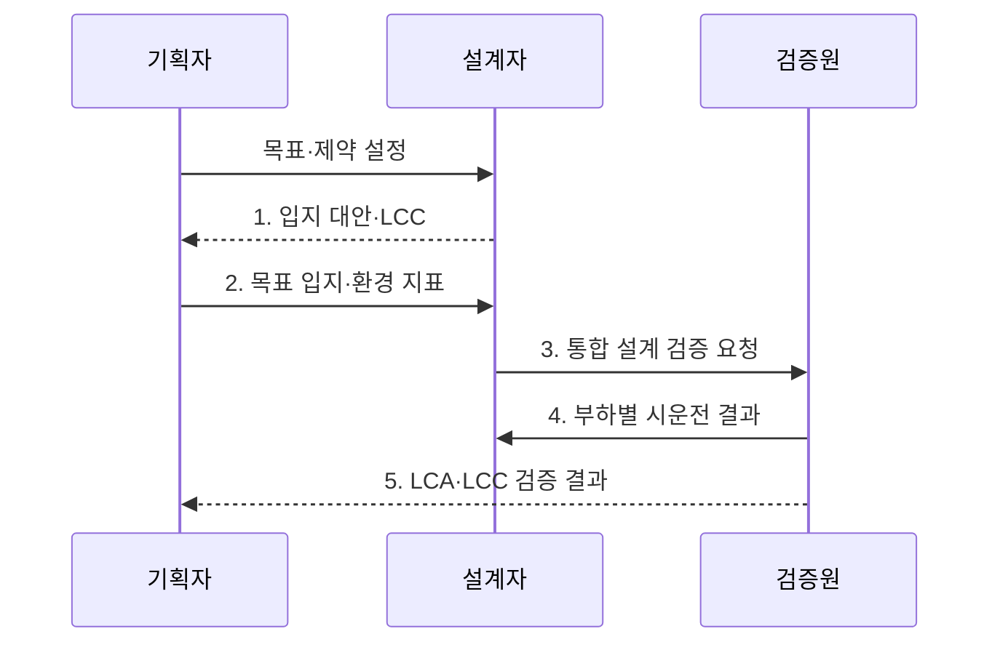

---
sidebar:
  order: 41
  label: "041. 그린 데이터센터 설계 기준 (Green Data Center Design)"
  badge:
    text: "기출 · 70%"
    variant: note
title: "그린 데이터센터 설계 기준 (Green Data Center Design)"
date: "2026-07-30T23:30:00+09:00"
author: "Claude Opus 4.6 (Enhanced by Gemini 3.5)"
tags:
  - "notes-evaluation"
weight: 41
extra:
  question_no: "041"
  source_status: "기출"
  source_history: "138회"
  priority: 70
  priority_note: "최근 기출, 전력·냉각·탄소를 묶는 설계축"
---

## 미리 알고가기

- **그린 데이터센터(Green Data Center, GDC)**: 서비스 가용성을 유지하면서 에너지·탄소·물 사용과 자원 폐기 영향을 줄이도록 설계·운영하는 시설이다.
- **전력 사용 효율(Power Usage Effectiveness, PUE)**: 데이터센터 총에너지를 IT 장비 에너지로 나누어 지원 설비의 전력 부담을 나타내는 지표다.
- **물 사용 효율(Water Usage Effectiveness, WUE)**: 현장 물 사용량을 IT 장비 에너지로 나누어 물 사용 부담을 나타내는 지표다.
- **탄소 사용 효율(Carbon Usage Effectiveness, CUE)**: 탄소 배출량을 IT 장비 에너지로 나누어 탄소 집약도를 나타내는 지표다.
- **재생에너지 계수(Renewable Energy Factor, REF)**: 데이터센터 총에너지 중 재생에너지가 차지하는 비율이다.
- **생애주기 평가(Life Cycle Assessment, LCA)**: 원료 조달부터 건설·운영·폐기까지 전 과정의 환경 영향을 평가하는 기법이다.
- **생애주기 비용(Life Cycle Cost, LCC)**: 도입비뿐 아니라 운영·유지·폐기 비용까지 합산한 비용이다.
- **외기 냉각**: 낮은 외부 온도를 이용해 냉동기 가동을 줄이는 냉각 방식이다.
- **액체 냉각**: 공기보다 열전달이 좋은 액체로 고발열 IT 장비의 열을 제거하는 방식이다.
- **침지 냉각**: 전기가 통하지 않는 냉각액에 서버를 담가 열을 직접 제거하는 액체 냉각 방식이다.
- **고밀도 랙**: 한 랙에 많은 고전력 장비를 배치해 단위 면적당 발열량이 큰 구성이다.


## Ⅰ. 개요

- 정의/개념: 서비스 가용성을 유지하면서 입지·IT 자원·전력·냉각의 생애주기를 최적화해 **에너지·탄소·물·폐기 영향**을 줄이는 데이터센터 설계
- 배경/필요성: 전력 효율만 최적화할 때 냉각수·전력원 탄소·서비스 가용성으로 환경 부담이 이동하는 **지표 간 상충** 방지

### 쉽게 이해하기 (학습용)
- 서버를 멈추지 않으면서 전기·물·탄소를 덜 쓰도록 입지부터 장비 폐기까지 함께 설계함


## Ⅱ. 특징

- **다중 환경지표**로 전력·물·탄소·재생에너지 영향을 함께 평가한다.
- **생애주기 최적화**로 입지·IT·시설의 건설·운영·폐기 영향을 줄인다.
- **냉각 효율·서비스 가용성 상충**을 실제 부하 시험으로 검증한다.

### 쉽게 이해하기 (학습용)
- 전기만 줄여 다른 지역의 물이나 탄소 부담을 늘리지 않도록 여러 환경 지표를 함께 봄


## Ⅲ. 구조 및 구성요소

```mermaid
block-beta
    columns 3
    L["입지"] R["에너지·수자원"]
    I["IT 자원"] F["시설 인프라"]
    M["성과 계측"]:2
    L -- I
    L -- F
    R -- F
    I -- M
    F -- M
  L --- I
  I --- M
```

| 구성요소 | 책임 |
|:---|:---|
| 입지 | 기후·전력망·물 부족도·재해 위험으로 설계 제약 제공 |
| 에너지·수자원 | 재생전력·재이용수의 공급량과 지역 환경 부담 관리 |
| IT 자원 | 서버 이용률·고밀도 랙·장비 수명을 최적화해 처리당 자원 감소 |
| 시설 인프라 | 전력 경로와 외기·액체 냉각으로 배전·열 제거 손실 감소 |
| 성과 계측 | PUE·CUE·WUE·REF와 가용성을 같은 부하 조건에서 추적 |

### 쉽게 이해하기 (학습용)
- 입지가 허용하는 전력·물 안에서 서버와 냉각을 맞추고 네 지표로 실제 효과를 확인함


## Ⅳ. 흐름도



1. **입지 대안·LCC**: 기후·전력망·물 부족도·재해 위험과 생애주기 비용 비교
2. **목표 입지·환경 지표**: 서비스 부하·가용성 조건과 PUE·WUE·CUE·REF 목표 확정
3. **통합 설계 검증 요청**: IT 자원·전력 경로·냉각 방식·에너지·수자원 조달의 상충 검토
4. **부하별 시운전 결과**: 저·평균·최대 부하에서 환경 지표와 장애 전환 능력 측정
5. **LCA·LCC 검증 결과**: 건설·운영·폐기의 환경 영향과 비용을 합산해 설계 대안 확정

### 쉽게 이해하기 (학습용)
- 서비스 목표와 지역 한계를 먼저 정하고 시설을 지은 뒤 실제 부하에서 전력·물·탄소를 확인함


## Ⅴ. 종류 및 비교

| 그린 설계 영역 | IT 자원 | 시설 인프라 | 에너지·수자원 |
|:---|:---|:---|:---|
| 적용 기준 | 저이용 서버가 많을 때 | 고밀도 발열·높은 PUE | 높은 CUE·WUE·물 부족도 |
| 핵심 특징 | 연산당 장비 사용량 절감 | 배전·냉각 손실 절감 | 탄소·물 원천 부담 절감 |
| 한계 | 통합 시 장애 영향 확대 | 절수와 전력 효율 상충 | 공급 변동·지역 부담 전가 |

### 쉽게 이해하기 (학습용)
- 빈 서버는 통합하고 시설 손실은 냉각으로 줄이며 남은 전력·물은 저환경 자원으로 조달함


## Ⅵ. 실무 고려사항 및 대책

| 고려사항 | 대책 | 효과 |
|:---|:---|:---|
| 고밀도 AI 랙의 발열이 공랭 용량을 넘어 **열점·장애 증가** | 액체·침지 냉각을 적용하고 누수·정비·재료 호환성 시험 | 냉각 전력 감소와 **열 안정성 확보** |
| 물 절감형 냉각이 전력 사용을 늘려 **PUE·CUE 악화** | 동일 부하에서 WUE·PUE·CUE를 함께 비교해 제어값 최적화 | 환경 부담의 **지표 간 전가 방지** |
| 서버 통합으로 효율은 높지만 장애 시 **영향 범위 확대** | 가용성 목표에 맞춰 자원 분산·예비 용량·장애 전환 시험 | 자원 효율과 **서비스 연속성 균형** |

### 쉽게 이해하기 (학습용)
- 발열이 큰 AI 서버에 침지 냉각을 적용하되 냉각액 호환성·정비 방식·장애 전환을 실제 부하에서 함께 검증한다.


## Ⅶ. 결론

- 서비스 부하·가용성을 제약으로 두고 **PUE·WUE·CUE·REF와 LCA·LCC**를 함께 비교해 환경 부담을 다른 자원으로 전가하지 않는 설계 대안 결정

### 쉽게 이해하기 (학습용)
- 한 지표만 낮추지 않고 서비스 가용성과 전력·탄소·물의 상충을 함께 줄이는 대안을 고름
