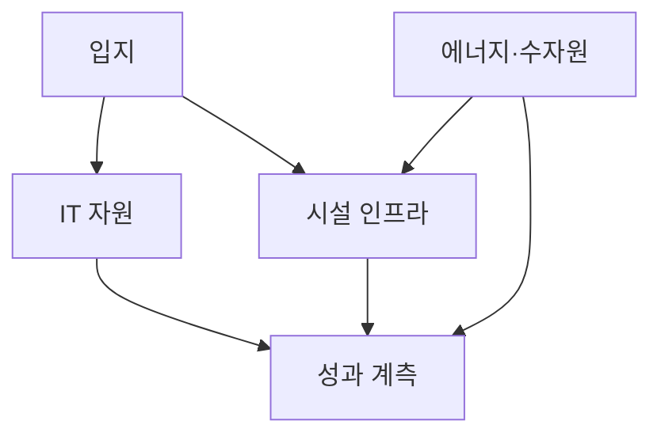
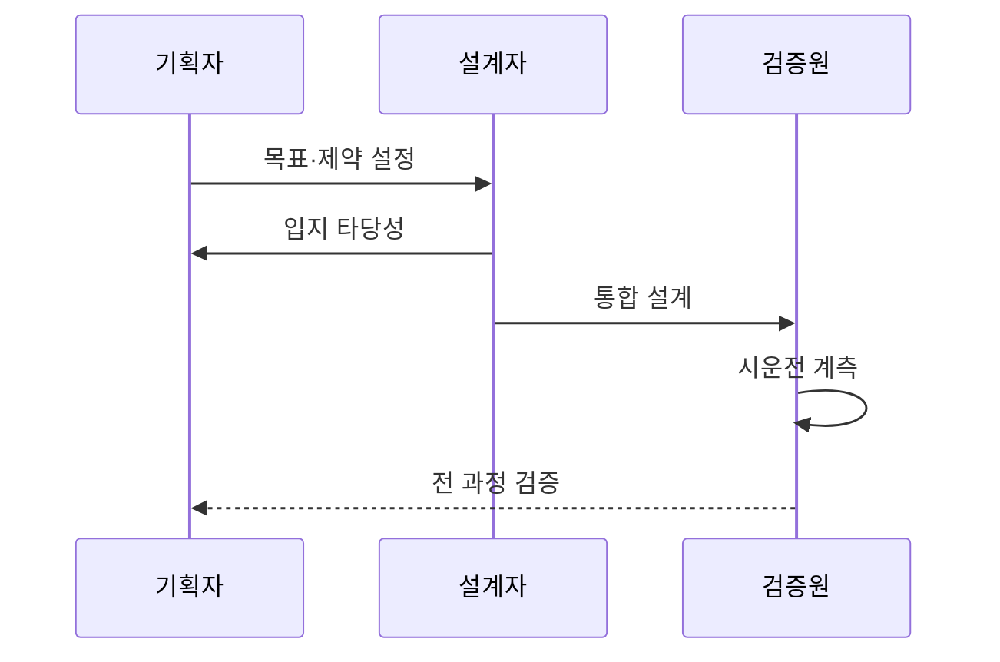

---
sidebar:
  order: 41
  label: "041. 그린 데이터센터 설계 기준 (Green Data Center Design)"
  badge:
    text: "기출 · 70%"
    variant: note
title: "그린 데이터센터 설계 기준 (Green Data Center Design)"
date: "2026-07-27T23:59:59+09:00"
author: "Claude Opus 4.6 (Enhanced by Gemini 3.5)"
tags:
  - "notes-evaluation"
weight: 41
extra:
  question_no: "041"
  source_status: "기출"
  source_history: "138회"
  priority: 70
  priority_note: "최근 기출, 전력·냉각·탄소를 묶는 설계축"
---

## 미리 알고가기

- **그린 데이터센터(Green Data Center, GDC)**: 서비스 가용성을 유지하면서 에너지·탄소·물과 자원 폐기 영향을 줄이도록 설계·운영하는 시설
- **전력 사용 효율(Power Usage Effectiveness, PUE)**: 데이터센터 총에너지를 IT 장비 에너지로 나누어 지원 설비의 전력 부담을 나타내는 지표다.
- **물 사용 효율(Water Usage Effectiveness, WUE)**: 현장 물 사용량을 IT 장비 에너지로 나누어 물 사용 부담을 나타내는 지표다.
- **탄소 사용 효율(Carbon Usage Effectiveness, CUE)**: 탄소 배출량을 IT 장비 에너지로 나누어 탄소 집약도를 나타내는 지표다.
- **재생에너지 계수(Renewable Energy Factor, REF)**: 데이터센터 총에너지 중 재생에너지가 차지하는 비율이다.
- **LCA(Life Cycle Assessment)**: 원료 조달부터 건설·운영·폐기까지 전 과정의 환경 영향을 평가하는 기법
- **LCC(Life Cycle Cost)**: 도입비뿐 아니라 운영·유지·폐기 비용까지 합산하는 생애주기 비용
- **외기 냉각**: 낮은 외부 온도를 이용해 냉동기 가동을 줄이는 냉각 방식
- **액체 냉각**: 공기보다 열전달이 좋은 액체로 고발열 IT 장비의 열을 제거하는 방식
- **침지 냉각**: 전기가 통하지 않는 냉각액에 서버를 담가 열을 직접 제거하는 액체 냉각 방식
- **고밀도 랙**: 한 랙에 많은 고전력 장비를 배치해 단위 면적당 발열량이 큰 구성

## Ⅰ. 개요

- 정의/개념: 가용성을 지키며 전력·탄소·물을 줄이는 설계
- 기존 한계: 전력 효율만 최적화하면 물·탄소 부담 전가 가능
- 기존 한계: 전력 효율만 최적화하면 냉각 방식에 따른 물 사용과 전력원의 탄소 배출, 서비스 가용성 간 상충을 놓칠 수 있다.

### 쉽게 이해하기 (학습용)
- 서버를 멈추지 않으면서 전기·물·탄소를 덜 쓰도록 입지부터 장비 폐기까지 함께 설계함

## Ⅱ. 특징

- PUE·WUE·CUE·REF로 전력·물·탄소·재생 비율을 평가한다.
- 입지·IT·전력·냉각을 생애주기 관점에서 최적화한다.
- 고밀도 냉각 효율과 서비스 가용성의 상충을 관리한다.

### 쉽게 이해하기 (학습용)
- 전기만 줄여 다른 지역의 물이나 탄소 부담을 늘리지 않도록 여러 환경 지표를 함께 봄

## Ⅲ. 아키텍처 및 구성요소

| 설계 요소 | 설명 |
|:---|:---|
| 입지 | 기후·전력망·물 부족·재해 조건 |
| IT 자원 | 서버 이용률·고밀도 랙·장비 수명 |
| 시설 인프라 | 전력 경로·외기·액체 냉각 |
| 에너지·수자원 | 재생전력·재이용수 조달 |
| 성과 계측 | PUE·CUE·WUE·REF 추적 |

### 쉽게 이해하기 (학습용)
- 입지가 허용하는 전력·물 안에서 서버와 냉각을 맞추고 네 지표로 실제 효과를 확인함

## Ⅳ. 원리 및 절차 흐름도

| 절차 | 설명 |
|:---|:---|
| 목표·제약 설정 | 가용성·부하와 환경 목표 확정 |
| 입지 타당성 | 기후·전력·물과 LCC 비교 |
| 통합 설계 | IT·전력·냉각·자원 경로 설계 |
| 시운전 계측 | 부하별 가용성과 환경 지표 측정 |
| 전 과정 검증 | LCA·LCC로 대안 효과 확정 |

### 쉽게 이해하기 (학습용)
- 서비스 목표와 지역 한계를 먼저 정하고 시설을 지은 뒤 실제 부하에서 전력·물·탄소를 확인함

## Ⅴ. 종류 및 비교

| 판단 기준 | IT 자원 | 시설 인프라 | 에너지·수자원 |
|:---|:---|:---|:---|
| 적용 기준 | 저이용 서버가 많을 때 | 고밀도 발열·높은 PUE | 높은 CUE·WUE·물 부족도 |
| 핵심 특징 | 연산당 장비 사용량 절감 | 배전·냉각 손실 절감 | 탄소·물 원천 부담 절감 |
| 한계 | 통합 시 장애 영향 확대 | 절수와 전력 효율 상충 | 공급 변동·지역 부담 전가 |

### 쉽게 이해하기 (학습용)
- 빈 서버는 통합하고 시설 손실은 냉각으로 줄이며 남은 전력·물은 저환경 자원으로 조달함

## Ⅵ. 실무 사례

1. AI 센터는 고밀도 랙에 **침지 냉각** 적용

### 쉽게 이해하기 (학습용)
- 발열이 큰 AI 서버를 냉각액에 담가 팬 전력을 줄이고 누수·정비 방식을 함께 검증함

## Ⅶ. 결론

- 친환경 센터 설계를 위해 가용성·자원 지표를 검토하여 **그린 설계** 활용

### 쉽게 이해하기 (학습용)
- 한 지표만 낮추지 않고 서비스 가용성과 전력·탄소·물의 상충을 함께 줄이는 대안을 고름
