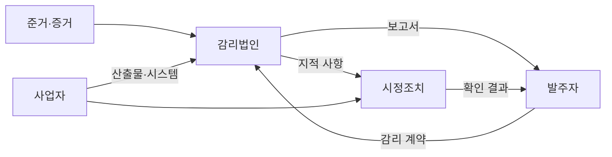
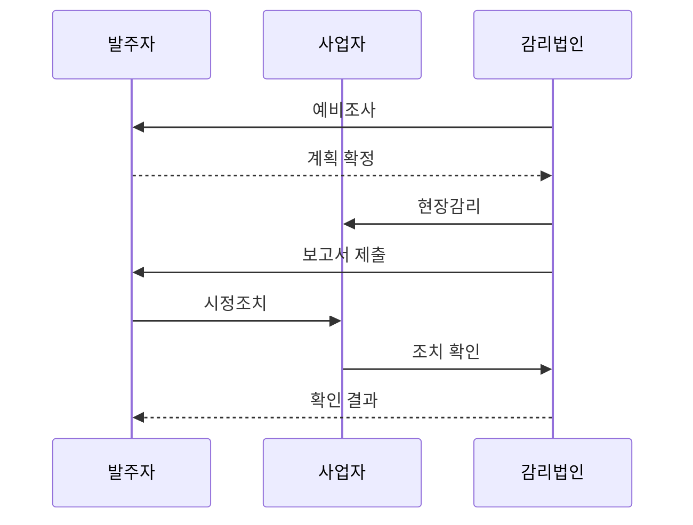

---
sidebar:
  order: 42
  label: "042. 정보시스템 감리 절차 (Information System Audit Procedure)"
  badge:
    text: "기출 · 70%"
    variant: note
title: "정보시스템 감리 절차 (Information System Audit Procedure)"
date: "2026-07-27T23:59:59+09:00"
author: "Claude Opus 4.6 (Enhanced by Gemini 3.5)"
tags:
  - "notes-evaluation"
weight: 42
extra:
  question_no: "042"
  source_status: "기출"
  source_history: "120회, 123회, 126회"
  priority: 70
  priority_note: "반복 기출, 공공 정보시스템 감리의 기본 절차"
---

## 미리 알고가기

- **정보시스템 감리**: 제3자가 정보시스템의 효율성·안전성과 사업 관리 적정성을 종합 점검하고 개선을 권고하는 제도
- **감리기준**: 감리 대상·시기·절차·점검항목과 보고 방법을 정한 법령·고시상의 준거
- **감리계획서**: 감리 범위·인력·일정·점검 방법과 필요한 자료를 정한 문서
- **예비조사**: 사업 자료와 위험을 분석해 현장감리의 범위와 중점항목을 정하는 단계
- **현장감리**: 문서·인터뷰·시스템 실행 증거를 대조해 준거 충족 여부를 확인하는 단계
- **감리보고서**: 발견한 문제·영향·근거·개선 권고와 사업자의 의견을 기록한 공식 문서
- **시정조치 확인**: 사업자가 지적 사항을 고친 결과와 증거를 감리법인이 다시 검증하는 활동
- **PMO(Project Management Office, 피엠오)**: 영문 머리글자를 딴 사업관리 조직으로, 발주자의 일정·범위·비용·위험 관리를 지원
- **QA(Quality Assurance, 큐에이)**: 영문 머리글자를 딴 품질보증 활동으로, 개발 절차와 산출물 품질을 내부에서 보증
- **CI/CD(Continuous Integration/Continuous Delivery, 시아이·시디)**: 지속 통합과 지속 전달을 빗금으로 연결한 자동화 파이프라인
- **공동 책임 모델**: 클라우드 제공자와 이용자가 보안·운영 책임을 나누는 원칙

## Ⅰ. 개요

- 정의/개념: 독립된 제3자가 사업·시스템을 점검하는 제도
- 기존 한계: 사업 수행자의 자체 점검만으로 객관성 확보 곤란
- **배경/필요성**: 독립 감리로 사업·시스템 위험 조기 개선

### 쉽게 이해하기 (학습용)
- 발주자나 개발사가 아닌 감리법인이 계약·법·기술 기준과 실제 시스템을 맞대어 문제를 찾음

## Ⅱ. 특징

- 독립된 감리법인이 법령·계약·표준 준거로 점검한다.
- 문서·인터뷰·시스템 실행 증거를 교차 검증한다.
- 감리 지적과 사업자 시정조치 결과를 끝까지 추적한다.

### 쉽게 이해하기 (학습용)
- 보고서만 내는 검사가 아니라 발견한 문제가 실제로 고쳐졌는지 증거까지 다시 확인함

## Ⅲ. 아키텍처 및 구성요소

| 설계 요소 | 설명 |
|:---|:---|
| 발주자 | 감리 계약·자료 제공·결과 관리 |
| 사업자 | 시스템 구축·수감·시정조치 |
| 감리법인 | 독립 점검·보고·조치 확인 |
| 준거·증거 | 법령·계약과 산출물·실행 기록 |
| 시정조치 | 지적 사항 수정과 증거 재검증 |

### 쉽게 이해하기 (학습용)
- 발주자가 독립 감리를 맡기고 사업자는 증거와 수정 결과를 내며 감리법인이 둘을 검증함

## Ⅳ. 원리 및 절차 흐름도

| 절차 | 설명 |
|:---|:---|
| 예비조사 | 사업 위험으로 범위·중점·계획 수립 |
| 현장감리 | 준거와 문서·인터뷰·실행 증거 대조 |
| 보고서 제출 | 문제·영향·근거·개선 권고 확정 |
| 시정조치 | 사업자가 지적 사항을 수정 |
| 조치 확인 | 수정 증거와 잔여 위험을 재검증 |
| 확인 결과 | 발주자에게 이행 여부 보고 |

### 쉽게 이해하기 (학습용)
- 위험을 보고 검사 계획을 세운 뒤 현장에서 증거를 확인하고 발견한 문제가 고쳐질 때까지 추적함

## Ⅴ. 종류 및 비교

| 판단 기준 | 정보시스템 감리 | PMO | 품질보증(QA) |
|:---|:---|:---|:---|
| 적용 기준 | 법정 대상·고위험 사업 검증 | 대규모 사업의 관리역량 보완 | 개발 절차·산출물 품질 관리 |
| 핵심 특징 | 제3자의 독립 점검·개선 권고 | 발주자 관점의 사업관리 지원 | 사업자 내부 품질보증 |
| 한계 | 독립성 훼손·형식적 확인 | 의사결정 책임·역할 혼선 | 자기검증에 따른 결함 누락 |

### 쉽게 이해하기 (학습용)
- 감리는 독립 검사, PMO는 발주자 보좌, QA는 개발팀 자체 품질관리라는 역할 차이가 있음

## Ⅵ. 실무 사례

- CI/CD 사업: 빌드·시험·배포 로그로 증거 확인
- 클라우드 전환: 공동 책임별 감리 범위 구분

### 쉽게 이해하기 (학습용)
- 짧은 개발 주기마다 자동으로 남은 시험·승인 로그를 모아 실제 품질 게이트 통과를 확인함
- 제공자 시설과 이용자 설정의 책임을 나눠 어느 통제를 누구에게 확인할지 정함

## Ⅶ. 결론

- 독립 증거 검증과 시정조치 확인으로 감리 완결

### 쉽게 이해하기 (학습용)
- 문제를 찾는 데서 끝나지 않고 사업자가 고친 결과를 독립된 증거로 확인해야 감리가 끝남
