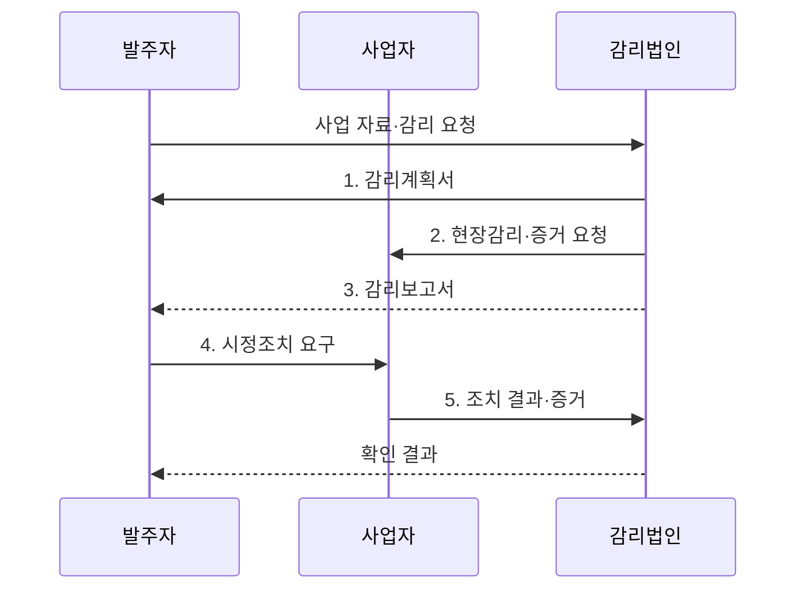

---
sidebar:
  order: 42
  label: "042. 정보시스템 감리 절차 (Information System Audit Procedure)"
  badge:
    text: "기출 · 70%"
    variant: note
title: "정보시스템 감리 절차 (Information System Audit Procedure)"
date: "2026-07-30T23:30:00+09:00"
author: "Claude Opus 4.6 (Enhanced by Gemini 3.5)"
tags:
  - "notes-evaluation"
weight: 42
extra:
  question_no: "042"
  source_status: "기출"
  source_history: "120회, 123회, 126회"
  priority: 70
  priority_note: "반복 기출, 공공 정보시스템 감리의 기본 절차"
---

## 미리 알고가기

- **정보시스템 감리**: 독립된 제3자가 정보시스템의 효율성·안전성과 사업 관리 적정성을 종합 점검하고 개선을 권고하는 제도다.
- **감리기준**: 감리 대상·시기·절차·점검항목과 보고 방법을 정한 법령·고시상의 준거다.
- **감리계획서**: 감리 범위·인력·일정·점검 방법과 필요한 자료를 정한 문서다.
- **예비조사**: 사업 자료와 위험을 분석해 현장감리의 범위와 중점항목을 정하는 단계다.
- **현장감리**: 문서·인터뷰·시스템 실행 증거를 대조해 준거 충족 여부를 확인하는 단계다.
- **감리보고서**: 발견한 문제·영향·근거·개선 권고와 사업자의 의견을 기록한 공식 문서다.
- **시정조치 확인**: 사업자가 지적 사항을 고친 결과와 증거를 감리법인이 다시 검증하는 활동이다.
- **프로젝트 관리 조직(Project Management Office, PMO)**: 발주자의 일정·범위·비용·품질·위험 관리를 지원하는 사업관리 조직이다.
- **품질 보증(Quality Assurance, QA)**: 개발 절차와 산출물이 정해진 품질 기준을 충족하도록 예방·검증하는 활동이다.
- **지속적 통합·지속적 전달(Continuous Integration/Continuous Delivery, CI/CD)**: 코드 변경의 빌드·시험·배포를 자동화하고 단계별 승인 증거를 남기는 파이프라인이다.
- **공동 책임 모델**: 클라우드 제공자와 이용자가 보안·운영 책임을 나누는 원칙이다.


## Ⅰ. 개요

- 정의/개념: 독립된 감리법인이 법령·계약·표준을 준거로 사업 관리와 시스템의 효율성·안전성을 점검하고 **개선 조치 이행까지 확인**하는 제3자 검증 제도
- 배경/필요성: 사업 수행 조직의 자체 점검으로 확보하기 어려운 **위험 발견의 객관성**과 시정조치 결과의 독립적 증거 확보

### 쉽게 이해하기 (학습용)
- 발주자나 개발사가 아닌 감리법인이 계약·법·기술 기준과 실제 시스템을 맞대어 문제를 찾음


## Ⅱ. 특징

- **독립된 감리법인**이 법령·계약·표준을 준거로 사업과 시스템을 점검한다.
- **문서·인터뷰·시스템 실행 증거의 교차 검증**으로 형식적 준수와 실제 작동을 구분한다.
- **감리 지적과 시정조치 증거의 추적**으로 잔여 위험과 이행 여부를 확인한다.

### 쉽게 이해하기 (학습용)
- 보고서만 내는 검사가 아니라 발견한 문제가 실제로 고쳐졌는지 증거까지 다시 확인함


## Ⅲ. 구조 및 구성요소

```mermaid
block-beta
    columns 3
    C["발주자"] A["감리법인"] S["사업자"]
    R["준거·증거"]:3
    X["시정조치"]:3
    C -- A
    A -- S
    R -- A
    S -- X
    A -- X
```

| 구성요소 | 책임 |
|:---|:---|
| 발주자 | 감리 계약·사업 자료 제공과 보고서·조치 결과 관리 |
| 감리법인 | 위험 기반 계획, 독립 점검, 개선 권고와 조치 확인 수행 |
| 사업자 | 산출물·시스템 증거 제공, 의견 제시와 지적 사항 수정 |
| 준거·증거 | 법령·계약·표준과 문서·인터뷰·실행 기록의 판정 근거 제공 |
| 시정조치 | 지적 원인을 제거하고 수정 결과·시험 증거를 감리법인에 제출 |

### 쉽게 이해하기 (학습용)
- 발주자가 독립 감리를 맡기고 사업자는 증거와 수정 결과를 내며 감리법인이 둘을 검증함


## Ⅳ. 흐름도



### 동작 원리

1. **감리계획서**: 예비조사에서 사업 위험을 분석해 범위·중점·인력·일정·증거 요구 확정
2. **현장감리·증거 요청**: 준거와 산출물·인터뷰·시스템 실행 기록을 대조해 문제와 영향 확인
3. **감리보고서**: 사실 확인과 사업자 의견을 반영해 문제·근거·개선 권고 확정
4. **시정조치 요구**: 발주자가 지적 사항별 책임자·기한·수정 기준을 사업자에 부여
5. **조치 결과·증거**: 감리법인이 수정 결과와 재시험 증거를 확인해 이행·미이행·잔여 위험 판정

### 쉽게 이해하기 (학습용)
- 위험을 보고 검사 계획을 세운 뒤 현장에서 증거를 확인하고 발견한 문제가 고쳐질 때까지 추적함


## Ⅴ. 종류 및 비교

| 사업 검증 활동 | 정보시스템 감리 | PMO | 품질보증(QA) |
|:---|:---|:---|:---|
| 적용 기준 | 법정 대상·고위험 사업 검증 | 대규모 사업의 관리역량 보완 | 개발 절차·산출물 품질 관리 |
| 핵심 특징 | 제3자의 독립 점검·개선 권고 | 발주자 관점의 사업관리 지원 | 사업자 내부 품질보증 |
| 한계 | 독립성 훼손·형식적 확인 | 의사결정 책임·역할 혼선 | 자기검증에 따른 결함 누락 |

### 쉽게 이해하기 (학습용)
- 감리는 독립 검사, PMO는 발주자 보좌, QA는 개발팀 자체 품질관리라는 역할 차이가 있음


## Ⅵ. 실무 고려사항 및 대책

| 고려사항 | 대책 | 효과 |
|:---|:---|:---|
| 산출물 존재 여부만 확인해 실제 시스템과 다른 **형식적 감리** | 문서·인터뷰와 빌드·시험·배포 로그 및 시스템 실행 증거 교차 검증 | 준거의 **실제 이행 여부 확인** |
| 지적 문구가 모호해 사업자가 수정 완료를 입증하지 못하는 **조치 기준 불명확** | 문제·영향·근거·개선 권고와 확인할 완료 증거를 함께 명시 | 시정조치의 **검증 가능성 확보** |
| 짧은 개발 주기에서 감리 시점 사이 변경이 누락되는 **증거 공백** | CI/CD 단계별 품질 게이트와 승인 로그를 지속 수집 | 변경 단위의 **감사 추적성 확보** |

### 쉽게 이해하기 (학습용)
- 짧은 개발 주기마다 자동으로 남은 빌드·시험·승인·배포 로그를 모아 변경별 품질 게이트 통과를 확인한다.


## Ⅶ. 결론

- 사업 위험에 따라 감리 범위와 증거를 정하고 **시정조치 결과까지 독립 검증**해 미이행·잔여 위험을 발주 의사결정에 반영하는 감리 운영

### 쉽게 이해하기 (학습용)
- 문제를 찾는 데서 끝나지 않고 사업자가 고친 결과를 독립된 증거로 확인해야 감리가 끝남
