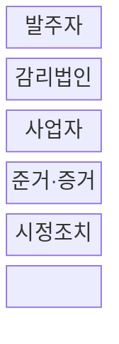
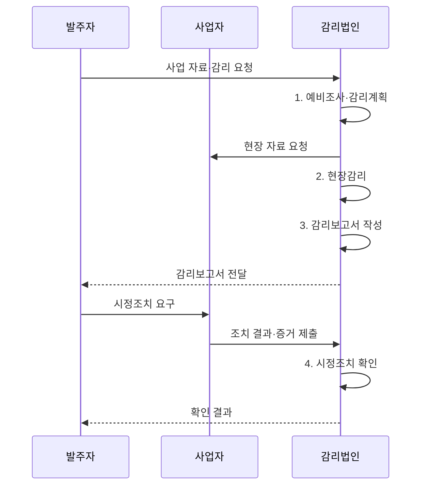

---
sidebar:
  order: 42
  label: "042. 정보시스템 감리 절차 (Information System Audit Procedure)"
  badge:
    text: "기출 · 70%"
    variant: note
title: "정보시스템 감리 절차 (Information System Audit Procedure)"
date: "2026-08-02T12:42:00+09:00"
author: "Claude Opus 4.6 (Enhanced by Gemini 3.5)"
tags:
  - "notes-evaluation"
weight: 42
extra:
  question_no: "042"
  source_status: "기출"
  source_history: "120회, 123회, 126회"
  priority: 70
  priority_note: "반복 기출, 공공 정보시스템 감리의 기본 절차"
---

## Ⅰ. 개요

핵심 용어

- **정보시스템 감리**: 독립된 제3자가 정보시스템의 효율성·안전성과 사업관리 적정성을 종합 점검하고 개선을 권고하는 제도이다.
- **독립성**: 감리 주체가 사업 수행·의사결정·이해관계에서 분리되어 객관적으로 판단할 수 있는 상태이다.

- 정의/개념: 독립된 감리법인이 사업 관리와 시스템을 점검하고 **시정조치 이행**까지 확인하는 제3자 검증 제도
- 배경/필요성: 자체 점검만으로는 **위험 발견의 객관성**과 시정 증거 확보 곤란

### 쉽게 이해하기 (학습용)
- 발주자나 개발사가 아닌 감리법인이 계약·법·기술 기준과 실제 시스템을 맞대어 문제를 찾음

## Ⅱ. 특징

핵심 용어

- **감리기준**: 감리 대상·시기·절차·점검항목·보고 방법을 정한 법령·고시상의 준거이다.
- **시정조치 확인**: 사업자가 지적 사항을 수정한 결과와 증거를 감리법인이 다시 검증하는 활동이다.

- 법령·계약·표준을 준거로 하는 **독립된 감리법인**
- 형식적 준수와 실제 작동을 가르는 **증거 교차 검증**
- 잔여 위험과 이행 여부를 확인하는 **시정조치 추적**

### 쉽게 이해하기 (학습용)
- 보고서만 내는 검사가 아니라 발견한 문제가 실제로 고쳐졌는지 증거까지 다시 확인함

## Ⅲ. 구조 및 구성요소

핵심 용어

- **감리계획서**: 감리 범위·인력·일정·점검 방법과 필요한 자료를 정한 문서이다.
- **감리보고서**: 발견한 문제·영향·근거·개선 권고와 사업자 의견을 기록한 공식 문서이다.
- **감리 증거**: 판정과 개선 권고를 뒷받침하는 문서·인터뷰·로그·시스템 실행 결과이다.

| 구성요소 | 책임 |
|:---|:---|
| 발주자 | **감리 계약·조치 결과** 관리와 자료 제공 |
| 감리법인 | **위험 기반 계획·독립 점검**과 조치 확인 |
| 사업자 | **실행 증거·수정 결과**와 산출물 제공 |
| 준거·증거 | **법령·실행 기록**과 계약·표준을 판정 근거로 활용 |
| 시정조치 | **지적 원인 제거·재시험 증거** 제출 |

### 쉽게 이해하기 (학습용)
- 발주자가 독립 감리를 맡기고 사업자는 증거와 수정 결과를 내며 감리법인이 둘을 검증함

## Ⅳ. 흐름도

핵심 용어

- **예비조사**: 사업 자료와 위험을 분석하여 현장감리의 범위와 중점항목을 정하는 단계이다.
- **현장감리**: 문서·인터뷰·시스템 실행 증거를 대조하여 준거 충족 여부를 확인하는 단계이다.

1. **예비조사·감리계획**: 사업 위험에 따라 범위·중점·인력·증거 요구 확정
2. **현장감리**: 준거와 산출물·인터뷰·실행 기록을 대조해 문제 확인
3. **감리보고서 작성**: 사실 확인과 사업자 의견을 반영해 개선 권고 확정
4. **시정조치 확인**: 수정 결과와 재시험 증거로 이행 여부와 잔여 위험 판정

### 쉽게 이해하기 (학습용)
- 위험을 보고 검사 계획을 세운 뒤 현장에서 증거를 확인하고 발견한 문제가 고쳐질 때까지 추적함

## Ⅴ. 종류 및 비교

핵심 용어

- **정보시스템 감리**: 독립 제3자가 법정·계약 준거에 따라 사업과 시스템을 점검하고 개선을 권고하는 활동이다.
- **프로젝트 관리 조직(PMO)**: 발주자의 일정·범위·비용·품질·위험 관리를 지원하는 사업관리 조직이다.
- **품질 보증(QA)**: 개발 절차와 산출물이 품질 기준을 충족하도록 사업자 내부에서 예방·검증하는 활동이다.

| 사업 검증 활동 | 정보시스템 감리 | PMO | 품질보증(QA) |
|:---|:---|:---|:---|
| 적용 기준 | **법정 대상·고위험 사업** 검증 | 대규모 사업의 **관리역량 보완** | 개발 **절차·산출물 품질** 관리 |
| 핵심 특징 | 제3자의 **독립 점검·개선 권고** | 발주자 관점의 **사업관리 지원** | 사업자 **내부 품질보증** |
| 한계 | **독립성 훼손·형식적 확인** | **의사결정 책임·역할 혼선** | 자기검증에 따른 **결함 누락** |

### 쉽게 이해하기 (학습용)
- 감리는 독립 검사, PMO는 발주자 보좌, QA는 개발팀 자체 품질관리라는 역할 차이가 있음

## Ⅵ. 실무 고려사항 및 대책

핵심 용어

- **형식적 확인**: 문서 제출 여부만 보고 실제 시스템과 통제의 작동 여부를 검증하지 않는 문제이다.
- **표본 대표성**: 선택한 산출물·거래·설정 표본이 전체 위험과 예외를 충분히 나타내는 성질이다.
- **전자적 증거**: CI/CD 로그·형상 이력·시험 결과처럼 생성 시각과 변경 이력을 확인할 수 있는 증거이다.

| 문제 | 대책 | 효과 |
|:---|:---|:---|
| 산출물만 보면 실제 시스템과 다른 **형식적 감리** 발생 | **문서·인터뷰·실행 로그 교차 검증** | 준거의 **실제 이행 확인** |
| 지적이 모호하면 수정 완료를 입증하기 어려움 | **문제·영향·근거·완료 증거 명시** | 시정조치의 **검증 가능성 확보** |
| 짧은 개발 주기로 감리 사이 **증거 공백** 발생 | **CI/CD 품질 게이트·승인 로그 수집** | 변경 단위의 **감사 추적성 확보** |
| 법정 절차 누락 시 감리 결과의 효력이 약화됨 | **전자정부법 제57조·감리기준 준수** | 감리 대상·절차의 **법적 정합성 확보** |

### 쉽게 이해하기 (학습용)
- 짧은 개발 주기마다 자동으로 남은 빌드·시험·승인·배포 로그를 모아 변경별 품질 게이트 통과를 확인한다.

## Ⅶ. 결론

핵심 용어

- **전자정부법 제57조**: 행정기관 등의 정보시스템 감리 대상·독립 수행·감리기준 준수 근거를 정한 조항이다.
- **개선 폐루프**: 문제 식별에서 권고·시정·증거 검증·잔여위험 확인까지 완료하는 감리 절차이다.

- 사업 위험에 따라 감리 범위와 증거를 정하고 **시정조치 결과까지 독립 검증**해 미이행·잔여 위험을 발주 의사결정에 반영하는 감리 운영

### 쉽게 이해하기 (학습용)
- 문제를 찾는 데서 끝나지 않고 사업자가 고친 결과를 독립된 증거로 확인해야 감리가 끝남
