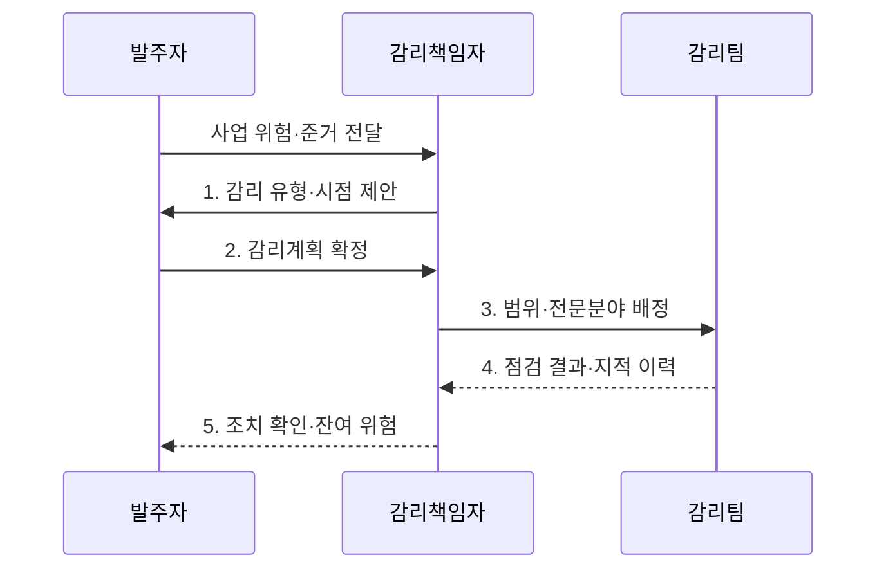

---
sidebar:
  order: 43
  label: "043. 정보시스템 감리 유형 (Audit Types)"
  badge:
    text: "기출 · 30%"
    variant: note
title: "정보시스템 감리 유형 (Audit Types)"
date: "2026-07-30T23:30:00+09:00"
author: "Claude Opus 4.6 (Enhanced by Gemini 3.5)"
tags:
  - "notes-evaluation"
weight: 43
extra:
  question_no: "043"
  source_status: "기출"
  source_history: "120회"
  priority: 30
  priority_note: "감리 시점별 유형은 절차 답안의 비교 항목"
---

## 미리 알고가기

- **단계감리**: 요구·설계·구현·종료 등 정한 사업 단계에서 산출물과 다음 단계 진입 조건을 점검하는 방식이다.
- **상주감리**: 감리원이 사업 기간 중 현장에 지속 참여해 위험을 조기에 발견하는 방식이다.
- **정기감리**: 정해진 주기에 사업이나 운영 상태와 통제 이행을 반복 점검하는 방식이다.
- **수시·특정감리**: 중대 장애·분쟁·고위험 현안이 생겼을 때 해당 범위와 원인을 집중 점검하는 방식이다.
- **독립성**: 감리인이 사업 수행이나 의사결정에서 분리돼 객관적으로 판단할 수 있는 상태다.
- **점검 준거**: 법령·계약·표준·계획처럼 적정 여부를 판단할 때 대조하는 기준이다.
- **마일스톤**: 요구 확정·설계 완료처럼 사업의 주요 단계 완료를 판정하는 시점이다.
- **프로젝트 관리 조직(Project Management Office, PMO)**: 발주자의 일정·범위·비용·품질·위험 관리를 지원하는 사업관리 조직이다.
- **스프린트**: 애자일 개발에서 기능을 설계·구현·시험하는 짧고 반복적인 개발 주기다.
- **시정조치 확인**: 감리 지적 사항의 수정 결과와 증거, 남은 위험을 다시 검토하는 활동이다.


## Ⅰ. 개요

- 정의/개념: 사업의 규모·단계·변화 속도·현안 위험에 따라 **감리 시점과 관여 강도**를 단계·상주·정기·특정 방식으로 구분한 검증 유형
- 배경/필요성: 모든 사업에 동일한 감리 방식을 적용할 때 놓치는 **단계 사이의 변화 위험**과 긴급 현안의 원인·조치 시점 보완

### 쉽게 이해하기 (학습용)
- 계속 지켜볼지, 단계가 끝날 때 볼지, 문제가 생긴 부분만 볼지를 사업 위험에 따라 정함


## Ⅱ. 특징

- **사업 위험·단계·현안**에 따라 감리 시점·범위·전문분야를 선택한다.
- **상주·반복 점검**은 변화 위험의 조기 발견 기회를 높이고 단계감리는 진입 조건을 검증한다.
- 감리 유형과 무관하게 **사업 수행과 감리 판단의 독립성**을 유지한다.

### 쉽게 이해하기 (학습용)
- 자주 볼수록 문제를 빨리 찾지만 사업 수행에 개입하지 않도록 감리와 관리 역할을 분리해야 함


## Ⅲ. 구조 및 구성요소

```mermaid
block-beta
    columns 3
    R["사업 위험·준거"]:2
    T["시점·관여 방식"] P["인력·전문분야"]
    E["증거·지적 이력"]:2
    C["조치 확인"]:2
    R -- T
    R -- P
    T -- E
    P -- E
    E -- C
  R --- T
  T --- E
  E --- C
```

| 구성요소 | 책임 |
|:---|:---|
| 사업 위험·준거 | 규모·복잡도·법정 의무·핵심 현안으로 감리 목적과 범위 결정 |
| 시점·관여 방식 | 단계·상주·정기·특정 중 위험을 발견할 시점과 강도 선택 |
| 인력·전문분야 | 기술·사업관리 위험에 맞는 감리원과 투입 기간 배정 |
| 증거·지적 이력 | 여러 감리 유형의 점검 근거·판정·지적 사항을 하나의 이력으로 연결 |
| 조치 확인 | 수정 증거와 잔여 위험을 검증해 지적 사항 종결 여부 판정 |

### 쉽게 이해하기 (학습용)
- 사업 위험을 입력으로 받아 언제 어떤 전문가가 보고 지적을 어떻게 끝낼지 하나의 계획으로 묶음


## Ⅳ. 흐름도



1. **감리 유형·시점 제안**: 규모·단계·변화 속도·현안에 따라 단계·상주·정기·특정 유형 조합
2. **감리계획 확정**: 범위·일정·독립성·필요 증거와 유형별 책임을 발주자와 합의
3. **범위·전문분야 배정**: 사업관리·응용·데이터·인프라 등 위험별 감리원 투입
4. **점검 결과·지적 이력**: 유형별 증거와 지적 사항을 연결해 중복 판정과 조치 누락 방지
5. **조치 확인·잔여 위험**: 수정 결과를 재검증하고 다음 감리 시점 또는 발주 결정에 잔여 위험 전달

### 쉽게 이해하기 (학습용)
- 사업이 크고 계속 변하면 자주 보고, 단계 결과가 중요하면 마일스톤에서 보고, 사고가 나면 그 부분을 집중 점검함


## Ⅴ. 종류 및 비교

| 감리 유형 | 단계감리 | 상주감리 | 특정감리 |
|:---|:---|:---|:---|
| 적용 기준 | 단계 진입·완료 판단이 중요할 때 | 대규모·고위험 사업을 밀착 점검 | 중대 장애·분쟁·긴급 위험 발생 |
| 핵심 특징 | 마일스톤별 산출물 점검 | 사업 기간에 지속 관여 | 특정 현안·원인 집중 점검 |
| 한계 | 단계 사이 위험 발견 지연 | 역할 개입으로 독립성 훼손 | 연관 위험 누락 가능 |

### 쉽게 이해하기 (학습용)
- 단계 결과를 보면 단계감리, 진행 중 위험을 계속 보면 상주감리, 사고 원인을 좁혀 보면 특정감리임


## Ⅵ. 실무 고려사항 및 대책

| 고려사항 | 대책 | 효과 |
|:---|:---|:---|
| 대규모 차세대 사업의 단계 사이 변경으로 **위험 발견 지연** | 상주감리로 변화 위험을 추적하고 단계감리에서 진입 조건 재검증 | 조기 발견과 **마일스톤 통제 결합** |
| 상주감리원이 사업 의사결정에 개입해 **독립성 훼손** | 관찰·권고와 사업 수행·승인 책임을 분리하고 이해상충 기록 | 지속 관여 중 **객관성 유지** |
| 여러 유형의 지적 사항이 따로 관리돼 **중복·조치 누락** | 공통 식별자로 증거·지적·시정조치·확인 결과를 연결 | 감리 유형 간 **추적성 확보** |

### 쉽게 이해하기 (학습용)
- 상주감리에서 찾은 위험을 단계감리의 진입 조건과 같은 이력으로 연결해 중복 지적과 조치 누락을 막는다.


## Ⅶ. 결론

- 위험을 발견해야 할 시점과 필요한 전문분야를 기준으로 **감리 유형을 조합**하고 모든 지적·시정조치를 하나의 증거 이력으로 종결하는 감리 설계

### 쉽게 이해하기 (학습용)
- 감리 횟수를 먼저 정하지 말고 위험을 언제 발견해야 하는지에 맞춰 유형과 투입을 고름
