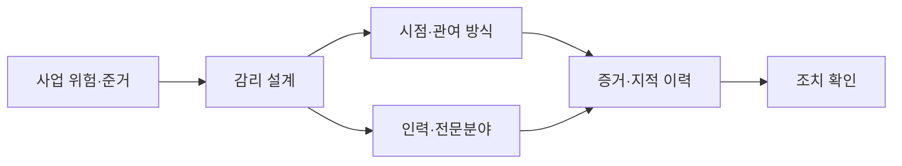
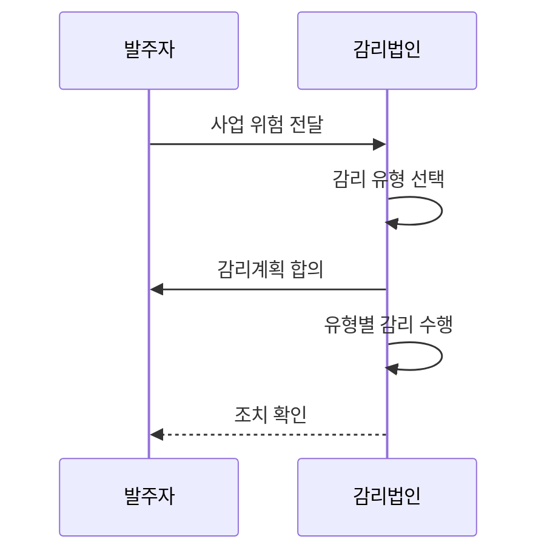

---
sidebar:
  order: 43
  label: "043. 정보시스템 감리 유형 (Audit Types)"
  badge:
    text: "기출 · 30%"
    variant: note
title: "정보시스템 감리 유형 (Audit Types)"
date: "2026-07-27T23:59:59+09:00"
author: "Claude Opus 4.6 (Enhanced by Gemini 3.5)"
tags:
  - "notes-evaluation"
weight: 43
extra:
  question_no: "043"
  source_status: "기출"
  source_history: "120회"
  priority: 30
  priority_note: "감리 시점별 유형은 절차 답안의 비교 항목"
---

## 미리 알고가기

- **단계감리**: 요구·설계·구현·종료 등 정한 사업 단계에서 산출물과 다음 단계 진입 조건을 점검하는 방식
- **상주감리**: 감리원이 사업 기간 중 현장에 지속 참여해 위험을 조기에 발견하는 방식
- **정기감리**: 정해진 주기에 사업이나 운영 상태와 통제 이행을 반복 점검하는 방식
- **수시·특정감리**: 중대 장애·분쟁·고위험 현안이 생겼을 때 해당 범위와 원인을 집중 점검하는 방식
- **독립성**: 감리인이 사업 수행이나 의사결정에서 분리돼 객관적으로 판단할 수 있는 상태
- **점검 준거**: 법령·계약·표준·계획처럼 적정 여부를 판단할 때 대조하는 기준
- **마일스톤**: 요구 확정·설계 완료처럼 사업의 주요 단계 완료를 판정하는 시점
- **PMO(Project Management Office, 피엠오)**: 영문 머리글자를 딴 사업관리 조직으로, 발주자의 일정·비용·범위·위험 관리를 지원
- **스프린트**: 애자일 개발에서 기능을 설계·구현·시험하는 짧고 반복적인 개발 주기
- **시정조치 확인**: 감리 지적 사항의 수정 결과와 증거, 남은 위험을 다시 검토하는 활동

## Ⅰ. 개요

- 정의/개념: 사업 위험에 맞춰 감리 시점·관여 방식을 구분
- 기존 한계: 단일 시점 감리는 단계 사이·긴급 현안 포착 곤란
- **배경/필요성**: 사업 위험별 감리 시점과 관여 강도 선택

### 쉽게 이해하기 (학습용)
- 계속 지켜볼지, 단계가 끝날 때 볼지, 문제가 생긴 부분만 볼지를 사업 위험에 따라 정함

## Ⅱ. 특징

- 사업 위험·단계·현안에 따라 감리 시점과 범위를 선택한다.
- 상주·반복 점검은 위험의 조기 발견 기회를 높인다.
- 감리 유형과 무관하게 사업 의사결정과 독립성을 유지한다.

### 쉽게 이해하기 (학습용)
- 자주 볼수록 문제를 빨리 찾지만 사업 수행에 개입하지 않도록 감리와 관리 역할을 분리해야 함

## Ⅲ. 아키텍처 및 구성요소

| 설계 요소 | 설명 |
|:---|:---|
| 사업 위험·준거 | 규모·복잡도·법정 의무·핵심 현안 |
| 감리 설계 | 목적·범위와 적용 유형 조합 |
| 시점·관여 방식 | 단계·상주·정기·특정 시점 결정 |
| 인력·전문분야 | 위험별 감리원과 투입 기간 |
| 증거·지적 이력 | 유형 간 점검 결과와 근거 연결 |
| 조치 확인 | 수정 결과와 잔여 위험 종결 |

### 쉽게 이해하기 (학습용)
- 사업 위험을 입력으로 받아 언제 어떤 전문가가 보고 지적을 어떻게 끝낼지 하나의 계획으로 묶음

## Ⅳ. 원리 및 절차 흐름도

| 절차 | 설명 |
|:---|:---|
| 사업 위험 전달 | 규모·단계·복잡도·현안 파악 |
| 감리 유형 선택 | 시점·관여 강도와 전문분야 결정 |
| 감리계획 합의 | 범위·일정·인력·증거 확정 |
| 유형별 감리 수행 | 준거에 따라 증거·현장 점검 |
| 조치 확인 | 지적 수정과 잔여 위험 종결 |

### 쉽게 이해하기 (학습용)
- 사업이 크고 계속 변하면 자주 보고, 단계 결과가 중요하면 마일스톤에서 보고, 사고가 나면 그 부분을 집중 점검함

## Ⅴ. 종류 및 비교

| 판단 기준 | 단계감리 | 상주감리 | 특정감리 |
|:---|:---|:---|:---|
| 적용 기준 | 단계 진입·완료 판단이 중요할 때 | 대규모·고위험 사업을 밀착 점검 | 중대 장애·분쟁·긴급 위험 발생 |
| 핵심 특징 | 마일스톤별 산출물 점검 | 사업 기간에 지속 관여 | 특정 현안·원인 집중 점검 |
| 한계 | 단계 사이 위험 발견 지연 | 역할 개입으로 독립성 훼손 | 연관 위험 누락 가능 |

### 쉽게 이해하기 (학습용)
- 단계 결과를 보면 단계감리, 진행 중 위험을 계속 보면 상주감리, 사고 원인을 좁혀 보면 특정감리임

## Ⅵ. 실무 사례

- 차세대 사업: 상주감리와 단계감리 병행
- 중대 장애: 원인 구간에 특정감리 투입

### 쉽게 이해하기 (학습용)
- 상주 중 찾은 위험을 단계감리 보고서와 같은 이력으로 연결해 중복 지적과 조치 누락을 막음
- 장애가 난 인터페이스와 배포 변경만 집중 점검하되 연관 시스템으로 범위를 확장할 조건도 정함

## Ⅶ. 결론

- 사업 단계·위험·현안으로 감리 유형 선택

### 쉽게 이해하기 (학습용)
- 감리 횟수를 먼저 정하지 말고 위험을 언제 발견해야 하는지에 맞춰 유형과 투입을 고름
