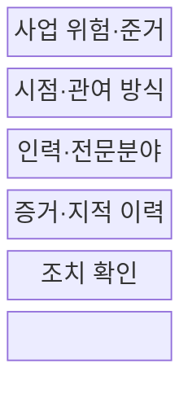
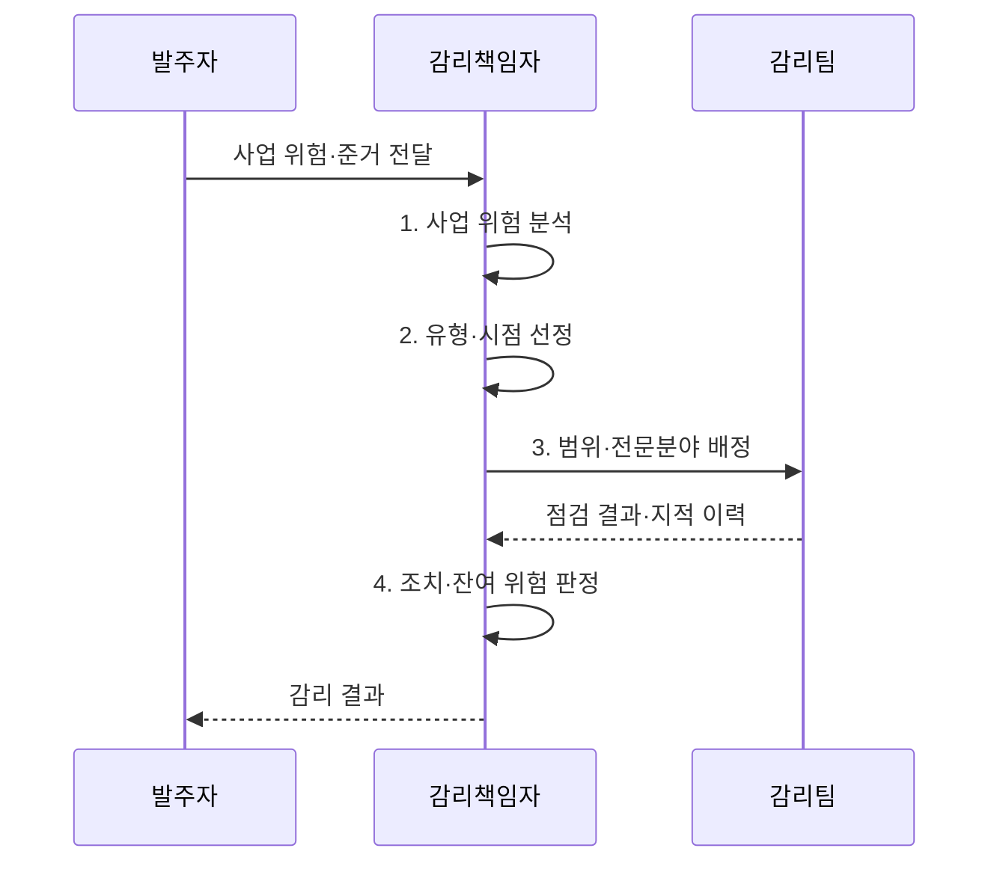

---
sidebar:
  order: 43
  label: "043. 정보시스템 감리 유형 (Audit Types)"
  badge:
    text: "기출 · 30%"
    variant: note
title: "정보시스템 감리 유형 (Audit Types)"
date: "2026-08-02T12:43:00+09:00"
author: "Claude Opus 4.6 (Enhanced by Gemini 3.5)"
tags:
  - "notes-evaluation"
weight: 43
extra:
  question_no: "043"
  source_status: "기출"
  source_history: "120회"
  priority: 30
  priority_note: "감리 시점별 유형은 절차 답안의 비교 항목"
---

## Ⅰ. 개요

핵심 용어

- **감리 유형**: 사업 위험과 목적에 따라 감리 시점·주기·관여 강도·집중 범위를 구분한 검증 방식이다.
- **점검 준거**: 법령·계약·표준·계획처럼 적정 여부를 판단할 때 대조하는 기준이다.
- **위험 기반 유형 선택**: 위험을 발견해야 할 시점과 필요한 관여 강도에 따라 단계·상주·정기·특정감리를 조합하는 결정이다.

- 정의/개념: 사업 위험에 따라 **감리 시점·관여 강도** 를 단계·상주·정기·특정 방식으로 구분한 검증 유형
- 배경/필요성: 정해진 시점의 감리만으로는 **단계 사이 변화** 와 긴급 현안 발견 지연

#### 한줄 요약
- 계속 지켜볼지, 단계가 끝날 때 볼지, 문제가 생긴 부분만 볼지를 사업 위험에 따라 정함

## Ⅱ. 특징

핵심 용어

- **독립성**: 감리인이 사업 수행과 의사결정에서 분리되어 객관적으로 판단할 수 있는 상태이다.
- **마일스톤**: 요구 확정·설계 완료처럼 사업의 주요 단계 완료와 다음 단계 진입을 판정하는 시점이다.
- **역할 분리**: 상주감리의 관찰·권고와 사업자의 수행·승인 책임을 나눠 감리 독립성을 유지하는 원칙이다.

- 사업 단계·현안에 따라 **단계감리·특정감리** 선택
- 변화 조기 발견과 진입 조건을 잇는 **상주감리**
- 통제 이행을 정해진 주기로 확인하는 **정기감리**
- 모든 유형에서 지켜야 하는 **사업 수행·감리 판단 독립성**

#### 한줄 요약
- 자주 볼수록 문제를 빨리 찾지만 사업 수행에 개입하지 않도록 감리와 관리 역할을 분리해야 함

## Ⅲ. 구조 및 구성요소

핵심 용어

- **단계감리**: 요구·설계·구현·종료 등 정한 사업 단계에서 산출물과 진입 조건을 점검하는 방식이다.
- **상주감리**: 감리원이 사업 기간 중 현장에 지속 참여하여 위험을 조기에 발견하는 방식이다.
- **정기·특정감리**: 정한 주기로 통제를 반복 점검하거나 중대 현안이 생겼을 때 해당 원인을 집중 점검하는 방식이다.
- **감리 증거 이력**: 유형이 달라도 판정 근거·지적 사항·시정조치를 공통 식별자로 연결한 기록이다.

| 구성요소 | 책임 |
|:---|:---|
| 사업 위험·준거 | **규모·복잡도** 와 법정 의무·현안으로 범위 결정 |
| 시점·관여 방식 | **감리 시점·관여 강도** 선택 |
| 인력·전문분야 | 위험별 **감리원·투입 기간** 배정 |
| 증거·지적 이력 | 유형별 **판정 근거·지적 사항** 연결 |
| 조치 확인 | **수정 증거·잔여 위험**으로 종결 여부 판정 |

#### 한줄 요약
- 사업 위험을 입력으로 받아 언제 어떤 전문가가 보고 지적을 어떻게 끝낼지 하나의 계획으로 묶음

## Ⅳ. 흐름도

핵심 용어

- **위험 재평가**: 사업 변화·결함·지연에 따라 감리 범위와 표본 우선순위를 다시 정하는 활동이다.
- **시정조치 확인**: 감리 지적 사항의 수정 결과·증거·남은 위험을 다시 검토하는 활동이다.
- **다음 감리 시점 결정**: 조치 결과와 잔여위험을 바탕으로 후속 점검의 유형·범위·시기를 정하는 판단이다.

1. **사업 위험 분석**: 규모·단계·변화 속도·현안과 점검 준거 분석
2. **유형·시점 선정**: 위험을 발견해야 할 시점에 맞춰 감리 유형 조합
3. **범위·전문분야 배정**: 사업관리·응용·데이터·인프라 등 위험별 감리원 투입
4. **조치·잔여 위험 판정**: 수정 증거를 재검증해 종결 여부와 다음 감리 시점 결정

#### 한줄 요약
- 사업이 크고 계속 변하면 자주 보고, 단계 결과가 중요하면 마일스톤에서 보고, 사고가 나면 그 부분을 집중 점검함

## Ⅴ. 종류 및 비교

핵심 용어

- **단계감리**: 마일스톤별 산출물과 다음 단계 진입 조건을 확인하는 방식이다.
- **상주감리**: 대규모·고위험 사업에 지속 관여하여 단계 사이 위험을 조기에 찾는 방식이다.
- **수시·특정감리**: 중대 장애·분쟁·긴급 위험의 범위와 원인을 집중 점검하는 방식이다.
- **유형 조합**: 단계 결과는 단계감리, 진행 중 고위험은 상주감리, 긴급 현안은 특정감리로 다루는 구분이다.

| 감리 유형 | 단계감리 | 상주감리 | 특정감리 |
|:---|:---|:---|:---|
| 적용 기준 | **단계 진입·완료 판단** 이 중요할 때 | **대규모·고위험 사업** 밀착 점검 | **중대 장애·분쟁·긴급 위험** 발생 |
| 핵심 특징 | **마일스톤별 산출물** 점검 | 사업 기간 **지속 관여** | **특정 현안·원인** 집중 점검 |
| 한계 | 단계 사이 **위험 발견 지연** | 역할 개입으로 **독립성 훼손** | **연관 위험 누락** 가능 |

#### 한줄 요약
- 단계 결과를 보면 단계감리, 진행 중 위험을 계속 보면 상주감리, 사고 원인을 좁혀 보면 특정감리임

## Ⅵ. 실무 고려사항 및 대책

핵심 용어

- **역할 개입**: 상주감리원이 사업 의사결정이나 산출물 작성에 참여하여 자기검증 위험을 만드는 문제이다.
- **단계 사이 공백**: 정한 마일스톤 사이에서 누적된 변경과 결함을 늦게 발견하는 문제이다.
- **연관 위험 누락**: 특정 현안만 좁게 보아 같은 원인의 다른 시스템·통제 영향을 놓치는 문제이다.
- **공통 식별자**: 여러 감리 유형의 증거·지적·조치 항목을 하나의 이력으로 추적하도록 부여한 고유 표식이다.

| 문제 | 대책 | 효과 |
|:---|:---|:---|
| 단계 사이 변경으로 **위험 발견 지연** | **상주 추적 후 단계 진입 조건 재검증** | 조기 발견과 **마일스톤 통제 결합** |
| 상주감리의 의사결정 개입으로 **독립성 훼손** | **관찰·권고와 수행·승인 책임 분리** | 지속 관여 중 **객관성 유지** |
| 유형별 지적 분리로 **중복·조치 누락** | **증거·지적·시정조치 공통 식별자 연결** | 감리 유형 간 **추적성 확보** |
| 상주 역할이 모호하면 사업관리와 감리가 혼재됨 | **정보시스템 감리기준의 역할·절차 준수** | 상주감리의 **법적 정합성 확보** |

#### 한줄 요약
- 상주감리에서 찾은 위험을 단계감리의 진입 조건과 같은 이력으로 연결해 중복 지적과 조치 누락을 막는다.

## Ⅶ. 결론

핵심 용어

- **위험 기반 조합**: 기본 단계감리에 상주·정기·특정감리를 사업 위험 변화에 맞게 추가하는 운영 원칙이다.
- **정보시스템 감리기준**: 상주감리를 포함한 감리 업무범위·절차·준수사항을 정한 고시이다.
- **감리 설계 결정**: 위험 발견 시점과 전문분야를 기준으로 유형을 조합하고 모든 지적·시정조치를 하나의 증거 이력으로 종결하는 판단이다.

- 위험을 발견해야 할 시점과 필요한 전문분야를 기준으로 **감리 유형을 조합**하고 모든 지적·시정조치를 하나의 증거 이력으로 종결하는 감리 설계

#### 한줄 요약
- 감리 횟수를 먼저 정하지 말고 위험을 언제 발견해야 하는지에 맞춰 유형과 투입을 고름
