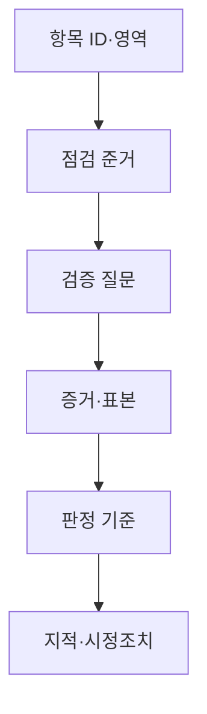
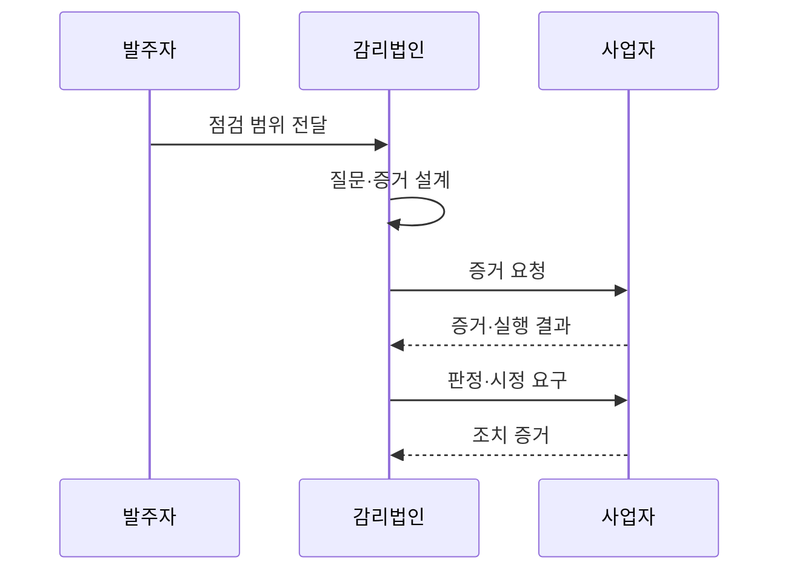

---
sidebar:
  order: 44
  label: "044. 감리 점검 항목 (Audit Checklist)"
  badge:
    text: "기출 · 30%"
    variant: note
title: "감리 점검 항목 (Audit Checklist)"
date: "2026-07-25T01:10:00+09:00"
author: "Claude Opus 4.6 (Enhanced by Gemini 3.5)"
tags:
  - "notes-evaluation"
weight: 44
extra:
  question_no: "044"
  source_status: "기출"
  source_history: "120회"
  priority: 30
  priority_note: "공공 감리의 단계별 점검 기준을 묻는 기출"
---

## 미리 알고가기

- **점검 준거**: 활동과 산출물이 적정한지 판정할 때 대조하는 법령·계약·표준·계획
- **준거성**: 활동·산출물·시스템이 정해진 점검 준거를 충족하는 성질
- **실증성**: 감리 의견을 문서·로그·시험 결과처럼 확인 가능한 증거로 입증하는 성질
- **추적성**: 요구사항부터 설계·구현·시험·결함·조치 결과까지 연결해 확인할 수 있는 성질
- **위험 기반 점검**: 발생 가능성과 영향이 큰 항목에 감리 시간과 표본을 우선 배분하는 방식
- **모집단**: 표본 점검의 대상이 되는 전체 산출물·거래·설정·코드 항목
- **표본 점검**: 모집단 일부를 선정해 전체 통제 상태와 예외를 검증하는 방식
- **감리 증거**: 판정·영향·개선 권고를 뒷받침하는 문서·인터뷰·로그·실행 결과
- **식별자(ID)**: 점검 항목과 증거·판정·시정조치를 연결하는 고유 번호
- **SLA(Service Level Agreement)**: 가용성·응답시간 등 서비스 목표와 책임을 정한 협약
- **API(Application Programming Interface)**: 시스템이 정해진 형식으로 기능과 데이터를 주고받는 접점
- **다중인증**: 서로 다른 종류의 인증 수단을 둘 이상 요구해 계정 탈취 위험을 낮추는 방식

## Ⅰ. 개요

- **정의/개념**: 준거·질문·증거·판정을 연결한 점검 목록
- **배경/필요성**: 감리인별 판정 편차와 증거 누락 방지

### 쉽게 이해하기 (학습용)
- 무엇을 물어보고 어떤 증거가 나오면 적합한지 미리 정해 누구나 같은 방식으로 점검하게 함

## Ⅱ. 특징

- 준거마다 검증 가능한 질문과 증거 연결한다.
- 문서·인터뷰·시스템 실행 결과 교차 확인한다.
- 위험도에 따라 깊이·표본·인력을 차등 배분한다.
- ID로 판정·지적·시정조치까지 추적한다.

### 쉽게 이해하기 (학습용)
- “보안이 적절한가”가 아니라 “관리자 계정의 다중인증 설정 로그가 있는가”처럼 확인 가능하게 물음

## Ⅲ. 아키텍처 및 구성요소

| 설계 요소 | 설명 |
|:---|:---|
| 항목 ID·영역 | 단계·관리·기술·품질 항목 구분 |
| 점검 준거 | 법령·계약·표준·승인 계획 연결 |
| 검증 질문 | 충족 여부를 확인 가능한 문장 |
| 증거·표본 | 문서·로그·실행 결과와 선정 기준 |
| 판정 기준 | 적합·부적합·개선 권고 조건 |
| 지적·시정조치 | 원인·영향·조치·확인 증거 연결 |

### 쉽게 이해하기 (학습용)
- 질문 하나에 근거 규정, 볼 증거, 합격 조건, 고칠 결과를 한 줄로 연결함

## Ⅳ. 원리 및 절차 흐름도

| 절차 | 설명 |
|:---|:---|
| 점검 범위 전달 | 단계·시스템 경계·고위험 영역 확정 |
| 질문·증거 설계 | 준거별 질문·표본·판정 조건 작성 |
| 증거 요청 | 문서·로그·인터뷰·실행 시험 요구 |
| 증거·실행 결과 | 표본과 시스템 동작 결과 제출 |
| 판정·시정 요구 | 준거 대비 차이와 개선기한 확정 |
| 조치 증거 | 수정 결과를 같은 기준으로 재검증 |

### 쉽게 이해하기 (학습용)
- 질문마다 미리 정한 증거를 받아 기준과 대조하고 불합격 항목은 같은 ID로 수정까지 확인함

## Ⅴ. 종류 및 비교

| 비교축 | 관리 | 기술 | 품질·운영 |
|:---|:---|:---|:---|
| 핵심 특징 | 계약·일정·범위·변경 통제 | 아키텍처·코드·보안 준거 | 시험 완료·운영 전환 준비 |
| 적용 기준 | 사업관리 책임과 승인 검증 | 기술 설계·구현 적정성 검증 | 인수·배포·운영 가능성 검증 |
| 주요 위험 | 문서 충족만 보고 실제 진척 오판 | 표본 밖 취약점·설정 누락 | 시험 환경과 운영 환경 차이 |

### 쉽게 이해하기 (학습용)
- 사업을 제대로 통제했는지, 시스템을 제대로 만들었는지, 실제 운영할 준비가 됐는지를 나눠 봄

## Ⅵ. 실무 사례

- 금융 API: 인증 실패 로그를 위험 표본으로 점검
- 운영 전환: SLA별 부하시험 증거를 대조

### 쉽게 이해하기 (학습용)
- 전체 요청 중 관리자·대량 실패처럼 피해가 큰 인증 로그를 더 많이 뽑아 통제가 작동했는지 확인함
- “빠르다”는 설명 대신 계약한 응답시간·부하·지속시간을 충족한 시험 원본을 확인함

## Ⅶ. 결론

- 준거·질문·증거·판정 연결로 점검 편차 축소

### 쉽게 이해하기 (학습용)
- 체크 표시 수가 아니라 같은 증거를 보면 같은 판정이 나오도록 질문과 합격 조건을 설계함
