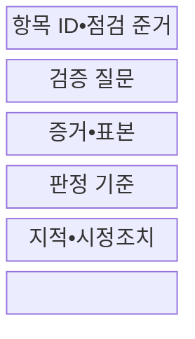
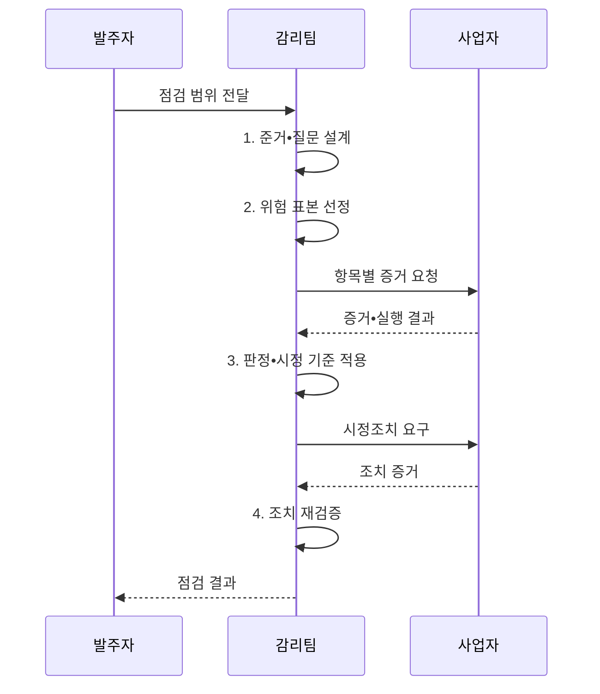

---
sidebar:
  order: 44
  label: "044. 감리 점검 항목 (Audit Checklist)"
  badge:
    text: "기출 • 30%"
    variant: note
title: "감리 점검 항목 (Audit Checklist)"
date: "2026-08-04T23:28:00+09:00"
author: "Claude Opus 4.6 (Enhanced by Gemini 3.5)"
tags:
  - "notes-evaluation"
weight: 44
extra:
  question_no: "044"
  source_status: "기출"
  source_history: "120회"
  priority: 30
  priority_note: "공공 감리의 단계별 점검 기준을 묻는 기출"
---

## Ⅰ. 개요

핵심 용어

- **감리 점검표**: 점검 준거를 검증 질문•필요 증거•표본•판정 기준•시정조치로 연결한 감리 통제 목록이다.
- **점검 준거**: 활동과 산출물이 적정한지 판정할 때 대조하는 법령•계약•표준•계획이다.
- **판정 재현성**: 다른 감리인이 같은 준거와 증거를 검토해도 동일한 결론을 낼 수 있는 성질이다.

- 정의/개념: 법령•계약•표준의 **점검 준거** 를 검증 질문•필요 증거•표본•판정 기준•시정조치로 연결한 감리 통제 목록
- 배경/필요성: 감리인 경험•추상 질문만으로는 **판정 재현•증거 완전성 확보 불가**

#### 한줄 요약
- 무엇을 물어보고 어떤 증거가 나오면 적합한지 미리 정해 누구나 같은 방식으로 점검하게 함

## Ⅱ. 특징

핵심 용어

- **준거성**: 활동•산출물•시스템이 정한 점검 준거를 충족하는 성질이다.
- **실증성**: 감리 의견을 문서•로그•시험 결과처럼 확인 가능한 증거로 입증하는 성질이다.
- **추적성**: 요구부터 설계•구현•시험•결함•시정 결과까지 연결하여 확인할 수 있는 성질이다.
- **위험 표본**: 발생 가능성과 영향이 큰 예외•변경•관리자 활동을 우선 포함하도록 선정한 점검 대상이다.

- 동일 증거의 같은 판정을 위한 **준거•질문•판정 기준 연결**
- 형식적 준수와 실제 작동을 가르는 **증거 교차 확인**
- 판정부터 시정조치까지 잇는 **위험 표본•항목 ID**

#### 한줄 요약
- “보안이 적절한가”가 아니라 “관리자 계정의 다중인증 설정 로그가 있는가”처럼 확인 가능하게 물음

## Ⅲ. 구조 및 구성요소

핵심 용어

- **검증 질문**: 준거 충족 여부를 예•아니오와 근거로 판정할 수 있도록 구체화한 질문이다.
- **감리 증거**: 판정•영향•개선 권고를 뒷받침하는 문서•인터뷰•로그•실행 결과이다.
- **식별자(Identifier, ID)**: 점검 항목과 증거•판정•시정조치를 연결하는 고유 번호이다.
- **판정 기준**: 증거가 적합•부적합 중 어느 상태인지 일관되게 구분하는 합격 조건이다.

| 구성요소 | 책임 |
|:---|:---|
| 항목 ID•점검 준거 | **법령•계약** 을 단계•영역•표준과 연결 |
| 검증 질문 | **판정 근거•확인 질문**으로 구체화 |
| 증거•표본 | **실행 결과•선정 기준** 과 문서•로그 명시 |
| 판정 기준 | **적합•부적합 조건** 과 개선 권고 기준 정의 |
| 지적•시정조치 | **수정 결과•확인 증거** 를 원인•영향과 연결 |

#### 한줄 요약
- 질문 하나에 근거 규정, 볼 증거, 합격 조건, 고칠 결과를 한 줄로 연결함

## Ⅳ. 흐름도

핵심 용어

- **모집단**: 표본 점검의 대상이 되는 전체 산출물•거래•설정•코드 항목이다.
- **표본 점검**: 모집단 일부를 위험 기반으로 선정하여 전체 통제 상태와 예외를 검증하는 방식이다.
- **조치 재검증**: 최초 판정 기준으로 수정 결과와 증거를 다시 확인해 종결•잔여위험 여부를 판단하는 절차이다.

1. **준거•질문 설계**: 점검 준거를 검증 질문과 판정 조건으로 변환
2. **위험 표본 선정**: 모집단 위험에 따라 표본 대상과 수량 결정
3. **판정•시정 기준 적용**: 준거와 증거의 차이로 문제•완료 기준 확정
4. **조치 재검증**: 최초 판정 기준으로 수정 결과와 잔여 위험 확인

#### 한줄 요약
- 질문마다 미리 정한 증거를 받아 기준과 대조하고 불합격 항목은 같은 ID로 수정까지 확인함

## Ⅴ. 종류 및 비교

핵심 용어

- **사업관리 점검**: 계약•일정•범위•변경•승인 책임의 적정성을 검증하는 점검이다.
- **기술 점검**: 아키텍처•코드•보안•데이터 설계와 구현의 준거 충족을 검증하는 점검이다.
- **운영전환 점검**: 시험 완료•배포•백업•복구•운영 인수 준비 상태를 검증하는 점검이다.
- **영역별 점검 선택**: 관리 책임•승인은 사업관리, 설계•구현은 기술, 인수•배포•운영 준비는 품질•운영 영역에서 검증하는 구분이다.

| 감리 점검 영역 | 관리 | 기술 | 품질•운영 |
|:---|:---|:---|:---|
| 적용 기준 | **사업관리 책임•승인** 검증 | **기술 설계•구현 적정성** 검증 | **인수•배포•운영 가능성** 검증 |
| 핵심 특징 | **계약•일정•범위•변경** 통제 | **아키텍처•코드•보안** 준거 | **시험 완료•운영 전환** 준비 |
| 한계 | 문서만 보고 **실제 진척 오판** | 표본 밖 **취약점•설정 누락** | **시험•운영 환경 차이** |

#### 한줄 요약
- 사업을 제대로 통제했는지, 시스템을 제대로 만들었는지, 실제 운영할 준비가 됐는지를 나눠 봄

## Ⅵ. 실무 고려사항 및 대책

핵심 용어

- **문서-실제 불일치**: 승인 문서는 정상이나 실제 코드•설정•운영 상태가 다르게 적용된 문제이다.
- **표본 편향**: 편한 항목이나 정상 사례만 선택하여 고위험 예외를 놓치는 문제이다.
- **재현성 통제**: 대상•증거•합격 조건을 명시해 감리인별 판정 편차를 줄이는 조치이다.
- **고위험 표본 추가**: 무작위 표본에 관리자 활동•대량 실패•변경 직후 항목을 더해 통제 실패 검출 가능성을 높이는 방법이다.

| 문제 | 대책 | 효과 |
|:---|:---|:---|
| 추상 질문으로 **감리인별 판정 편차** 발생 | **대상•증거•합격 조건 직접 명시** | 점검 결과의 **재현성 확보** |
| 무작위 표본에서 고위험 예외가 빠지는 **표본 편향** | **관리자•대량 실패•변경 직후 표본 추가** | 통제 실패의 **검출 가능성 향상** |
| ID가 증거•조치와 끊겨 **종결 여부 불명확** | **준거•증거•판정•기한•결과 연결** | 감리 전 과정의 **추적성 확보** |

#### 한줄 요약
- 전체 요청 중 관리자 계정•대량 실패처럼 영향이 큰 인증 로그를 위험 표본으로 추가해 통제가 실제 작동했는지 확인한다.

## Ⅶ. 결론

핵심 용어

- **위험 기반 점검**: 발생 가능성과 영향이 큰 항목에 감리 시간•전문가•표본을 우선 배분하는 방식이다.
- **시정 추적**: 문제 식별부터 책임자•기한•수정 증거•재검증•잔여위험 승인까지 연결하는 관리이다.
- **점검표 설계 결정**: 고위험 준거를 검증 질문과 판정 기준으로 바꾸고 동일 식별자로 증거와 시정조치를 연결하는 판단이다.

- 고위험 준거를 **검증 질문•판정 기준** 으로 바꾸고 **동일 ID** 로 증거와 시정조치를 연결하는 감리 점검

#### 한줄 요약
- 체크 표시 수가 아니라 같은 증거를 보면 같은 판정이 나오도록 질문과 합격 조건을 설계함
