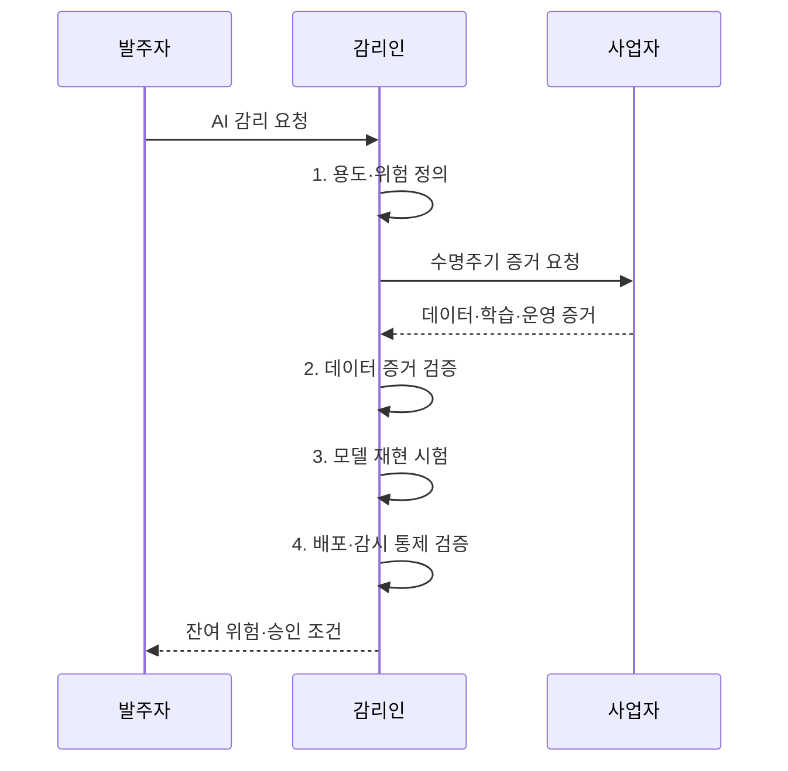

---
sidebar:
  order: 45
  label: "045. AI 개발 사업 감리 특수 점검 (AI Development Audit)"
  badge:
    text: "기출 · 70%"
    variant: note
title: "AI 개발 사업 감리 특수 점검 (AI Development Audit)"
date: "2026-08-02T12:45:00+09:00"
author: "Claude Opus 4.6 (Enhanced by Gemini 3.5)"
tags:
  - "notes-evaluation"
weight: 45
extra:
  question_no: "045"
  source_status: "기출"
  source_history: "135회"
  priority: 70
  priority_note: "AI 데이터·모델·편향을 점검하는 최근 감리축"
---

## Ⅰ. 개요

핵심 용어

- **AI 개발 감리**: 데이터·코드·모델·배포·운영 증거를 연결하여 성능·공정성·강건성·책임 통제를 검증하는 정보시스템 감리이다.
- **MLOps**: 데이터·코드·모델의 학습·배포·감시를 자동화하고 버전과 증거를 연결하는 운영 체계이다.

- 정의/개념: AI 수명주기 증거를 연결해 **성능·공정성**과 **강건성·책임 통제**를 검증하는 정보시스템 감리
- 배경/필요성: 일반 기능 감리만으로는 **확률적 오류·편향·드리프트 검증 불가**

### 쉽게 이해하기 (학습용)

- 데이터 출처부터 모델 판단과 배포 후 변화까지 증거로 이어 AI가 왜 잘못됐는지 추적 가능하게 함

## Ⅱ. 특징

핵심 용어

- **데이터 계보**: 데이터 출처부터 수집·정제·변환·학습 사용까지의 이력을 연결한 기록이다.
- **재현성**: 같은 데이터·코드·환경·설정으로 같은 모델과 평가 결과를 다시 만들 수 있는 성질이다.
- **모델 드리프트**: 운영 데이터나 입력-결과 관계가 바뀌어 모델 성능·편향·위험이 변하는 현상이다.

- 학습·평가 결과를 다시 만드는 **데이터 계보·재현성**
- 평균 정확도 밖을 보는 **공정성·교란 강건성**
- 배포 뒤 위험을 통제하는 **모델 드리프트·인간 감독**

### 쉽게 이해하기 (학습용)

- 한 번의 정확도만 보지 않고 어떤 데이터와 설정으로 만들었으며 누구에게 틀리고 운영 중 어떻게 변하는지 확인함

## Ⅲ. 구조 및 구성요소

핵심 용어

- **공정성**: 보호 특성에 따라 정당한 이유 없이 결과가 불리해지지 않는 성질이다.
- **강건성**: 입력 교란이나 환경 변화에도 모델 성능과 안전성이 급격히 무너지지 않는 성질이다.
- **모델 카드**: 모델의 용도·학습 데이터·성능·한계·금지 용도와 책임을 기록한 문서이다.

| 구성요소 | 책임 |
|:---|:---|
| 목적·위험 | **오류 비용·허용 기준**과 용도·영향 집단 확정 |
| 데이터 | 출처·권리·대표성과 **데이터 계보·누수** 검증 |
| 모델 | 성능·공정성과 **강건성·재현성** 평가 |
| 버전·증거 | 데이터·코드·환경과 **모델·평가 버전** 연결 |
| 운영·책임 | 드리프트에 대응하는 **롤백·중단 권한** 관리 |

### 쉽게 이해하기 (학습용)

- 무엇에 쓸 AI인지 정한 뒤 재료·학습 결과·제조 기록·운영 책임을 한 줄로 이어 검증함

## Ⅳ. 흐름도

핵심 용어

- **데이터 누수**: 평가 시점에 알 수 없는 정보가 학습 데이터에 들어가 성능이 과대평가되는 오류이다.
- **인간 감독**: 사람이 고위험 AI 결과를 검토·거부하고 필요하면 서비스를 중단하는 통제이다.
- **롤백**: 새 모델에 문제가 생기면 검증된 이전 모델로 되돌리는 복구 절차이다.

1. **용도·위험 정의**: 오류 비용과 영향 집단에 맞춰 성능·안전 허용 기준 확정
2. **데이터 증거 검증**: 출처·권리·계보와 학습·평가 데이터 분리 검증
3. **모델 재현 시험**: 오류 비용에 맞춘 성능·집단별 공정성·교란 강건성 기준을 독립 재실행
4. **배포·감시 통제 검증**: 드리프트 임계값·인간 검토·중단·롤백 절차 확인

### 쉽게 이해하기 (학습용)

- AI가 틀렸을 때의 피해를 먼저 정하고 데이터부터 운영 중 중단 수단까지 증거를 따라 확인함

## Ⅴ. 종류 및 비교

핵심 용어

- **데이터 감리**: 출처·권리·대표성·품질·계보와 학습·평가 분리를 검증하는 점검이다.
- **모델 감리**: 성능·공정성·강건성·재현성과 과적합·교란 취약성을 검증하는 점검이다.
- **운영 감리**: 드리프트 감시·인간 감독·변경 승인·롤백·책임 체계를 검증하는 점검이다.

| AI 감리 영역 | 데이터 | 모델 | 운영·책임 |
|:---|:---|:---|:---|
| 적용 기준 | **수집·정제·학습 데이터** 승인 | 모델 후보의 **배포 승인** | 상용 **배포·변경·중단** 결정 |
| 핵심 특징 | **출처·권리·대표성·계보** | **성능·공정성·강건성·재현성** | **감시·인간 감독·롤백·책임** |
| 한계 | **오염·누수·편향·권리 침해** | **과적합·차별·교란 취약성** | **드리프트·오용·책임 공백** |

### 쉽게 이해하기 (학습용)

- 데이터는 재료의 출처, 모델은 결과의 정확성과 차별, 운영은 배포 뒤 변화와 중단 책임을 봄

## Ⅵ. 실무 고려사항 및 대책

핵심 용어

- **환각**: 생성형 AI가 사실과 맞지 않는 내용을 그럴듯하게 생성하는 현상이다.
- **프롬프트 주입**: 공격자가 입력 지시로 모델의 원래 규칙과 도구 통제를 우회하도록 유도하는 공격이다.
- **오탐·미탐**: 정상 대상을 문제로 판정한 오류와 실제 문제를 놓친 오류이다.

| 문제 | 대책 | 효과 |
|:---|:---|:---|
| 평균 정확도와 달리 특정 집단에 **미탐 집중** | **집단별 민감도·미탐률·인간 검토 기준** 설정 | 고위험 집단의 **진단 누락 감소** |
| 버전 연결이 끊겨 **평가 결과 재현 불가** | **MLOps 불변 식별자로 학습·평가 연결** | 모델 승인 근거의 **추적성 확보** |
| 데이터 변화에도 **배포 모델 지속 사용** | **드리프트 임계값·중단·롤백 책임 지정** | 배포 후 **성능·안전성 회복** |
| 생성형 AI 입력·출력에 **프롬프트 주입·환각** 발생 | **입력 격리·근거 검증**과 인간 검토 적용 | 생성 결과의 **오용·오류 감소** |
| 조직별 위험 기준 차이로 감리 판정이 흔들림 | **ISO/IEC 42001·23894와 NIST AI RMF 정렬** | AI 위험관리의 **일관성 확보** |

### 쉽게 이해하기 (학습용)

- 질병을 놓치는 피해가 큰 의료 AI는 집단별 미탐 허용 기준과 의사 검토·서비스 중단 절차를 함께 검증한다.

## Ⅶ. 결론

핵심 용어

- **ISO/IEC 42001**: AI 관리체계의 수립·운영·유지·지속 개선 요구사항을 규정한 국제표준이다.
- **ISO/IEC 23894**: AI 위험관리를 조직 활동에 통합하기 위한 국제 지침이다.

- 오류 비용과 영향 집단에 맞춰 **재현 시험·운영 감시**를 연결하고 **인간 감독·롤백**이 입증된 모델만 배포

### 쉽게 이해하기 (학습용)

- 학습 당시 성능만 믿지 않고 만든 근거를 재현하고 운영 변화 때 중단·복구할 수 있어야 함
