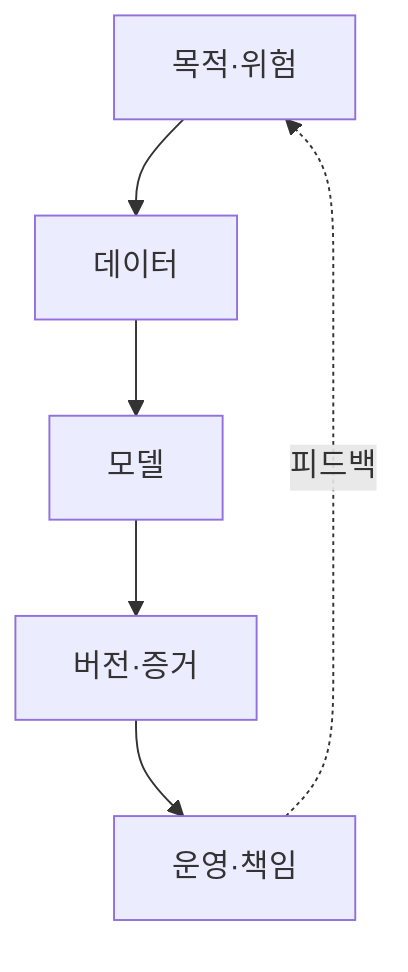
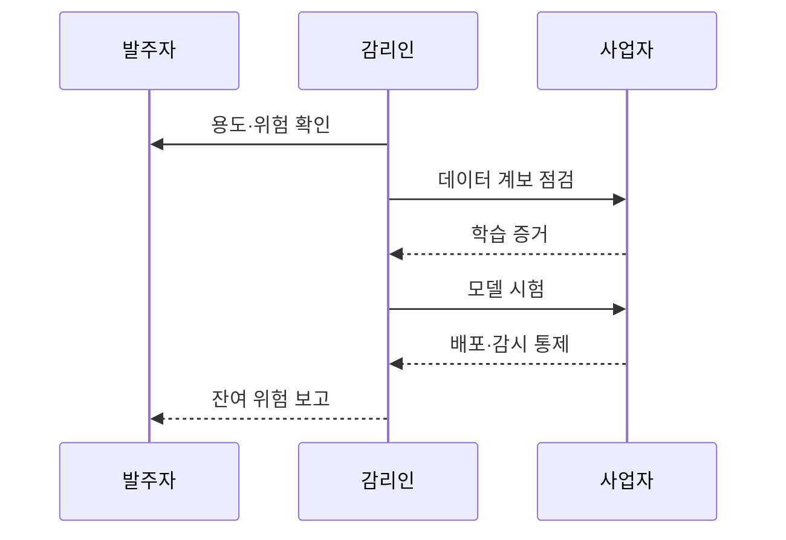

---
sidebar:
  order: 45
  label: "045. AI 개발 사업 감리 특수 점검 (AI Development Audit)"
  badge:
    text: "기출 · 70%"
    variant: note
title: "AI 개발 사업 감리 특수 점검 (AI Development Audit)"
date: "2026-07-25T01:10:00+09:00"
author: "Claude Opus 4.6 (Enhanced by Gemini 3.5)"
tags:
  - "notes-evaluation"
weight: 45
extra:
  question_no: "045"
  source_status: "기출"
  source_history: "135회"
  priority: 70
  priority_note: "AI 데이터·모델·편향을 점검하는 최근 감리축"
---

## 미리 알고가기

- **AI(Artificial Intelligence)**: 데이터에서 패턴을 학습해 분류·예측·생성·의사결정을 수행하는 기술
- **MLOps**: 데이터·코드·모델의 버전과 학습·배포·감시 과정을 자동화하고 추적하는 운영 체계
- **데이터 계보(Lineage)**: 데이터의 출처부터 수집·정제·변환·학습 사용까지의 이력을 연결한 기록
- **데이터 누수(Leakage)**: 평가 시점에 알 수 없는 정보가 학습 데이터에 들어가 성능이 과대평가되는 오류
- **재현성**: 같은 데이터·코드·환경·설정으로 같은 모델과 평가 결과를 다시 만들 수 있는 성질
- **강건성(Robustness)**: 입력 교란이나 환경 변화가 있어도 모델 성능과 안전성이 급격히 무너지지 않는 성질
- **공정성(Fairness)**: 성별·연령 등 보호 특성에 따라 정당한 이유 없이 결과가 불리해지지 않는 성질
- **모델 카드(Model Card)**: 모델의 용도·학습 데이터·성능·한계·금지 용도와 책임을 기록한 문서
- **모델 드리프트**: 운영 데이터나 입력과 결과의 관계가 바뀌어 모델 성능·편향·위험이 변하는 현상
- **인간 감독(Human Oversight)**: 사람이 고위험 AI 결과를 검토·거부하고 필요하면 서비스를 중단하는 통제
- **롤백(Rollback)**: 새 모델에 문제가 생기면 검증된 이전 모델로 되돌리는 복구 절차
- **환각(Hallucination)**: 생성형 AI가 사실과 맞지 않는 내용을 그럴듯하게 만들어 내는 현상
- **프롬프트 주입**: 공격자가 입력 지시로 AI의 원래 규칙을 우회해 의도하지 않은 동작을 유도하는 공격
- **오탐·미탐**: 문제가 아닌 대상을 문제로 판정한 오류와 실제 문제를 놓친 오류
- **과적합**: 모델이 학습 데이터에 지나치게 맞춰져 새로운 데이터에서 성능이 떨어지는 현상
- **교란**: 입력을 작게 변형해 모델이 잘못 판단하도록 만드는 의도적 또는 비의도적 변화

## Ⅰ. 개요

- **정의/개념**: AI 수명주기의 품질·안전·책임을 점검하는 감리
- **배경/필요성**: 데이터 편향·재현 불가·운영 성능 저하 통제

### 쉽게 이해하기 (학습용)

- 데이터 출처부터 모델 판단과 배포 후 변화까지 증거로 이어 AI가 왜 잘못됐는지 추적 가능하게 함

## Ⅱ. 특징

- 확률적 결과를 성능 분포와 실패 조건으로 검증한다.
- 오류 비용·집단 영향을 반영해 기준 차등화한다.
- 데이터·코드·환경·모델 버전을 함께 추적한다.
- 배포 후 드리프트와 인간 개입 가능성 확인한다.

### 쉽게 이해하기 (학습용)

- 한 번의 정확도만 보지 않고 어떤 데이터와 설정으로 만들었으며 누구에게 틀리고 운영 중 어떻게 변하는지 확인함

## Ⅲ. 아키텍처 및 구성요소

| 설계 요소 | 설명 |
|:---|:---|
| 목적·위험 | 용도·금지 용도·오류 비용 확정 |
| 데이터 | 권리·대표성·품질·계보 검증 |
| 모델 | 성능·공정성·강건성·재현성 평가 |
| 버전·증거 | 데이터·코드·환경·모델 연결 |
| 운영·책임 | 드리프트·인간 감독·롤백 통제 |

### 쉽게 이해하기 (학습용)

- 무엇에 쓸 AI인지 정한 뒤 재료·학습 결과·제조 기록·운영 책임을 한 줄로 이어 검증함

## Ⅳ. 원리 및 절차 흐름도

| 절차 | 설명 |
|:---|:---|
| 용도·위험 확인 | 오류 비용·영향 집단·금지 용도 확정 |
| 데이터 계보 점검 | 출처·권리·대표성·누수 검증 |
| 학습 증거 | 코드·환경·설정·모델 버전 연결 |
| 모델 시험 | 성능·공정성·강건성 재현 |
| 배포·감시 통제 | 드리프트·인간 감독·롤백 확인 |
| 잔여 위험 보고 | 한계·책임·개선기한 기록 |

### 쉽게 이해하기 (학습용)

- AI가 틀렸을 때의 피해를 먼저 정하고 데이터부터 운영 중 중단 수단까지 증거를 따라 확인함

## Ⅴ. 종류 및 비교

| 비교축 | 데이터 | 모델 | 운영·책임 |
|:---|:---|:---|:---|
| 핵심 특징 | 출처·권리·대표성·계보 | 성능·공정성·강건성·재현성 | 감시·인간 감독·롤백·책임 |
| 적용 기준 | 수집·정제·학습 데이터 승인 | 모델 후보의 배포 승인 | 상용 배포·변경·중단 결정 |
| 주요 위험 | 오염·누수·편향·권리 침해 | 과적합·차별·교란 취약성 | 드리프트·오용·책임 공백 |

### 쉽게 이해하기 (학습용)

- 데이터는 재료의 출처, 모델은 결과의 정확성과 차별, 운영은 배포 뒤 변화와 중단 책임을 봄

## Ⅵ. 실무 사례

- 의료 AI: 미탐 비용을 반영한 배포 기준 검증
- 신용평가 AI: 집단별 오류율·인간 재심 확인

### 쉽게 이해하기 (학습용)

- 질병을 놓치는 피해가 큰 업무이므로 미탐 허용 기준과 의사 검토 절차를 함께 확인함
- 전체 정확도가 같아도 특정 집단의 거절 오류가 큰지 보고 사람이 재심할 경로를 확인함

## Ⅶ. 결론

- 계보·재현성·드리프트로 AI 배포 승인

### 쉽게 이해하기 (학습용)

- 학습 당시 성능만 믿지 않고 만든 근거를 재현하고 운영 변화 때 중단·복구할 수 있어야 함
