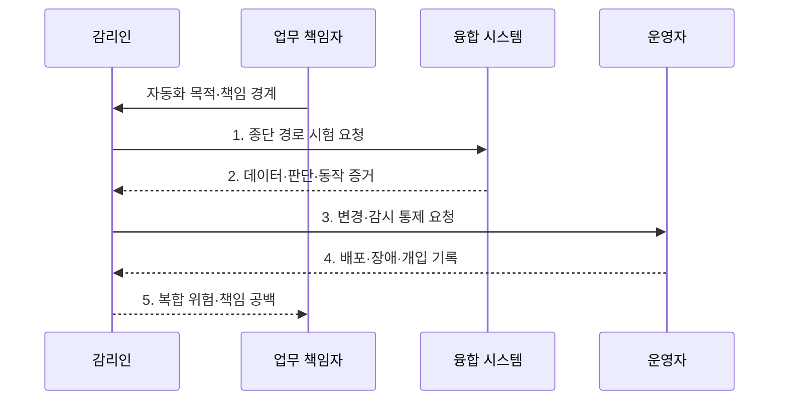

---
sidebar:
  order: 46
  label: "046. 지능정보기술 감리 (Intelligent IT Audit)"
  badge:
    text: "기출 · 50%"
    variant: note
title: "지능정보기술 감리 (Intelligent IT Audit)"
date: "2026-07-30T08:05:00+09:00"
author: "Claude Opus 4.6 (Enhanced by Gemini 3.5)"
tags:
  - "notes-evaluation"
weight: 46
extra:
  question_no: "046"
  source_status: "기출"
  source_history: "134회"
  priority: 50
  priority_note: "빅데이터·클라우드 특성을 반영한 감리 확장"
---

## 미리 알고가기

- **지능정보기술**: AI·데이터·클라우드·사물인터넷을 결합해 인지·판단·제어를 자동화하는 기술이다.
- **인공지능(Artificial Intelligence, AI)**: 데이터에서 패턴을 학습하여 예측·생성·판단 등 지능적 과업을 수행하는 기술이다.
- **사물 인터넷(Internet of Things, IoT)**: 센서와 기기를 네트워크로 연결하여 데이터를 수집하고 원격 제어하는 기술이다.
- **응용 프로그래밍 인터페이스(Application Programming Interface, API)**: 시스템 간 기능 호출과 데이터 교환을 위한 규격이다.
- **신원 및 접근 관리(Identity and Access Management, IAM)**: 사용자와 기기의 신원을 확인하고 자원 접근 권한을 관리하는 체계다.
- **데이터 거버넌스**: 데이터의 소유·품질·보호·사용 규칙과 책임을 정하는 관리 체계다.
- **데이터 계보(Lineage)**: 데이터의 출처와 수집·변환·사용 이력을 연결해 추적하는 기록이다.
- **공동 책임 모델**: 클라우드 제공자와 이용자가 계층별 보안·운영 책임을 나누는 원칙이다.
- **종단 간 검증**: 센서 입력부터 AI 판단·API 전달·현장 동작까지 전체 경로의 결과를 확인하는 방식이다.
- **복원력**: 장애나 공격이 발생해도 서비스를 유지하고 정해진 수준으로 복구하는 능력이다.
- **다학제 감리팀**: AI·데이터·클라우드·네트워크·보안 전문가를 함께 구성한 감리 조직이다.
- **AI 활용 감리**: 로그 분류·이상 탐지처럼 감리 업무 자체에 AI를 보조 도구로 사용하는 방식이다.

## Ⅰ. 개요

- 정의/개념: 데이터·AI·클라우드·API·기기의 **종단 경로와 계층별 책임**을 연결해 확률적 판단·물리 동작·복합 장애를 검증하는 융합 시스템 감리
- 배경/필요성: 기술별 단독 점검으로 놓치기 쉬운 **계층 경계의 데이터·권한·책임 공백**과 복합 장애의 서비스·물리 안전 영향 식별

### 쉽게 이해하기 (학습용)

- 센서는 정상이어도 AI나 API 연결에서 결과가 바뀔 수 있어 입력부터 현장 동작까지 한 경로로 확인함

## Ⅱ. 특징

- **데이터·AI·클라우드·API·기기의 종단 경로**에서 값·권한·명령의 변화를 검증한다.
- **확률적 판단과 물리 동작의 안전 영향**을 실제 환경과 실패 시나리오로 함께 평가한다.
- **제공자·개발자·운영자의 공동 책임과 증거**를 계층 경계별로 추적한다.

### 쉽게 이해하기 (학습용)

- 각 부품이 따로 정상인지보다 부품 사이에서 데이터·권한·책임이 끊기지 않는지를 더 중요하게 봄

## Ⅲ. 구조 및 구성요소

```mermaid
block-beta
    columns 2
    H["업무·인간 책임"]:2
    D["데이터·AI"] C["클라우드·API"]
    I["기기·통신"] O["운영 통제"]
    H -- D
    D -- C
    C -- I
    O -- D
    O -- C
    O -- I
```

| 구성요소 | 책임 |
|:---|:---|
| 업무·인간 책임 | 자동화 범위·오류 비용·승인·거부·서비스 중단 책임 확정 |
| 데이터·AI | 데이터 계보·품질과 모델 성능·편향·강건성 증거 제공 |
| 클라우드·API | IAM·인터페이스 계약과 제공자·이용자의 공동 책임 통제 |
| 기기·통신 | 센서 신뢰성·명령 전달·연결 보안·장애 복원력 유지 |
| 운영 통제 | 변경·재학습·배포 감시와 사고 대응·수동 전환 이력 관리 |

### 쉽게 이해하기 (학습용)

- 사람의 업무 판단에서 시작해 AI·클라우드·현장 기기까지 이어지는 층과 이를 계속 감시하는 운영층을 함께 봄

## Ⅳ. 흐름도



- 1. **종단 경로 시험 요청**: 센서 입력·데이터 변환·AI 판단·API 명령·기기 동작의 추적 ID 설정
- 2. **데이터·판단·동작 증거**: 정상·오류·공격 입력별 값 변화와 성능·권한·물리 결과를 연결
- 3. **변경·감시 통제 요청**: 재학습·API·펌웨어 변경과 드리프트·장애 감시·복구 절차 확인
- 4. **배포·장애·개입 기록**: 계층별 배포 이력과 장애 시 자동·수동 전환 및 인간 개입 증거 제공
- 5. **복합 위험·책임 공백**: 기술 경계에서 발생한 원인·영향·담당자·개선 조치를 공동 책임표에 확정

### 쉽게 이해하기 (학습용)

- 누가 자동화를 승인했는지 확인하고 실제 데이터 길을 따라가며 결과·변경·사고 증거를 한데 맞춤

## Ⅴ. 종류 및 비교

| 감리 방식 | 지능정보기술 감리 | 전통 시스템 감리 | AI 활용 감리 |
|:---|:---|:---|:---|
| 적용 기준 | AI·IoT·클라우드 결합 사업 | 일반 정보시스템 구축 사업 | 대량 로그·문서 분석이 필요할 때 |
| 핵심 특징 | 융합 계층의 종단 위험 검증 | 사업·SW·인프라 준거 검증 | AI로 감리 분석 업무 보조 |
| 한계 | 경계·공동 책임 누락 | 확률·물리 동작 위험 누락 | 오탐·설명 부족을 그대로 수용 |

### 쉽게 이해하기 (학습용)

- 융합 시스템을 감사하는 것과 AI를 감사 도구로 쓰는 것은 대상과 수단이 서로 다름

## Ⅵ. 실무 고려사항 및 대책

| 고려사항 | 대책 | 효과 |
|:---|:---|:---|
| 개별 계층은 정상이지만 변환·API 경계에서 **데이터 의미 변경** | 종단 추적 ID와 스키마·단위 계약으로 센서값부터 기기 명령까지 대조 | 계층 경계의 **값 왜곡 검출** |
| 제공자·개발자·운영자 사이 장애 대응 책임이 비어 **복구 지연** | 공동 책임표에 감시·판정·중단·복구 책임과 증거 소유자 지정 | 복합 장애의 **책임 공백 제거** |
| AI 오판이 현장 설비 동작으로 이어져 **물리 안전 위험** | 실패 시나리오에서 안전 한계·인간 승인·수동 정지·복구 시험 | 자동 판단의 **물리 영향 통제** |

### 쉽게 이해하기 (학습용)

- 스마트공장은 센서값이 AI 판단과 API를 거쳐 설비 명령으로 정확히 변환되고 실패 시 사람이 안전하게 중단할 수 있는지 종단 시험한다.

## Ⅶ. 결론

- 자동 판단의 물리 영향과 장애 비용에 따라 **종단 경로·공동 책임·인간 개입 증거**를 검증해 계층 경계의 복합 위험을 제거하는 지능정보기술 감리

### 쉽게 이해하기 (학습용)

- 기술별 체크리스트를 합치는 데 그치지 않고 계층 사이에서 데이터와 책임이 끊기는 지점을 찾아야 함
