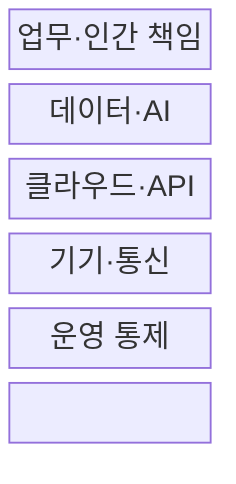
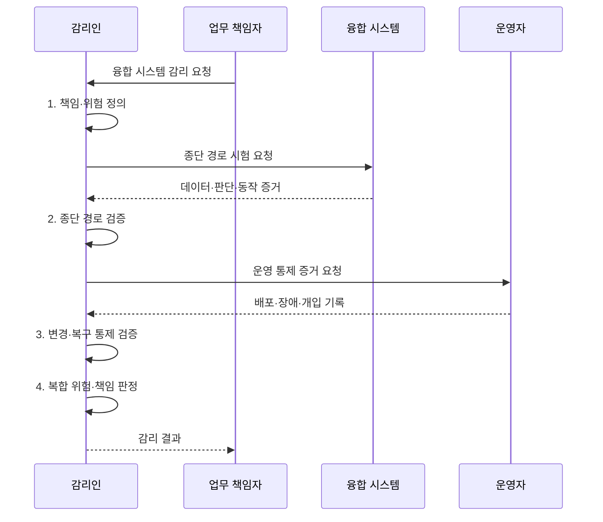

---
sidebar:
  order: 46
  label: "046. 지능정보기술 감리 (Intelligent IT Audit)"
  badge:
    text: "기출 · 50%"
    variant: note
title: "지능정보기술 감리 (Intelligent IT Audit)"
date: "2026-08-02T12:46:00+09:00"
author: "Claude Opus 4.6 (Enhanced by Gemini 3.5)"
tags:
  - "notes-evaluation"
weight: 46
extra:
  question_no: "046"
  source_status: "기출"
  source_history: "134회"
  priority: 50
  priority_note: "빅데이터·클라우드 특성을 반영한 감리 확장"
---

## Ⅰ. 개요

핵심 용어

- **지능정보기술 감리**: AI·데이터·클라우드·IoT의 종단 경로와 계층별 책임을 연결하여 복합 위험을 검증하는 융합 시스템 감리이다.
- **지능정보기술**: AI·데이터·클라우드·사물인터넷을 결합하여 인지·판단·제어를 자동화하는 기술이다.

- 정의/개념: AI·클라우드·기기의 **종단 경로·계층별 책임**을 연결해 복합 위험을 검증하는 융합 시스템 감리
- 배경/필요성: 기술별 단독 점검으로는 **계층 경계의 데이터·권한·책임 공백 식별 불가**

### 쉽게 이해하기 (학습용)

- 센서는 정상이어도 AI나 API 연결에서 결과가 바뀔 수 있어 입력부터 현장 동작까지 한 경로로 확인함

## Ⅱ. 특징

핵심 용어

- **종단 간 검증**: 센서 입력부터 데이터 처리·AI 판단·API 전달·현장 동작까지 전체 경로의 결과와 통제를 확인하는 방식이다.
- **공동 책임 모델**: 클라우드 제공자와 이용자가 계층별 보안·운영 책임을 나누는 원칙이다.
- **다학제 감리팀**: AI·데이터·클라우드·네트워크·보안 전문가를 함께 구성한 감리 조직이다.

- 값·권한·명령 변화를 잇는 **AI·클라우드·기기 종단 경로**
- 실제 실패 시나리오로 보는 **확률 판단·물리 안전 영향**
- 계층 경계별 **제공자·개발자·운영자 공동 책임 증거**

### 쉽게 이해하기 (학습용)

- 각 부품이 따로 정상인지보다 부품 사이에서 데이터·권한·책임이 끊기지 않는지를 더 중요하게 봄

## Ⅲ. 구조 및 구성요소

핵심 용어

- **데이터 거버넌스**: 데이터의 소유·품질·보호·사용 규칙과 책임을 정하는 관리 체계이다.
- **신원 및 접근 관리(IAM)**: 사용자·기기·서비스의 신원을 확인하고 자원 접근 권한을 관리하는 체계이다.
- **데이터 계보**: 데이터의 출처와 수집·변환·사용 이력을 연결하여 추적하는 기록이다.

| 구성요소 | 책임 |
|:---|:---|
| 업무·인간 책임 | **오류 비용·중단 책임**과 자동화 승인 기준 확정 |
| 데이터·AI | **데이터 거버넌스·계보**와 성능·편향 증거 |
| 클라우드·API | **IAM·공동 책임 모델**과 인터페이스 계약 통제 |
| 기기·통신 | **연결 보안·복원력**과 센서·명령 무결성 유지 |
| 운영 통제 | **재학습·수동 전환**을 포함한 변경·배포 관리 |

### 쉽게 이해하기 (학습용)

- 사람의 업무 판단에서 시작해 AI·클라우드·현장 기기까지 이어지는 층과 이를 계속 감시하는 운영층을 함께 봄

## Ⅳ. 흐름도

핵심 용어

- **사물인터넷(IoT)**: 센서와 기기를 네트워크로 연결하여 데이터를 수집하고 원격 제어하는 기술이다.
- **응용 프로그래밍 인터페이스(API)**: 시스템 간 기능 호출과 데이터 교환을 위한 규격이다.
- **복원력**: 장애나 공격이 발생해도 서비스를 유지하고 정한 수준으로 복구하는 능력이다.

1. **책임·위험 정의**: 자동화 목적·오류 비용·승인·중단 책임 확정
2. **종단 경로 검증**: 센서 입력부터 AI 판단·API 명령·기기 동작까지 대조
3. **변경·복구 통제 검증**: 재학습·API·펌웨어 변경과 장애 복구 절차 확인
4. **복합 위험·책임 판정**: 기술 경계의 원인·영향·담당자를 공동 책임표에 확정

### 쉽게 이해하기 (학습용)

- 누가 자동화를 승인했는지 확인하고 실제 데이터 길을 따라가며 결과·변경·사고 증거를 한데 맞춤

## Ⅴ. 종류 및 비교

핵심 용어

- **지능정보기술 감리**: 융합 계층의 데이터·권한·물리 동작·책임 경계를 종단 검증하는 감리이다.
- **일반 정보시스템 감리**: 사업관리·소프트웨어·인프라의 준거와 산출물 적정성을 검증하는 감리이다.
- **AI 활용 감리**: 로그 분류·이상 탐지·문서 분석 등 감리 업무 자체에 AI를 보조 도구로 사용하는 방식이다.

| 감리 방식 | 지능정보기술 감리 | 전통 시스템 감리 | AI 활용 감리 |
|:---|:---|:---|:---|
| 적용 기준 | **AI·IoT·클라우드 결합 사업** | 일반 **정보시스템 구축 사업** | **대량 로그·문서 분석** 필요 |
| 핵심 특징 | 융합 계층의 **종단 위험 검증** | **사업·SW·인프라 준거** 검증 | AI로 **감리 분석 업무 보조** |
| 한계 | **경계·공동 책임 누락** | **확률·물리 동작 위험** 누락 | **오탐·설명 부족** 수용 |

### 쉽게 이해하기 (학습용)

- 융합 시스템을 감사하는 것과 AI를 감사 도구로 쓰는 것은 대상과 수단이 서로 다름

## Ⅵ. 실무 고려사항 및 대책

핵심 용어

- **계층 경계 위험**: 개별 기술 통제는 정상이어도 API·데이터 전달·책임 인계 구간에서 생기는 위험이다.
- **AI 보조 오탐**: 감리 보조 모델이 정상 항목을 이상으로 분류하거나 실제 문제를 놓치는 오류이다.
- **물리 안전 영향**: AI·IoT 판단 오류가 현장 장비 동작을 통해 사람·재산·환경에 피해를 줄 수 있는 영향이다.

| 문제 | 대책 | 효과 |
|:---|:---|:---|
| 변환·API 경계에서 **데이터 의미 변경** | **추적 ID·스키마·단위 계약 종단 대조** | 계층 경계의 **값 왜곡 검출** |
| 장애 대응 책임이 비어 **복구 지연** | **공동 책임표에 중단·복구·증거 소유자 지정** | 복합 장애의 **책임 공백 제거** |
| AI 오판이 설비 동작으로 이어져 **물리 안전 위험** | **안전 한계·인간 승인·수동 정지 시험** | 자동 판단의 **물리 영향 통제** |
| 융합 기술별 위험 기준이 달라 판정이 분절됨 | **NIST AI RMF·ISO/IEC 42001 정렬** | AI 위험·책임의 **공통 기준 확보** |

### 쉽게 이해하기 (학습용)

- 스마트공장은 센서값이 AI 판단과 API를 거쳐 설비 명령으로 정확히 변환되고 실패 시 사람이 안전하게 중단할 수 있는지 종단 시험한다.

## Ⅶ. 결론

핵심 용어

- **NIST AI RMF**: Govern·Map·Measure·Manage 기능으로 AI 위험을 관리하는 프레임워크이다.
- **ISO/IEC 42001**: AI 관리체계의 수립·운영·유지·지속 개선 요구사항을 규정한 국제표준이다.

- 물리 영향이 크면 **종단 검증**과 **인간 중단**이 입증된 시스템만 승인

### 쉽게 이해하기 (학습용)

- 기술별 체크리스트를 합치는 데 그치지 않고 계층 사이에서 데이터와 책임이 끊기는 지점을 찾아야 함
