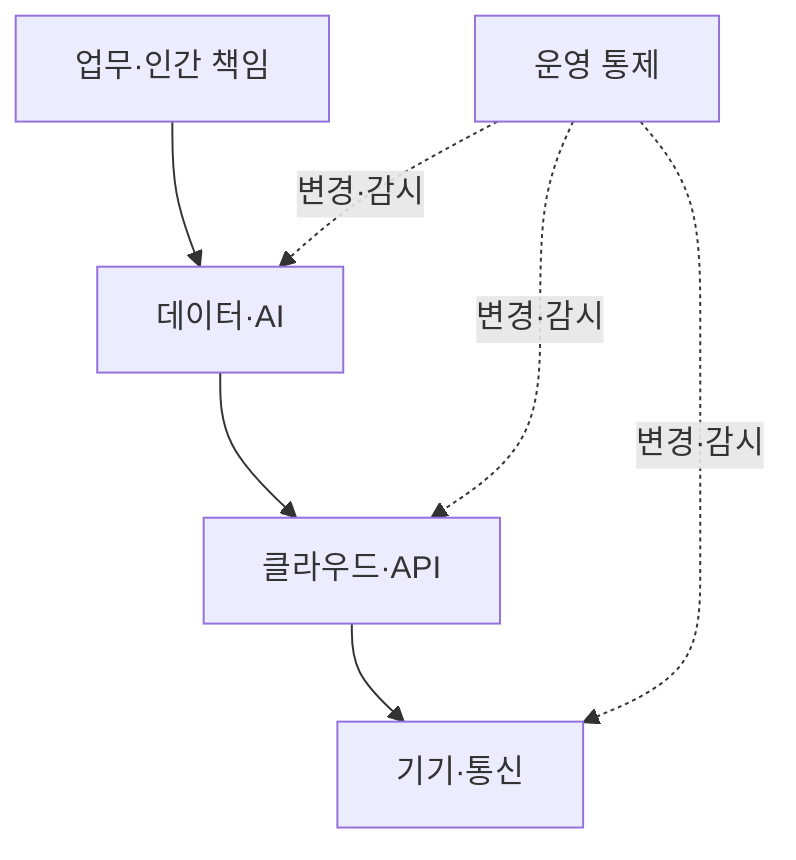
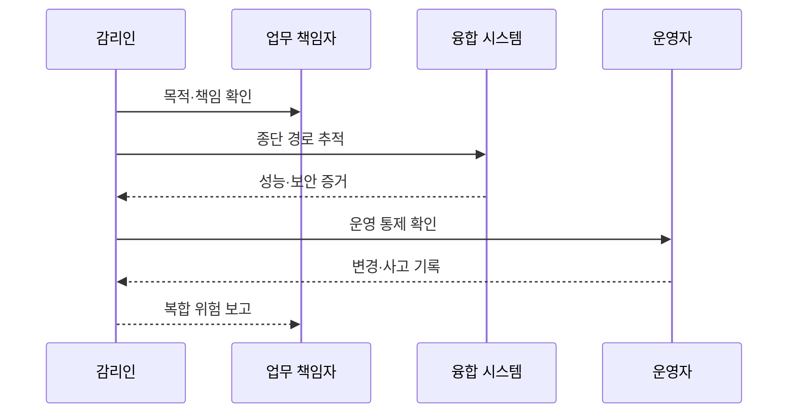

---
sidebar:
  order: 46
  label: "046. 지능정보기술 감리 (Intelligent IT Audit)"
  badge:
    text: "기출 · 50%"
    variant: note
title: "지능정보기술 감리 (Intelligent IT Audit)"
date: "2026-07-27T23:59:59+09:00"
author: "Claude Opus 4.6 (Enhanced by Gemini 3.5)"
tags:
  - "notes-evaluation"
weight: 46
extra:
  question_no: "046"
  source_status: "기출"
  source_history: "134회"
  priority: 50
  priority_note: "빅데이터·클라우드 특성을 반영한 감리 확장"
---

## 미리 알고가기

- **지능정보기술**: AI·데이터·클라우드·사물인터넷을 결합해 인지·판단·제어를 자동화하는 기술
- **인공지능(Artificial Intelligence, AI)**: 데이터에서 패턴을 학습하여 예측·생성·판단 등 지능적 과업을 수행하는 기술이다.
- **사물 인터넷(Internet of Things, IoT)**: 센서와 기기를 네트워크로 연결하여 데이터를 수집하고 원격 제어하는 기술이다.
- **응용 프로그래밍 인터페이스(Application Programming Interface, API)**: 시스템 간 기능 호출과 데이터 교환을 위한 규격이다.
- **신원 및 접근 관리(Identity and Access Management, IAM)**: 사용자와 기기의 신원을 확인하고 자원 접근 권한을 관리하는 체계다.
- **데이터 거버넌스**: 데이터의 소유·품질·보호·사용 규칙과 책임을 정하는 관리 체계
- **데이터 계보(Lineage)**: 데이터의 출처와 수집·변환·사용 이력을 연결해 추적하는 기록
- **공동 책임 모델**: 클라우드 제공자와 이용자가 계층별 보안·운영 책임을 나누는 원칙
- **종단 간 검증**: 센서 입력부터 AI 판단·API 전달·현장 동작까지 전체 경로의 결과를 확인하는 방식
- **복원력**: 장애나 공격이 발생해도 서비스를 유지하고 정해진 수준으로 복구하는 능력
- **다학제 감리팀**: AI·데이터·클라우드·네트워크·보안 전문가를 함께 구성한 감리 조직
- **AI 활용 감리**: 로그 분류·이상 탐지처럼 감리 업무 자체에 AI를 보조 도구로 사용하는 방식

## Ⅰ. 개요

- 정의/개념: 융합 기술의 종단 위험·책임을 점검하는 감리
- 기존 한계: 기술별 단독 점검은 계층 경계·복합 장애 누락
- 기존 한계: 개별 시스템만 점검하면 데이터·모델·API·센서·현장 장치로 이어지는 융합 서비스의 종단 간 위험과 책임 공백을 식별하기 어렵다.

### 쉽게 이해하기 (학습용)

- 센서는 정상이어도 AI나 API 연결에서 결과가 바뀔 수 있어 입력부터 현장 동작까지 한 경로로 확인함

## Ⅱ. 특징

- 데이터·AI·클라우드·API·기기의 종단 경로를 검증한다.
- 확률적 판단과 물리 동작의 안전 영향을 함께 평가한다.
- 제공자·개발자·운영자의 경계별 책임과 증거를 추적한다.

### 쉽게 이해하기 (학습용)

- 각 부품이 따로 정상인지보다 부품 사이에서 데이터·권한·책임이 끊기지 않는지를 더 중요하게 봄

## Ⅲ. 아키텍처 및 구성요소

| 설계 요소 | 설명 |
|:---|:---|
| 업무·인간 책임 | 자동화 범위·승인·중단 책임 |
| 데이터·AI | 계보·품질·성능·편향 검증 |
| 클라우드·API | IAM·인터페이스·공동 책임 통제 |
| 기기·통신 | 센서 신뢰성·연결 보안·복원력 |
| 운영 통제 | 변경·재학습·감시·사고 대응 |

### 쉽게 이해하기 (학습용)

- 사람의 업무 판단에서 시작해 AI·클라우드·현장 기기까지 이어지는 층과 이를 계속 감시하는 운영층을 함께 봄

## Ⅳ. 원리 및 절차 흐름도

| 절차 | 설명 |
|:---|:---|
| 목적·책임 확인 | 자동화 범위와 계층별 책임 확정 |
| 종단 경로 추적 | 입력·AI 판단·API·기기 동작 연결 |
| 성능·보안 증거 | 실제 환경의 결과와 공격 경로 확인 |
| 운영 통제 확인 | 변경·감시·복구·인간 개입 검증 |
| 변경·사고 기록 | 재학습·배포·장애 이력 대조 |
| 복합 위험 보고 | 경계별 원인·책임·개선안 연결 |

### 쉽게 이해하기 (학습용)

- 누가 자동화를 승인했는지 확인하고 실제 데이터 길을 따라가며 결과·변경·사고 증거를 한데 맞춤

## Ⅴ. 종류 및 비교

| 판단 기준 | 지능정보기술 감리 | 전통 시스템 감리 | AI 활용 감리 |
|:---|:---|:---|:---|
| 적용 기준 | AI·IoT·클라우드 결합 사업 | 일반 정보시스템 구축 사업 | 대량 로그·문서 분석이 필요할 때 |
| 핵심 특징 | 융합 계층의 종단 위험 검증 | 사업·SW·인프라 준거 검증 | AI로 감리 분석 업무 보조 |
| 한계 | 경계·공동 책임 누락 | 확률·물리 동작 위험 누락 | 오탐·설명 부족을 그대로 수용 |

### 쉽게 이해하기 (학습용)

- 융합 시스템을 감사하는 것과 AI를 감사 도구로 쓰는 것은 대상과 수단이 서로 다름

## Ⅵ. 실무 사례

1. 스마트공장은 센서부터 AI 제어까지 **종단 검증**

### 쉽게 이해하기 (학습용)

- 센서값이 AI 판단을 거쳐 설비 정지 명령까지 정확히 전달되고 실패 때 사람이 중단할 수 있는지 확인함

## Ⅶ. 결론

- 융합 위험 통제를 위해 종단 경로·책임을 검토하여 **지능정보 감리** 활용

### 쉽게 이해하기 (학습용)

- 기술별 체크리스트를 합치는 데 그치지 않고 계층 사이에서 데이터와 책임이 끊기는 지점을 찾아야 함
