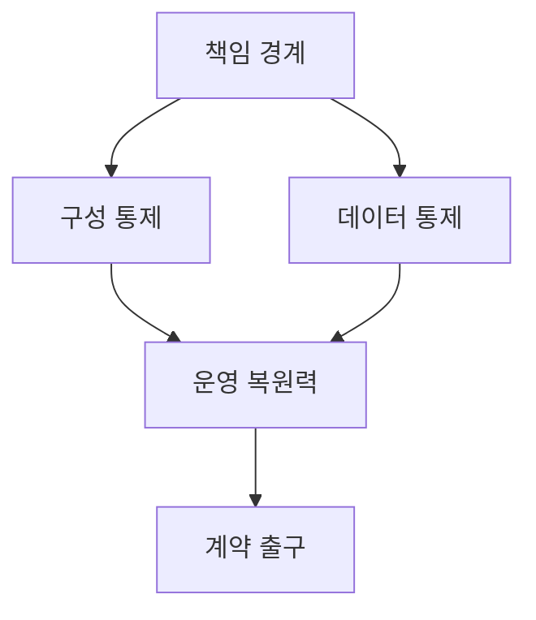
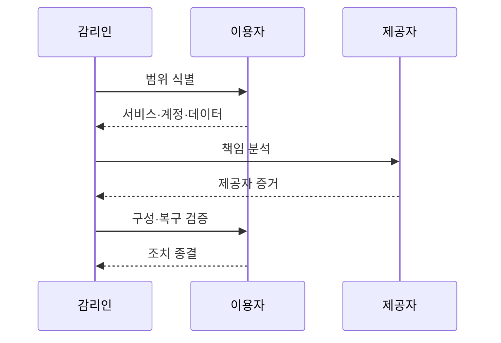

---
sidebar:
  order: 47
  label: "047. 클라우드 서비스 감리 (Cloud Service Audit)"
  badge:
    text: "기출 · 70%"
    variant: note
title: "클라우드 서비스 감리 (Cloud Service Audit)"
date: "2026-07-27T23:59:59+09:00"
author: "Claude Opus 4.6 (Enhanced by Gemini 3.5)"
tags:
  - "notes-evaluation"
weight: 47
extra:
  question_no: "047"
  source_status: "기출"
  source_history: "128회, 132회, 138회"
  priority: 70
  priority_note: "3회 기출, 클라우드 통제·증적 감리의 핵심축"
---

## 미리 알고가기

- **공유 책임 모델**: 클라우드 제공자와 이용자가 서비스 계층별 보안·운영 책임을 나누는 원칙
- **IaaS(Infrastructure as a Service, 아이애스)**: 인프라 서비스형 표기로, 제공자는 인프라를, 이용자는 OS 이상을 관리
- **PaaS(Platform as a Service, 패스)**: 플랫폼 서비스형 표기로, 제공자는 실행 플랫폼까지, 이용자는 앱·데이터를 관리
- **SaaS(Software as a Service, 사스)**: 소프트웨어 서비스형 표기로, 제공자는 앱을, 이용자는 계정·데이터·설정을 관리
- **OS(Operating System)**: 가상 서버의 하드웨어 자원을 관리하고 응용프로그램 실행 환경을 제공하는 운영체제
- **IAM(Identity and Access Management)**: 사용자·서비스 계정의 신원과 자원 접근 권한을 통제하는 체계
- **API(Application Programming Interface)**: 프로그램이 클라우드 기능과 데이터를 정해진 형식으로 호출하는 접점
- **IaC(Infrastructure as Code)**: 클라우드 자원 구성을 코드로 정의해 반복 배포하고 변경 이력을 남기는 방식
- **SLA(Service Level Agreement)**: 가용성·지원·복구 등 서비스 목표와 위반 책임을 정한 협약
- **테넌트 격리**: 여러 고객이 자원을 공유해도 각 고객의 데이터·연산·권한이 섞이지 않게 분리하는 통제
- **제어 평면**: 클라우드 자원 생성·설정·권한을 관리하는 기능 영역
- **데이터 평면**: 실제 업무 요청과 데이터가 처리·전송되는 기능 영역
- **관측 가능성**: 로그·메트릭·추적 정보로 분산 시스템의 내부 상태와 장애 원인을 파악할 수 있는 성질
- **재위탁자**: 클라우드 제공자가 서비스 일부를 다시 맡긴 외부 사업자
- **워크로드**: 클라우드에서 실행되는 응용프로그램과 그 처리 부하
- **출구 전략**: 계약 종료 때 데이터·서비스를 이전하고 잔여 데이터를 삭제하는 이행 계획
- **보안그룹**: 클라우드 자원으로 들어오고 나가는 네트워크 통신을 허용 규칙으로 제한하는 가상 방화벽

## Ⅰ. 개요

- 정의/개념: 공유 책임별 구성·운영 증거를 점검하는 감리
- 기존 한계: 제공자 인증만으로 이용자 설정·운영 책임 검증 불가
- 기존 한계: 클라우드 제공자와 이용자의 책임 경계가 불명확하면 보안 설정·운영 통제가 누락되고 사고 책임과 증거를 추적하기 어렵다.

### 쉽게 이해하기 (학습용)
- 제공자 인증만 믿지 않고 제공자와 이용자 중 누가 무엇을 관리하며 실제 설정이 맞는지 확인함

## Ⅱ. 특징

- 서비스 모델별 제공자·이용자 책임 경계를 식별한다.
- API·IaC·로그로 실제 구성과 변경 이력을 검증한다.
- 테넌트·지역·재위탁·출구까지 데이터 흐름을 추적한다.

### 쉽게 이해하기 (학습용)
- IaaS에서 SaaS로 갈수록 제공자 책임은 늘지만 계정·데이터·설정에 대한 이용자 책임은 남음

## Ⅲ. 아키텍처 및 구성요소

| 설계 요소 | 설명 |
|:---|:---|
| 책임 경계 | 제공자·이용자·재위탁자 책임 구분 |
| 구성 통제 | IAM·네트워크·IaC 정책 검증 |
| 데이터 통제 | 위치·접근·백업·삭제 확인 |
| 운영 복원력 | 관측·변경·장애 복구 점검 |
| 계약 출구 | SLA·감사·이식·종료 지원 |

### 쉽게 이해하기 (학습용)
- 책임표를 시작점으로 실제 설정·데이터·장애 대응과 계약 종료 때의 이전·삭제까지 연결함

## Ⅳ. 원리 및 절차 흐름도

| 절차 | 설명 |
|:---|:---|
| 범위 식별 | 서비스·계정·데이터·지역 확정 |
| 책임 분석 | 계층별 제공자·이용자 통제 매핑 |
| 제공자 증거 | 인증·장애·재위탁·SLA 증거 확인 |
| 구성·복구 검증 | IAM·네트워크·백업을 직접 시험 |
| 조치 종결 | 계약 예외와 잔여 위험 승인 |

### 쉽게 이해하기 (학습용)
- 제공자가 맡은 부분은 외부 증거로 보고 이용자가 맡은 설정과 복구는 직접 시험해 책임 공백을 찾음

## Ⅴ. 종류 및 비교

| 판단 기준 | IaaS | PaaS | SaaS |
|:---|:---|:---|:---|
| 적용 기준 | 인프라 직접 제어 필요 | 개발 플랫폼 구성 필요 | 완성된 응용 서비스 이용 |
| 핵심 특징 | OS 이상을 이용자가 관리 | 앱·데이터를 이용자가 관리 | 계정·데이터·설정을 이용자가 관리 |
| 한계 | 권한 과다·관리 포트 노출 | 종속성·비밀정보 노출 | 테넌트 격리·무단 반출 |

### 쉽게 이해하기 (학습용)
- IaaS는 제어권과 책임이 크고 SaaS는 운영 부담은 작지만 계정·데이터 통제는 이용자에게 남음

## Ⅵ. 실무 사례

1. IaaS는 IaC와 실제 자원 설정의 **차이 검증**

### 쉽게 이해하기 (학습용)
- 코드에는 닫혀 있지만 실제 보안그룹이 열려 있지 않은지 배포 상태와 변경 로그를 대조함

## Ⅶ. 결론

- 클라우드 위험 통제를 위해 책임·구성을 검토하여 **클라우드 감리** 활용

### 쉽게 이해하기 (학습용)
- 제공자 인증은 이용자 설정을 대신하지 않으므로 책임별 증거와 실제 자원 상태를 함께 확인해야 함
