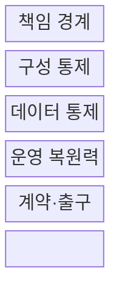
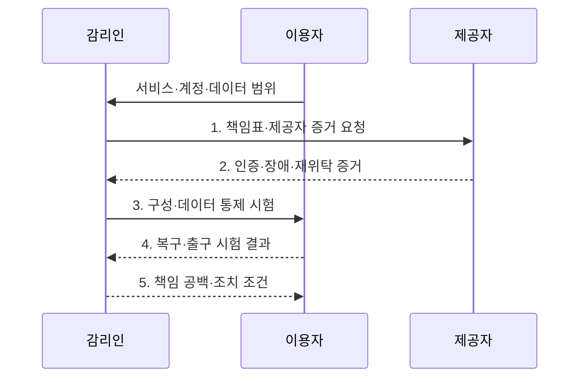

---
sidebar:
  order: 47
  label: "047. 클라우드 서비스 감리 (Cloud Service Audit)"
  badge:
    text: "기출 · 70%"
    variant: note
title: "클라우드 서비스 감리 (Cloud Service Audit)"
date: "2026-07-31T05:06:14+09:00"
author: "Claude Opus 4.6 (Enhanced by Gemini 3.5)"
tags:
  - "notes-evaluation"
weight: 47
extra:
  question_no: "047"
  source_status: "기출"
  source_history: "128회, 132회, 138회"
  priority: 70
  priority_note: "3회 기출, 클라우드 통제·증적 감리의 핵심축"
---

## 미리 알고가기

- **공유 책임 모델**: 클라우드 제공자와 이용자가 서비스 계층별 보안·운영 책임을 나누는 원칙이다.
- **서비스형 인프라(Infrastructure as a Service, IaaS)**: 제공자가 물리·가상 인프라를 관리하고 이용자가 운영체제 이상을 관리하는 서비스 모델이다.
- **서비스형 플랫폼(Platform as a Service, PaaS)**: 제공자가 실행 플랫폼까지 관리하고 이용자가 애플리케이션과 데이터를 관리하는 서비스 모델이다.
- **서비스형 소프트웨어(Software as a Service, SaaS)**: 제공자가 애플리케이션까지 관리하고 이용자가 계정·데이터·설정을 관리하는 서비스 모델이다.
- **운영체제(Operating System, OS)**: 가상 서버의 하드웨어 자원을 관리하고 응용프로그램 실행 환경을 제공하는 소프트웨어다.
- **신원 및 접근 관리(Identity and Access Management, IAM)**: 사용자·서비스 계정의 신원을 확인하고 자원 접근 권한을 통제하는 체계다.
- **응용 프로그래밍 인터페이스(Application Programming Interface, API)**: 프로그램이 클라우드 기능과 데이터를 정해진 형식으로 호출하는 접점이다.
- **코드형 인프라(Infrastructure as Code, IaC)**: 클라우드 자원 구성을 코드로 정의해 반복 배포하고 변경 이력을 남기는 방식이다.
- **서비스 수준 협약(Service Level Agreement, SLA)**: 가용성·지원·복구 등 서비스 목표와 위반 책임을 정한 협약이다.
- **테넌트 격리**: 여러 고객이 자원을 공유해도 각 고객의 데이터·연산·권한이 섞이지 않게 분리하는 통제다.
- **제어 평면**: 클라우드 자원의 생성·설정·권한을 관리하는 기능 영역이다.
- **데이터 평면**: 실제 업무 요청과 데이터가 처리·전송되는 기능 영역이다.
- **관측 가능성**: 로그·메트릭·추적 정보로 분산 시스템의 내부 상태와 장애 원인을 파악할 수 있는 성질이다.
- **재위탁자**: 클라우드 제공자가 서비스 일부를 다시 맡긴 외부 사업자다.
- **워크로드**: 클라우드에서 실행되는 응용프로그램과 그 처리 부하다.
- **출구 전략**: 계약 종료 때 데이터·서비스를 이전하고 잔여 데이터를 삭제하는 이행 계획이다.
- **보안그룹**: 클라우드 자원으로 들어오고 나가는 네트워크 통신을 허용 규칙으로 제한하는 가상 방화벽이다.
- **ISO/IEC 27017 제2판**: 클라우드 제공자·이용자 보안 통제를 다루며 2026년 7월 발행 절차 중인 표준이다.
- **ISO/IEC 27018:2025**: 공개 클라우드 개인정보 처리자의 보호 통제 지침이다.

## Ⅰ. 개요

- 정의/개념: 서비스 모델별 **공유 책임 경계**를 기준으로 제공자 증거와 이용자의 실제 구성·데이터·복구·출구 통제를 검증하는 정보시스템 감리
- 배경/필요성: 제공자 인증만으로는 **이용자 설정·재위탁 통제·복구 책임 검증 불가**

### 쉽게 이해하기 (학습용)
- 제공자 인증만 믿지 않고 제공자와 이용자 중 누가 무엇을 관리하며 실제 설정이 맞는지 확인함

## Ⅱ. 특징

- 통제 단위가 되는 **서비스 모델별 제공자·이용자 책임 경계**
- 구성 편차를 찾는 **API·IaC·로그·실제 자원 대조**
- 접근·이전·삭제를 잇는 **테넌트·지역·재위탁·출구 흐름**

### 쉽게 이해하기 (학습용)
- IaaS에서 SaaS로 갈수록 제공자 책임은 늘지만 계정·데이터·설정에 대한 이용자 책임은 남음

## Ⅲ. 구조 및 구성요소

| 구성요소 | 책임 |
|:---|:---|
| 책임 경계 | **IaaS·PaaS·SaaS별 통제 책임** 구분 |
| 구성 통제 | **IAM·네트워크·암호화·IaC** 실자원 대조 |
| 데이터 통제 | **테넌트·지역별 접근·백업·이전·삭제** 확인 |
| 운영 복원력 | **로그·변경·장애 전환·복구 시험** 관리 |
| 계약·출구 | **SLA·감사권·재위탁·이식·삭제** 보장 |

### 쉽게 이해하기 (학습용)
- 책임표를 시작점으로 실제 설정·데이터·장애 대응과 계약 종료 때의 이전·삭제까지 연결함

## Ⅳ. 흐름도

1. **책임표·제공자 증거 요청**: 서비스 계층별 통제를 제공자·이용자·재위탁자에 배정하고 증거 소유자 확정
2. **인증·장애·재위탁 증거**: 제공자 통제의 인증 범위·예외·장애 이력·하위 제공자·SLA 이행 확인
3. **구성·데이터 통제 시험**: 이용자 IAM·보안그룹·암호화·지역 제한과 IaC·실제 자원 편차 검증
4. **복구·출구 시험 결과**: 백업 복원, 장애 전환, 데이터 이식과 계약 종료 후 삭제 가능성 입증
5. **책임 공백·조치 조건**: 미배정 통제·계약 예외·잔여 위험의 담당자·기한·수용 권한 확정

### 쉽게 이해하기 (학습용)
- 제공자가 맡은 부분은 외부 증거로 보고 이용자가 맡은 설정과 복구는 직접 시험해 책임 공백을 찾음

## Ⅴ. 종류 및 비교

| 클라우드 서비스 모델 | IaaS | PaaS | SaaS |
|:---|:---|:---|:---|
| 적용 기준 | 인프라 **직접 제어** 필요 | 개발 **플랫폼 구성** 필요 | 완성된 **응용 서비스** 이용 |
| 핵심 특징 | OS 이상을 **이용자가 관리** | 앱·데이터를 **이용자가 관리** | 계정·데이터·설정을 **이용자가 관리** |
| 한계 | **권한 과다·관리 포트 노출** | **종속성·비밀정보 노출** | **테넌트 격리·무단 반출** |

### 쉽게 이해하기 (학습용)
- IaaS는 제어권과 책임이 크고 SaaS는 운영 부담은 작지만 계정·데이터 통제는 이용자에게 남음

## Ⅵ. 실무 고려사항 및 대책

| 고려사항 | 대책 | 효과 |
|:---|:---|:---|
| 제공자 인증을 이용자 설정까지 해석해 **책임 공백** | **공유 책임표·통제·증거 소유자 명시** | 제공자·이용자의 **통제 누락 방지** |
| 승인 IaC와 실제 보안그룹의 **구성 편차** | **API 실자원과 승인 IaC 지속 대조** | 배포 상태의 **준거 일치 확보** |
| 계약 종료 뒤 **공급자 종속·잔존 데이터** | **이식·복원 시험·삭제 증명 계약화** | 서비스 이전과 **데이터 종결 가능성 확보** |
| 클라우드·개인정보 통제 기준이 다르면 증거가 누락됨 | **ISO/IEC 27017 발행 추적·27018:2025 적용** | 보안·개인정보의 **공통 통제 확보** |

### 쉽게 이해하기 (학습용)
- IaaS의 승인 IaC와 실제 보안그룹·IAM 설정 및 변경 로그를 대조해 무단 구성 편차를 확인한다.

## Ⅶ. 결론

- IaaS·PaaS·SaaS별 **책임·증거 소유자 확정 후 실구성·복구·출구 시험**

### 쉽게 이해하기 (학습용)
- 제공자 인증은 이용자 설정을 대신하지 않으므로 책임별 증거와 실제 자원 상태를 함께 확인해야 함
