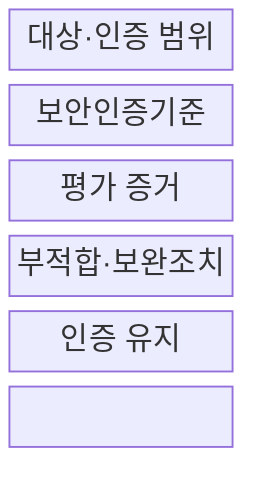
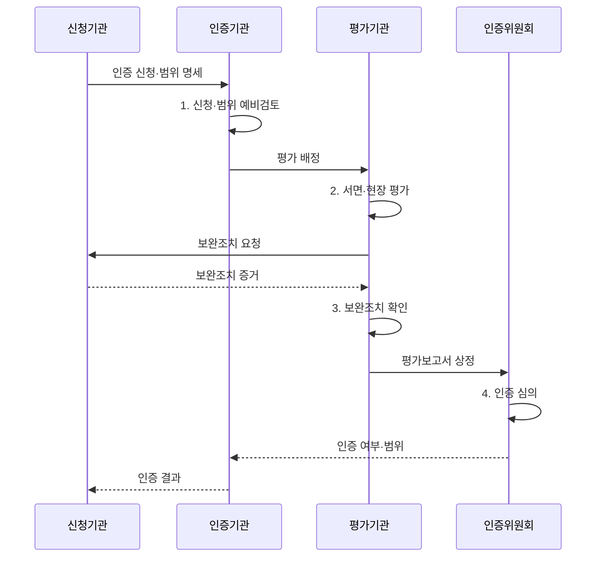

---
sidebar:
  order: 48
  label: "048. CSAP 클라우드 보안 인증 평가 (CSAP Assessment)"
  badge:
    text: "기출 · 50%"
    variant: note
title: "CSAP 클라우드 보안 인증 평가 (CSAP Assessment)"
date: "2026-08-02T12:48:00+09:00"
author: "Claude Opus 4.6 (Enhanced by Gemini 3.5)"
tags:
  - "notes-evaluation"
weight: 48
extra:
  question_no: "048"
  source_status: "기출"
  source_history: "129회"
  priority: 50
  priority_note: "공공 클라우드 보안 인증 평가의 기출 주제"
---

## Ⅰ. 개요

핵심 용어

- **클라우드서비스 보안인증(CSAP)**: 공공기관이 이용하는 클라우드서비스가 정한 보안인증 기준을 충족하는지 평가·심의하는 법정 제도이다.
- **인증 범위**: 인증 서비스와 관련된 조직·시스템·설비·시설·지원서비스를 포함한 평가 경계이다.

- 정의/개념: 공공 클라우드의 범위별 통제를 평가·심의하는 **법정 보안인증 제도**
- 배경/필요성: 일반 인증만으로는 공공 서비스의 **범위별 통제·지속 준수 검증 불가**

#### 한줄 요약
- 서비스 이름만 인증하는 것이 아니라 그 서비스를 운영하는 조직·시설·시스템과 지원 기능까지 정한 범위로 검증함

## Ⅱ. 특징

핵심 용어

- **보안인증 등급**: 정보 중요도와 보호 수준에 따라 상·중·하로 구분한 인증 수준이다.
- **공유 책임**: 클라우드 제공자와 이용자가 서비스 계층별 보안·운영 책임을 나누는 원칙이다.
- **보안인증 유효기간**: 인증 효력이 유지되는 기간으로, 기간 중에도 사후평가와 변경관리가 필요하다.

- **IaaS·SaaS**와 DaaS 유형·등급·범위별 차등 보안인증기준
- 가상 데스크톱의 세션·단말을 검증하는 **DaaS 평가**
- 제공자 통제와 이용자 설정을 나누는 **공유 책임**
- 통제 설계·작동성을 보는 **서면·현장·취약점·모의침투 평가**
- 신규·중요 변경 시 전체 기준을 확인하는 **최초평가**
- 지속 준수와 유효기간 연장을 위한 **사후·갱신평가**

#### 한줄 요약
- 최초 통과로 끝나지 않고 매년 실제 통제 운영과 중요한 서비스 변경을 다시 확인함

## Ⅲ. 구조 및 구성요소

핵심 용어

- **평가기관**: 신청 서비스의 서면·현장 평가와 보완조치 확인을 수행하도록 지정된 기관이다.
- **인증위원회**: 평가 결과와 기술자문을 바탕으로 인증 여부를 심의하는 조직이다.
- **한국인터넷진흥원(KISA)**: 인터넷·정보보호 진흥과 관련 인증·평가 업무를 수행하는 전문기관이다.

| 구성요소 | 책임 |
|:---|:---|
| 대상·인증 범위 | **유형·등급**에 따라 조직·시스템·시설 경계 확정 |
| 인증·평가 조직 | **KISA·평가기관**의 평가와 인증위원회 심의 |
| 보안인증기준 | **관리·기술 보호**와 물리 보호 요구사항 제공 |
| 평가 증거 | **취약점·모의침투**와 정책·로그·현장 결과 |
| 부적합·보완조치 | **수정 결과·이행점검**을 원인·영향과 연결 |
| 인증 유지 | **범위 변경·사후평가**와 사고·갱신평가 관리 |

#### 한줄 요약
- 서비스와 연결된 조직·시설·시스템의 테두리를 먼저 정하고 그 안의 통제 증거와 결함 조치를 인증 유지까지 추적함

## Ⅳ. 흐름도

핵심 용어

- **최초평가**: 처음 신청하거나 인증 범위에 중요한 변경이 있을 때 전체 기준을 평가하는 절차이다.
- **사후평가**: 인증 유효기간 중 보안인증 기준을 계속 준수하는지 확인하는 평가이다.
- **갱신평가**: 유효기간 만료 전에 인증을 연장하기 위해 다시 수행하는 평가이다.

1. **신청·범위 예비검토**: 유형·등급·인증 범위와 평가 가능성 확인
2. **서면·현장 평가**: 정책·로그·설정·시설과 취약점 시험 결과 대조
3. **보완조치 확인**: 부적합 원인 제거와 재시험 결과 검증
4. **인증 심의**: 평가 결과·잔여 위험에 따라 인증 여부와 범위 결정

#### 한줄 요약
- 신청 범위를 정한 뒤 평가기관이 현장을 확인하고 결함을 고치면 위원회가 인증을 결정하며 이후에도 매년 유지 여부를 봄

## Ⅴ. 종류 및 비교

핵심 용어

- **IaaS 인증**: 공공에 제공하는 물리·가상 인프라와 관리 평면·격리 통제를 평가한다.
- **SaaS 인증**: 공공에 제공하는 응용 기능과 데이터·테넌트·애플리케이션 보안을 평가한다.
- **DaaS 인증**: 업무용 가상 데스크톱의 세션·가상 OS·관리 기반과 단말 연계를 평가한다.

| CSAP 서비스 유형 | IaaS | SaaS | DaaS |
|:---|:---|:---|:---|
| 적용 기준 | 인프라를 **공공에 공급** | SaaS를 **공공에 공급** | **업무용 가상 PC** 공급 |
| 핵심 특징 | **물리·가상 인프라** 제공 | **응용프로그램 기능** 제공 | **가상 데스크톱** 제공 |
| 한계 | **관리 평면·가상화 격리** | **데이터·테넌트 취약점**과 앱 위협 | **세션·가상 OS 침해**와 단말 위협 |

#### 한줄 요약
- IaaS는 기반시설, SaaS는 앱과 데이터, DaaS는 가상 PC 세션과 단말 연결을 중심으로 봄

## Ⅵ. 실무 고려사항 및 대책

핵심 용어

- **모의침투테스트**: 실제 공격 절차를 모사하여 서비스 취약점의 악용 가능성을 확인하는 시험이다.
- **중요 변경**: 인증 범위·아키텍처·재위탁·데이터 위치·핵심 통제에 영향을 주어 재평가가 필요한 변경이다.
- **인증 범위 밖 의존성**: 인증서에 포함되지 않은 외부 서비스·운영 조직이 실제 보안에 영향을 주는 위험이다.

| 문제 | 대책 | 효과 |
|:---|:---|:---|
| 운영 계정·지원시스템이 빠져 **인증 범위 누락** | **자산·데이터 흐름·재위탁 범위 대조** | 평가 경계의 **완전성 확보** |
| 중요 변경 누락으로 **인증·실서비스 불일치** | **범위·아키텍처·위탁 변경 영향 보고** | 인증 효력의 **변경 추적성 유지** |
| 보완 문서만 제출해 취약점이 남는 **형식적 이행** | **설정·로그·재점검·모의침투 확인** | 부적합 원인의 **실제 제거 입증** |
| 인증 만료 뒤 사용하면 공공 조달 근거가 상실됨 | **제23조의2·5년 유효기간**에 따라 갱신 관리 | 인증 상태의 **법적 연속성 확보** |

#### 한줄 요약
- SaaS 신청 범위를 실제 네트워크·운영 계정·지원시스템·재위탁 서비스와 대조해 빠진 자산과 통제를 찾는다.

## Ⅶ. 결론

핵심 용어

- **지속 준수**: 인증 취득 시점뿐 아니라 변경·운영·사고 대응 전 기간에 기준 충족을 유지하는 상태이다.
- **클라우드컴퓨팅법 제23조의2**: CSAP의 평가·심의·발급·사후관리 법적 근거를 정한 조항이다.

- 유형·등급·구성이 **CSAP 범위와 일치하면 이용**, 불일치·만료 시 배제

#### 한줄 요약
- 인증서 유무만 보지 말고 이용하려는 서비스·등급·구성이 인증 범위 안에 있는지 확인해야 함
