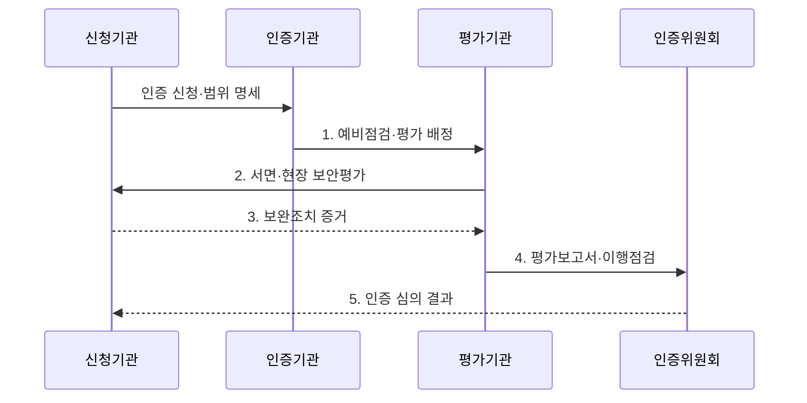

---
sidebar:
  order: 48
  label: "048. CSAP 클라우드 보안 인증 평가 (CSAP Assessment)"
  badge:
    text: "기출 · 50%"
    variant: note
title: "CSAP 클라우드 보안 인증 평가 (CSAP Assessment)"
date: "2026-07-30T08:31:00+09:00"
author: "Claude Opus 4.6 (Enhanced by Gemini 3.5)"
tags:
  - "notes-evaluation"
weight: 48
extra:
  question_no: "048"
  source_status: "기출"
  source_history: "129회"
  priority: 50
  priority_note: "공공 클라우드 보안 인증 평가의 기출 주제"
---

## 미리 알고가기

- **클라우드서비스 보안인증(Cloud Security Assurance Program, CSAP)**: 공공기관이 이용하는 클라우드서비스가 보안인증 기준을 충족하는지 평가하는 제도다.
- **한국인터넷진흥원(Korea Internet & Security Agency, KISA)**: 인터넷·정보보호 진흥과 관련 인증·평가 업무를 수행하는 전문기관이다.
- **평가기관**: 신청 서비스의 서면·현장 평가와 보완조치 확인을 수행하도록 지정된 기관이다.
- **인증위원회**: 평가 결과와 기술자문을 바탕으로 인증 여부를 심의하는 조직이다.
- **서비스형 인프라(Infrastructure as a Service, IaaS)**: 제공자가 물리·가상 인프라를 운영하는 클라우드 서비스 모델이다.
- **서비스형 소프트웨어(Software as a Service, SaaS)**: 제공자가 완성된 응용프로그램을 운영하는 클라우드 서비스 모델이다.
- **서비스형 데스크톱(Desktop as a Service, DaaS)**: 제공자가 가상 데스크톱과 실행 기반을 운영하는 클라우드 서비스 모델이다.
- **보안인증 등급**: 정보 중요도와 보호 수준에 따라 상·중·하로 구분한 인증 수준이다.
- **인증 범위**: 인증 서비스와 관련된 조직·시스템·설비·시설·지원서비스를 포함한 평가 경계다.
- **최초평가**: 처음 신청하거나 인증 범위에 중요한 변경이 있을 때 전체 기준을 평가하는 절차다.
- **사후평가**: 인증 유효기간 중 보안인증기준을 계속 준수하는지 확인하는 평가다.
- **갱신평가**: 유효기간 만료 전에 인증을 연장하기 위해 다시 수행하는 평가다.
- **모의침투테스트**: 실제 공격 절차를 모사해 서비스의 취약점 악용 가능성을 확인하는 시험이다.
- **공유 책임**: 클라우드 제공자와 이용자가 서비스 계층별 보안·운영 책임을 나누는 원칙이다.
- **가상화**: 하나의 물리 자원을 여러 독립된 논리 자원으로 나누어 사용하는 기술이다.
- **관리 평면**: 클라우드 자원 생성·설정·권한을 제어하는 관리 기능 영역이다.
- **세션**: 사용자가 가상 데스크톱에 접속해 작업하는 동안 유지되는 논리적 연결 상태다.

## Ⅰ. 개요

- 정의/개념: 클라우드서비스의 조직·시스템·설비·시설·지원서비스를 **인증 범위**로 정하고 보안인증기준의 충족 여부를 평가·심의하는 제도
- 배경/필요성: 사업자의 자체 주장이나 일반 인증만으로 확인하기 어려운 **공공 클라우드서비스의 범위별 보안 통제**와 지속 준수 검증

### 쉽게 이해하기 (학습용)
- 서비스 이름만 인증하는 것이 아니라 그 서비스를 운영하는 조직·시설·시스템과 지원 기능까지 정한 범위로 검증함

## Ⅱ. 특징

- **서비스 유형·등급·인증 범위별 보안인증기준**을 적용한다.
- **서면·현장·취약점·모의침투 증거의 종합 평가**로 통제 설계와 작동성을 확인한다.
- **최초·사후·갱신평가**로 인증 범위의 변경과 지속 준수를 관리한다.

### 쉽게 이해하기 (학습용)
- 최초 통과로 끝나지 않고 매년 실제 통제 운영과 중요한 서비스 변경을 다시 확인함

## Ⅲ. 구조 및 구성요소

```mermaid
block-beta
    columns 2
    S["대상·인증 범위"] C["보안인증기준"]
    E["평가 증거"]:2
    R["부적합·보완조치"] M["인증 유지"]
    S -- E
    C -- E
    E -- R
    R -- M
```

| 구성요소 | 책임 |
|:---|:---|
| 대상·인증 범위 | 서비스 유형·등급과 조직·시스템·설비·시설·지원서비스 경계 확정 |
| 보안인증기준 | 관리·물리·기술 영역의 보호 요구사항과 평가 조건 제공 |
| 평가 증거 | 정책·로그·설정·현장·취약점·모의침투 결과로 통제 작동 입증 |
| 부적합·보완조치 | 원인·영향·수정 결과와 이행점검 증거를 항목별로 연결 |
| 인증 유지 | 범위 변경·보안 사고·사후평가·갱신평가와 인증 상태 관리 |

### 쉽게 이해하기 (학습용)
- 서비스와 연결된 조직·시설·시스템의 테두리를 먼저 정하고 그 안의 통제 증거와 결함 조치를 인증 유지까지 추적함

## Ⅳ. 흐름도



- 1. **예비점검·평가 배정**: 신청 서류와 유형·등급·인증 범위의 평가 가능성을 확인하고 평가기관 배정
- 2. **서면·현장 보안평가**: 기준별 정책·로그·설정·시설과 취약점·모의침투 결과를 대조
- 3. **보완조치 증거**: 부적합·취약점의 원인 제거와 재시험 결과를 항목별로 제출
- 4. **평가보고서·이행점검**: 보완조치 이행 여부와 잔여 위험을 포함한 평가 결과를 인증위원회에 상정
- 5. **인증 심의 결과**: 인증위원회가 인증 여부와 범위를 결정하고 이후 사후·갱신평가로 지속 준수 확인

### 쉽게 이해하기 (학습용)
- 신청 범위를 정한 뒤 평가기관이 현장을 확인하고 결함을 고치면 위원회가 인증을 결정하며 이후에도 매년 유지 여부를 봄

## Ⅴ. 종류 및 비교

| CSAP 서비스 유형 | IaaS | SaaS | DaaS |
|:---|:---|:---|:---|
| 적용 기준 | 인프라 서비스를 공공에 공급 | SaaS를 공공에 공급 | 업무용 가상 PC를 공공에 공급 |
| 핵심 특징 | 물리·가상 인프라 제공 | 응용프로그램 기능 제공 | 가상 데스크톱 제공 |
| 한계 | 관리 평면·가상화 격리 | 데이터·테넌트·앱 취약점 | 세션·단말·가상 OS 침해 |

### 쉽게 이해하기 (학습용)
- IaaS는 기반시설, SaaS는 앱과 데이터, DaaS는 가상 PC 세션과 단말 연결을 중심으로 봄

## Ⅵ. 실무 고려사항 및 대책

| 고려사항 | 대책 | 효과 |
|:---|:---|:---|
| 신청서에서 운영 계정·지원시스템이 빠져 **인증 범위 누락** | 네트워크·자산·데이터 흐름과 조직·재위탁 서비스를 범위 명세에 대조 | 평가 경계의 **완전성 확보** |
| 인증 뒤 중요 구성 변경이 반영되지 않아 **인증 상태와 실서비스 불일치** | 범위·아키텍처·위탁 변경을 영향 분석하고 평가·인증기관에 절차대로 보고 | 인증 효력의 **변경 추적성 유지** |
| 보완 문서만 제출하고 실제 취약점이 남는 **형식적 이행** | 수정 설정·로그와 취약점 재점검·모의침투 결과를 함께 확인 | 부적합 원인의 **실제 제거 입증** |

### 쉽게 이해하기 (학습용)
- SaaS 신청 범위를 실제 네트워크·운영 계정·지원시스템·재위탁 서비스와 대조해 빠진 자산과 통제를 찾는다.

## Ⅶ. 결론

- 이용하려는 서비스의 유형·등급·구성이 **CSAP 인증 범위**와 일치하는지 확인하고 변경·사후·갱신평가 증거로 지속 준수를 판단하는 인증 활용

### 쉽게 이해하기 (학습용)
- 인증서 유무만 보지 말고 이용하려는 서비스·등급·구성이 인증 범위 안에 있는지 확인해야 함
