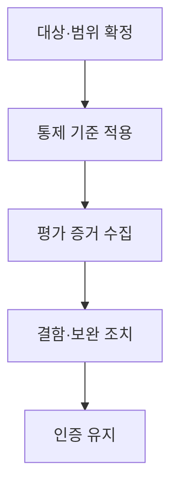
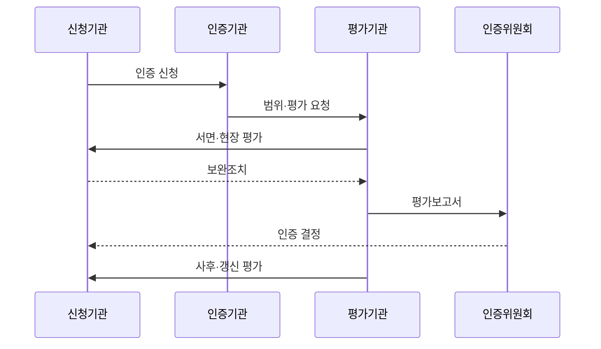

---
sidebar:
  order: 48
  label: "048. CSAP 클라우드 보안 인증 평가 (CSAP Assessment)"
  badge:
    text: "기출 · 50%"
    variant: note
title: "CSAP 클라우드 보안 인증 평가 (CSAP Assessment)"
date: "2026-07-25T01:10:00+09:00"
author: "Claude Opus 4.6 (Enhanced by Gemini 3.5)"
tags:
  - "notes-evaluation"
weight: 48
extra:
  question_no: "048"
  source_status: "기출"
  source_history: "129회"
  priority: 50
  priority_note: "공공 클라우드 보안 인증 평가의 기출 주제"
---

## 미리 알고가기

- **CSAP(Cloud Security Assurance Program)**: 공공부문에 제공하는 클라우드서비스가 보안인증기준을 충족하는지 평가·인증하는 제도
- **KISA(Korea Internet & Security Agency)**: CSAP 신청을 접수하고 인증위원회를 운영하는 한국인터넷진흥원
- **평가기관**: 신청 서비스의 서면·현장 평가와 보완조치 확인을 수행하도록 지정된 기관
- **인증위원회**: 평가 결과와 기술자문을 바탕으로 인증 여부를 심의하는 조직
- **IaaS(Infrastructure as a Service)**: 제공자가 물리·가상 인프라를 운영하는 클라우드서비스 유형
- **SaaS(Software as a Service)**: 제공자가 완성된 응용프로그램을 클라우드로 운영하는 서비스 유형
- **DaaS(Desktop as a Service)**: 제공자가 가상 데스크톱과 그 실행 기반을 운영하는 서비스 유형
- **보안인증 등급**: 정보 중요도와 보호 수준에 따라 상·중·하로 구분한 인증 수준
- **인증 범위**: 인증 서비스와 관련된 조직·시스템·설비·시설·지원서비스를 포함한 평가 경계
- **최초평가**: 처음 신청하거나 인증 범위에 중요한 변경이 있을 때 전체 기준을 평가하는 절차
- **사후평가**: 인증 유효기간 중 보안인증기준을 계속 준수하는지 매년 확인하는 평가
- **갱신평가**: 유효기간 만료 전에 인증을 연장하기 위해 다시 수행하는 평가
- **모의침투테스트**: 실제 공격 절차를 모사해 서비스의 취약점 악용 가능성을 확인하는 시험
- **공유 책임**: 클라우드 제공자와 이용자가 서비스 계층별 보안·운영 책임을 나누는 원칙
- **가상화**: 하나의 물리 자원을 여러 독립된 논리 자원으로 나누어 사용하는 기술
- **관리 평면**: 클라우드 자원 생성·설정·권한을 제어하는 관리 기능 영역
- **세션**: 사용자가 가상 데스크톱에 접속해 작업하는 동안 유지되는 논리적 연결 상태

## Ⅰ. 개요

- **정의/개념**: 공공 클라우드의 보안 통제를 평가·인증하는 제도
- **배경/필요성**: 공공 이용자가 검증된 서비스와 범위를 선택

### 쉽게 이해하기 (학습용)
- 서비스 이름만 인증하는 것이 아니라 그 서비스를 운영하는 조직·시설·시스템과 지원 기능까지 정한 범위로 검증함

## Ⅱ. 특징

- 법률에 따라 서비스 단위로 보안을 인증한다.
- 유형·등급별 요구사항과 인증 범위 차등화한다.
- 서면·현장·취약점·침투 증거를 종합 평가한다.
- 5년 유효기간 중 매년 사후평가 수행한다.

### 쉽게 이해하기 (학습용)
- 최초 통과로 끝나지 않고 매년 실제 통제 운영과 중요한 서비스 변경을 다시 확인함

## Ⅲ. 아키텍처 및 구성요소

| 설계 요소 | 설명 |
|:---|:---|
| 대상·범위 | 유형·등급·조직·시설 경계 확정 |
| 통제 기준 | 관리·물리·기술 보안 요구사항 규정 |
| 평가 증거 | 서면 정책·로그·현장 검증 |
| 결함·보완 | 부적합 사항 및 보완 조치 재확인 |
| 인증 유지 | 변경 사항 및 사고 통제·갱신 관리 |

### 쉽게 이해하기 (학습용)
- 서비스와 연결된 조직·시설·시스템의 테두리를 먼저 정하고 그 안의 통제 증거와 결함 조치를 인증 유지까지 추적함

## Ⅳ. 원리 및 절차 흐름도

| 절차 | 설명 |
|:---|:---|
| 인증 신청 | 서비스 유형·등급·범위 제출 |
| 범위·평가 요청 | 신청 검토 후 평가기관에 배정 |
| 서면·현장 평가 | 통제 증거·취약점·침투 가능성 확인 |
| 보완조치 | 부적합·취약점 수정 증거 제출 |
| 평가보고서 | 이행 확인 결과를 위원회에 제출 |
| 인증 결정 | 심의 후 인증서 발급 여부 확정 |
| 사후·갱신 평가 | 유지·변경·연장 적합성 확인 |

### 쉽게 이해하기 (학습용)
- 신청 범위를 정한 뒤 평가기관이 현장을 확인하고 결함을 고치면 위원회가 인증을 결정하며 이후에도 매년 유지 여부를 봄

## Ⅴ. 종류 및 비교

| 비교축 | IaaS | SaaS | DaaS |
|:---|:---|:---|:---|
| 핵심 특징 | 물리·가상 인프라 제공 | 응용프로그램 기능 제공 | 가상 데스크톱 제공 |
| 적용 기준 | 인프라 서비스를 공공에 공급 | SaaS를 공공에 공급 | 업무용 가상 PC를 공공에 공급 |
| 주요 위험 | 관리 평면·가상화 격리 | 데이터·테넌트·앱 취약점 | 세션·단말·가상 OS 침해 |

### 쉽게 이해하기 (학습용)
- IaaS는 기반시설, SaaS는 앱과 데이터, DaaS는 가상 PC 세션과 단말 연결을 중심으로 봄

## Ⅵ. 실무 사례

- SaaS: 신청 네트워크와 실제 자원 범위 대조
- 중요 변경: 신규 데이터 저장소의 재평가 판단

### 쉽게 이해하기 (학습용)
- 신청서의 서비스 경계와 실제 네트워크·운영 계정·지원시스템을 대조해 빠진 자산을 찾음
- 인증 후 새 저장소를 추가하면 중요한 범위 변경인지 인증기관과 확인해 최초평가 여부를 정함

## Ⅶ. 결론

- 유형·등급·범위와 연속 평가로 인증 유지

### 쉽게 이해하기 (학습용)
- 인증서 유무만 보지 말고 이용하려는 서비스·등급·구성이 인증 범위 안에 있는지 확인해야 함
