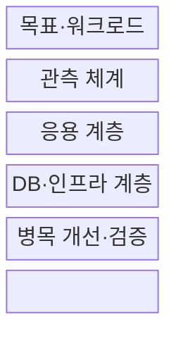
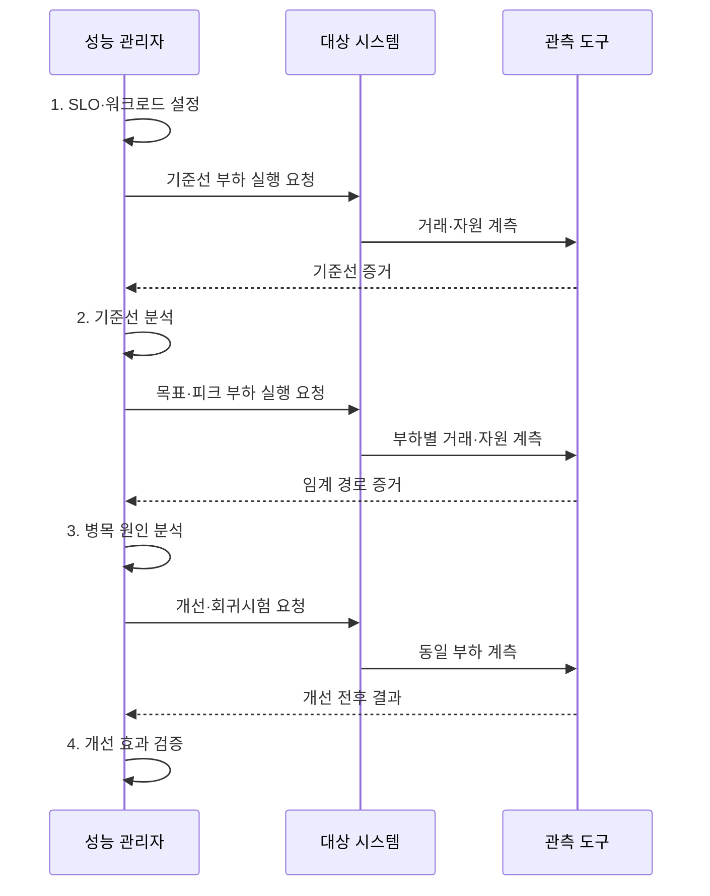

---
sidebar:
  order: 49
  label: "049. 정보시스템 성능 관리 방법론 (IS Performance Management)"
  badge:
    text: "미출 · 30%"
    variant: note
title: "정보시스템 성능 관리 방법론 (IS Performance Management)"
date: "2026-07-31T11:35:11+09:00"
author: "Claude Opus 4.6 (Enhanced by Gemini 3.5)"
tags:
  - "notes-evaluation"
weight: 49
extra:
  question_no: "049"
  source_status: "미출"
  source_history: ""
  priority: 30
  priority_note: "측정·분석·개선 폐루프를 잇는 관리 방법"
---

## 미리 알고가기

- **서비스 수준 지표(Service Level Indicator, SLI)**: 지연시간·오류율처럼 서비스 상태를 실제로 측정한 정량 지표다.
- **서비스 수준 목표(Service Level Objective, SLO)**: 정해진 기간에 SLI가 충족해야 하는 목표 수준이다.
- **기준선(Baseline)**: 개선·변경 전후의 성능 차이를 판단하기 위해 고정한 초기 측정 상태다.
- **워크로드**: 요청 종류·도착 빈도·동시 사용자·데이터 크기를 조합한 시스템 처리 부하다.
- **포화도**: CPU·메모리·디스크·네트워크의 처리 여유가 얼마나 소진됐는지 나타내는 정도다.
- **병목**: 한 구성요소의 처리 한계가 전체 서비스 처리량이나 지연을 제한하는 상태다.
- **애플리케이션 성능 모니터링(Application Performance Monitoring, APM)**: 사용자 거래부터 내부 호출·데이터베이스·자원 사용을 연결해 추적하는 체계다.
- **분위수**: 측정값을 크기순으로 놓았을 때 일정 비율이 그 값 이하에 위치하는 경계값이다.
- **임계 경로**: 종단 요청을 완료하는 데 걸리는 시간을 결정하는 가장 긴 의존 호출 경로다.
- **회귀 검증**: 변경 뒤 성능이 기존보다 나빠지거나 다른 경로에 새 병목이 생기지 않았는지 확인하는 시험이다.
- **계측 오버헤드**: 로그·추적·메트릭 수집이 대상 시스템에 추가하는 CPU·메모리·지연 부담이다.
- **p95 지연시간**: 전체 요청의 95%가 해당 값 이하에서 완료되는 응답시간 경계다.
- **데이터베이스(Database, DB)**: 구조화된 데이터를 저장하고 질의로 조회·변경하는 시스템이다.
- **캐시(Cache)**: 자주 쓰는 데이터를 빠른 저장공간에 임시 보관해 원본 조회를 줄이는 방식이다.
- **잠금(Lock)**: 동시에 같은 데이터를 바꿀 때 충돌하지 않도록 접근 순서를 제한하는 통제다.
- **인덱스(Index)**: 전체 데이터를 읽지 않고 원하는 행의 위치를 빠르게 찾게 하는 검색 구조다.
- **큐(Queue)**: 먼저 들어온 작업부터 처리할 수 있도록 대기 요청을 저장하는 구조다.

## Ⅰ. 개요

- 정의/개념: 핵심 거래의 **SLO·워크로드 기준선**을 정하고 병목 개선 효과를 동일 부하에서 검증하는 폐루프 관리
- 배경/필요성: 개별 자원 사용률만으로는 **사용자 거래 지연 원인·병목 이동 식별 불가**

### 쉽게 이해하기 (학습용)
- 중요한 사용자 거래의 목표를 정하고 느려진 요청이 어느 계층에서 기다리는지 찾아 개선 효과를 같은 부하로 확인함

## Ⅱ. 특징

- 평균에 가려진 실패를 드러내는 **분위수 지연·오류율**
- 응용·DB·자원 포화를 잇는 **종단 거래 ID**
- 효과와 병목 이동을 확인하는 **동일 워크로드 회귀 시험**

### 쉽게 이해하기 (학습용)
- CPU가 높다는 사실만 보지 않고 느린 사용자 요청이 어떤 호출과 대기열을 지나 포화됐는지 연결함

## Ⅲ. 구조 및 구성요소

| 구성요소 | 책임 |
|:---|:---|
| 목표·워크로드 | 거래별 **SLI·SLO**와 요청·동시성·데이터 기준선 |
| 관측 체계 | **APM·거래 ID**로 추적·로그·메트릭 연결 |
| 응용 계층 | **코드·캐시**와 스레드·외부 호출 대기시간 |
| DB·인프라 계층 | **잠금·자원 포화도**와 질의·저장장치 상태 제공 |
| 병목 개선·검증 | 동일 워크로드의 **효과·새 병목** 재시험 |

### 쉽게 이해하기 (학습용)
- 사용자 요청이 응용·DB·인프라를 지나는 동안 같은 거래 ID로 시간을 이어 어느 계층이 전체를 늦추는지 찾음

## Ⅳ. 흐름도

1. **SLO·워크로드 설정**: 핵심 거래의 분위수 지연·오류율 목표와 요청·동시성·데이터 조건 확정
2. **기준선 분석**: 변경 전 지연·오류·포화도와 임계 경로 기록
3. **병목 원인 분석**: 호출·질의·잠금·큐와 자원 포화의 인과 확인
4. **개선 효과 검증**: 동일 부하에서 SLO 개선과 병목 이동 여부 확인

### 쉽게 이해하기 (학습용)
- 바꾸기 전 상태를 저장하고 같은 요청을 다시 흘려 개선 뒤 빨라졌는지와 병목이 옮겨 가지 않았는지 확인함

## Ⅴ. 종류 및 비교

| 성능 관리 계층 | 애플리케이션 | 데이터베이스 | 인프라 |
|:---|:---|:---|:---|
| 적용 기준 | 거래 추적에서 **호출 지연** 발생 | **DB 대기·실행계획**이 지연 지배 | **자원 큐·사용률**이 한계 도달 |
| 핵심 특징 | **코드·스레드**와 외부 호출 지연 | **질의·잠금**과 저장장치 대기 | **CPU·메모리**와 네트워크 포화 |
| 한계 | 캐시의 **데이터 불일치** 가능 | 인덱스의 **쓰기·공간 비용** 증가 | 증설 뒤 **상위 병목 잔존** |

### 쉽게 이해하기 (학습용)
- 거래 추적에서 시간이 멈춘 위치를 보고 코드·DB 대기·자원 포화 중 실제 원인이 있는 계층을 고름

## Ⅵ. 실무 고려사항 및 대책

| 고려사항 | 대책 | 효과 |
|:---|:---|:---|
| 평균에 느린 요청이 가려져 **체감 SLO 미달** | **p95·p99 지연**과 오류율 관리 | 꼬리 지연의 **가시성 확보** |
| CPU 증설 뒤에도 **DB 잠금 병목 잔존** | **거래 ID·잠금 대기**를 종단 추적 | 임계 경로의 **원인 분리** |
| 전후 워크로드 차이로 **효과 과대평가** | **동일 부하 회귀시험**으로 전후 비교 | 개선 효과와 **병목 이동 검증** |

### 쉽게 이해하기 (학습용)
- 주문 API의 느린 5% 요청을 거래 ID로 따라가 같은 주문 레코드의 DB 잠금 대기가 p95 지연을 지배하는지 확인한다.

## Ⅶ. 결론

- 동일 부하에서 **SLO 병목 제거·부작용 없음**을 입증한 개선안만 채택

### 쉽게 이해하기 (학습용)
- 자원 사용률 하나로 판단하지 않고 사용자 거래의 임계 경로를 같은 부하에서 전후 비교해야 함
