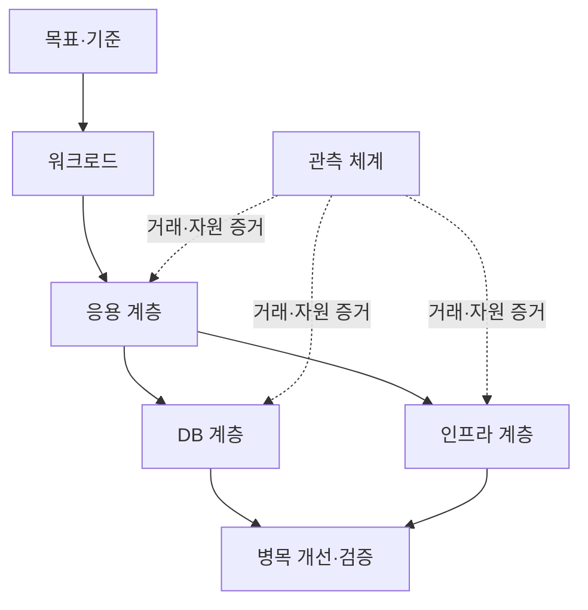
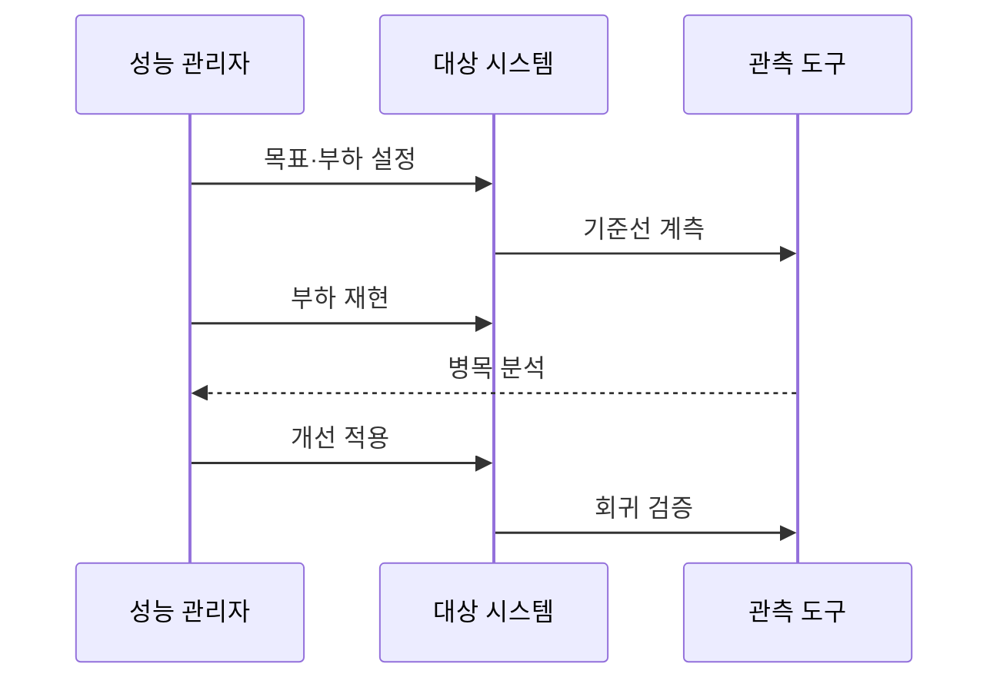

---
sidebar:
  order: 49
  label: "049. 정보시스템 성능 관리 방법론 (IS Performance Management)"
  badge:
    text: "미출제 · 30%"
    variant: note
title: "정보시스템 성능 관리 방법론 (IS Performance Management)"
date: "2026-07-25T01:10:00+09:00"
author: "Claude Opus 4.6 (Enhanced by Gemini 3.5)"
tags:
  - "notes-evaluation"
weight: 49
extra:
  question_no: "049"
  source_status: "미출제"
  source_history: ""
  priority: 30
  priority_note: "측정·분석·개선 폐루프를 잇는 관리 방법"
---

## 미리 알고가기

- **SLI(Service Level Indicator)**: 지연시간·오류율처럼 서비스 상태를 실제로 측정한 정량 지표
- **SLO(Service Level Objective)**: 정해진 기간에 SLI가 충족해야 하는 목표 수준
- **기준선(Baseline)**: 개선·변경 전후의 성능 차이를 판단하기 위해 고정한 초기 측정 상태
- **워크로드**: 요청 종류·도착 빈도·동시 사용자·데이터 크기를 조합한 시스템 처리 부하
- **포화도**: CPU·메모리·디스크·네트워크의 처리 여유가 얼마나 소진됐는지 나타내는 정도
- **병목**: 한 구성요소의 처리 한계가 전체 서비스 처리량이나 지연을 제한하는 상태
- **APM(Application Performance Monitoring)**: 사용자 거래부터 내부 호출·DB·자원 사용을 연결해 추적하는 도구
- **분위수**: 측정값을 크기순으로 놓았을 때 일정 비율이 그 값 이하에 위치하는 경계값
- **임계 경로**: 종단 요청을 완료하는 데 걸리는 시간을 결정하는 가장 긴 의존 호출 경로
- **회귀 검증**: 변경 뒤 성능이 기존보다 나빠지거나 다른 경로에 새 병목이 생기지 않았는지 확인하는 시험
- **계측 오버헤드**: 로그·추적·메트릭 수집이 대상 시스템에 추가하는 CPU·메모리·지연 부담
- **p95 지연시간**: 전체 요청의 95%가 해당 값 이하에서 완료되는 응답시간 경계
- **DB(Database)**: 구조화된 데이터를 저장하고 질의로 조회·변경하는 데이터베이스
- **캐시(Cache)**: 자주 쓰는 데이터를 빠른 저장공간에 임시 보관해 원본 조회를 줄이는 방식
- **잠금(Lock)**: 동시에 같은 데이터를 바꿀 때 충돌하지 않도록 접근 순서를 제한하는 통제
- **인덱스(Index)**: 전체 데이터를 읽지 않고 원하는 행의 위치를 빠르게 찾게 하는 검색 구조
- **큐(Queue)**: 먼저 들어온 작업부터 처리할 수 있도록 대기 요청을 저장하는 구조

## Ⅰ. 개요

- 정의/개념: 성능 목표·병목 개선·회귀 검증의 반복 활동
- **배경/필요성**: 부하 변화에도 사용자 거래의 SLO 유지

### 쉽게 이해하기 (학습용)
- 중요한 사용자 거래의 목표를 정하고 느려진 요청이 어느 계층에서 기다리는지 찾아 개선 효과를 같은 부하로 확인함

## Ⅱ. 특징

- 평균보다 분위수·오류율로 사용자 체감 반영한다.
- 종단 거래 ID로 호출·DB·자원 증거 연결한다.
- 워크로드별 부하·포화·지연 인과 재현한다.
- 개선 전후를 같은 기준선·부하로 검증한다.

### 쉽게 이해하기 (학습용)
- CPU가 높다는 사실만 보지 않고 느린 사용자 요청이 어떤 호출과 대기열을 지나 포화됐는지 연결함

## Ⅲ. 아키텍처 및 구성요소

| 구성요소 | 설명 |
|:---|:---|
| 목표·기준 | 거래별 SLI·SLO·기준선 |
| 워크로드 | 요청·동시성·데이터·지속시간 |
| 응용 계층 | 코드·스레드·캐시·외부 호출 |
| DB 계층 | 질의·잠금·대기·저장장치 |
| 인프라 계층 | CPU·메모리·디스크·네트워크 |
| 관측 체계 | 거래 ID로 추적·로그·메트릭 연결 |
| 병목 개선·검증 | 임계 경로 조정 후 같은 부하 재시험 |

### 쉽게 이해하기 (학습용)
- 사용자 요청이 응용·DB·인프라를 지나는 동안 같은 거래 ID로 시간을 이어 어느 계층이 전체를 늦추는지 찾음

## Ⅳ. 원리 및 절차 흐름도

| 절차 | 설명 |
|:---|:---|
| 목표·부하 설정 | 핵심 거래의 SLO·워크로드 확정 |
| 기준선 계측 | 변경 전 지연·오류·포화도 기록 |
| 부하 재현 | 목표·피크·장애 부하를 반복 |
| 병목 분석 | 임계 경로와 자원 대기의 인과 확인 |
| 개선 적용 | 코드·질의·캐시·용량 조정 |
| 회귀 검증 | 같은 부하로 효과·새 병목 확인 |

### 쉽게 이해하기 (학습용)
- 바꾸기 전 상태를 저장하고 같은 요청을 다시 흘려 개선 뒤 빨라졌는지와 병목이 옮겨 가지 않았는지 확인함

## Ⅴ. 종류 및 비교

| 비교축 | 애플리케이션 | 데이터베이스 | 인프라 |
|:---|:---|:---|:---|
| 핵심 특징 | 코드·스레드·외부 호출 지연 | 질의·잠금·저장장치 대기 | CPU·메모리·네트워크 포화 |
| 적용 기준 | 거래 추적에서 호출이 오래 걸릴 때 | DB 대기·실행계획이 지연을 지배 | 자원 큐·사용률이 한계에 이를 때 |
| 주요 위험 | 캐시로 데이터 불일치 발생 | 인덱스로 쓰기·공간 비용 증가 | 증설해도 상위 병목이 남을 수 있음 |

### 쉽게 이해하기 (학습용)
- 거래 추적에서 시간이 멈춘 위치를 보고 코드·DB 대기·자원 포화 중 실제 원인이 있는 계층을 고름

## Ⅵ. 실무 사례

- 주문 API: p95 지연의 DB 잠금 원인 추적

### 쉽게 이해하기 (학습용)
- 느린 5%의 요청을 따라가 같은 주문 레코드의 잠금 대기가 응답시간을 지배하는지 확인함

## Ⅶ. 결론

- 정보시스템 성능을 지속적으로 개선하기 위해 **사용자 SLO·트랜잭션 임계경로·자원 포화·변경 전후 동일 부하**를 검토하고, 측정 가능한 병목 제거 효과를 기준으로 개선안을 채택해야 한다.

### 쉽게 이해하기 (학습용)
- 자원 사용률 하나로 판단하지 않고 사용자 거래의 임계 경로를 같은 부하에서 전후 비교해야 함
