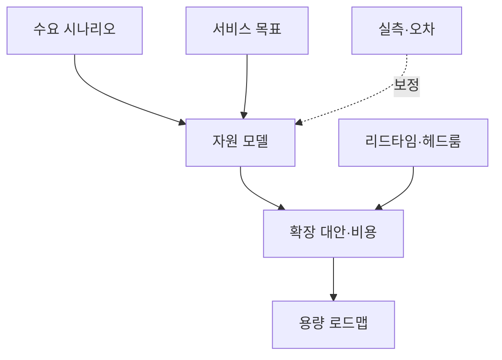
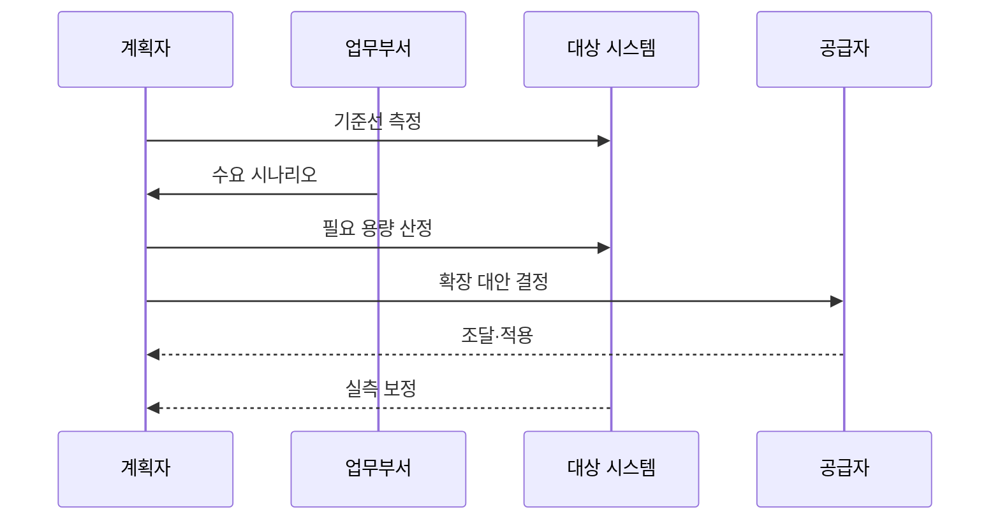

---
sidebar:
  order: 50
  label: "050. 용량 계획 (Capacity Planning)"
  badge:
    text: "미출제 · 50%"
    variant: note
title: "용량 계획 (Capacity Planning)"
date: "2026-07-25T01:10:00+09:00"
author: "Claude Opus 4.6 (Enhanced by Gemini 3.5)"
tags:
  - "notes-evaluation"
weight: 50
extra:
  question_no: "050"
  source_status: "미출제"
  source_history: ""
  priority: 50
  priority_note: "성장률·피크로 자원 증설 시점을 정하는 핵심축"
---

## 미리 알고가기

- **수요 예측**: 성장률·사업 일정·계절성·이벤트를 반영해 미래 워크로드를 추정하는 활동
- **기준선(Baseline)**: 현재 워크로드에서 측정한 처리량·지연·자원 사용 상태
- **피크 부하**: 일정 기간에 발생하는 최대 요청량과 그 부하가 유지되는 시간
- **헤드룸(Headroom)**: 수요 급증·장애·예측 오차를 흡수하도록 남겨 둔 처리 여유
- **병목 자원**: CPU·메모리·DB 연결·네트워크 중 전체 처리량과 지연을 먼저 제한하는 자원
- **스케일업(Scale-up)**: 한 서버의 CPU·메모리 등 자원 크기를 늘리는 수직 확장 방식
- **스케일아웃(Scale-out)**: 서버 인스턴스 수를 늘려 부하를 나누는 수평 확장 방식
- **오토스케일링(Auto Scaling)**: 측정 지표와 정책에 따라 인스턴스 수나 자원 크기를 자동 조정하는 기능
- **조달 리드타임**: 자원을 주문한 시점부터 설치·시험·전환해 사용할 때까지 걸리는 시간
- **민감도 분석**: 성장률·부하·비용 가정을 바꿨을 때 필요한 용량과 시점이 얼마나 달라지는지 분석하는 기법
- **SLO(Service Level Objective)**: 정해진 기간에 서비스 지연·오류·가용성이 충족해야 하는 목표 수준
- **온프레미스(On-premises)**: 조직이 소유하거나 직접 통제하는 시설에 시스템을 구축·운영하는 방식

## Ⅰ. 개요

- 정의/개념: 미래 수요를 만족할 자원량·확장 시점을 결정
- **배경/필요성**: 용량 부족 장애와 과잉 투자 동시 방지

### 쉽게 이해하기 (학습용)
- 사용량이 자원 한계에 닿기 전에 조달 시간을 거꾸로 계산해 필요한 만큼 확장하는 계획임

## Ⅱ. 특징

- 업무 계획을 요청·동시성·데이터량으로 변환한다.
- 워크로드 증가와 병목 자원 관계를 모델링한다.
- 피크·장애·예측 오차를 헤드룸에 반영한다.
- 조달 리드타임 전 증설 의사결정한다.

### 쉽게 이해하기 (학습용)
- 평균 성장만 늘려 보지 않고 행사 피크와 서버 한 대 장애가 겹쳐도 목표를 지킬 여유를 계산함

## Ⅲ. 아키텍처 및 구성요소

| 구성요소 | 설명 |
|:---|:---|
| 수요 시나리오 | 성장·계절·이벤트별 워크로드 |
| 서비스 목표 | 처리량·지연·오류 허용 기준 |
| 자원 모델 | 워크로드와 병목 자원 사용 관계 |
| 확장 대안·비용 | 스케일업·아웃·클라우드 비용 비교 |
| 리드타임·헤드룸 | 장애 여유와 조달 소요기간 |
| 용량 로드맵 | 증설·회수 규모와 실행 시점 |
| 실측·오차 | 실제 수요로 모델·계획 보정 |

### 쉽게 이해하기 (학습용)
- 미래 요청과 서비스 목표를 자원량으로 바꾸고 장애 여유·비용·조달 시간을 더해 실행 날짜를 정함

## Ⅳ. 원리 및 절차 흐름도

| 절차 | 설명 |
|:---|:---|
| 기준선 측정 | 현재 부하·성능·자원 한계 기록 |
| 수요 시나리오 | 성장·피크·장애 워크로드 정의 |
| 필요 용량 산정 | SLO·헤드룸을 만족할 자원 계산 |
| 확장 대안 결정 | 비용·리드타임으로 방식·시점 선택 |
| 조달·적용 | 용량 확보 후 부하 시험 |
| 실측 보정 | 예측 오차로 모델·로드맵 갱신 |

### 쉽게 이해하기 (학습용)
- 현재 한계와 미래 피크를 비교해 부족해지는 날을 찾고 그날보다 조달 기간만큼 먼저 확장함

## Ⅴ. 종류 및 비교

| 비교축 | 추세 분석 | 워크로드 모델 | 부하 검증 |
|:---|:---|:---|:---|
| 핵심 특징 | 과거 사용량의 성장 추세 연장 | 업무량과 자원 소비 관계 모델링 | 목표 워크로드를 실제로 주입 |
| 적용 기준 | 안정적 성장·계절 패턴 | 신규 기능·업무량 변화 분석 | 배포 전 병목·한계 검증 |
| 주요 위험 | 이벤트·구조 변화 예측 실패 | 잘못된 인과 가정으로 오차 | 시험 환경이 운영과 다를 수 있음 |

### 쉽게 이해하기 (학습용)
- 과거가 이어지면 추세, 업무 구조가 바뀌면 모델, 실제 한계를 확인하려면 부하 검증을 사용함

## Ⅵ. 실무 사례

- 온라인 행사: 피크 지속시간으로 최대 인스턴스 결정

### 쉽게 이해하기 (학습용)
- 행사 최대 동시 요청과 유지시간을 부하 시험해 오토스케일링 상한과 예산 한도를 정함

## Ⅶ. 결론

- 수요·헤드룸·리드타임으로 확장 시점 결정

### 쉽게 이해하기 (학습용)
- 평균 사용률이 아니라 피크·장애 여유와 조달 시간을 반영해 부족해지기 전에 필요한 만큼 확장함
