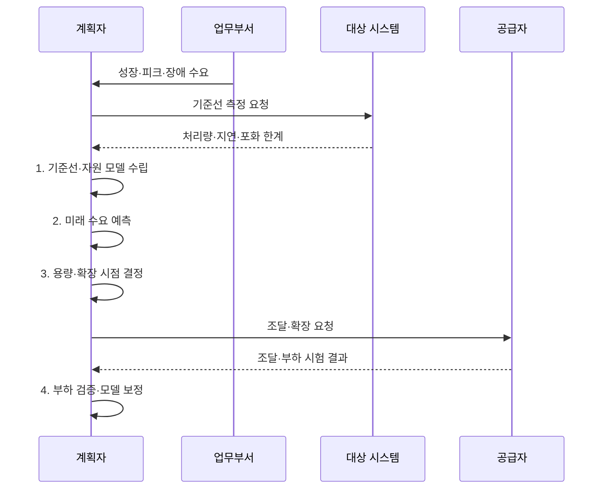

---
sidebar:
  order: 50
  label: "050. 용량 계획 (Capacity Planning)"
  badge:
    text: "미출 · 50%"
    variant: note
title: "용량 계획 (Capacity Planning)"
date: "2026-07-31T11:35:48+09:00"
author: "Claude Opus 4.6 (Enhanced by Gemini 3.5)"
tags:
  - "notes-evaluation"
weight: 50
extra:
  question_no: "050"
  source_status: "미출"
  source_history: ""
  priority: 50
  priority_note: "성장률·피크로 자원 증설 시점을 정하는 핵심축"
---

## 미리 알고가기

- **수요 예측**: 성장률·사업 일정·계절성·이벤트를 반영해 미래 워크로드를 추정하는 활동이다.
- **기준선(Baseline)**: 현재 워크로드에서 측정한 처리량·지연·자원 사용 상태다.
- **피크 부하**: 일정 기간에 발생하는 최대 요청량과 그 부하가 유지되는 시간이다.
- **헤드룸(Headroom)**: 수요 급증·장애·예측 오차를 흡수하도록 남겨 둔 처리 여유다.
- **병목 자원**: CPU·메모리·DB 연결·네트워크 중 전체 처리량과 지연을 먼저 제한하는 자원이다.
- **스케일업(Scale-up)**: 한 서버의 CPU·메모리 등 자원 크기를 늘리는 수직 확장 방식이다.
- **스케일아웃(Scale-out)**: 서버 인스턴스 수를 늘려 부하를 나누는 수평 확장 방식이다.
- **오토스케일링(Auto Scaling)**: 측정 지표와 정책에 따라 인스턴스 수나 자원 크기를 자동 조정하는 기능이다.
- **조달 리드타임**: 자원을 주문한 시점부터 설치·시험·전환해 사용할 때까지 걸리는 시간이다.
- **민감도 분석**: 성장률·부하·비용 가정을 바꿨을 때 필요한 용량과 시점이 얼마나 달라지는지 분석하는 기법이다.
- **서비스 수준 목표(Service Level Objective, SLO)**: 정해진 기간에 서비스 지연·오류·가용성이 충족해야 하는 목표 수준이다.

## Ⅰ. 개요

- 정의/개념: 현재 성능 기준선과 미래 **수요 시나리오**를 자원 모델에 적용해 SLO·헤드룸을 만족할 용량 규모와 조달·확장 시점을 결정하는 계획
- 배경/필요성: 평균 사용량만으로는 **피크·장애 용량 부족과 과잉 투자 판정 불가**

### 쉽게 이해하기 (학습용)
- 사용량이 자원 한계에 닿기 전에 조달 시간을 거꾸로 계산해 필요한 만큼 확장하는 계획임

## Ⅱ. 특징

- 업무 계획을 자원 수요로 바꾸는 **요청·동시성·데이터 워크로드**
- SLO 필요 용량을 구하는 **워크로드·병목 자원 관계**
- 확장 규모·시점을 정하는 **헤드룸·조달 리드타임**
- 성장률과 피크 가정별 용량 차이를 보는 **수요 예측·민감도 분석**

### 쉽게 이해하기 (학습용)
- 평균 성장만 늘려 보지 않고 행사 피크와 서버 한 대 장애가 겹쳐도 목표를 지킬 여유를 계산함

## Ⅲ. 구조 및 구성요소

| 구성요소 | 책임 |
|:---|:---|
| 수요·SLO | **피크 부하·SLO**와 성장·계절·장애 조건 제공 |
| 자원 모델 | **워크로드·병목 자원**의 처리량 관계 |
| 리드타임·헤드룸 | **예측 오차·조달 기간**과 장애·급증 반영 |
| 확장 대안·비용 | **스케일업·스케일아웃**과 오토스케일링 비교 |
| 용량 로드맵·실측 | **확장 규모·실행 시점**과 모델 보정 |

### 쉽게 이해하기 (학습용)
- 미래 요청과 서비스 목표를 자원량으로 바꾸고 장애 여유·비용·조달 시간을 더해 실행 날짜를 정함

## Ⅳ. 흐름도

1. **기준선·자원 모델 수립**: 워크로드별 성능과 병목 자원 관계 측정
2. **미래 수요 예측**: 사업 일정·계절·이벤트를 미래 부하로 변환
3. **용량·확장 시점 결정**: SLO·헤드룸·리드타임을 반영한 조달 요구 확정
4. **부하 검증·모델 보정**: 확장 후 피크·장애 부하를 시험해 실측 오차 반영

### 쉽게 이해하기 (학습용)
- 현재 한계와 미래 피크를 비교해 부족해지는 날을 찾고 그날보다 조달 기간만큼 먼저 확장함

## Ⅴ. 종류 및 비교

| 용량 산정 방법 | 추세 분석 | 워크로드 모델 | 부하 검증 |
|:---|:---|:---|:---|
| 적용 기준 | **안정적 성장·계절 패턴** | **신규 기능·업무량 변화** 분석 | 배포 전 **병목·한계 검증** |
| 핵심 특징 | 과거 **사용량 추세 연장** | **업무량·자원 소비 관계** 모델링 | **목표 워크로드 실제 주입** |
| 한계 | **이벤트·구조 변화** 예측 실패 | 잘못된 인과로 **산정 오차** | **시험·운영 환경 차이** |

### 쉽게 이해하기 (학습용)
- 과거가 이어지면 추세, 업무 구조가 바뀌면 모델, 실제 한계를 확인하려면 부하 검증을 사용함

## Ⅵ. 실무 고려사항 및 대책

| 고려사항 | 대책 | 효과 |
|:---|:---|:---|
| 평균 성장률로 **순간 피크·지속시간 누락** | **최대 동시 요청·지속시간 부하 시험** | 피크 중 **SLO 유지 용량 확보** |
| 장애와 급증이 겹쳐 **헤드룸 부족** | **N-1 장애·예측 오차별 최소 여유율** 설정 | 장애 중 **처리 여유 유지** |
| 포화 뒤 조달해 **증설 전 용량 고갈** | **포화일에서 설치·시험·전환 기간 역산** | 용량 부족 전 **확장 완료** |

### 쉽게 이해하기 (학습용)
- 온라인 행사의 최대 동시 요청과 지속시간을 부하 시험해 SLO를 만족하는 오토스케일링 상한과 예산 한도를 정한다.

## Ⅶ. 결론

- 피크·장애에도 **SLO·헤드룸을 충족하는 용량**을 리드타임 전에 확장

### 쉽게 이해하기 (학습용)
- 평균 사용률이 아니라 피크·장애 여유와 조달 시간을 반영해 부족해지기 전에 필요한 만큼 확장함
