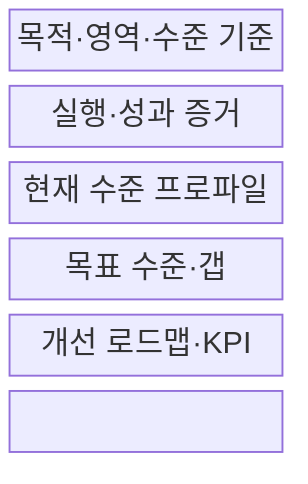
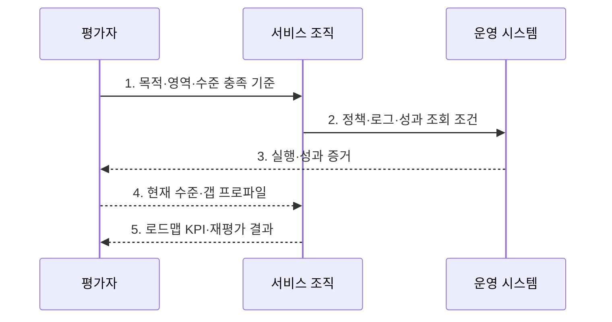

---
sidebar:
  order: 51
  label: "051. 디지털 서비스 성숙도 모형 평가 (Digital Service Maturity Evaluation)"
  badge:
    text: "기출 · 30%"
    variant: note
title: "디지털 서비스 성숙도 모형 평가 (Digital Service Maturity Evaluation)"
date: "2026-07-31T05:08:52+09:00"
author: "Claude Opus 4.6 (Enhanced by Gemini 3.5)"
tags:
  - "notes-evaluation"
weight: 51
extra:
  question_no: "051"
  source_status: "기출"
  source_history: "138회"
  priority: 30
  priority_note: "최근 기출, 디지털 서비스 성숙도 평가 주제"
---

## 미리 알고가기

- **성숙도 모형(Maturity Model)**: 조직 역량이 우연한 수행에서 표준화·측정·지속 개선으로 발전하는 수준을 단계화한 진단 틀이다.
- **평가 영역**: 전략·고객·프로세스·데이터·기술·조직처럼 역량을 나누어 진단하는 관점이다.
- **역량 수준**: 각 평가 영역의 활동이 정의·반복·측정·개선되는 정도를 나타내는 단계다.
- **현재 수준**: 정책·실행·지표·시스템 증거로 확인한 조직의 실제 역량 상태다.
- **목표 수준**: 사업 가치·위험·비용을 고려해 일정 시점까지 도달하기로 정한 역량 상태다.
- **증거 기반 평가**: 설문 응답을 정책·로그·지표·실제 시스템과 대조해 수준을 판정하는 방식이다.
- **갭 분석(Gap Analysis)**: 현재 수준과 목표 수준의 차이와 그 차이를 만드는 원인을 분석하는 기법이다.
- **개선 로드맵**: 선행관계에 따라 개선 과제·책임자·일정·예산·성과지표를 배열한 실행 계획이다.
- **핵심 성과 지표(Key Performance Indicator, KPI)**: 조직이나 서비스의 목표 달성 정도를 지속적으로 측정하는 핵심 지표다.
- **역량 프로파일**: 평가 영역별 성숙도 수준을 한눈에 비교하도록 나타낸 결과다.
- **내재화**: 특정 담당자나 외부 업체에 의존하지 않고 조직의 표준 역할과 절차로 역량을 반복 수행하는 상태다.
- **ISO/IEC 33020:2019**: 프로세스 역량 수준·속성 평가의 측정 틀이며 2026년 재확인된 표준이다.

## Ⅰ. 개요

- 정의/개념: 전략·고객·프로세스·데이터·기술·조직의 **실행·성과 증거**로 현재 역량 수준을 판정하고 목표와의 갭을 개선 로드맵으로 전환하는 평가
- 배경/필요성: 기술 보유·자가 설문만으로는 **반복 운영·성과·개선 역량 입증 불가**

### 쉽게 이해하기 (학습용)
- 새 기술을 샀는지가 아니라 조직이 디지털 서비스를 같은 품질로 반복 운영하고 개선할 수 있는지를 봄

## Ⅱ. 특징

- 평균에 가려진 취약점을 드러내는 **영역별 수준 프로파일**
- 선언과 실제 역량을 가르는 **반복 실행·성과 증거**
- 개선 순서를 정하는 **사업 목표·갭 원인·선행관계**

### 쉽게 이해하기 (학습용)
- 자가평가 점수보다 실제 로그와 성과를 보고 업무에 필요한 영역만 현실적인 목표 단계로 올림

## Ⅲ. 구조 및 구성요소

| 구성요소 | 책임 |
|:---|:---|
| 목적·영역·수준 기준 | **사업 목표·진단 범위·단계 충족 조건** 제공 |
| 실행·성과 증거 | **정책·로그·지표·시스템·인터뷰** 대조 |
| 현재 수준 프로파일 | 영역별 **충족 수준·미충족 근거** 판정 |
| 목표 수준·갭 | **가치·위험·비용·수준 차이·원인** 결정 |
| 개선 로드맵·KPI | **과제·선행관계·책임·일정·성과** 연결 |

### 쉽게 이해하기 (학습용)
- 영역마다 실제 증거로 현재 위치를 찍고 필요한 위치까지 가는 과제를 순서와 책임으로 연결함

## Ⅳ. 흐름도

1. **목적·영역·수준 충족 기준**: 사업 목표·평가 범위·단계별 증거
2. **정책·로그·성과 조회 조건**: 반복 실행·서비스 결과의 기간·범위
3. **실행·성과 증거**: 운영 시스템의 로그·KPI와 조직의 정책·역할·인터뷰를 동일 기간으로 연결
4. **현재 수준·갭 프로파일**: 영역별 현재 수준을 독립 판정하고 필요한 목표와 차이·원인·선행조건 도출
5. **로드맵 KPI·재평가 결과**: 개선 과제의 책임·일정·성과를 측정하고 새 증거로 수준을 재판정

### 쉽게 이해하기 (학습용)
- 실제 증거로 현재 단계를 정하고 사업에 필요한 목표와의 차이를 과제로 바꾼 뒤 성과로 다시 확인함

## Ⅴ. 종류 및 비교

| 성숙 단계 | 초기 단계 | 관리 단계 | 최적화 단계 |
|:---|:---|:---|:---|
| 적용 기준 | 공통 **역할·절차**부터 정립 | **실행 편차·책임** 통제 | **성과 예측·자동 개선** 필요 |
| 핵심 특징 | 개인 경험에 따른 **결과 변동** | 표준 절차로 **반복 수행** | 측정 결과로 **지속 개선** |
| 한계 | 이탈 시 **역량 상실** | **절차 준수의 목적화** | 측정 최적화로 **고객 가치 왜곡** |

### 쉽게 이해하기 (학습용)
- 사람마다 다르면 초기, 같은 절차로 반복하면 관리, 결과를 재서 절차까지 바꾸면 최적화 단계임

## Ⅵ. 실무 고려사항 및 대책

| 고려사항 | 대책 | 효과 |
|:---|:---|:---|
| 설문·정책만으로 높게 판정하는 **증거 편향** | **로그·KPI·시스템·인터뷰 교차 검증** | 실행 기반 **현재 수준 판정** |
| 낮은 영역이 평균에 가려지는 **취약점 은폐** | **영역별 프로파일·미충족 근거 공개** | 개선할 **병목 역량 식별** |
| 최고 단계 일괄 추진으로 **사업 가치와 단절** | **가치·위험별 목표·선행 과제 로드맵** | 투자 대비 **우선순위·실행력 확보** |
| 수준 해석이 조직마다 달라 비교 가능성이 낮아짐 | **ISO/IEC 33020:2019 측정 틀 정렬** | 역량 판정의 **일관성 확보** |

### 쉽게 이해하기 (학습용)
- 공공 서비스는 평균 점수로 취약 영역을 가리지 않고 고객 채널은 유지하면서 낮은 데이터 품질·책임 역량을 먼저 개선한다.

## Ⅶ. 결론

- 사업 가치에 필요한 **영역별 목표만 선택**, 갭은 책임·KPI 로드맵으로 개선

### 쉽게 이해하기 (학습용)
- 최고 등급을 목표로 삼지 말고 사업 가치에 필요한 영역의 갭을 책임·일정·KPI로 닫아야 함
