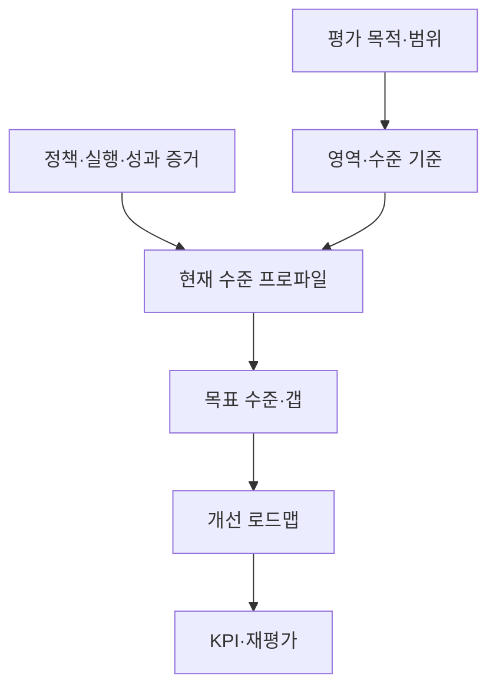
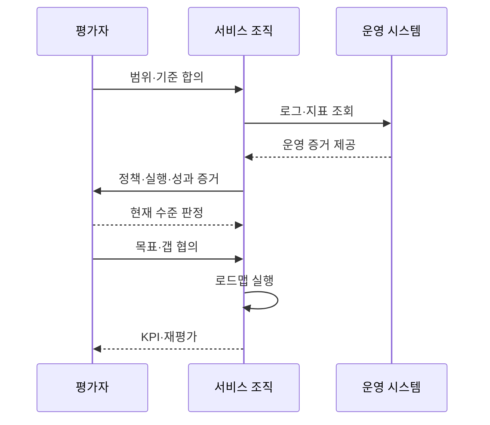

---
sidebar:
  order: 51
  label: "051. 디지털 서비스 성숙도 모형 평가 (Digital Service Maturity Evaluation)"
  badge:
    text: "기출 · 30%"
    variant: note
title: "디지털 서비스 성숙도 모형 평가 (Digital Service Maturity Evaluation)"
date: "2026-07-27T23:59:59+09:00"
author: "Claude Opus 4.6 (Enhanced by Gemini 3.5)"
tags:
  - "notes-evaluation"
weight: 51
extra:
  question_no: "051"
  source_status: "기출"
  source_history: "138회"
  priority: 30
  priority_note: "최근 기출, 디지털 서비스 성숙도 평가 주제"
---

## 미리 알고가기

- **성숙도 모형(Maturity Model)**: 조직 역량이 우연한 수행에서 표준화·측정·지속 개선으로 발전하는 수준을 단계화한 진단 틀
- **평가 영역**: 전략·고객·프로세스·데이터·기술·조직처럼 역량을 나누어 진단하는 관점
- **역량 수준**: 각 평가 영역의 활동이 정의·반복·측정·개선되는 정도를 나타내는 단계
- **현재 수준**: 정책·실행·지표·시스템 증거로 확인한 조직의 실제 역량 상태
- **목표 수준**: 사업 가치·위험·비용을 고려해 일정 시점까지 도달하기로 정한 역량 상태
- **증거 기반 평가**: 설문 응답을 정책·로그·지표·실제 시스템과 대조해 수준을 판정하는 방식
- **갭 분석(Gap Analysis)**: 현재 수준과 목표 수준의 차이와 그 차이를 만드는 원인을 분석하는 기법
- **개선 로드맵**: 선행관계에 따라 개선 과제·책임자·일정·예산·성과지표를 배열한 실행 계획
- **핵심 성과 지표(Key Performance Indicator, KPI)**: 영문 머리글자를 딴 표기로 “케이피아이”로 읽으며, 목표 달성 정도를 지속 측정하는 지표
- **역량 프로파일**: 평가 영역별 성숙도 점수를 한눈에 비교하도록 나타낸 결과
- **내재화**: 특정 담당자나 외부 업체 없이도 조직의 표준 역할과 절차로 역량을 반복 수행하는 상태

## Ⅰ. 개요

- 정의/개념: 디지털 서비스 역량을 영역별 증거로 진단해 단계화하는 평가
- **배경/필요성**: 기술 보유·자가 설문만으로 반복 실행과 지속 개선 역량 판정 곤란

### 쉽게 이해하기 (학습용)
- 새 기술을 샀는지가 아니라 조직이 디지털 서비스를 같은 품질로 반복 운영하고 개선할 수 있는지를 봄

## Ⅱ. 특징

- 영역별 수준을 나눠 평균 점수의 왜곡 방지한다.
- 정책 존재보다 반복 실행·측정 증거를 중시한다.
- 필요 목표와 갭 원인·선행관계로 개선 순서를 결정한다.

### 쉽게 이해하기 (학습용)
- 자가평가 점수보다 실제 로그와 성과를 보고 업무에 필요한 영역만 현실적인 목표 단계로 올림

## Ⅲ. 아키텍처 및 구성요소

| 설계 요소 | 설명 |
|:---|:---|
| 평가 목적·범위 | 사업 목표와 진단 서비스·조직 |
| 영역·수준 기준 | 영역별 단계와 충족 조건 |
| 정책·실행·성과 증거 | 문서·로그·지표·인터뷰 대조 |
| 현재 수준 프로파일 | 영역별 실제 성숙도 판정 |
| 목표 수준·갭 | 필요 수준과 원인·우선순위 |
| 개선 로드맵 | 과제·책임·일정·선행관계 |
| KPI·재평가 | 성과 측정과 수준 재판정 |

### 쉽게 이해하기 (학습용)
- 영역마다 실제 증거로 현재 위치를 찍고 필요한 위치까지 가는 과제를 순서와 책임으로 연결함

## Ⅳ. 원리 및 절차 흐름도

| 절차 | 설명 |
|:---|:---|
| 범위·기준 합의 | 목적·영역·수준 충족 조건 확정 |
| 증거 수집 | 조직이 정책·로그·성과지표 제출 |
| 현재 수준 판정 | 평가자가 영역별 증거와 기준 대조 |
| 목표·갭 합의 | 필요 수준·원인·우선순위 결정 |
| 로드맵 실행 | 과제·책임·일정에 따라 개선 |
| KPI·재평가 | 성과와 새 증거로 수준 갱신 |

### 쉽게 이해하기 (학습용)
- 실제 증거로 현재 단계를 정하고 사업에 필요한 목표와의 차이를 과제로 바꾼 뒤 성과로 다시 확인함

## Ⅴ. 디지털 서비스 성숙 단계 비교

| 구분 | 초기 단계 | 관리 단계 | 최적화 단계 |
|:---|:---|:---|:---|
| 적용 기준 | 공통 역할·절차부터 정립 | 실행 편차와 책임을 통제 | 성과 예측·자동 개선이 필요 |
| 핵심 특징 | 개인 경험에 따라 결과 변동 | 표준 절차로 반복 수행 | 측정 결과로 절차를 지속 개선 |
| 한계 | 담당자 이탈 시 역량 상실 | 절차 준수가 목적이 될 수 있음 | 측정 최적화로 고객 가치 왜곡 |

### 쉽게 이해하기 (학습용)
- 사람마다 다르면 초기, 같은 절차로 반복하면 관리, 결과를 재서 절차까지 바꾸면 최적화 단계임

## Ⅵ. 실무 사례

- 공공 서비스: 고객 영역은 높고 데이터 영역은 낮음
- 운영 조직: 외주 의존 업무의 내재화 로드맵 수립

### 쉽게 이해하기 (학습용)
- 평균 점수로 가리지 않고 고객 채널은 유지하면서 낮은 데이터 품질·책임 영역을 먼저 개선함
- 외부 업체만 수행하는 배포·복구 업무를 표준 문서·교육·실습으로 조직이 반복 수행하게 만듦

## Ⅶ. 결론

- 영역별 증거·목표 갭으로 개선 순서 결정

### 쉽게 이해하기 (학습용)
- 최고 등급을 목표로 삼지 말고 사업 가치에 필요한 영역의 갭을 책임·일정·KPI로 닫아야 함
