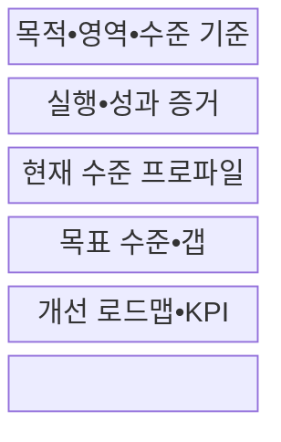
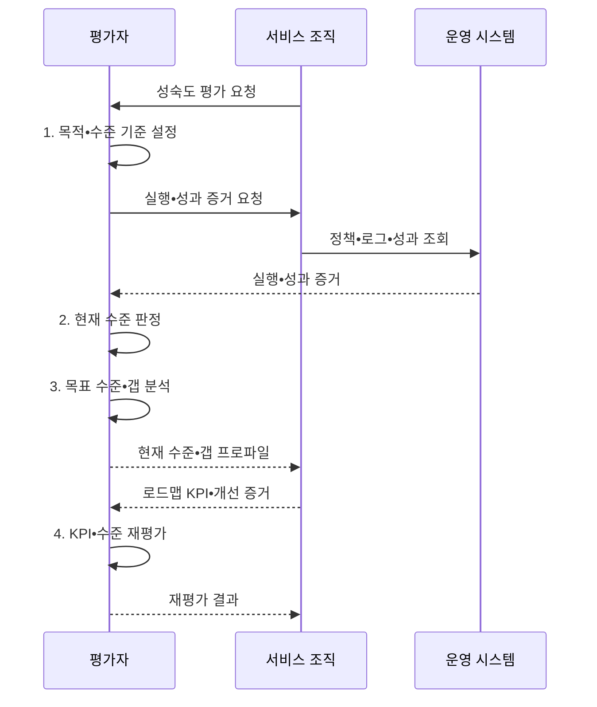

---
sidebar:
  order: 51
  label: "051. 디지털 서비스 성숙도 모형 평가 (Digital Service Maturity Evaluation)"
  badge:
    text: "기출 • 30%"
    variant: note
title: "디지털 서비스 성숙도 모형 평가 (Digital Service Maturity Evaluation)"
date: "2026-08-03T08:48:47+09:00"
author: "Claude Opus 4.6 (Enhanced by Gemini 3.5)"
tags:
  - "notes-evaluation"
weight: 51
extra:
  question_no: "051"
  source_status: "기출"
  source_history: "138회"
  priority: 30
  priority_note: "최근 기출, 디지털 서비스 성숙도 평가 주제"
---

## Ⅰ. 개요

핵심 용어

- **성숙도 모형**: 조직 역량이 우연한 수행에서 표준화•측정•지속 개선으로 발전하는 수준을 단계화한 진단 틀이다.
- **디지털 서비스 성숙도 평가**: 영역별 실행•성과 증거로 현재 역량을 판정하고 목표와의 차이를 개선 계획으로 전환하는 평가이다.
- **조직 역량 진단**: 반복 운영•측정•개선 능력을 영역별 실행 증거와 성과로 판정하는 체계이다.

- 정의/개념: **디지털 서비스 성숙도 평가** — 전략•고객•프로세스•데이터•기술•조직 등 영역별 실행•성과 증거로 현재 역량 수준을 판정하고 목표와의 격차를 개선 로드맵으로 전환하는 **조직 역량 진단 체계**
- 배경/필요성: 기술 보유 여부나 자가 설문만으로는 서비스의 **반복 운영•성과•개선 역량 입증 곤란**

#### 한줄 요약
- 새 기술을 샀는지가 아니라 조직이 디지털 서비스를 같은 품질로 반복 운영하고 개선할 수 있는지를 봄

## Ⅱ. 특징

핵심 용어

- **평가 영역**: 전략•고객•프로세스•데이터•기술•조직처럼 역량을 나누어 진단하는 관점이다.
- **역량 수준**: 각 영역의 활동이 정의•반복•측정•개선되는 정도를 나타내는 단계이다.
- **내재화**: 특정 담당자나 외부 업체에 의존하지 않고 조직의 표준 역할과 절차로 역량을 반복 수행하는 상태이다.
- **갭•선행관계**: 현재와 목표 수준의 차이와 이를 해소하기 위해 먼저 갖춰야 할 역할•절차•기술의 의존 관계이다.

- 평균에 가려진 취약점을 드러내는 **영역별 수준 프로파일**
- 선언과 실제 역량을 가르는 **증거 기반 평가**
- 개선 순서를 정하는 **갭 분석•선행관계**
- 담당자 의존을 줄이고 반복 수행하는 **역량 내재화**

#### 한줄 요약
- 자가평가 점수보다 실제 로그와 성과를 보고 업무에 필요한 영역만 현실적인 목표 단계로 올림

## Ⅲ. 구조 및 구성요소

핵심 용어

- **증거 기반 평가**: 설문 응답을 정책•로그•지표•실제 시스템과 대조하여 수준을 판정하는 방식이다.
- **역량 프로파일**: 평가 영역별 현재 성숙도 수준과 미충족 근거를 한눈에 비교하도록 나타낸 결과이다.
- **핵심 성과 지표(Key Performance Indicator, KPI)**: 조직이나 서비스의 목표 달성 정도를 지속적으로 측정하는 핵심 지표이다.
- **개선 로드맵**: 역량 갭을 선행관계에 따라 과제•책임자•일정•예산•성과지표로 배열한 실행 계획이다.

| 구성요소 | 책임 |
|:---|:---|
| 목적•영역•수준 기준 | **사업 목표•충족 조건** 과 진단 범위 제공 |
| 실행•성과 증거 | **로그•KPI** 와 정책•시스템•인터뷰 대조 |
| 현재 수준 프로파일 | 영역별 **충족 수준•미충족 근거** 판정 |
| 목표 수준•갭 | **수준 차이•원인** 을 가치•위험•비용으로 결정 |
| 개선 로드맵•KPI | **선행 과제•성과지표** 를 책임•일정과 연결 |

#### 한줄 요약
- 영역마다 실제 증거로 현재 위치를 찍고 필요한 위치까지 가는 과제를 순서와 책임으로 연결함

## Ⅳ. 흐름도

핵심 용어

- **현재 수준**: 정책•실행•지표•시스템 증거로 확인한 조직의 실제 역량 상태이다.
- **목표 수준**: 사업 가치•위험•비용을 고려하여 일정 시점까지 도달하기로 정한 역량 상태이다.
- **재평가**: 개선 과제 수행 뒤 새 실행•성과 증거로 역량 수준과 잔여 갭을 다시 판정하는 활동이다.
- **성과 검증**: 개선 과제의 완료 여부뿐 아니라 핵심 성과 지표 변화로 실제 역량 향상을 확인하는 절차이다.

1. **목적•수준 기준 설정**: 사업 목표•평가 범위•단계별 충족 증거 확정
2. **현재 수준 판정**: 동일 기간의 로그•KPI와 정책•인터뷰 대조
3. **목표 수준•갭 분석**: 영역별 목표와 차이•원인•선행조건 도출
4. **KPI•수준 재평가**: 개선 성과와 새 증거로 역량 수준 재판정

#### 한줄 요약
- 실제 증거로 현재 단계를 정하고 사업에 필요한 목표와의 차이를 과제로 바꾼 뒤 성과로 다시 확인함

## Ⅴ. 종류 및 비교

핵심 용어

- **초기 단계**: 활동이 개인 경험에 의존하여 수행 결과와 품질의 변동이 큰 수준이다.
- **관리 단계**: 공통 역할•절차•책임에 따라 활동을 반복 수행하고 편차를 통제하는 수준이다.
- **최적화 단계**: 측정한 성과와 원인 분석을 바탕으로 절차•기술•조직 역량을 지속 개선하는 수준이다.

| 성숙 단계 | 판정 증거 | 다음 전환 조건 |
|:---|:---|:---|
| 초기 단계 | 개인 경험 의존과 **결과 품질 변동** | 공통 역할•절차•책임 정립 |
| 관리 단계 | 표준 절차의 **반복 실행•편차 통제** | 성과지표•원인 분석 체계 확보 |
| 최적화 단계 | 측정 결과 기반 **지속 개선•예측** | 고객 가치와 목표 수준의 주기적 재검증 |

#### 한줄 요약
- 사람마다 다르면 초기, 같은 절차로 반복하면 관리, 결과를 재서 절차까지 바꾸면 최적화 단계임

## Ⅵ. 실무 고려사항 및 대책

핵심 용어

- **갭 분석**: 현재 수준과 목표 수준의 차이 및 그 차이를 만드는 원인을 분석하는 기법이다.
- **개선 로드맵**: 선행관계에 따라 개선 과제•책임자•일정•예산•성과지표를 배열한 실행 계획이다.
- **증거 편향**: 설문•정책 문서 중심의 자료만 선택하여 실제 수행 능력보다 수준을 높게 판정하는 문제이다.
- **병목 역량**: 영역별 프로파일에서 목표 달성을 제한해 우선 개선해야 하는 낮은 실행 역량이다.

| 문제 | 대책 | 효과 |
|:---|:---|:---|
| 설문•정책만으로 높게 판정하는 **증거 편향** | **로그•KPI•시스템•인터뷰 교차 검증** | 실행 기반 **현재 수준 판정** |
| 낮은 영역이 평균에 가려지는 **취약점 은폐** | **영역별 프로파일•미충족 근거 공개** | 개선할 **병목 역량 식별** |
| 최고 단계 일괄 추진으로 **사업 가치와 단절** | **가치•위험별 목표•선행 과제 로드맵** | 투자 대비 **우선순위•실행력 확보** |
| 수준 해석이 조직마다 달라 비교 가능성이 낮아짐 | **ISO/IEC 33020:2019 측정 틀 정렬** | 역량 판정의 **일관성 확보** |

#### 한줄 요약
- 평균 점수에 가려진 데이터 품질•책임 역량의 우선 개선

## Ⅶ. 결론

핵심 용어

- **가치 기반 목표 수준**: 모든 영역의 최고 단계를 일괄 추구하지 않고 사업 가치•위험•비용에 필요한 수준만 선택한 목표이다.
- **국제표준화기구•국제전기기술위원회 33020(International Organization for Standardization/International Electrotechnical Commission 33020, ISO/IEC 33020)**: 프로세스 역량 수준과 속성을 일관되게 평가하기 위한 측정 틀을 제시하는 국제표준이다.
- **목표 수준 결정**: 모든 영역의 최고 단계가 아니라 사업 가치에 필요한 수준을 선택하고 갭을 책임•일정•핵심 성과 지표로 닫는 판단이다.

- 사업 가치에 필요한 **영역별 목표만 선택**, 갭은 책임•KPI 로드맵으로 개선

#### 한줄 요약
- 최고 등급을 목표로 삼지 말고 사업 가치에 필요한 영역의 갭을 책임•일정•KPI로 닫아야 함
