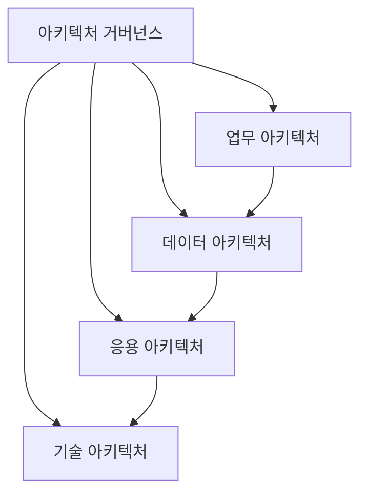
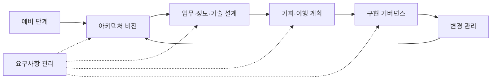

---
sidebar:
  order: 1
  label: "001. EA와 TOGAF (Enterprise Architecture & TOGAF)"
  badge:
    text: "기출 · 70%"
    variant: note
title: "EA와 TOGAF (Enterprise Architecture & TOGAF)"
date: "2026-07-27T23:59:59+09:00"
tags:
  - "notes-law_policy"
weight: 1
extra:
  question_no: "001"
  source_status: "기출"
  source_history: "125회, 128회, 132회, 134회, 135회"
  priority: 70
  priority_note: "5회 기출, EA·TOGAF·범정부 구조의 반복축"
---

## 미리 알고가기

- **전사 아키텍처(Enterprise Architecture, EA)**: 비즈니스 목표와 정보기술 인프라를 유기적으로 연계하고 관리하는 아키텍처 관리 체계
- **정보기술(Information Technology, IT)**: 비즈니스 프로세스를 지원하고 자동화하기 위한 정보 시스템과 인프라 기술
- **오픈 그룹 아키텍처 프레임워크(The Open Group Architecture Framework, TOGAF)**: 글로벌 컨소시엄인 오픈 그룹에서 제정한 전사 아키텍처의 표준 설계 및 관리 프레임워크
- **아키텍처 개발 방법(Architecture Development Method, ADM)**: 비전 수립부터 기술 설계, 갭 분석, 변경 관리까지 순환 반복하는 TOGAF의 핵심 개발 절차
- **현행·목표 아키텍처(As-Is/To-Be Architecture)**: 현재의 정보 기술 구조와 향후 지향할 정보 기술 구조의 상태 정의
- **업무 아키텍처(Business Architecture, BA)**: 조직의 사업 목표, 거버넌스, 비즈니스 기능 및 핵심 프로세스를 정의하는 아키텍처
- **데이터 아키텍처(Data Architecture, DA)**: 조직의 데이터 자원 구조, 논리·물리 데이터 모델, 표준 및 관리 체계를 정의하는 아키텍처
- **애플리케이션 아키텍처(Application Architecture, AA)**: 비즈니스를 지원하는 소프트웨어 서비스의 구성, 기능 및 연계 관계를 정의하는 아키텍처
- **기술 아키텍처(Technology Architecture, TA)**: 소프트웨어 실행을 지원하는 서버, 네트워크, 보안 기기 및 하드웨어 인프라를 정의하는 아키텍처
- **정보화 전략 계획(Information Strategy Plan, ISP)**: 경영 전략 달성을 위해 정보기술 관점의 중장기 사업 포트폴리오와 투자 로드맵을 수립하는 활동
- **정보시스템 마스터 계획(Information System Master Plan, ISMP)**: 개별 정보시스템 구축 사업을 발주하기 위해 세부 요구사항을 정의하고 예산 범위를 확정하는 계획
- **제안 요청서(Request for Proposal, RFP)**: 발주기관이 수주업체들에게 사업의 세부 요구 조건과 평가 기준을 제시하여 제안서 제출을 요청하는 공식 문서
- **범정부 EA**: 정부 및 공공기관의 정보자원을 통합 관리하고 중복 투자를 방지하기 위해 구축한 공공 부문 전사 아키텍처 포털
- **현행·목표 구조(As-Is·To-Be)**: 현재 아키텍처와 구축할 목표 아키텍처로, 두 구조의 차이를 분석해 전환 과제를 도출한다

## Ⅰ. 개요

- 정의/개념: 전사 전략과 **업무·데이터·응용·기술**을 정렬하는 **관리 체계**
- 기존 한계: 부문별 구축으로 **중복 투자·구조 불일치** 발생

### 쉽게 이해하기 (학습용)
- 전사 전략에 맞춰 업무·데이터·애플리케이션·기술 구조를 정렬하고 지속적으로 관리하는 활동이다

## Ⅱ. 특징

- **통합 관점**: BA·DA·AA·TA의 관계를 추적한다
- **순환 개발**: ADM으로 현행·목표·이행을 반복한다
- **거버넌스**: 원칙·표준·변경 승인으로 정합성을 통제한다

### 쉽게 이해하기 (학습용)
- 새 시스템을 도입할 때 기존 구조와의 중복·연계·표준 준수 여부를 검토해 투자 낭비와 구조 불일치를 줄인다

## Ⅲ. 아키텍처 및 구성요소

| 설계 요소 | 설명 |
|:---|:---|
| 업무 아키텍처 | 목표·기능·프로세스·조직 정의 |
| 데이터 아키텍처 | 데이터·표준·흐름 정의 |
| 애플리케이션 아키텍처 | 시스템·서비스·연계 정의 |
| 기술 아키텍처 | 서버·망·보안·클라우드 정의 |
| 거버넌스 체계 | 원칙·검토·변경 승인 관리 |

> 요약: 거버넌스가 전 도메인을 통제함

### 쉽게 이해하기 (학습용)
- 업무·데이터·애플리케이션·기술 아키텍처를 구분하고 거버넌스가 원칙·표준·변경을 통제한다

## Ⅳ. 원리 및 절차 흐름도

| 절차 | 핵심 활동 |
|:---|:---|
| 예비 단계 | 원칙·범위·거버넌스 확정 |
| 아키텍처 비전 | 목표·이해관계·범위 합의 |
| 도메인 설계 | 업무·데이터·응용·기술 설계 |
| 기회·이행 계획 | 갭·전환 과제·로드맵 확정 |
| 구현 거버넌스 | 사업의 아키텍처 준수 통제 |
| 변경 관리 | 변화 감지·다음 주기 결정 |

### 쉽게 이해하기 (학습용)
- 현행 구조와 목표 구조의 차이를 분석해 전환 과제와 로드맵을 수립하고 구현 결과를 다시 아키텍처에 반영한다

## Ⅴ. EA·ISP·ISMP 비교

| 비교 기준 | EA | ISP | ISMP |
|:---|:---|:---|:---|
| 적용 기준 | 전사 구조·표준 통제 시 | 중장기 투자 계획 수립 시 | 개별 사업 발주 전 상세화 시 |
| 핵심 특징 | 전사 구조·변경 거버넌스 | 과제·투자 로드맵 | 요구·규모·예산 구체화 |
| 한계 | 지속 현행화 비용 | 개별 발주 상세 부족 | 전사 전략 관점 부족 |

> 요약: EA는 구조, ISP는 투자, ISMP는 발주를 정의함

### 쉽게 이해하기 (학습용)
- EA는 전사 구조와 표준을 통제하고, ISP는 중장기 투자 계획을 수립하며, ISMP는 개별 사업의 발주 규격을 정의한다

## Ⅵ. 실무 사례

1. 공공 정보화: **범정부 EA**로 중복 투자 검토

### 쉽게 이해하기 (학습용)
- 공공기관은 신규 정보화 사업 전에 범정부 EA에서 유사 시스템과 공동 활용 가능성을 확인해 중복 투자를 검토한다

## Ⅶ. 결론

- 전사 정합성을 위해 변화·거버넌스를 검토하여 **EA·TOGAF** 활용

### 쉽게 이해하기 (학습용)
- 비즈니스와 기술 변화에 맞춰 아키텍처를 현행화하고 전사 구조의 일관성을 유지해야 한다
