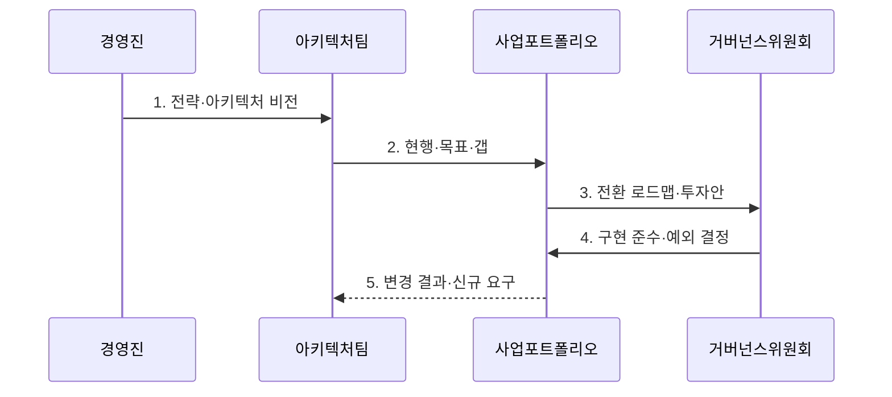

---
sidebar:
  order: 1
  label: "001. EA와 TOGAF (Enterprise Architecture & TOGAF)"
  badge:
    text: "기출 · 70%"
    variant: note
title: "EA와 TOGAF (Enterprise Architecture & TOGAF)"
date: "2026-07-30T09:22:00+09:00"
tags:
  - "notes-law_policy"
weight: 1
extra:
  question_no: "001"
  source_status: "기출"
  source_history: "125회, 128회, 132회, 134회, 135회"
  priority: 70
  priority_note: "5회 기출, EA·TOGAF·범정부 구조의 반복축"
---

## 미리 알고가기

- **전사 아키텍처(Enterprise Architecture, EA)**: 비즈니스 목표와 업무·데이터·애플리케이션·기술 구조를 정렬하고 지속 관리하는 체계다.
- **정보기술(Information Technology, IT)**: 비즈니스 프로세스를 지원하고 자동화하기 위한 정보시스템과 인프라 기술이다.
- **오픈 그룹 아키텍처 프레임워크(The Open Group Architecture Framework, TOGAF)**: 오픈 그룹이 제정한 전사 아키텍처의 설계·이행·거버넌스 프레임워크다.
- **아키텍처 개발 방법(Architecture Development Method, ADM)**: 비전 수립부터 도메인 설계·갭 분석·이행·변경 관리를 순환하는 TOGAF의 핵심 방법이다.
- **현행·목표 아키텍처(As-Is/To-Be Architecture)**: 현재 구조와 지향할 구조를 정의해 두 상태의 차이에서 전환 과제를 도출하는 기준이다.
- **업무 아키텍처(Business Architecture, BA)**: 조직의 사업 목표·거버넌스·업무 기능·핵심 프로세스를 정의하는 아키텍처다.
- **데이터 아키텍처(Data Architecture, DA)**: 조직의 데이터 구조·모델·흐름·표준·관리 체계를 정의하는 아키텍처다.
- **애플리케이션 아키텍처(Application Architecture, AA)**: 업무를 지원하는 소프트웨어 서비스의 구성·기능·연계 관계를 정의하는 아키텍처다.
- **기술 아키텍처(Technology Architecture, TA)**: 애플리케이션 실행을 지원하는 서버·네트워크·보안·클라우드 인프라를 정의하는 아키텍처다.
- **정보화 전략 계획(Information Strategy Plan, ISP)**: 경영 전략 달성을 위한 중장기 정보화 사업 포트폴리오와 투자 로드맵을 수립하는 활동이다.
- **정보시스템 마스터 계획(Information System Master Plan, ISMP)**: 개별 정보시스템 구축 사업의 요구사항·규모·예산을 발주 수준으로 구체화하는 계획이다.
- **범정부 EA**: 정부·공공기관의 정보자원을 연계 관리하고 공동 활용과 중복 투자 검토를 지원하는 공공 부문 전사 아키텍처 체계다.

## Ⅰ. 개요

- 정의/개념: 전사 전략에 맞춰 **업무·데이터·애플리케이션·기술 아키텍처**를 정렬하고 TOGAF ADM으로 현행·목표·이행·변경을 관리하는 체계
- 배경/필요성: 부문별 시스템 구축에서 발생하는 **중복 투자·데이터 및 연계 불일치·기술 표준 분산**을 전사 관점에서 통제

### 쉽게 이해하기 (학습용)
- 전사 전략에 맞춰 업무·데이터·애플리케이션·기술 구조를 정렬하고 지속적으로 관리하는 활동이다

## Ⅱ. 특징

- **통합 관점**으로 BA·DA·AA·TA의 의존 관계와 변경 영향을 추적한다.
- **ADM 순환 개발**로 현행·목표 아키텍처와 갭·이행 로드맵을 반복 현행화한다.
- **아키텍처 거버넌스**로 원칙·표준·예외·변경 승인을 통제한다.

### 쉽게 이해하기 (학습용)
- 새 시스템을 도입할 때 기존 구조와의 중복·연계·표준 준수 여부를 검토해 투자 낭비와 구조 불일치를 줄인다

## Ⅲ. 구조 및 구성요소

```mermaid
block-beta
    columns 4
    G["아키텍처 거버넌스"]:4
    B["업무 아키텍처"] D["데이터 아키텍처"] A["애플리케이션 아키텍처"] T["기술 아키텍처"]
    G -- B
    G -- D
    G -- A
    G -- T
    B -- D
    D -- A
    A -- T
```

| 구성요소 | 책임 |
|:---|:---|
| 아키텍처 거버넌스 | 전사 원칙·표준·검토·예외·변경 승인과 도메인 간 정합성 통제 |
| 업무 아키텍처 | 전략을 조직·업무 기능·프로세스·서비스 구조로 변환 |
| 데이터 아키텍처 | 업무가 생성·사용하는 데이터 모델·흐름·소유·표준 정의 |
| 애플리케이션 아키텍처 | 업무·데이터를 지원하는 시스템·서비스·인터페이스 책임 정의 |
| 기술 아키텍처 | 애플리케이션을 실행할 서버·네트워크·보안·클라우드 기반 정의 |

> 요약: 거버넌스가 전 도메인을 통제함

### 쉽게 이해하기 (학습용)
- 업무·데이터·애플리케이션·기술 아키텍처를 구분하고 거버넌스가 원칙·표준·변경을 통제한다

## Ⅳ. 흐름도



- 1. **전략·아키텍처 비전**: 이해관계자·범위·원칙과 사업 성과를 합의해 ADM 주기의 방향 설정
- 2. **현행·목표·갭**: BA·DA·AA·TA별 현재와 목표 상태를 모델링하고 중복·단절·표준 차이 식별
- 3. **전환 로드맵·투자안**: 갭을 과제·선행관계·전환 아키텍처·비용·효과가 있는 포트폴리오로 구성
- 4. **구현 준수·예외 결정**: 사업 설계가 목표 아키텍처와 원칙을 따르는지 검토하고 예외·보완 조건 승인
- 5. **변경 결과·신규 요구**: 구현 결과와 전략·기술 변화를 아키텍처 저장소에 반영해 다음 ADM 주기 시작

### 쉽게 이해하기 (학습용)
- 현행 구조와 목표 구조의 차이를 분석해 전환 과제와 로드맵을 수립하고 구현 결과를 다시 아키텍처에 반영한다

## Ⅴ. 종류 및 비교

| 정보화 계획 체계 | EA | ISP | ISMP |
|:---|:---|:---|:---|
| 적용 기준 | 전사 구조·표준 통제 시 | 중장기 투자 계획 수립 시 | 개별 사업 발주 전 상세화 시 |
| 핵심 특징 | 전사 구조·변경 거버넌스 | 과제·투자 로드맵 | 요구·규모·예산 구체화 |
| 한계 | 지속 현행화 비용 | 개별 발주 상세 부족 | 전사 전략 관점 부족 |

> 요약: EA는 구조, ISP는 투자, ISMP는 발주를 정의함

### 쉽게 이해하기 (학습용)
- EA는 전사 구조와 표준을 통제하고, ISP는 중장기 투자 계획을 수립하며, ISMP는 개별 사업의 발주 규격을 정의한다

## Ⅵ. 실무 고려사항 및 대책

| 고려사항 | 대책 | 효과 |
|:---|:---|:---|
| 아키텍처 모델이 실제 시스템 변경을 반영하지 못해 **현행 정보 불일치** | 사업 승인·배포·폐기 절차를 아키텍처 저장소 갱신과 연결 | 투자 검토에 쓸 **현행성 확보** |
| 도메인별 모델만 작성하고 관계가 끊겨 **변경 영향 추적 불가** | 업무 기능·데이터·애플리케이션·기술 구성요소를 공통 식별자로 연결 | 전략 변화의 **종단 영향 분석** |
| 표준 준수만 강제해 긴급·혁신 사업이 지연되는 **거버넌스 경직** | 예외 사유·기간·보완 통제·종료 조건을 위원회가 승인·추적 | 정합성과 **사업 민첩성 균형** |

### 쉽게 이해하기 (학습용)
- 공공기관은 신규 정보화 사업 전에 범정부 EA의 현행 정보자원과 공동 활용 가능성을 대조해 중복 투자와 연계 대상을 검토한다.

## Ⅶ. 결론

- 전략·업무·데이터·애플리케이션·기술의 **현행·목표 갭**을 투자 로드맵으로 전환하고 구현 결과를 거버넌스로 다시 현행화하는 EA 운영

### 쉽게 이해하기 (학습용)
- 비즈니스와 기술 변화에 맞춰 아키텍처를 현행화하고 전사 구조의 일관성을 유지해야 한다
