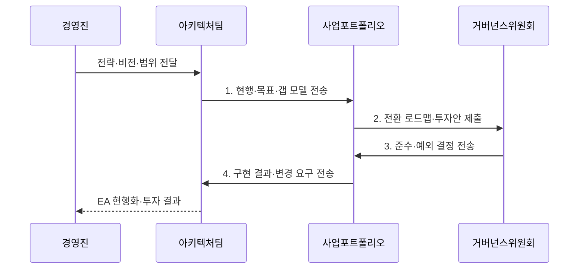

---
sidebar:
  order: 1
  label: "001. EA와 TOGAF (Enterprise Architecture & TOGAF)"
  badge:
    text: "기출 · 70%"
    variant: note
title: "EA와 TOGAF (Enterprise Architecture & TOGAF)"
date: "2026-08-02T12:00:00+09:00"
tags:
  - "notes-law_policy"
weight: 1
extra:
  question_no: "001"
  source_status: "기출"
  source_history: "125회, 128회, 132회, 134회, 135회"
  priority: 70
  priority_note: "5회 기출, EA·TOGAF·범정부 구조의 반복축"
---

## Ⅰ. 개요

<details>
<summary>핵심 용어</summary>

- **TOGAF 10판 ADM**: TOGAF 10판 ADM은 전사 아키텍처의 비전 수립부터 도메인 설계·이행·변경 관리까지 순환시키는 개발 방법이다.

</details>

- 정의/개념: 전사 전략과 도메인을 정렬하고 **TOGAF 10판 ADM**으로 전환을 관리하는 체계
- 배경/필요성: 부문별 구축으로 **중복 투자·데이터 불일치·표준 분산** 발생

### 쉽게 이해하기 (학습용)
- 전사 전략에 맞춰 업무·데이터·애플리케이션·기술 구조를 정렬하고 지속적으로 관리하는 활동이다

## Ⅱ. 특징

<details>
<summary>핵심 용어</summary>

- **현행·목표·갭**: 현행·목표·갭 분석은 현재 구조와 목표 구조의 차이를 찾아 전환 과제를 도출한다.

</details>

- **통합 축**: BA·DA·AA·TA의 의존 관계와 변경 영향 추적
- **개발 축**: ADM 순환으로 현행·목표·갭·이행 로드맵 현행화
- **통제 축**: 거버넌스로 원칙·표준·예외·변경 승인 관리

### 쉽게 이해하기 (학습용)
- 새 시스템을 도입할 때 기존 구조와의 중복·연계·표준 준수 여부를 검토해 투자 낭비와 구조 불일치를 줄인다

## Ⅲ. 구조 및 구성요소

<details>
<summary>핵심 용어</summary>

- **아키텍처 거버넌스**: 아키텍처 거버넌스는 전사 원칙·표준·예외·변경 승인을 관리해 도메인 정합성을 통제한다.

</details>

```mermaid
block-beta
    columns 3
    G["아키텍처 거버넌스"]:3
    B["업무 아키텍처"] D["데이터 아키텍처"] A["애플리케이션 아키텍처"]
    T["기술 아키텍처"]
    G -- B
    G -- D
    G -- A
    G -- T
    B -- D
    D -- A
    A -- T
    G --- B
    B --- D
    D --- A
    A --- T
```

| 구성요소 | 책임 |
|:---|:---|
| 아키텍처 거버넌스 | **원칙·표준·예외·변경 승인**과 도메인 정합성 통제 |
| 업무 아키텍처 | 전략을 **조직·기능·프로세스·서비스**로 변환 |
| 데이터 아키텍처 | **데이터 모델·흐름·소유·표준** 정의 |
| 애플리케이션 아키텍처 | **시스템·서비스·인터페이스 책임** 정의 |
| 기술 아키텍처 | **서버·네트워크·보안·클라우드 기반** 정의 |

### 쉽게 이해하기 (학습용)
- 업무·데이터·애플리케이션·기술 아키텍처를 구분하고 거버넌스가 원칙·표준·변경을 통제한다

## Ⅳ. 흐름도

<details>
<summary>핵심 용어</summary>

- **3. 준수·예외 결정 전송**: 거버넌스위원회는 목표 구조와 원칙 준수 여부를 심사해 예외의 보완 조건과 종료 시점을 결정한다.

</details>



1. **현행·목표·갭 모델 전송**: 도메인별 중복·단절·표준 차이 식별
2. **전환 로드맵·투자안 제출**: 과제·선행 관계·비용·효과 구성
3. **준수·예외 결정 전송**: 목표 구조와 원칙의 보완 조건 승인
4. **구현 결과·변경 요구 전송**: 저장소에 반영해 ADM 재순환

### 쉽게 이해하기 (학습용)
- 현행 구조와 목표 구조의 차이를 분석해 전환 과제와 로드맵을 수립하고 구현 결과를 다시 아키텍처에 반영한다

## Ⅴ. 종류 및 비교

<details>
<summary>핵심 용어</summary>

- **정보화 계획 체계**: 정보화 계획 체계는 전사 구조를 관리하는 EA와 투자·발주를 구체화하는 ISP·ISMP의 역할을 구분한다.

</details>

| 정보화 계획 체계 | EA | ISP | ISMP |
|:---|:---|:---|:---|
| 적용 기준 | **전사 구조·표준** 통제 | **중장기 투자 계획** 수립 | **개별 사업 발주** 상세화 |
| 핵심 특징 | **구조·변경 거버넌스** | **과제·투자 로드맵** | **요구·규모·예산** 구체화 |
| 한계 | **지속 현행화 비용** | **발주 상세 부족** | **전사 전략 관점 부족** |

> 요약: **EA**는 구조, **ISP·ISMP**는 투자·발주 정의

### 쉽게 이해하기 (학습용)
- EA는 전사 구조와 표준을 통제하고, ISP는 중장기 투자 계획을 수립하며, ISMP는 개별 사업의 발주 규격을 정의한다

## Ⅵ. 실무 고려사항 및 대책

<details>
<summary>핵심 용어</summary>

- **현행 정보 불일치**: 현행 정보 불일치는 실제 시스템 변경이 EA 저장소에 반영되지 않아 투자·영향 분석이 왜곡되는 문제다.

</details>

| 문제 | 대책 | 효과 |
|:---|:---|:---|
| 시스템 변경이 빠져 생기는 **현행 정보 불일치** | 승인·배포·폐기와 **범정부 EA 저장소** 갱신 연결 | 투자 검토의 **현행성** 확보 |
| 도메인 관계가 끊겨 생기는 **변경 영향 추적 불가** | 전 도메인을 **공통 식별자**로 연결 | 전략 변화의 **종단 영향 분석** |
| 표준만 강제해 생기는 **거버넌스 경직** | **예외 기간·보완 통제·종료 조건** 승인 | 정합성과 **사업 민첩성** 균형 |

### 쉽게 이해하기 (학습용)
- 공공기관은 신규 정보화 사업 전에 범정부 EA의 현행 정보자원과 공동 활용 가능성을 대조해 중복 투자와 연계 대상을 검토한다.

## Ⅶ. 결론

<details>
<summary>핵심 용어</summary>

- **TOGAF ADM 로드맵**: TOGAF ADM 로드맵은 품질 기준을 충족하는 갭 과제를 선행 관계와 투자 순서에 따라 배치한다.

</details>

- 전사 구조는 **EA**, 갭 과제는 **TOGAF ADM 로드맵**으로 승인

### 쉽게 이해하기 (학습용)
- 비즈니스와 기술 변화에 맞춰 아키텍처를 현행화하고 전사 구조의 일관성을 유지해야 한다
