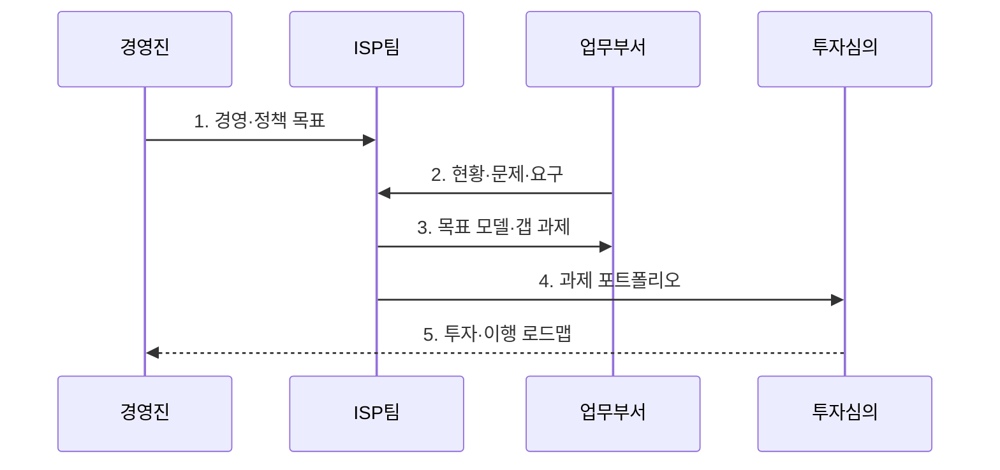

---
sidebar:
  order: 2
  label: "002. ISP (Information Strategy Plan)"
  badge:
    text: "기출 · 50%"
    variant: note
title: "ISP (Information Strategy Plan)"
date: "2026-07-30T09:35:00+09:00"
tags:
  - "notes-law_policy"
weight: 2
extra:
  question_no: "002"
  source_status: "기출"
  source_history: "120회"
  priority: 50
  priority_note: "전략 목표와 정보화 과제를 잇는 기본 계획"
---

## 미리 알고가기

- **정보화 전략 계획(Information Strategy Plan, ISP)**: 조직의 경영 전략 달성을 위해 중장기 정보화 과제와 투자 로드맵을 수립하는 전략 기획 활동이다.
- **정보시스템 마스터 계획(Information System Master Plan, ISMP)**: 특정 구축 사업의 발주를 위해 세부 요구사항·규모·예산·구축 범위를 확정하는 계획이다.
- **전사 아키텍처(Enterprise Architecture, EA)**: 비즈니스 목표와 업무·데이터·애플리케이션·기술 구조를 연계하고 일관되게 관리하는 체계다.
- **제안 요청서(Request for Proposal, RFP)**: 발주기관이 사업 요구 조건과 평가 기준을 제시해 제안서 제출을 요청하는 공식 문서다.
- **현행·목표 상태(As-Is/To-Be)**: 현재 정보화 수준과 달성할 목표 상태를 정의하고 두 상태의 차이에서 이행 과제를 도출하는 기준이다.

## Ⅰ. 개요

- 정의/개념: 경영·정책 목표와 정보화 현황을 분석해 **현행·목표 상태의 갭**을 중장기 과제 포트폴리오·투자 우선순위·이행 로드맵으로 전환하는 전략 계획
- 배경/필요성: 부서별 개별 투자에서 발생하는 **사업 중복·전략 불일치·예산 분산**을 전사 관점의 효과·시급성·실행성으로 조정

### 쉽게 이해하기 (학습용)
- 경영 전략에 맞춰 중장기 정보화 과제의 우선순위와 투자 일정·예산을 수립하는 활동이다

## Ⅱ. 특징

- **전략 정렬**로 경영·정책 목표와 정보화 방향·성과지표를 연결한다.
- **갭 기반 과제 도출**로 현행 문제와 목표 역량의 차이를 사업 후보로 전환한다.
- **포트폴리오·투자 로드맵**으로 효과·시급성·실행성에 따른 일정·예산·책임을 단계화한다.

### 쉽게 이해하기 (학습용)
- 부서별 중복 과제를 조정하고 효과·시급성·실행성을 평가해 한정된 예산의 투자 우선순위를 정한다

## Ⅲ. 구조 및 구성요소

| 구성요소 | 책임 |
|:---|:---|
| 환경·전략 분석 | 경영 목표·정책·산업·기술 변화와 핵심 성공 요인 식별 |
| 현황 분석 | 업무 프로세스·데이터·시스템·조직의 문제와 중복·연계 상태 진단 |
| 목표 모델 | 목표 업무·정보·애플리케이션·기술 구조와 성과 수준 정의 |
| 과제 포트폴리오 | 현행·목표 갭을 과제화하고 효과·시급성·실행성·위험으로 우선순위 확정 |
| 이행 계획 | 과제 선행관계·일정·예산·조직·성과지표를 단계별 로드맵으로 구성 |

### 쉽게 이해하기 (학습용)
- 기업 외부의 법률이나 기술 트렌드를 분석하는 환경 분석부터 실제 사업을 추진하기 위한 구체적인 일정과 예산 수립 단계까지 유기적으로 구성됨

## Ⅳ. 흐름도

1. **경영·정책 목표**: 전략 방향·핵심 성과·법제도·산업·기술 변화와 계획 범위 합의
2. **현황·문제·요구**: 업무·데이터·시스템·조직의 운영 증거와 이해관계자 요구로 현재 상태 진단
3. **목표 모델·갭 과제**: 목표 업무·정보·기술 구조를 정의하고 현행과의 차이를 실행 가능한 과제로 변환
4. **과제 포트폴리오**: 중복·의존성을 조정하고 효과·시급성·실행성·비용·위험으로 우선순위 평가
5. **투자·이행 로드맵**: 과제별 일정·예산·책임·선행관계·성과지표를 확정하고 경영 변화에 따라 현행화

### 쉽게 이해하기 (학습용)
- 외부 환경과 내부 정보화 현황을 분석하고 목표 모델과 과제를 도출해 일정·예산·조직을 포함한 이행계획을 수립한다

## Ⅴ. 종류 및 비교

| 정보화 계획 체계 | ISP | ISMP | EA |
|:---|:---|:---|:---|
| 적용 기준 | 중장기 투자 계획 수립 시 | 개별 사업 발주 전 상세화 시 | 전사 구조·표준 통제 시 |
| 핵심 특징 | 과제·투자 로드맵 | 요구·규모·예산 구체화 | 전사 구조·변경 거버넌스 |
| 한계 | 개별 발주 상세 부족 | 전사 전략 관점 부족 | 투자 우선순위 구체화 부족 |

> 요약: ISP는 투자, ISMP는 발주, EA는 구조를 정함

### 쉽게 이해하기 (학습용)
- ISP는 중장기 투자 방향, ISMP는 개별 사업의 발주 요건, EA는 전사 정보자원의 표준 구조를 관리한다

## Ⅵ. 실무 고려사항 및 대책

| 고려사항 | 대책 | 효과 |
|:---|:---|:---|
| 경영 전략을 추상 구호로만 연결해 **과제 성과 불명확** | 목표별 업무 성과지표와 정보화 과제의 기여 관계를 직접 매핑 | 투자안의 **전략 정합성 확보** |
| 부서 요구를 그대로 합쳐 유사 사업과 기능이 **중복** | 현행 시스템·EA·공동 활용 자원과 요구 기능을 대조해 통합·폐기 결정 | 중복 투자와 **운영 복잡성 감소** |
| 효과만 큰 과제를 우선해 데이터·인프라 선행조건이 빠지는 **로드맵 실행 실패** | 과제 의존성·조직 역량·예산·조달 기간을 반영해 단계화 | 투자 순서의 **실행 가능성 확보** |

### 쉽게 이해하기 (학습용)
- 공공기관은 예산 신청 전에 정보화 과제의 전략 정합성·기존 사업 중복·비용 대비 효과와 선행조건을 검토한다.

## Ⅶ. 결론

- 경영 목표에 기여하는 **현행·목표 갭 과제**를 효과·시급성·실행성으로 우선화하고 선행관계·예산·성과지표가 있는 투자 로드맵으로 실행하는 ISP

### 쉽게 이해하기 (학습용)
- 경영 전략과 정보화 과제를 정렬하고 우선순위와 성과 지표를 지속적으로 현행화해야 한다
