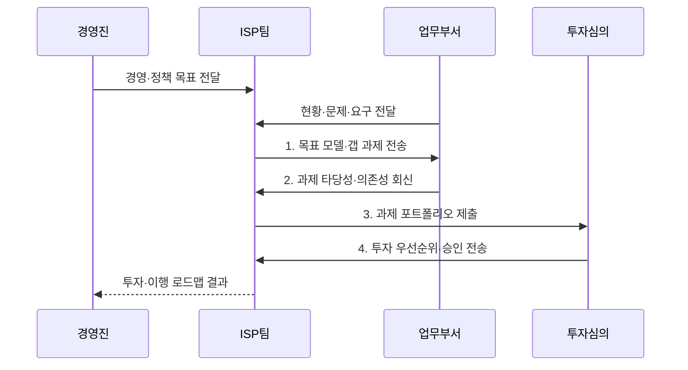

---
sidebar:
  order: 2
  label: "002. ISP (Information Strategy Plan)"
  badge:
    text: "기출 · 50%"
    variant: note
title: "ISP (Information Strategy Plan)"
date: "2026-08-02T12:00:00+09:00"
tags:
  - "notes-law_policy"
weight: 2
extra:
  question_no: "002"
  source_status: "기출"
  source_history: "120회"
  priority: 50
  priority_note: "전략 목표와 정보화 과제를 잇는 기본 계획"
---

## Ⅰ. 개요

핵심 용어

- **과제 포트폴리오·투자 로드맵**: 과제 포트폴리오·투자 로드맵은 전략 목표에 기여하는 정보화 과제를 우선순위·일정·예산으로 구조화한 계획이다.

- 정의/개념: 경영 전략과 현황의 갭을 **과제 포트폴리오·투자 로드맵**으로 전환하는 계획
- 배경/필요성: 부서별 투자로 **사업 중복·전략 불일치·예산 분산** 발생

#### 한줄 요약
- 경영 전략에 맞춰 중장기 정보화 과제의 우선순위와 투자 일정·예산을 수립하는 활동이다

## Ⅱ. 특징

핵심 용어

- **투자 우선순위**: 투자 우선순위는 후보 과제의 효과·시급성·실행성·위험을 비교해 한정된 예산의 배분 순서를 정한다.

- **정렬 축**: 경영·정책 목표와 정보화 방향·성과지표 연결
- **도출 축**: 현행 문제와 목표 역량의 갭을 사업 후보로 전환
- **투자 축**: 효과·시급성·실행성으로 일정·예산·책임 단계화

#### 한줄 요약
- 부서별 중복 과제를 조정하고 효과·시급성·실행성을 평가해 한정된 예산의 투자 우선순위를 정한다

## Ⅲ. 구조 및 구성요소

핵심 용어

- **과제 포트폴리오**: 과제 포트폴리오는 현행과 목표의 갭에서 도출한 사업 후보를 평가 기준에 따라 통합 관리한다.

| 구성요소 | 책임 |
|:---|:---|
| 환경·전략 분석 | **경영 목표·정책·산업·기술 변화** 식별 |
| 현황 분석 | **업무·데이터·시스템·조직 문제** 진단 |
| 목표 모델 | **목표 업무·정보·기술 구조·성과** 정의 |
| 과제 포트폴리오 | **효과·시급성·실행성·위험**으로 우선순위 결정 |
| 이행 계획 | **선행 관계·일정·예산·책임·성과지표** 구성 |

#### 한줄 요약
- 기업 외부의 법률이나 기술 트렌드를 분석하는 환경 분석부터 실제 사업을 추진하기 위한 구체적인 일정과 예산 수립 단계까지 유기적으로 구성됨

## Ⅳ. 흐름도

핵심 용어

- **3. 과제 포트폴리오 제출**: ISP팀은 후보 과제의 효과·시급성·실행성·위험과 상호 의존성을 분석해 투자심의에 제출한다.

1. **목표 모델·갭 과제 전송**: 현행과 목표의 차이를 사업 후보로 변환
2. **과제 타당성·의존성 회신**: 중복·선행 조건·실행 역량 검증
3. **과제 포트폴리오 제출**: 효과·시급성·실행성·위험 평가
4. **투자 우선순위·승인 전송**: 일정·예산·책임·성과지표 확정

#### 한줄 요약
- 외부 환경과 내부 정보화 현황을 분석하고 목표 모델과 과제를 도출해 일정·예산·조직을 포함한 이행계획을 수립한다

## Ⅴ. 종류 및 비교

핵심 용어

- **정보화 계획 체계**: 정보화 계획 체계에서 ISP는 중장기 투자, ISMP는 개별 발주, EA는 전사 구조와 표준을 담당한다.

| 정보화 계획 체계 | ISP | ISMP | EA |
|:---|:---|:---|:---|
| 적용 기준 | **중장기 투자 계획** 수립 | **개별 사업 발주** 상세화 | **전사 구조·표준** 통제 |
| 핵심 특징 | **과제·투자 로드맵** | **요구·규모·예산** 구체화 | **구조·변경 거버넌스** |
| 한계 | **발주 상세 부족** | **전사 전략 관점 부족** | **투자 우선순위 부족** |

> 요약: **ISP**는 투자, **ISMP·EA**는 발주·구조 정의

#### 한줄 요약
- ISP는 중장기 투자 방향, ISMP는 개별 사업의 발주 요건, EA는 전사 정보자원의 표준 구조를 관리한다

## Ⅵ. 실무 고려사항 및 대책

핵심 용어

- **유사 사업·기능 중복**: 유사 사업·기능 중복은 부서 요구를 단순 합산해 같은 기능과 예산이 여러 과제에 반복 반영되는 문제다.

| 문제 | 대책 | 효과 |
|:---|:---|:---|
| 전략을 구호로 연결해 생기는 **과제 성과 불명확** | 목표 성과지표와 **과제 기여 관계** 직접 매핑 | 투자안의 **전략 정합성** 확보 |
| 부서 요구를 합쳐 생기는 **유사 사업·기능 중복** | 현행 시스템·EA와 대조해 **통합·폐기** 결정 | 중복 투자와 **운영 복잡성** 감소 |
| 선행 조건을 빼서 생기는 **로드맵 실행 실패** | **의존성·역량·예산·조달 기간**으로 단계화 | 투자 순서의 **실행 가능성** 확보 |

#### 한줄 요약
- 공공기관은 예산 신청 전에 정보화 과제의 전략 정합성·기존 사업 중복·비용 대비 효과와 선행조건을 검토한다.

## Ⅶ. 결론

핵심 용어

- **ISP 로드맵**: ISP 로드맵에는 전략 기여도와 실행 가능성이 검증된 갭 과제를 선행 관계에 맞춰 반영해야 한다.

- **효과·시급성·실행성**이 높은 갭 과제만 ISP 로드맵에 우선 반영

#### 한줄 요약
- 경영 전략과 정보화 과제를 정렬하고 우선순위와 성과 지표를 지속적으로 현행화해야 한다
