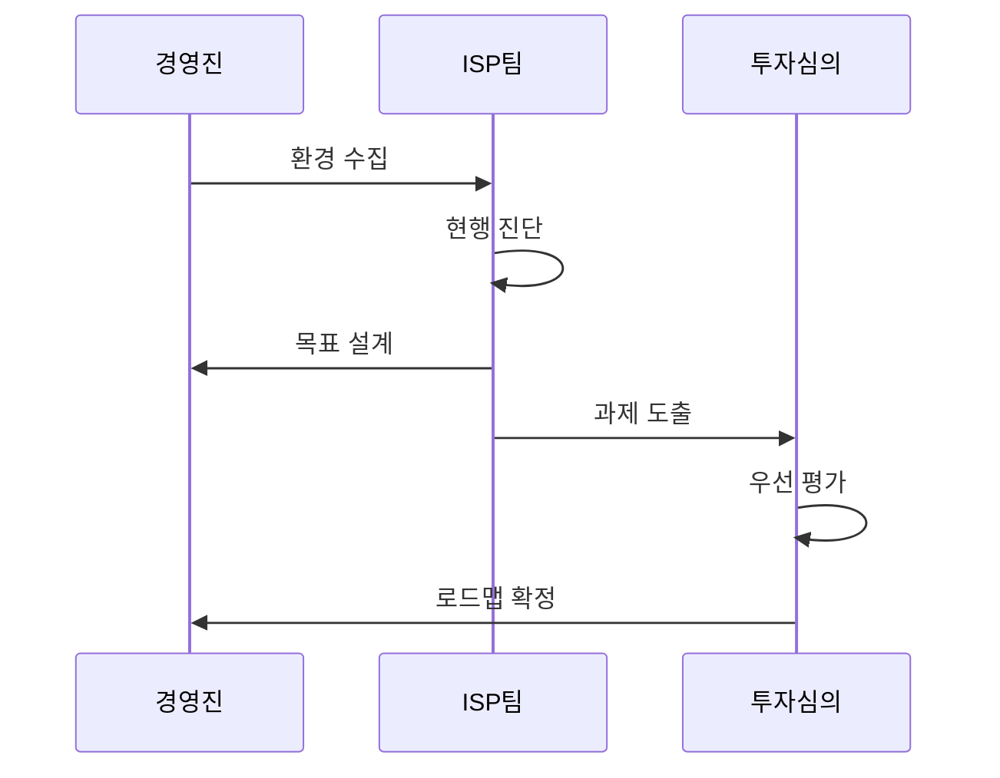

---
sidebar:
  order: 2
  label: "002. ISP (Information Strategy Plan)"
  badge:
    text: "기출 · 50%"
    variant: note
title: "ISP (Information Strategy Plan)"
date: "2026-07-25T01:20:00+09:00"
tags:
  - "notes-law_policy"
weight: 2
extra:
  question_no: "002"
  source_status: "기출"
  source_history: "120회"
  priority: 50
  priority_note: "전략 목표와 정보화 과제를 잇는 기본 계획"
---

## 미리 알고가기

- **정보화 전략 계획(Information Strategy Plan, ISP)**: 조직의 경영 전략 달성을 위해 정보기술 관점의 중장기 정보화 과제와 투자 계획을 수립하는 전략 기획 활동
- **정보시스템 마스터 계획(Information System Master Plan, ISMP)**: 특정 구축 사업의 발주를 위해 세부 요구사항을 정의하고 예산 타당성을 분석하여 구축 범위를 확정하는 계획
- **전사 아키텍처(Enterprise Architecture, EA)**: 비즈니스 목표와 정보기술 인프라를 유기적으로 연계하고 일관되게 관리하는 전사적인 아키텍처 관리 체계
- **제안 요청서(Request for Proposal, RFP)**: 발주기관이 수주업체들에게 사업 요구 조건과 평가 기준을 제시하며 제안서 제출을 요청하는 공식 문서
- **현행·목표 아키텍처(As-Is/To-Be Architecture)**: 현재 운영 중인 시스템 구조와 향후 비즈니스 전략에 맞춰 달성하려는 미래 지향적 아키텍처 상태
- **약어 읽기·표기**: ISP는 ‘아이에스피’, ISMP는 ‘아이에스엠피’, EA는 ‘이 에이’, RFP는 ‘알에프피’로 읽으며 영문 정식명의 머리글자로 계획·구조·발주 산출물을 구분함
- **상태 표기(As-Is/To-Be)**: ‘애즈 이즈/투 비’로 읽고 슬래시는 현행과 목표의 대비를 나타내며 로드맵의 출발·도착 상태를 가리킴
- **시퀀스 기호(->>)**: ‘요청 전달’로 읽고 이중 화살촉은 ISP 분석·설계 산출물의 인계를 나타냄

## Ⅰ. 개요

- **정의/개념**: 경영 목표를 정보화 과제·로드맵으로 전환
- **배경/필요성**: 중복 투자를 줄이고 시스템 연계성 확보

### 쉽게 이해하기 (학습용)
- 회사의 경영 방향에 맞춰 앞으로 3~5년 동안 어떤 정보 시스템을 만들고 예산을 어떻게 쓸지 전체적인 계획을 세우는 활동임

## Ⅱ. 특징

- 경영·업무·IT 현황에서 정보화 과제를 도출한다
- 현행·목표 차이가 투자 순서·일정을 정한다
- 예산·조직·추진 방식을 실행 계획에 담는다
- 공공 법제도·EA·클라우드 기준을 검토한다

### 쉽게 이해하기 (학습용)
- 부서별로 중복된 시스템을 따로 개발하는 일을 차단하고, 한정된 예산을 가장 시급하고 중요한 IT 사업에 먼저 쓰도록 일정과 순서를 정함

## Ⅲ. 아키텍처 및 구성요소

| 설계 요소 | 설명 |
|:---|:---|
| 환경 분석 | 정책·산업·기술·업무 변화 식별 |
| 현황 분석 | 프로세스·데이터·시스템 진단 |
| 목표 모델 | 목표 업무·데이터·시스템 정의 |
| 과제 포트폴리오 | 비용·효과·시급성 우선순위 확정 |
| 이행 계획 | 일정·예산·조직 로드맵 작성 |

> 요약: 환경 분석을 이행 로드맵으로 연결함

### 쉽게 이해하기 (학습용)
- 기업 외부의 법률이나 기술 트렌드를 분석하는 환경 분석부터 실제 사업을 추진하기 위한 구체적인 일정과 예산 수립 단계까지 유기적으로 구성됨

## Ⅳ. 원리 및 절차 흐름도

| 절차 | 핵심 활동 |
|:---|:---|
| 환경 수집 | 경영 목표·기술 동향 파악 |
| 현행 진단 | 시스템 병목 규명 |
| 목표 설계 | 미래 정보화 지향점 정의 |
| 과제 도출 | 현행·목표 격차 과제화 |
| 우선 평가 | 투자 효과·시급성 분석 |
| 로드맵 확정 | 예산·일정·성과지표 수립 |

### 쉽게 이해하기 (학습용)
- 외부 환경과 내부 시스템 현황을 먼저 정밀하게 진단한 후, 우리가 가야 할 미래 시스템 설계도를 그리고 이를 실천하기 위한 실행 목록을 일정표로 만듦

## Ⅴ. 종류 및 비교

| 판단 기준 | ISP | ISMP | EA |
|:---|:---|:---|:---|
| 핵심 초점 | 투자 방향 결정 | 사업 발주 범위 | 전사 구조 관리 |
| 주요 산출 | 비전·과제·로드맵 | 요구사항·RFP | 표준·이행 구조 |
| 적용 기준 | 중장기 투자 계획 수립 시 | 개별 사업 발주 전 상세화 시 | 전사 구조·표준 통제 시 |

> 요약: ISP는 투자, ISMP는 발주, EA는 구조를 정함

### 쉽게 이해하기 (학습용)
- ISP는 중장기 정보화 청사진과 투자 가이드를 잡는 데 쓰이고, ISMP는 구체적인 시스템 개발 계약 요건을 정의하며, EA는 정보자원의 표준 구조를 상시 관리함

## Ⅵ. 실무 사례

1. 공공 ISP: 공통 가이드라인 기반의 예산 및 클라우드 검토
2. 과제 상세화: 업무 목표 달성을 위한 세부 정보화 과제 정의

### 쉽게 이해하기 (학습용)
- 공공기관에서 예산을 신청하기 전에 공통 기준과 보안 규정에 어긋나지 않는지 검토하고 도입할 소프트웨어의 타당성을 확인함
- 수립된 전략에 따라 도출된 정보화 과제마다 기대 효과와 예상 소요 예산을 연결하여 비즈니스 가치를 수치로 입증함

## Ⅶ. 결론

- 경영 목표 달성을 위한 투자 타당성 및 이행 로드맵 확보

### 쉽게 이해하기 (학습용)
- 경영 전략과 정보기술을 밀접하게 정렬하여 정보화 사업의 낭비를 방지하고 중장기적인 투자 효율성을 확보해야 함
