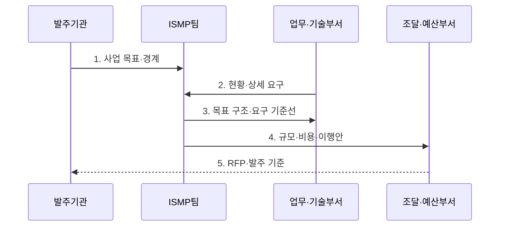

---
sidebar:
  order: 3
  label: "003. ISMP (Information System Master Plan)"
  badge:
    text: "기출 · 70%"
    variant: note
title: "ISMP (Information System Master Plan)"
date: "2026-07-30T09:48:00+09:00"
tags:
  - "notes-law_policy"
weight: 3
extra:
  question_no: "003"
  source_status: "기출"
  source_history: "125회, 128회, 132회, 135회"
  priority: 70
  priority_note: "4회 기출, 실행 사업·아키텍처의 반복 계획"
---

## 미리 알고가기

- **정보시스템 마스터 계획(Information System Master Plan, ISMP)**: 특정 정보시스템 구축 사업의 요구사항·목표 구조·규모·예산·이행방안을 발주 수준으로 구체화하는 활동이다.
- **정보화 전략 계획(Information Strategy Plan, ISP)**: 조직의 중장기 정보화 투자 비전과 추진 과제 로드맵을 설계하는 상위 기획 활동이다.
- **제안 요청서(Request for Proposal, RFP)**: 발주기관이 사업 범위·요구사항·예산·평가 기준을 제시해 제안서 제출을 요청하는 공식 문서다.
- **기능점수(Function Point, FP)**: 사용자 관점의 데이터·트랜잭션 기능을 계수해 소프트웨어의 기능 규모를 나타내는 단위다.
- **요구사항 기준선(Requirement Baseline)**: 사업 범위·변경·추가 대가를 판단하는 기준으로 승인된 요구사항 명세다.

## Ⅰ. 개요

- 정의/개념: 특정 구축사업의 기능·비기능·연계 요구와 목표 구조를 상세화하고 **규모·비용·이행방안·RFP 기준선**을 확정하는 발주 계획
- 배경/필요성: 추상적인 과업 내용으로 발생하는 **요구 누락·범위 해석 차이·규모 및 추가 대가 분쟁**을 계약 전 예방

### 쉽게 이해하기 (학습용)
- 개별 정보시스템을 발주하기 전에 요구사항·규모·비용·이행방안을 구체화하는 활동이다

## Ⅱ. 특징

- **요구 상세화**로 기능·비기능·데이터·연계 범위와 인수 조건을 확정한다.
- **규모·대가 산정**으로 FP·투입·직접경비의 근거를 예산과 일정에 연결한다.
- **발주 기준선**으로 승인 요구사항·목표 구조·평가 기준을 RFP와 계약에 전환한다.

### 쉽게 이해하기 (학습용)
- 기능·비기능·연계 요구사항과 규모·비용을 구체화해 발주 범위를 명확히 하고 계약 분쟁을 줄인다

## Ⅲ. 구조 및 구성요소

| 구성요소 | 책임 |
|:---|:---|
| 사업 목표·경계 | 구축 목적·대상 업무·이해관계자·외부 시스템과 인수 산출물 정의 |
| 요구사항 기준선 | 기능·데이터·품질·보안·연계 요구와 검증 가능한 수용 기준 관리 |
| 목표 구조·규모 | 응용·데이터·기술 구조를 설계하고 FP 등으로 구축 규모 산정 |
| 이행 방안 | 범위·일정·조직·조달·전환·위험 대응과 비용 근거 수립 |
| RFP | 요구사항·산출물·계약 조건·제안 평가·검수 기준을 발주 문서로 확정 |

> 요약: 요구사항을 발주 문서로 체계화함

### 쉽게 이해하기 (학습용)
- 구축할 시스템의 목표 설정부터 기능 사양서 작성, 소프트웨어 규모 측정, 그리고 최종 제안 요청서 작성까지 사업 발주에 필요한 요소들로 구성됨

## Ⅳ. 흐름도

### 동작 원리

1. **사업 목표·경계**: ISP 과제와 구축 목적을 확인하고 대상 업무·시스템·외부 연계·산출물 범위 확정
2. **현황·상세 요구**: 사용자·운영자와 현행 업무·데이터·시스템을 분석해 기능·비기능·연계 요구 도출
3. **목표 구조·요구 기준선**: 응용·데이터·기술 구조와 요구별 검증·수용 조건을 합의해 기준선 승인
4. **규모·비용·이행안**: FP·직접경비·전환 범위로 예산을 산정하고 일정·조직·조달·위험 대응 수립
5. **RFP·발주 기준**: 요구·산출물·계약·평가·검수·변경관리 조건을 일관된 발주 문서로 확정

### 쉽게 이해하기 (학습용)
- 사업 범위와 요구사항을 분석하고 목표 구조와 규모·비용을 산정해 이행방안과 RFP를 작성한다

## Ⅴ. 종류 및 비교

| 정보화 계획 | ISMP | ISP |
|:---|:---|:---|
| 적용 기준 | 개별 사업 발주 전 상세화 시 | 중장기 투자 계획 수립 시 |
| 핵심 특징 | 요구·규모·예산·RFP | 비전·과제·투자 로드맵 |
| 한계 | 전사 전략 관점 부족 | 발주 요구·대가 상세 부족 |

> 요약: ISP는 투자 방향, ISMP는 발주 범위를 정함

### 쉽게 이해하기 (학습용)
- ISP는 중장기 정보화 투자 방향을 정하고, ISMP는 특정 구축사업의 상세 발주 규격을 작성한다

## Ⅵ. 실무 고려사항 및 대책

| 고려사항 | 대책 | 효과 |
|:---|:---|:---|
| 요구가 `편리한 화면`처럼 모호해 **인수 판정 불가** | 대상·조건·동작·성능·검증 방법이 있는 수용 기준으로 상세화 | 요구의 **시험·검수 가능성 확보** |
| 기능 목록과 목표 구조가 끊겨 **연계·데이터·인프라 규모 누락** | 요구 ID를 업무·데이터·애플리케이션·기술 구성요소와 연결 | 구축 범위의 **완전성 확보** |
| FP·비용 산정과 RFP 범위가 달라 **예산·대가 분쟁** | 동일 요구 기준선으로 기능 규모·직접경비·산출물·변경 절차 산정 | 계약 범위와 **비용 근거 일치** |

### 쉽게 이해하기 (학습용)
- 공공 구축사업은 기능·데이터·품질·연계 요구와 수용 기준을 기준선으로 승인해 수행사의 자의적 해석과 범위 분쟁을 줄인다.

## Ⅶ. 결론

- 검증 가능한 **요구사항 기준선**을 목표 구조·FP·비용·이행방안·RFP와 일치시켜 발주·인수·변경 대가의 판단 근거를 확보하는 ISMP

### 쉽게 이해하기 (학습용)
- 합의된 요구사항 기준선과 규모 산정 근거로 예산·기간·계약 범위를 명확히 해야 한다
