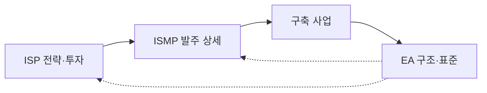
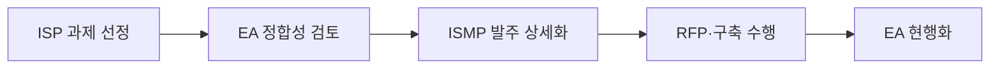

---
sidebar:
  order: 4
  label: "004. ISP·ISMP·EA 비교 (ISP, ISMP, EA Comparison)"
  badge:
    text: "기출 · 70%"
    variant: note
title: "ISP·ISMP·EA 비교 (ISP, ISMP, EA Comparison)"
date: "2026-07-27T23:59:59+09:00"
tags:
  - "notes-law_policy"
weight: 4
extra:
  question_no: "004"
  source_status: "기출"
  source_history: "125회, 128회, 132회, 135회"
  priority: 70
  priority_note: "4회 기출, 계획 범위·산출물 비교의 핵심축"
---

## 미리 알고가기

- **정보화 전략 계획(Information Strategy Plan, ISP)**: 조직의 비즈니스 비전에 따라 중장기 정보화 방향성과 투자 포트폴리오를 도출하는 기획 활동
- **정보시스템 마스터 계획(Information System Master Plan, ISMP)**: 구축할 정보시스템의 세부 기능과 기술 규격을 규정하여 발주 금액과 RFP를 상세화하는 활동
- **전사 아키텍처(Enterprise Architecture, EA)**: 비즈니스 조직 구조와 하드웨어, 소프트웨어, 데이터 자원을 일관성 있게 구성하고 조율하는 통제 프레임워크
- **제안 요청서(Request for Proposal, RFP)**: 발주처가 요구 사항과 사업 평가 방식을 서술하여 수주 가능 개발업체들에 공급 제안을 요청하는 공식 규격 문서
- **약어 읽기·표기**: ISP는 ‘아이에스피’, ISMP는 ‘아이에스엠피’, EA는 ‘이 에이’, RFP는 ‘알에프피’로 읽으며 각 영문 정식명의 머리글자로 계획·구조·발주 역할을 구분함
- **가운데점(·)**: ‘그리고’로 읽고 복합 비교 제목과 표에서 서로 다른 독립 대상을 병렬로 묶음
- **도식 기호(-->·-.->)**: ‘흐름·검토’로 읽고 실선은 사업 진행, 점선은 EA 기준의 지속 적용을 뜻함

## Ⅰ. 개요

- 정의/개념: ISP·ISMP·EA의 목적·범위·산출물 구분
- 기존 한계: 계획 간 역할 혼동으로 중복·발주 오류 발생

### 쉽게 이해하기 (학습용)
- IT 사업을 시작할 때, 투자 전략을 짤지(ISP), 개발업체 계약서 사양을 정할지(ISMP), 아니면 회사 전체 시스템 표준을 맞출지(EA) 시점과 용도에 따라 구별하여 적용해야 함

## Ⅱ. 특징

- **ISP**: 중장기 정보화 과제·투자 순위를 정한다
- **ISMP**: 개별 사업 요구·규모·예산을 확정한다
- **EA**: 전사 구조·표준·변경을 지속 통제한다

### 쉽게 이해하기 (학습용)
- ISP는 장기적인 투자 예산을 분배하고, ISMP는 당장 발주할 사업의 정밀한 계약 내용을 다듬으며, EA는 기업 내 모든 소프트웨어와 데이터가 꼬이지 않도록 통제함

## Ⅲ. 아키텍처 및 구성요소

| 설계 요소 | 설명 |
|:---|:---|
| 전략 계층 | ISP 투자 방향·과제 정의 |
| 발주 계층 | ISMP 요구·계약 범위 정의 |
| 구조 계층 | EA 업무·데이터·시스템 기준 제공 |
| 거버넌스 계층 | 예산·중복·변경 검토 연계 |

> 요약: 전략·발주·구조를 거버넌스로 연계함

### 쉽게 이해하기 (학습용)
- 중장기 방향을 잡는 전략, 실행 사양을 규정하는 발주, 그리고 전체 표준을 지탱하는 아키텍처가 관리 규칙에 따라 맞물려 작동함

## Ⅳ. 원리 및 절차 흐름도

| 절차 | 핵심 활동 |
|:---|:---|
| ISP 과제 선정 | 투자 순위·로드맵 확정 |
| EA 정합성 검토 | 표준·중복·공동 활용 확인 |
| ISMP 발주 상세화 | 요구·규모·예산 구체화 |
| RFP·구축 수행 | 계약 기준으로 사업 실행 |
| EA 현행화 | 구축 결과·구조정보 갱신 |

### 쉽게 이해하기 (학습용)
- 장기 IT 로드맵에 맞추어 과제를 고르고 중복 장비 유무를 먼저 검사한 뒤, 구체적인 계약 예산안을 세워 안전하게 개발하고 그 결과를 회사 표준 장부에 다시 기록함

## Ⅴ. ISP·ISMP·EA 비교

| 비교 기준 | ISP | ISMP | EA |
|:---|:---|:---|:---|
| 적용 기준 | 중장기 투자 계획 수립 시 | 개별 사업 발주 전 | 전사 구조 통제 시 |
| 핵심 특징 | 비전·과제·투자 로드맵 | 요구·규모·예산·RFP | 원칙·표준·구조·변경 |
| 한계 | 발주 상세 부족 | 전사 전략 관점 부족 | 투자 우선순위 상세 부족 |

> 요약: ISP는 투자, ISMP는 발주, EA는 구조를 관리함

### 쉽게 이해하기 (학습용)
- ISP는 무엇을 개발할 것인지 전체 로드맵을 그리고, ISMP는 얼마의 비용으로 어떻게 계약할 것인지 규정하며, EA는 어떤 원칙 하에 시스템을 지탱할 것인지 정함

## Ⅵ. 실무 사례

1. 대형 정보화: **ISP 과제**를 ISMP로 상세화
2. 신규 발주: **EA 검토**로 중복·표준 위반 통제

### 쉽게 이해하기 (학습용)
- 수십억 단위의 대형 IT 프로젝트가 발주되기 전, 상위 전략 계획 결과에 기반하여 세부 요구사항을 미리 도출하는 사업 준비 활동을 검토함
- 신규 개발하는 홈페이지가 다른 기관의 시스템과 기능이 겹치지 않는지 범정부 관리 장부와 대조하여 불필요한 예산을 줄임

## Ⅶ. 결론

- 전략부터 운영까지 **ISP·ISMP·EA**를 연계 통제

### 쉽게 이해하기 (학습용)
- 투자 기획(ISP), 발주 상세화(ISMP), 구조 통제(EA)를 연계하여 예산 낭비와 발주 분쟁을 줄여야 함
