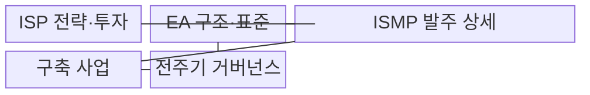
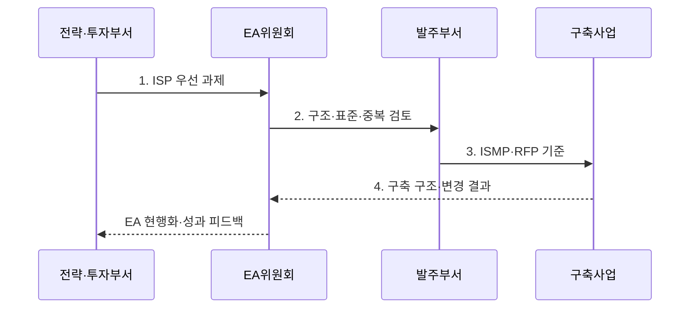

---
sidebar:
  order: 4
  label: "004. ISP·ISMP·EA 비교 (ISP, ISMP, EA Comparison)"
  badge:
    text: "기출 · 70%"
    variant: note
title: "ISP·ISMP·EA 비교 (ISP, ISMP, EA Comparison)"
date: "2026-07-31T05:51:13+09:00"
tags:
  - "notes-law_policy"
weight: 4
extra:
  question_no: "004"
  source_status: "기출"
  source_history: "125회, 128회, 132회, 135회"
  priority: 70
  priority_note: "4회 기출, 계획 범위·산출물 비교의 핵심축"
---

## 미리 알고가기

- **정보화 전략 계획(Information Strategy Plan, ISP)**: 조직의 경영 전략에 따라 중장기 정보화 과제와 투자 포트폴리오를 도출하는 기획 활동이다.
- **정보시스템 마스터 계획(Information System Master Plan, ISMP)**: 특정 구축사업의 요구사항·목표 구조·규모·예산·RFP를 발주 수준으로 상세화하는 활동이다.
- **전사 아키텍처(Enterprise Architecture, EA)**: 비즈니스 목표와 업무·데이터·애플리케이션·기술 구조를 정렬하고 원칙·표준·변경으로 통제하는 체계다.
- **제안 요청서(Request for Proposal, RFP)**: 발주기관이 사업 요구사항·계약 조건·평가 기준을 제시해 제안서 제출을 요청하는 공식 문서다.

## Ⅰ. 개요

- 정의/개념: 정보화 전주기에서 **ISP·ISMP·EA의 투자·발주·구조 역할**을 구분한 체계
- 배경/필요성: 역할 혼동으로 **전략·구축 단절과 요구·예산 불일치** 발생

### 쉽게 이해하기 (학습용)
- 중장기 투자계획은 ISP, 개별 사업 발주 상세화는 ISMP, 전사 구조와 표준 통제는 EA를 적용한다

## Ⅱ. 특징

- **투자 축**: ISP로 중장기 과제·우선순위·로드맵 결정
- **발주 축**: ISMP로 요구·구조·규모·예산·RFP 확정
- **구조 축**: EA로 전사 구조·표준·중복·변경 정합성 통제

### 쉽게 이해하기 (학습용)
- ISP는 투자 우선순위, ISMP는 발주 요구·예산, EA는 전사 구조·표준·변경을 관리한다

## Ⅲ. 구조 및 구성요소

| 구성요소 | 책임 |
|:---|:---|
| ISP 전략·투자 | **과제 포트폴리오·투자 우선순위·로드맵** 수립 |
| EA 구조·표준 | **현행 자원·목표 구조·원칙·표준** 제공 |
| ISMP 발주 상세 | **요구·구조·규모·예산·RFP** 구체화 |
| 구축 사업 | **설계·구현·전환·실구축 성과** 제공 |
| 전주기 거버넌스 | **투자·구조·발주·변경 승인**과 현행화 연결 |

### 쉽게 이해하기 (학습용)
- ISP의 투자 과제를 ISMP가 발주 요건으로 구체화하고 EA가 전사 구조와 표준의 정합성을 통제한다

## Ⅳ. 흐름도

1. **ISP 우선 과제**: 기여도·효과·시급성·실행성으로 투자 선정
2. **구조·표준·중복 검토**: 공동 활용·연계·표준·폐기 대상 확인
3. **ISMP·RFP 기준**: 요구·규모·예산·계약·검수 기준 전환
4. **구축 구조·변경 결과**: 실구축 자원·예외·성과 증거 제공

### 쉽게 이해하기 (학습용)
- ISP에서 과제를 선정하고 EA 정합성을 검토한 뒤 ISMP로 발주를 상세화하며 구축 결과를 EA에 반영한다

## Ⅴ. 종류 및 비교

| 정보화 계획 체계 | ISP | ISMP | EA |
|:---|:---|:---|:---|
| 적용 기준 | **중장기 투자 계획** 수립 | **개별 사업 발주** 상세화 | **전사 구조·표준** 통제 |
| 핵심 특징 | **비전·과제·투자 로드맵** | **요구·규모·예산·RFP** | **원칙·표준·구조·변경** |
| 한계 | **발주 상세 부족** | **전사 전략 관점 부족** | **투자 우선순위 부족** |

> 요약: **ISP·ISMP**는 투자·발주, **EA**는 구조 관리

### 쉽게 이해하기 (학습용)
- ISP는 개발 과제와 투자 순서, ISMP는 계약 범위와 비용, EA는 시스템의 구조 원칙과 표준을 정한다

## Ⅵ. 실무 고려사항 및 대책

| 고려사항 | 대책 | 효과 |
|:---|:---|:---|
| EA 검토 없이 발주해 생기는 **기능 중복** | 착수 전 **현행 자원·공동 활용·표준** 검토 | 중복 투자와 **구조 불일치** 방지 |
| ISP와 ISMP가 끊겨 생기는 **사업 목적 변질** | 과제 ID를 **요구·산출물·검수 기준**과 연결 | 전략부터 발주까지 **추적성** 확보 |
| 구축 결과가 빠져 생기는 **낡은 현황 의존** | 실구축 구조·예외를 **EA 저장소**에 반영 | 차기 투자 판단의 **현행성** 유지 |

### 쉽게 이해하기 (학습용)
- 대형 정보화 사업은 ISP에서 선정한 과제를 EA 현행 자원·표준과 대조한 뒤 ISMP에서 요구사항·규모·예산·RFP로 구체화한다.

## Ⅶ. 결론

- **중장기 투자·개별 발주**는 ISP·ISMP, **전사 구조**는 EA 적용

### 쉽게 이해하기 (학습용)
- ISP·ISMP·EA의 산출물을 사업 전주기에 연결해 중복 투자와 발주 분쟁을 줄여야 한다
