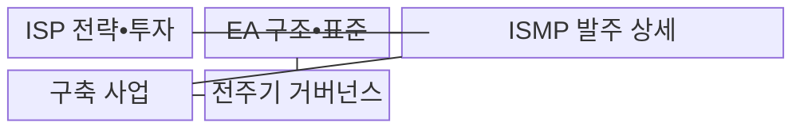
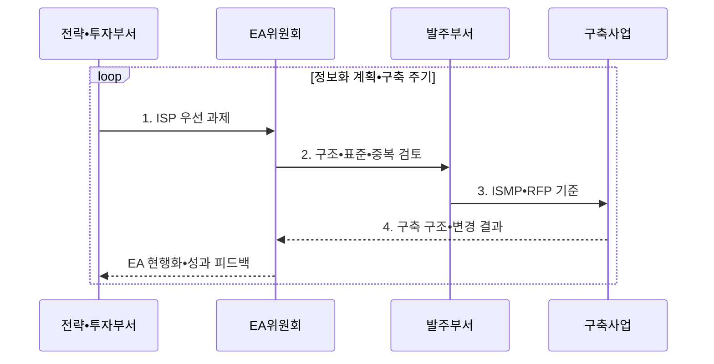

---
sidebar:
  order: 4
  label: "004. ISP•ISMP•EA 비교 (ISP, ISMP, EA Comparison)"
  badge:
    text: "기출 • 70%"
    variant: note
title: "ISP•ISMP•EA 비교 (ISP, ISMP, EA Comparison)"
date: "2026-08-04T14:49:50+09:00"
tags:
  - "notes-law_policy"
weight: 4
extra:
  question_no: "004"
  source_status: "기출"
  source_history: "125회, 128회, 132회, 135회"
  priority: 70
  priority_note: "4회 기출, 계획 범위•산출물 비교의 핵심축"
---

## Ⅰ. 개요

핵심 용어

- **정보전략계획(Information Strategy Planning, ISP)**: 중장기 정보화 과제와 투자 로드맵을 수립하는 계획이다.
- **정보시스템 마스터플랜(Information System Master Plan, ISMP)**: 개별 사업의 요구•규모•예산을 발주 수준으로 구체화하는 계획이다.
- **전사 아키텍처(Enterprise Architecture, EA)**: 전사 정보자원의 구조•표준과 변경을 통제하는 체계이다.

- 정의/개념: 정보화 전주기에서 **ISP•ISMP•EA의 투자•발주•구조 역할** 을 구분한 체계
- 배경/필요성: 역할 혼동으로 **전략•구축 단절과 요구•예산 불일치** 발생

#### 한줄 요약
- 중장기 투자계획은 ISP, 개별 사업 발주 상세화는 ISMP, 전사 구조와 표준 통제는 EA를 적용한다

## Ⅱ. 특징

핵심 용어

- **제안요청서(Request for Proposal, RFP)**: ISMP에서 확정한 요구•규모•예산•평가•검수 기준을 공급자에게 제시하는 발주 문서이다.
- **구조 축**: 구조 축은 EA를 통해 현행 자원•목표 구조•표준•변경의 전사 정합성을 유지한다.

- **투자 축**: ISP로 중장기 과제•우선순위•로드맵 결정
- **발주 축**: ISMP로 요구•구조•규모•예산•RFP 확정
- **구조 축**: EA로 전사 구조•표준•중복•변경 정합성 통제

#### 한줄 요약
- ISP는 투자 우선순위, ISMP는 발주 요구•예산, EA는 전사 구조•표준•변경을 관리한다

## Ⅲ. 구조 및 구성요소

핵심 용어

- **전주기 거버넌스**: 전주기 거버넌스는 ISP 투자부터 ISMP 발주와 구축 결과의 EA 현행화까지 승인•변경을 연결한다.

| 구성요소 | 책임 |
|:---|:---|
| ISP 전략•투자 | **과제 포트폴리오•투자 우선순위•로드맵** 수립 |
| EA 구조•표준 | **현행 자원•목표 구조•원칙•표준** 제공 |
| ISMP 발주 상세 | **요구•구조•규모•예산•RFP** 구체화 |
| 구축 사업 | **설계•구현•전환•실구축 성과** 제공 |
| 전주기 거버넌스 | **투자•구조•발주•변경 승인** 과 현행화 연결 |

#### 한줄 요약
- ISP의 투자 과제를 ISMP가 발주 요건으로 구체화하고 EA가 전사 구조와 표준의 정합성을 통제한다

## Ⅳ. 흐름도

핵심 용어

- **구조•표준•중복 검토**: 우선 과제를 현행 자원•공동 활용 가능성•표준과 대조해 중복과 예외를 판정하는 절차이다.

**동작 원리**

1. **ISP 우선 과제**: 기여도•효과•시급성•실행성으로 투자 선정
2. **구조•표준•중복 검토**: 공동 활용•연계•표준•폐기 대상 확인
3. **ISMP•RFP 기준**: 요구•규모•예산•계약•검수 기준 전환
4. **구축 구조•변경 결과**: 실구축 자원•예외•성과 증거 제공

#### 한줄 요약
- ISP에서 과제를 선정하고 EA 정합성을 검토한 뒤 ISMP로 발주를 상세화하며 구축 결과를 EA에 반영한다

## Ⅴ. 종류 및 비교

핵심 용어

- **정보화 계획 체계**: 정보화 계획 체계는 중장기 투자•개별 발주•전사 구조라는 서로 다른 판단 범위를 연결한다.

| 정보화 계획 체계 | ISP | ISMP | EA |
|:---|:---|:---|:---|
| 적용 기준 | **중장기 투자 계획** 수립 | **개별 사업 발주** 상세화 | **전사 구조•표준** 통제 |
| 핵심 특징 | **비전•과제•투자 로드맵** | **요구•규모•예산•RFP** | **원칙•표준•구조•변경** |
| 한계 | **발주 상세 부족** | **전사 전략 관점 부족** | **투자 우선순위 부족** |

> 요약: **ISP•ISMP** 는 투자•발주, **EA** 는 구조 관리

#### 한줄 요약
- ISP는 개발 과제와 투자 순서, ISMP는 계약 범위와 비용, EA는 시스템의 구조 원칙과 표준을 정한다

## Ⅵ. 실무 고려사항 및 대책

핵심 용어

- **사업 목적 변질**: 사업 목적 변질은 ISP에서 승인한 전략 과제와 ISMP 요구•산출물•검수 기준의 추적 관계가 끊길 때 발생한다.
- **과제 식별자(과제 ID)**: ISP 과제를 ISMP의 요구•산출물•검수 기준까지 추적하기 위해 부여한 고유 번호이다.
- **EA 저장소**: 현행 정보자원•목표 구조•표준•예외와 구축 결과를 등록해 투자 검토에 사용하는 전사 아키텍처 저장소이다.

| 문제 | 대책 | 효과 |
|:---|:---|:---|
| EA 검토 없이 발주해 생기는 **기능 중복** | 착수 전 **현행 자원•공동 활용•표준** 검토 | 중복 투자와 **구조 불일치** 방지 |
| ISP와 ISMP가 끊겨 생기는 **사업 목적 변질** | 과제 ID를 **요구•산출물•검수 기준** 과 연결 | 전략부터 발주까지 **추적성** 확보 |
| 구축 결과가 빠져 생기는 **낡은 현황 의존** | 실구축 구조•예외를 **EA 저장소** 에 반영 | 차기 투자 판단의 **현행성** 유지 |

#### 한줄 요약
- 대형 정보화 사업은 ISP에서 선정한 과제를 EA 현행 자원•표준과 대조한 뒤 ISMP에서 요구사항•규모•예산•RFP로 구체화한다.

## Ⅶ. 결론

핵심 용어

- **전사 구조**: 전사 구조는 EA 원칙과 표준으로 통제하고 중장기 투자와 개별 발주는 ISP•ISMP로 구체화한다.

- **중장기 투자•개별 발주** 는 ISP•ISMP, **전사 구조** 는 EA 적용

#### 한줄 요약
- ISP•ISMP•EA의 산출물을 사업 전주기에 연결해 중복 투자와 발주 분쟁을 줄여야 한다
