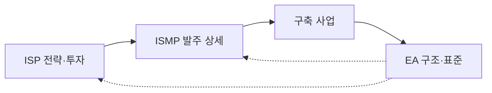

---
sidebar:
  order: 4
  label: "004. ISP·ISMP·EA 비교 (ISP, ISMP, EA Comparison)"
  badge:
    text: "기출 · 70%"
    variant: note
title: "ISP·ISMP·EA 비교 (ISP, ISMP, EA Comparison)"
date: "2026-07-27T23:59:59+09:00"
tags:
  - "notes-law_policy"
weight: 4
extra:
  question_no: "004"
  source_status: "기출"
  source_history: "125회, 128회, 132회, 135회"
  priority: 70
  priority_note: "4회 기출, 계획 범위·산출물 비교의 핵심축"
---

## 미리 알고가기

- **정보화 전략 계획(Information Strategy Plan, ISP)**: 조직의 비즈니스 비전에 따라 중장기 정보화 방향성과 투자 포트폴리오를 도출하는 기획 활동
- **정보시스템 마스터 계획(Information System Master Plan, ISMP)**: 구축할 정보시스템의 세부 기능과 기술 규격을 규정하여 발주 금액과 RFP를 상세화하는 활동
- **전사 아키텍처(Enterprise Architecture, EA)**: 비즈니스 조직 구조와 하드웨어, 소프트웨어, 데이터 자원을 일관성 있게 구성하고 조율하는 통제 프레임워크
- **제안 요청서(Request for Proposal, RFP)**: 발주처가 요구 사항과 사업 평가 방식을 서술하여 수주 가능 개발업체들에 공급 제안을 요청하는 공식 규격 문서

## Ⅰ. 개요

- 정의/개념: **ISP·ISMP·EA**의 목적·범위·산출물 구분
- 기존 한계: 계획 간 역할 혼동으로 **중복 투자·발주 오류** 발생

### 쉽게 이해하기 (학습용)
- 중장기 투자계획은 ISP, 개별 사업 발주 상세화는 ISMP, 전사 구조와 표준 통제는 EA를 적용한다

## Ⅱ. 특징

- **ISP**: 중장기 정보화 과제·투자 순위를 정한다
- **ISMP**: 개별 사업 요구·규모·예산을 확정한다
- **EA**: 전사 구조·표준·변경을 지속 통제한다

### 쉽게 이해하기 (학습용)
- ISP는 투자 우선순위, ISMP는 발주 요구·예산, EA는 전사 구조·표준·변경을 관리한다

## Ⅲ. 아키텍처 및 구성요소

| 설계 요소 | 설명 |
|:---|:---|
| 전략 계층 | ISP 투자 방향·과제 정의 |
| 발주 계층 | ISMP 요구·계약 범위 정의 |
| 구조 계층 | EA 업무·데이터·시스템 기준 제공 |
| 거버넌스 계층 | 예산·중복·변경 검토 연계 |

> 요약: 전략·발주·구조를 거버넌스로 연계함

### 쉽게 이해하기 (학습용)
- ISP의 투자 과제를 ISMP가 발주 요건으로 구체화하고 EA가 전사 구조와 표준의 정합성을 통제한다

## Ⅳ. 원리 및 절차 흐름도

| 절차 | 핵심 활동 |
|:---|:---|
| ISP 과제 선정 | 투자 순위·로드맵 확정 |
| EA 정합성 검토 | 표준·중복·공동 활용 확인 |
| ISMP 발주 상세화 | 요구·규모·예산 구체화 |
| RFP·구축 수행 | 계약 기준으로 사업 실행 |
| EA 현행화 | 구축 결과·구조정보 갱신 |

### 쉽게 이해하기 (학습용)
- ISP에서 과제를 선정하고 EA 정합성을 검토한 뒤 ISMP로 발주를 상세화하며 구축 결과를 EA에 반영한다

## Ⅴ. ISP·ISMP·EA 비교

| 비교 기준 | ISP | ISMP | EA |
|:---|:---|:---|:---|
| 적용 기준 | 중장기 투자 계획 수립 시 | 개별 사업 발주 전 | 전사 구조 통제 시 |
| 핵심 특징 | 비전·과제·투자 로드맵 | 요구·규모·예산·RFP | 원칙·표준·구조·변경 |
| 한계 | 발주 상세 부족 | 전사 전략 관점 부족 | 투자 우선순위 상세 부족 |

> 요약: ISP는 투자, ISMP는 발주, EA는 구조를 관리함

### 쉽게 이해하기 (학습용)
- ISP는 개발 과제와 투자 순서, ISMP는 계약 범위와 비용, EA는 시스템의 구조 원칙과 표준을 정한다

## Ⅵ. 실무 사례

1. 대형 정보화: **ISP 과제**를 ISMP로 상세화

### 쉽게 이해하기 (학습용)
- 대형 정보화 사업에서 ISP 과제를 선정한 뒤 EA 정합성을 검토하고 ISMP로 요구사항·규모·예산을 구체화한다

## Ⅶ. 결론

- 전주기 정렬을 위해 전략·구축·운영을 검토하여 **ISP·ISMP·EA** 활용

### 쉽게 이해하기 (학습용)
- ISP·ISMP·EA의 산출물을 사업 전주기에 연결해 중복 투자와 발주 분쟁을 줄여야 한다
