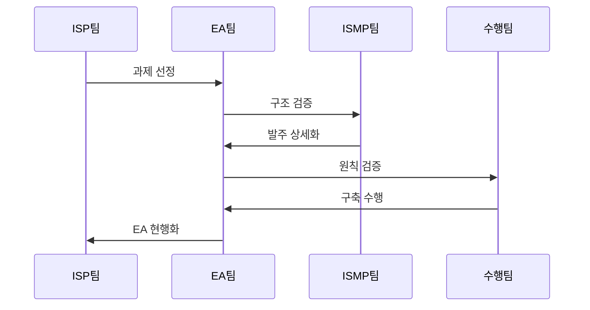

---
sidebar:
  order: 4
  label: "004. ISP·ISMP·EA 비교 (ISP, ISMP, EA Comparison)"
  badge:
    text: "기출 · 70%"
    variant: note
title: "ISP·ISMP·EA 비교 (ISP, ISMP, EA Comparison)"
date: "2026-07-25T01:20:00+09:00"
tags:
  - "notes-law_policy"
weight: 4
extra:
  question_no: "004"
  source_status: "기출"
  source_history: "125회, 128회, 132회, 135회"
  priority: 70
  priority_note: "4회 기출, 계획 범위·산출물 비교의 핵심축"
---

## 미리 알고가기

- **정보화 전략 계획(Information Strategy Plan, ISP)**: 조직의 비즈니스 비전에 따라 중장기 정보화 방향성과 투자 포트폴리오를 도출하는 기획 활동
- **정보시스템 마스터 계획(Information System Master Plan, ISMP)**: 구축할 정보시스템의 세부 기능과 기술 규격을 규정하여 발주 금액과 RFP를 상세화하는 활동
- **전사 아키텍처(Enterprise Architecture, EA)**: 비즈니스 조직 구조와 하드웨어, 소프트웨어, 데이터 자원을 일관성 있게 구성하고 조율하는 통제 프레임워크
- **제안 요청서(Request for Proposal, RFP)**: 발주처가 요구 사항과 사업 평가 방식을 서술하여 수주 가능 개발업체들에 공급 제안을 요청하는 공식 규격 문서
- **약어 읽기·표기**: ISP는 ‘아이에스피’, ISMP는 ‘아이에스엠피’, EA는 ‘이 에이’, RFP는 ‘알에프피’로 읽으며 각 영문 정식명의 머리글자로 계획·구조·발주 역할을 구분함
- **가운데점(·)**: ‘그리고’로 읽고 복합 비교 제목과 표에서 서로 다른 독립 대상을 병렬로 묶음
- **시퀀스 기호(->>)**: ‘요청 전달’로 읽고 이중 화살촉은 ISP·EA·ISMP 간 산출물 인계를 나타냄

## Ⅰ. 개요

- **정의/개념**: 전략·발주·구조 관리의 목적 및 시점별 구분
- **배경/필요성**: 역할 구분으로 기획 누락·중복·발주 오류 방지

### 쉽게 이해하기 (학습용)
- IT 사업을 시작할 때, 투자 전략을 짤지(ISP), 개발업체 계약서 사양을 정할지(ISMP), 아니면 회사 전체 시스템 표준을 맞출지(EA) 시점과 용도에 따라 구별하여 적용해야 함

## Ⅱ. 특징

- ISP는 경영 목표를 정보화 과제로 전환한다
- ISMP는 발주 요구·대가 산정 기준을 확정한다
- EA는 아키텍처 원칙·변경을 지속 관리한다
- 세 활동 연계가 기획·발주·구조 누락을 막는다

### 쉽게 이해하기 (학습용)
- ISP는 장기적인 투자 예산을 분배하고, ISMP는 당장 발주할 사업의 정밀한 계약 내용을 다듬으며, EA는 기업 내 모든 소프트웨어와 데이터가 꼬이지 않도록 통제함

## Ⅲ. 아키텍처 및 구성요소

| 설계 요소 | 설명 |
|:---|:---|
| 전략 계층 | ISP 투자 방향·과제 정의 |
| 발주 계층 | ISMP 요구·계약 범위 정의 |
| 구조 계층 | EA 업무·데이터·시스템 기준 제공 |
| 거버넌스 계층 | 예산·중복·변경 검토 연계 |

> 요약: 전략·발주·구조를 거버넌스로 연계함

### 쉽게 이해하기 (학습용)
- 중장기 방향을 잡는 전략, 실행 사양을 규정하는 발주, 그리고 전체 표준을 지탱하는 아키텍처가 관리 규칙에 따라 맞물려 작동함

## Ⅳ. 원리 및 절차 흐름도

| 절차 | 핵심 활동 |
|:---|:---|
| 과제 선정 | 투자 순위·로드맵 도출 |
| 구조 검증 | EA 표준·중복 여부 확인 |
| 발주 상세화 | ISMP 예산·범위 세분화 |
| 원칙 검증 | 요구 기준선·관리 규격 확인 |
| 구축 수행 | 확정 대가·범위 기준 개발 |
| EA 현행화 | 완료 사업 구조정보 갱신 |

### 쉽게 이해하기 (학습용)
- 장기 IT 로드맵에 맞추어 과제를 고르고 중복 장비 유무를 먼저 검사한 뒤, 구체적인 계약 예산안을 세워 안전하게 개발하고 그 결과를 회사 표준 장부에 다시 기록함

## Ⅴ. 종류 및 비교

| 판단 기준 | ISP | ISMP | EA |
|:---|:---|:---|:---|
| 핵심 질문 | 투자 내용 정의 | 발주 범위 확정 | 구조 유지 기준 |
| 적용 기준 | 중장기 전략 수립 | 특정 사업 발주 전 | 전 생명주기 통제 |
| 핵심 산출 | 비전·과제·로드맵 | 요구·규모·예산 | 원칙·표준·구조 |

> 요약: ISP는 투자, ISMP는 발주, EA는 구조를 관리함

### 쉽게 이해하기 (학습용)
- ISP는 무엇을 개발할 것인지 전체 로드맵을 그리고, ISMP는 얼마의 비용으로 어떻게 계약할 것인지 규정하며, EA는 어떤 원칙 하에 시스템을 지탱할 것인지 정함

## Ⅵ. 실무 사례

1. 대형 ISP 과제는 ISMP로 발주 범위 상세화
2. EA 연계 검토: 중복 기능 제거 및 표준 준수 예외 통제

### 쉽게 이해하기 (학습용)
- 수십억 단위의 대형 IT 프로젝트가 발주되기 전, 상위 전략 계획 결과에 기반하여 세부 요구사항을 미리 도출하는 사업 준비 활동을 검토함
- 신규 개발하는 홈페이지가 다른 기관의 시스템과 기능이 겹치지 않는지 범정부 관리 장부와 대조하여 불필요한 예산을 줄임

## Ⅶ. 결론

- 사업 추진의 단계적 연계로 공공 예산 낭비 차단

### 쉽게 이해하기 (학습용)
- 기획(ISP), 준비(ISMP), 운영(EA) 단계를 공백 없이 상호 보완적으로 연결하여 국가 정보화 예산의 낭비와 분쟁 요소를 최소화해야 함
